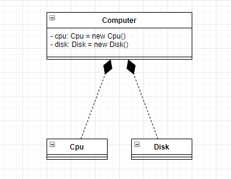

# UML

## 定义

UML(Unified modeling language)**统一建模语言**，是一种用于软件系统分析和设计的语言工具。它用于帮助软件开发人员进行思考和记录思路的结果

UML本身是一套浮好的规定，就像数学符号和化学符号一样，这些符号用于描述软件模型中的各个元素和它们之间的关系，比如类、接口、实现、泛化、依赖、组合、聚合等，如下图：


使用UML来建模，常用的工具有Rational Rose，也可以使用一些插件来建模。

## UML图

1. 分类：
   1. 用例图
   2. 静态结构图：类图、对象图、包图、组件图、部署图
   3. 动态行为图：交互图（时序图与协作图）、状态图、活动图

2. 说明
   - 类图描述的是类与类之间的关系，是UML图中最核心的

### 类图

1. 用于描述系统中的类（对象）本身的组成和类（对象）之间的各种静态关系。
2. 类之间的关系：依赖、泛化（继承）、实现、关联、聚合与组合

#### 举例

1. 依赖关系

    只要是在类中用到了对方，那么类之间就存在依赖关系，如果没有对方，编译都通不过。
    - 类的成员变量
    - 类的方法的返回值
    - 类的方法的参数类型
    - 类的方法中使用到的类型

    ```java
    // PersonService.java
    public class PersonService {

        private PersonDao personDao;

        public void save(Person person) {
            personDao.save(person);
        }

        public IdCard getIdCard(Integer personId) {
            return personDao.getIdCardById(personId);
        }

        public void modify() {
            Department department = new Department();
            ...
        }

        ...
    }

    // PersonDao.java
    public class PersonDao {}

    // Person.java
    public class Person {}

    // IdCard.java
    public class IdCard {}

    // Department.java
    public class Department {}
    ```

    上面的类关系如下图所示：

    

2. 泛化关系

    泛化关系实际上是继承关系，它是依赖关系的特例

    ```java
    // BaseDao.java
    public abstract class BaseDao {
      public void save(Object entity) {}
      public void delete(Integer id) {}
    }

    // PersonDao.java
    public class PersonDao extends BaseDao {}
    ```

    上面的类关系如下图所示：

    

3. 实现关系

    实现关系也是依赖关系的特例

    ```java
    // PersonService.java
    public interface PersonService {
        public void delete(Integer id);
    }

    // PersonServiceImpl.java
    public class PersonServiceImpl implements PersonService {
        public void delete(Integer id) {}
    }
    ```

    上面的类关系如下图所示：

    

4. 关联关系

    关联关系实际上是类与类之间的联系，它是依赖关系的特例

    关联具有**导航性**：即双向关系或单向关系。而关系具有多重性：
    - `1` 表示有且仅有一个
    - `0...` 表示0个或多个
    - `0,1` 表示0个或一个
    - `n,m` 表示n到m个都可以
    - `m...` 表示至少m个

    ```java
    // 单向一对一关系

    // Person.java
    public class Person {
        private IdCard idCard;
    }

    // IdCard.java
    public class IdCard {}
    ```

     ```java
    // 双向一对一关系

    // Person.java
    public class Person {
        private IdCard idCard;
    }

    // IdCard.java
    public class IdCard {
        private Person person;
    }
    ```

    上面的类关系如下图所示：

    

5. 聚合关系

    聚合关系表示的是整体与部分的关系，**整体与部分可以分开**。聚合关系是关联关系的特例，所以它具有关联的导航性与多重性。

    eg：一台电脑由键盘、显示器、鼠标等组成；组成电脑的各个配件是可以从电脑上分离出来的。

    ```java
    // Computer.java
    public class Computer {
        private Mouse mouse;
        private Keyboard keyboard;

        public void setMouse(Mouse mouse) {
            this.mouse = mouse;
        }

        public void setKeyboard(Keyboard keyboard) {
            this.keyboard = keyboard;
        }
    }

    // Mouse.java
    public class Mouse {}

    // Keyboard.java
    public class Keyboard {}
    ```

    上面的类关系如下图所示：

    

6. 组合关系

    组合也是整体与部分的关系，但是**整体与部分不可分开**。

    eg：电脑由Cpu、硬盘、内存组成，没有这些电脑是不能开机的。

    ```java
    // Computer.java
    public class Computer {
        private Cpu cpu = new Cpu();
        private Disk disk = new Disk();
    }

    // Cpu.java
    public class Cpu {}

    // Disk.java
    public class Disk {}
    ```

    上面的类关系如下图所示：

    

    举一个栗子：人和脑袋、身份证的关系：人不能没有脑袋，所以脑袋和人是组合关系；人可以没有身份证，所以人和身份证是聚合关系。但是在开发中，删除一个Person的时候，一般会同时删除IdCard（级联删除），这个时候，IdCard 和 Person 就是组合关系了。

    ```java
    // Person.java
    public class Person {
        private Head head = new Head();
        private IdCard idCard;
    }

    // Head.java
    public class Head {}

    // IdCard.java
    public class IdCard {}
    ```
