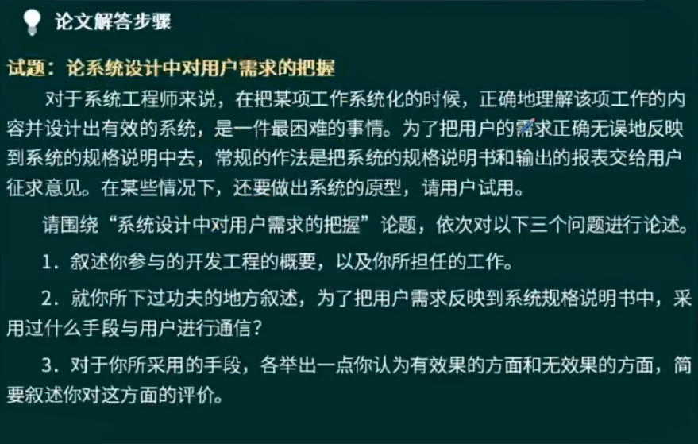
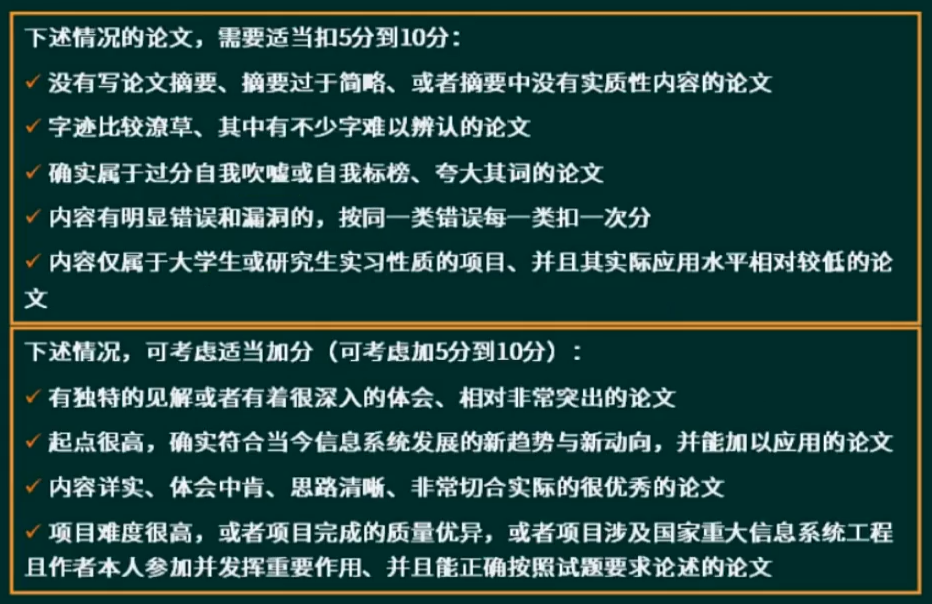
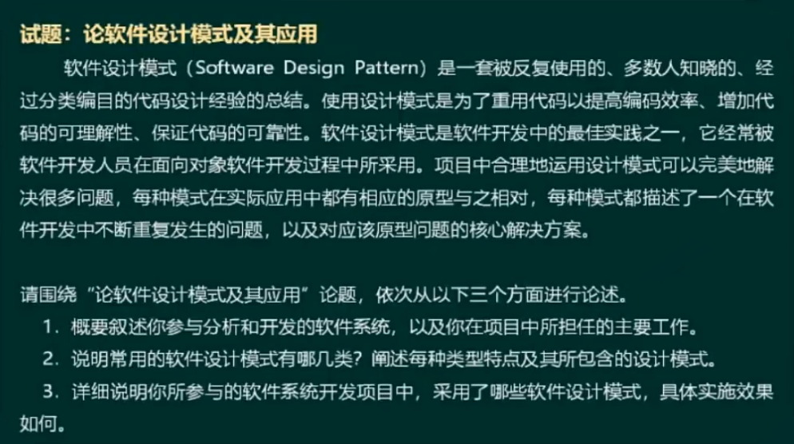
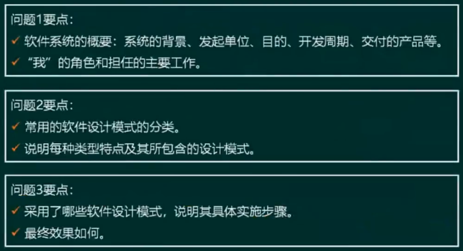
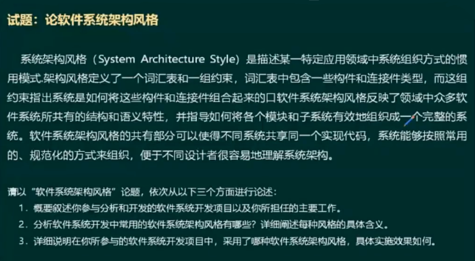
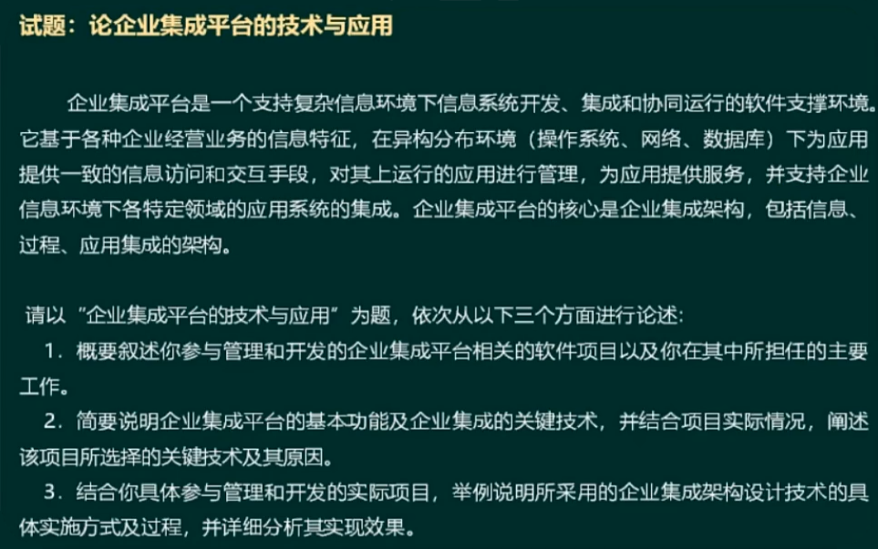

# 系统架构设计论文

## 如何解答试题
### 论文写作四部曲
- 找准核心论点（5min）
- 搭建论文框架（10min）
- 撰写摘要（15min）
- 正文写作（90min）

#### 找准核心论点
1. 根据论文标题
2. 分析题干问题
> 一般跟`具体（技术）实践`相关的问题才是核心论点

#### 搭建论文框架

> - 岗位如果不清楚，可以使用`技术负责人`
> - 项目背景介绍，从两方面入手：`宏观背景；微观背景`
> - 相关问题回应，起一个承上启下的作用
> - 论文结论，一般分两段，先分析总体效果，再总结不足/解决方案、展望等

#### 撰写摘要
- 本文讨论……系统的……（论文主题）。该系统……（系统背景、简单功能介绍）。在本文中首先讨论了……（过程、方法、措施），最后……（不足之处/如何改进、特色之处）。在本系统的开发过程中，我担任了……（工作角色）。
- 根据……需求（项目背景），我所在的……组织了……系统的开发。该系统……（系统背景、简单功能介绍）。在该系统的开发中，我担任了……（工作角色）。我通过采取……（过程、方法、措施），是该系统开发工作圆满完成，得到了用户们的一致好评。但现在看来，……（不足之处/如何改进、特色之处）。
- `…年…月，我参加了……系统的开发，担任……（工作角色）.该系统……（选题背景、简单功能介绍）。本文结合作者的实践，以……系统为例，讨论……（论文主题），包括……（过程、方法、措施）。`
- ……是……（戴帽子，讲论文主题的重要性）。本文结合作者实践，以……为例，讨论……（论文主题），包括……（过程、方法、措施）。在本系统的开发过程中，我担任了……（工作角色）。

#### 正文撰写
- 以我为中心
- 站在高级工程师的高度
- 忠于论点
- 条理清晰，开门见山
- 图文并茂，能收奇效
- 标新立异，要有主见
- 首尾一致

### 真题案例

#### 找准核心论点

#### 搭建论文框架

## 论文评分标准
### 扣分与加分准则

### 雷区

## 论文写作分析
### 软件设计模式

#### 找核心论点

#### 搭论文框架

### 系统架构风格

#### 找核心论点

#### 搭论文框架
 

### 企业集成

#### 找核心论点

#### 搭论文框架

### 信息安全

#### 找核心论点

#### 搭建论文框架

#### 素材准备
- 鉴别服务
  - 用户名 + 口令
  - 数字证书
  - 生物特征识别
- 访问控制
  - 自主访问控制（DAC）
  - 访问控制列表（ACL）
  - 强制访问控制（MAC）
  - 基于角色的访问控制（RBAC）
  - 基于任务的访问控制（TBAC）
- 数据完整性
  - 阻止对媒体访问的机制：隔离，访问控制，路由控制
  - 探测非授权修改的机制：数字签名，数据重复，数字指纹，消息序列号
- 数据保密性
  - 通过禁止访问提供机密性
  - 通过加密提供机密性
- 抗抵赖
  - 数字签名