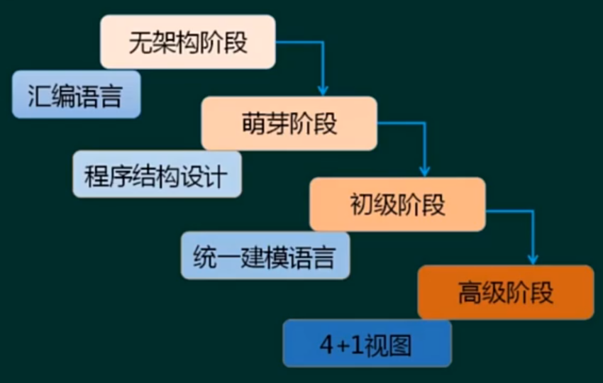
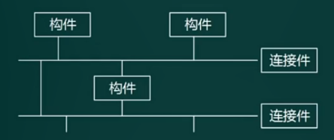
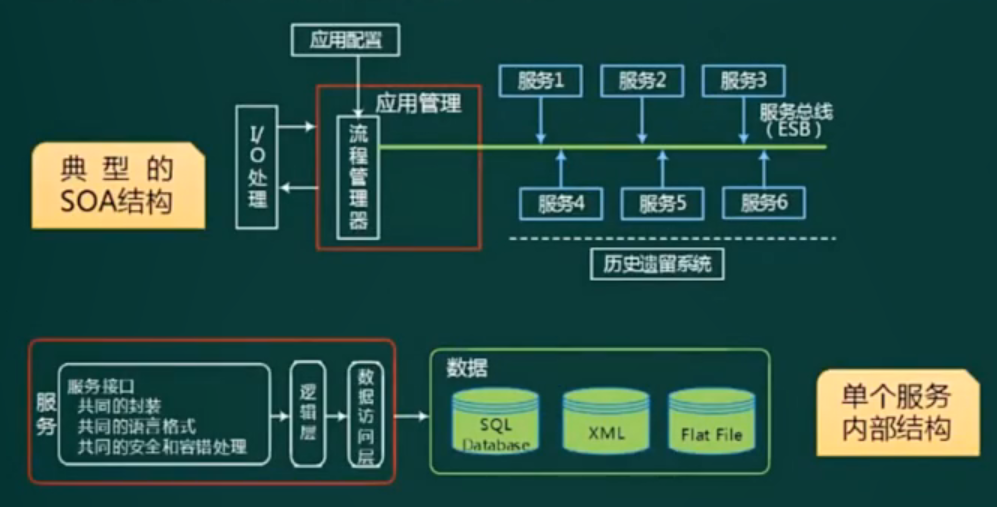
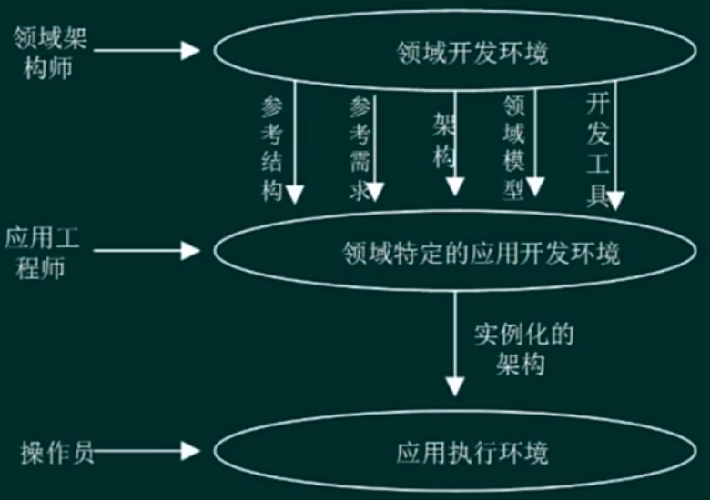
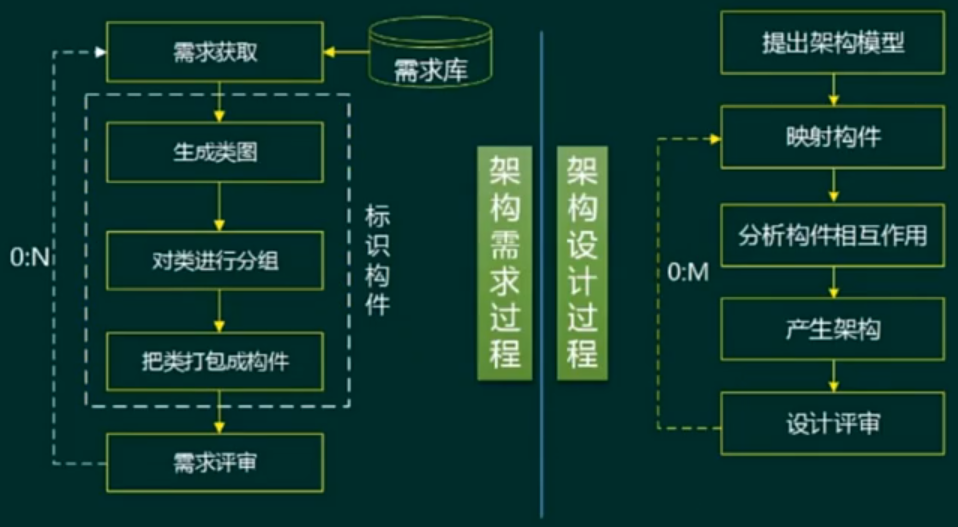
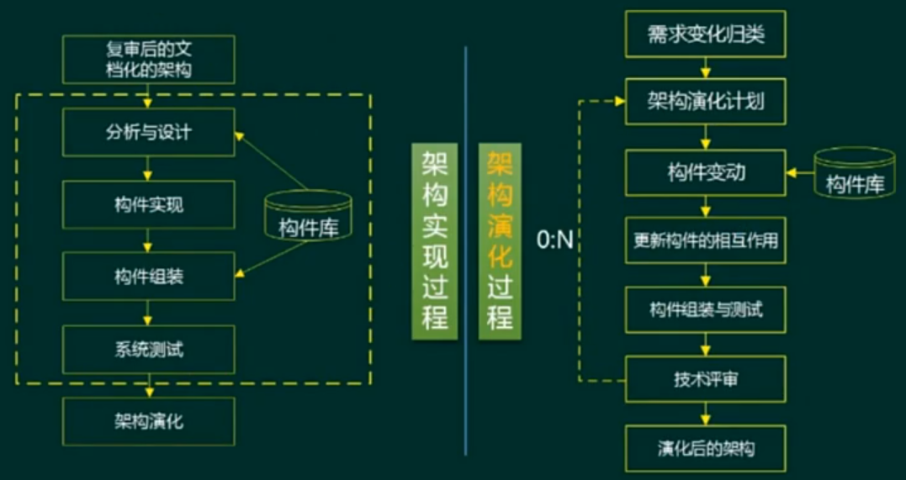
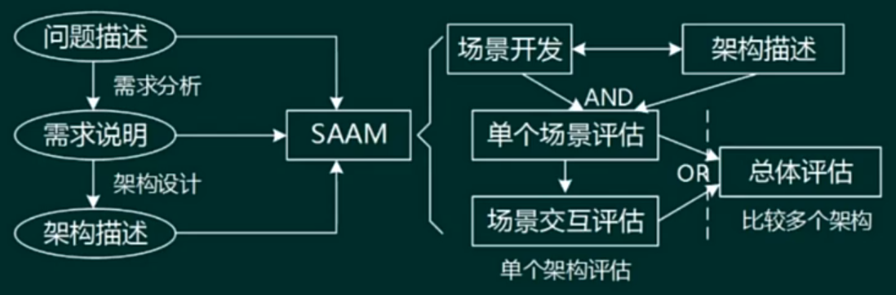
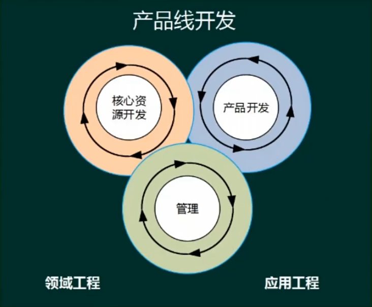

# 软件架构设计

## 软件架构的概念

> - 需求分析偏向于`业务`,软件设计偏向于`技术`，架构在需求分析之后，在软件设计之前，承前启后成为了处理两者关系的桥梁
> - 架构设计就是需求分配，即将满足需求的职责分配到组件上

**架构 = 体系结构**

- 软件架构风格是描述某一特定应用领域中系统组织方式的管用模式。架构风格定义一个系统家族，即一个体系结构定义一个词汇表和一组约束。词汇表中包含一些构件和连接件类型，而这组约束指出系统是如何将这些构件和连接件组合起来的
- 软件架构为软件系统提供了一个结构、行为和属性的高级抽象，由构成系统的元素的描述、这些元素的相互作用、指导元素集成的模式以及这些模式的约束组成
- 软件架构是项目干系人进行交流的手段，明确了对系统实现的约束条件，决定了开发和维护组织的组织结构，制约者系统的质量属性
- 软件架构使推理和控制的更改更加简单，有助于循序渐进的原型设计，可以作为培训的基础
- 软件架构是可传递和可复用的模型，通过研究软件架构可能预测软件的质量

### 软件架构的发展史

### 软件架构建模
- `结构模型（静态）`：以架构的构件、连接件和其他概念来刻画结构
- 框架模型：不太侧重描述结构的细节而更侧重于整体的结构
- `动态模型`：系统的“大颗粒”的行为性质
- 过程模型：构建系统的步骤和过程
- 功能模型：由一组功能构件按层次组成，下层向上层提供服务

#### 4+1模型

> - 对应的UML的4+1视图
> - 关注点：
>   - 逻辑视图 → 系统功能
>   - 开发试图 → 源代码、组件、DLL
>   - 进程试图 → 并发
>   - 物理视图 → 软件到硬件的映射关系

## 软件架构的风格

- 架构设计的一个核心问题是能否达到架构级的复用
- 架构分风格反映了领域中众多系统所共有的结构和语义特征，并指导如何将各个构建有效的组织成一个完整的系统
- 架构风格定义了用于描述系统的术语表和一组指导构建系统的规则

分类：
- 数据流风格：批处理序列、管道-过滤器
- 调用/返回风格：主程序/子程序、面向对象、层次结构
- 独立构件风格：进程通信、事件驱动系统（隐式调用）
- 虚拟机风格：解释器、基于规则的系统
- 仓库风格：数据库系统、超文本系统、黑板系统
> 仅仅只是分类，实际使用一般不可能只用单一类型

### 数据流风格

> 特点：数据处理、严格流程
- 批处理序列
  - 构件为一系列固定顺序的计算单元，构件之间只通过数据传递交互。每个处理步骤是一个独立的程序，每一步必须在其前一步结束后才能开始，`数据必须是完整的，以整体的方式传递`
- 管道-过滤器
  - 每个构件都有一组输入和输出，构件读书如的数据流，经过内部处理，如何产生输出数据流。这个过程通常是对输入数据流变换或计算来完成的，包括通过计算和增加信息以丰富数据、通过浓缩和删除以精简数据、通过改变记录方式以转化数据和传递地转化数据等。这里的构件称为过滤器，连接件就是数据流传输的管道，将一个过滤器的输出传输到另一个过滤器的输入
  - `早期编译器就是采用的这种架构。要一步一步处理的，均可考虑采用此架构`

### 调用/返回风格

- 主程序/子程序
  - 单线程控制，把问题划分为若干个处理步骤，构件即为主程序和子程序，子程序通常可以合成为模块。过程调用作为交互机制，即充当连接件的角色。调用关系具有层次性，其语义逻辑变现为主程序的正确性取决于它调用的子程序的正确性
- 面向对象
  - 构件是对象，对象是抽象数据类型的实例。在抽象数据类型中，数据的表示和它们的相应操作被封装起来，对象的行为体现在其接受和请求的动作。连接件即是对象间交互的方式，对象是通过函数和过程的调用来交互的
- 层次结构
  - 构件组织成一个层次结构，连接件通过决定层间如何交互的协议来定义。每层为上层提供服务，使用下一层的服务，只能见到与自己领接的层。通过层次结构，可以将大的问题分解为若干个渐进的小问题逐步解决，可以隐藏问题的复杂度。修改某一层，最多影响其相邻的两层（通常只能影响上层）

#### 层次型风格的优缺点
- 优点：
  1. 这种风格支持基于可增加抽象层的设计，`允许将一个复杂问题分解成一个增量步骤序列的实现`
  2. 不同的层次处于不用的抽象级别：
     - 越靠近底层，抽象级别越高
     - 越靠近顶层，抽象级别越低
  3. 由于每一层最多只影响`两层`，同时只要给相邻层提供相同的接口，允许每层用不同的方法实现，同样为`软件复用`提供了强大的支持
- 缺点：
  1. 并不是每个系统都可以很容易地划分为层的模式
  2. 很难找到一个合适的、正确的层次抽象方法

### 独立构件风格
- 进程通信
  - 构件是独立的过程，连接件是消息传递。构件通常是命名过程，消息传递的方式可以是点对点、异步或同步方式，以及远程过程（方法）调用等
- 事件驱动系统（隐式调用）
  - 构件不直接调用一个过程，而是触发或广播一个或多个事件。构件中的过程在一个或多个事件中注册，当某个事件被触发时，系统自动调用在这个事件中注册的所有过程。一个事件的触发就导致了另一个模块中的过程调用。这种风格的构件就是匿名的过程，它们之间交互的连接件往往是以过程之间的隐式调用来实现的。主要优点是为软件复用提供了强大的支持，为构建的维护和演化带来了方便；其缺点是构件放弃了对系统计算的控制

### 虚拟机风格
> 适应自定义需求的场景
- 解释器
  - 解释器通常包括一个完成解释工作的解释引擎、一个包含将被解释的代码的存储区、一个记录解释引擎当前工作状态的数据结构，以及一个记录源代码被解释执行的精度的数据结构。具有解释器风格的软件含有一个虚拟机，可以仿真硬件的执行过程和一些关键应用，其缺点是执行效率比较低
- 基于规则的系统
  - 基于规则的系统包括规则集、规则解释器、规则/数据选择器和工作内存，一般用在人工智能领域和DSS中

### 仓库风格
> - 以数据为中心的风格
> - `现代集成编译环境一般采用这种架构风格`
> 
>   

仓库风格中构件分为两种：一种是`中央数据结构`，保存系统当前的状态；另一种是`独立构件`，对中间存储进行操作
- 数据库系统
- 黑板系统
  - 包括知识源、黑板和控制三部分。知识源包括若干独立计算的不同单元，提供解决问题的知识。知识源响应黑板的变化，也只修改黑板；黑板是一个全局数据库，包含问题域解空间全部状态，是知识源相互作用的唯一媒介；知识源响应是通过黑板状态的变化来控制的。黑板系统通常应用在对于解决问题没有确定性算法的软件中（`信号处理、问题规划和编译器优化等`）
  
  
- 超文本系统
  - 构件以网状连接方式相互连接，用户可以在构件之间进行按照人类的联想思维发过誓任意跳转到相关构件。超文本是一种非线性的网状信息组织方法，它以结点为基本单位，链作为结点之间的联想是关联。超文本系统通常应用于互联网领域

### 闭环控制架构（过程控制）
当软件被用来操作一个物理系统时，软件与硬件之间可以粗略地表示为一个反馈循环，这个反馈循环通过接受一定的输入，确定一些列的输出，最终使环境达到一个新的状态。`适合嵌入式系统，涉及连续的动作与状态`

> - 遥控器就是一个开环控制系统的实例。用遥控器调电视频道
> - 空调就是一个闭环控制系统的实例。eg: 夏天室温30度，空调设定18度，给定温度比室温低，制冷~，获取室温（*反馈量*），如果给定温度比室温低，则继续制冷，否则，停止制冷

### C2风格
C2是一种并行构件网络。如下图所示：  

C2架构的基本规则：
- 构件和连接件都有一个顶部和一个底部
- 构件的定语要连接到连接件的底部，构件的底部要连接到连接件的顶部，构件之间不允许直连
- 一个连接件可以和任意数目的其他构件和连接件连接
- 当两个连接件进行直接连接时，必须由其中一个的底部到另一个的顶部

### 层次型架构风格演化过程
两层C/S → 三层C/S → 三层B/S → 混合架构

- 两层C/S架构
  - 开发成本较高
  - 客户端程序设计复杂
  - 信息内容和形式单一
  - 用户界面风格不一
  - 软件移植困难
  - 软件维护和省级困难
  - 新技术不能轻易应用

  
- 三层C/S架构

  

  
- 三层B/S架构
  - B/S架构缺乏对动态页面的支持能力，没有集成有效的数据库处理功能
  - B/S架构的安全性难以控制
  - 采用B/S架构的应用系统，在数据查询等响应速度上，要远低于C/S架构
  - B/S架构的数据提交一版以页面为单位，数据的动态交互性不强，不利于OLTP应用

    
- 混合架构风格

  

### 补充
#### 三层B/S架构

> 哪三层：表现层、数据库访问层、数据架构层
- MVC架构风格
  - 各层的含义：
    - Model（模型）是应用程序中用于`处理应用程序数据逻辑的部分`。通常模型对象负责在数据库中存取数据
    - View（视图）是应用程序中`处理数据显示的部分`。通常视图是依据模型数据创建的
    - Controller（控制器）是应用程序中`处理用户交互的部分`。通常控制器负责从视图读取数据，控制用户输入，并向模型发送数据
  - J2EE体系结构中：
    - Model: EJB(Entity Bean、Session Bean)
    - View: JSP
    - Controller: Servlet
  - 可以分为主动MVC和被动MVC两种

    
- MVP架构风格
  - MVP是MVC的变种
  - MVP实现了V与M之间的解耦（V不直接使用M，修改V不会影响M）
  - MVP更好的支持单元测试（业务逻辑在P中，可以脱离V来测试这些逻辑；可以将一个P用于多个V，而不需要改变P的逻辑）
  - MVP中V要处理界面事件，业务逻辑在P中，MVC中界面事件由C处理

  
- MVVM架构风格

  
#### 富互联网应用（RIA）

- RIA结合了C/S架构反映速度快、交互性强的优点，以及B/S架构传播范围广及容易传播的特性
- RIA简化并改进了B/S架构的用户交互
- 数据能够被缓存在客户端，从而可以实现一个比基于HTML的响应速度更快且数据往返于服务器次数更少的用户界面
> 因为需要加载所以打开慢，但加载完成后的运行表现力强

#### 基于服务的架构（SOA）
服务是一种为了满足某项业务需求的操作、规则等的逻辑组合，它包含一些列有序活动的交互，为实现用户目标提供支持

> `服务总线ESB`充当了*中介者*的角色

- 服务构件粗粒度，传统构件细粒度居多
- 服务构件的接口是标准的，主要是WSDL接口，传统构件经常以具体API形式出现
- 服务构件的实现与语言无关，传统构件绑定某种特定语言
- 服务构建可以通过构件容器提供QoS的服务，传统构件完全由程序代码直接控制

##### SOA的实现方式
- Web Service

  
  - 底层传输层
  - 服务通信协议层
  - 服务描述层
  - 服务层
  - 业务流程层
  - 服务注册层
- ESB

  
  - 提供位置透明性的消息路由和寻址服务
  - 提供服务注册和命名的管理功能
  - 支持多种的消息传递范型
  - 支持多种可以广泛使用的传输协议
  - 支持多种数据格式及其相互转换
  - 提供日志和监控功能
- 服务注册表
  - 服务注册：应用开发者（服务提供者）想注册表公布服务的功能
  - 服务位置：服务使用者（服务应用开发者）帮助他们查询注册服务，寻找符合自身要求的服务
  - 服务绑定：服务使用者利用检索到的服务接口来编写代码，所编写的代码将与注册的服务绑定、调用注册的服务，以及他们实现互动

##### SOA - 关键技术

| 功能    | 协议                |
|-------|-------------------|
| 发现服务  | UDDI、DISCO        |
| 描述服务  | WSDL、XML Schema   |
| 消息格式层 | SOAP、REST         |
| 编码格式层 | XML(DOM,SAX)      |
| 传输协议层 | HTTP、TCP/IP、SMTP等 |
- WSDL就是WebService接口对应的WSDL文件，该文件通过XML格式说明如何调用，可以看做WebService的接口文档（使用说明书）
- SOAP, Simple Object Access Protocol
  - 简单对象访问协议，简单说就是用于访问网络服务的协议；它是基于XML的简易协议，可使应用程序在HTTP之上进行信息交换。SOAP是一种网络通信协议，用于网络上、不同平台上、不同语言的应用程序之间的通讯
  - `SOAP协议 = HTTP协议 + XML数据格式`
- REST
  - HTTP + XML进行基于Web通信的技术
  - 简单性，缺少严格配置文件
  - 只支持几个操作（POST\GET\PUT\DELETE）
  - 强调信息本身，称为资源
    - 网络上多有的事务都被抽象为资源
    - 每个资源对应一个唯一的资源标识
    - 通过通用的连接器接口对资源进行操作
    - 对资源的各种操作不会改变资源标识
    - 所有的操作都是无状态的

#### 微服务
微服务顾名思义，就是很小的服务，所以它属于面向服务的一种

微服务架构是一种架构模式，它提倡将单一应用程序划分成一组小的服务，服务之间互相协调、互相配合，为用户提供最终价值。每个服务运行在其独立的进程中，服务与服务之间采用轻量级的通信机制互相沟通（通常是基于HTTP协议的RESTful API)。每个服务都围绕这具体的业务进行构建，并且能够被独立的部署到生产环境、类生产环境等。另外，应当尽量避免统一的、集中式的服务管理机制，对具体一个服务而言，应根据业务上下文，选择合适的语言、工具对其进行构建

特点：
- 小，且专注于多一件事情
- 轻量级的通信机制
- 松耦合、独立部署

优势：
- 技术异构性
- 弹性
- 扩展
- 简化部署（前提是实现自动化部署）
- 与组织结构相匹配
- 可组织性
- 对可替代性的优化

面临的挑战：
- 分布式系统的复杂度
- 运维成本
- 部署自动化
- DevOps于组织结构
- 服务间依赖测试
- 服务间依赖管理

#### 微服务与SOA

| 微服务              | SOA                     |
|------------------|-------------------------|
| 能拆分就拆分           | 是整体的，服务能放一起的都放一起        |
| 纵向业务划分           | 横向分多层                   |
| 由单一组织负责          | 按层级划分不用部门的组织负责          |
| 细粒度              | 粗粒度                     |
| 两句话可以解释清楚        | 几百字相只当于SOA目录            |
| 类似独立的子公司         | 类似大公司里面划分了一些业务单元（BU）    |
| 组件小              | 存在较复杂的组件                |
| 业务逻辑存在每一个服务中     | 业务逻辑横跨多个业务领域            |
| 使用轻量级的通信方式，如HTTP | 企业服务总线（ESB）充当了服务之间通信的角色 |

| 微服务架构实现                | SOA实现               |
|------------------------|---------------------|
| 团队级，自底向上开展实施           | 企业级，自顶向下开展实施        |
| 一个系统被拆分成多个服务，粒度细       | 服务由多个子系统组成，粒度粗      |
| 无集中式总线，松散的服务架构         | 企业服务总线，集中式的服务架构     |
| 集成方式简单（HTTP/REST/JSON） | 继承方式复杂（ESB/WS/SOAP） |
| 服务能独立部署                | 单块架构系统，相互依赖，部署复杂    |

#### 模型驱动架构-MDA(Model Driven Architecture)
- Model：客观事物的抽象表示
- Architecture：构成系统的部件、连接件及其约束的规约
- Model-Driven：使用模型完成软件的分析、设计、构件、部署、维护等开发活动

MDA起源于分离系统规约和平台实现的思想

MDA的主要目标：可移植性（portability）、互通性（interoperability）、可重用性（reusability）

MDA的3中核心模型：
- 平台（无关）独立模型（PIM）：具有高抽象层次、独立于热河实现技术的模型
- 平台相关模型（PSM）：为某种特定实现技术量身定做，用这种技术中可用的实现构造来描述系统的模型。PIM会被变换成一个或多个PSM
- 代码（Code）：用源代码对系统的描述（规约），每个PSM都将被变换成代码

> PIM的典型代表：UML

## 架构描述语言（ADL）

ADL是一种形式化语言，在底层语义模型的支持下，为软件系统的概念体系结构建模提供了具体语法和概念框架。基于底层语义的工具为体系结构的表示、分析、演化、细化、设计过程等提供支持

`ADL的三个基本元素`：
- 构件：计算或数据存储单元
- 连接件：用于构件之间交互建模的体系结构构造块及其支配这些交互的规则
- 架构配置：描述体系结构的构件与连接件的连接图

主要的架构描述语言：
- Aesop：支持体系结构风格的应用
- MetaH：为设计者提供了关于实时电子控制软件系统的设计指导
- C2：支持基于消息传递风格的用户界面系统的描述
- Rapide：支持体系结构设计的模拟并提供了分析模拟结果的工具
- SADL：提供了关于体系结构加细的形式化基础
- Unicon：支持异构的构件和连接类型并提供了关于体系结构的高层编译器
- Wright：支持体系结构构件之间的交互的说明和分析

## 特定领域软件架构（DSSA）

### 基本活动

### 领域分析机制

1. 领域专家：有经验的用户、从事该领域中系统的需求分析、设计、实现以及项目管理的有经验的软件工程师等 
领域专家的主要任务包括提供关于领域中系统的`需求规约和实现的知识`
2. 领域分析人员：领域分析人员应由具有知识工程背景的有经验的系统分析师来担任
3. 领域设计人员：领域设计人员应由有经验的软件设计人员来担任
4. 领域实现人员：领域实现人员应由有经验的程序设计人员来担任

> 通俗来理解：领域专家相当于军师的角色，其他人员才是干活的

### 建立过程

### 三层次模型

## 基于架构的软件开发
### 基于架构的软件设计（ABSD）
- ABSD方法是架构驱动，即`强调由业务、质量和功能需求的组合驱动架构设计`
- 使用ABSD方法，设计活动可以从项目总体功能框架明确就开始，这意味着需求获取和分析还没有完成（甚至远远没有完成），就开始了软件设计
- ABSD方法有三个基础
  - 第一个基础是`功能的分解`。在功能分解中，ABSD方法使用已有的基于模块的内聚合耦合技术
  - 第二个基础是通过`选择架构风格来实现质量和业务需求`
  - 第三个基础是`软件模板的使用`。软件模板利用了一些软件系统的结构
- ABSD方法的是递归的，且迭代每一步骤都是清晰地定义的。因此，不管设计是否完成，架构总是清晰的，这有助于降低架构设计的随意性
- 视角与视图：从不同的视角来检查，所以会有不同的视图
- 用例来<b>捕获功能需求</b>、特定场景来<b>捕获质量需求</b>
> *质量需求*指非功能性需求，类似性能、可靠性、可维护性等

### 开发过程

ABSD能很好的支持软件重用

- 架构需求与架构设计

  
- 架构文档化：架构文档化过程的主要输出结果是`架构规格说明`和`测试架构需求的质量设计说明书`这两个文档 
  文档的`完整性和质量`是软件架构成功的关键因素 
  **关于文档的三大注意事项：**
    - 文档要从使用者的角度进行编写
    - 必须分发给所有与系统有关的开发人员
    - 且必须保证开发者手上的文档是最新的

- 架构复审：架构复审的目的是标识潜在的风险，及早发现架构设计中的缺陷和错误
- 架构实现与架构演化

  

## 软件质量属性
1. `性能`
   - 性能（performance）是指`系统的响应能力`，即要经过多长时间才能对某个时间做出响应，或者在某段时间内系统能处理的事件的个数
   - `代表参数：响应时间、吞吐量`
   - `设计策略：优先级队列、资源调度`
2. `可用性`
   - 可用性（availability）是系统能够正常运行的时间的比例。经常用两次故障之间的时间长度或再出现故障时系统能够恢复正常的速度来表示
   - `代表参数：故障间隔时间`
   - `设计策略：冗余、心跳线`
3. `安全性`
   - 安全性（security）是指系统在`向合法用户提供服务的同时能够阻止非授权用户使用的企图或拒绝服务的能力`。安全性又分为机密性、完整性、不可否认性及可控制性等特性
   - `设计策略：追踪审计`
4. `可修改性`
   - 可修改性（modifiability）是指能够快速地以`较高的性能价格比对系统进行变更的能力`。通常以某些具体的变更为基准，通过考察这些变更的代价衡量可修改性
   - `主要策略：信息隐藏`
5. 可靠性
   - 可靠性（reliability）是软件系统在应用或系统错误面前，在意外或错误使用的情况下维持软件系统的功能特性的基本能力。主要考虑两个方面：容错、健壮性
   - `代表参数：MTTF、MTBF`
   - `设计策略：冗余、心跳线`
   > 可靠性决定了可用性，所以一般优先考虑*可用性*，论文主要考虑*可靠性*
6. 功能性
   - 功能性（functionality）是系统所能完成所期望的工作的能力。一项任务的完成需要系统中许多或大多数构建的相互协作
7. 可变性
   - 可变性（changeability）是指体系结构经扩充或变更而成为新体系结构的能力。这种新体系结构应该符合预先定义的规则，在某些具体方面不同于原有的体系结构。当要将某个体系结构作为一系列相关产品（例如，软件产品线）的基础时，可变性是很重要的
8. 互操作性
   - 作为系统组成部分的软件不是独立存在的，经常与其他系统或自身环境相互作用。为了支持互操作性（interoperation），软件体系结构必须为外部可视的功能特性和数据结构提供精心设计的软件入口。程序和用其它编程语言编写的软件系统的交互作用就是互操作性的问题，这种互操作性也影响应用的软件体系结构

## 软件架构评估
> 为什么要进行架构评估? 
> 架构评估倒地评什么? 
> 架构评估专门评? 

- `风险点`：系统架构风险是指架构设计中潜在的、存在问题的架构决策所带来的隐患
  - 非风险点：xxxx（用户提出的某某要求），这个要求是可以接受的
- `敏感点`：是指为了实现某种特定的质量属性，一个或多个构件所具有的特性
  - `权衡点`：是影响多个质量属性的特性，是多个质量属性的*敏感点*

架构评估的方式：
- 基于调查问卷（检查表）的方式
- 基于度量的方式（偏理论）
- `基于场景的方式`

<table>
  <thead style="font-weight: bold;text-align: center">
    <tr>
      <td rowspan="2">评估方式</td>
      <td colspan="2">调查问卷或检查表</td>
      <td rowspan="2">场景</td>
      <td rowspan="2">度量</td>
    </tr>
    <tr>
      <td>调查问卷</td>
      <td>检查表</td>
    </tr>
  </thead>
  <tbody>
    <tr>
      <td>通用性</td>
      <td>通用</td>
      <td>特定领域</td>
      <td>特定系统</td>
      <td>通用或特定领域</td>
    </tr>
    <tr>
      <td>评估者对架构的了解程度</td>
      <td>粗略了解</td>
      <td>无限制</td>
      <td>中等了解</td>
      <td>精确了解</td>
    </tr>
    <tr>
      <td>实施阶段</td>
      <td>早</td>
      <td>中</td>
      <td>中</td>
      <td>中</td>
    </tr>
    <tr>
      <td>客观性</td>
      <td>主观</td>
      <td>主观</td>
      <td>较主观</td>
      <td>较客观</td>
    </tr>
  </tbody>
</table>

> 什么是场景? - 系统环境对刺激做出相应的响应
> 
> 

### 基于场景的方式
- 确定应用领域的功能和软件架构的结构之间的映射
- 设计用于体现待评估质量属性的场景
- 分析软件架构对场景的支持程度

分类：
- 软件架构分析法（SAAM）：最初用于分析架构`可修改性`，后扩展到其他质量属性

  
  > `用例获取功能需求，场景获取非功能需求`
- 架构权衡分析法（ATAM）：在`SAAM的基础`上发展起来的，主要针对性能、实用性（可用性）、安全性和可修改性，在系统开发之前，`对这些质量属性进行评价和折中`
  - 第一阶段：场景和需求收集
    - 收集场景
    - 收集需求/约束/环境
  - 第二阶段：架构视图和场景实现
    - 描述架构视图
    - 实现场景
  - 第三阶段：属性模型构造和分析
    - 特定属性分析（优秀的单一理论）
  - 第四阶段：折中
    - 标志折中
    - 标志敏感度
  > 需要注意的问题：需求可能很多，但是需求的优先级是不一样的 → 需求的优先级 → 场景的优先级 ——→ 质量属性有优先级
- 成本效益分析法（CBAM）

### 质量效用树

## 软件产品线

### 基本概念

> 软件产品线是多种技术综合运用的产出物

### 过程模型
#### 双生命周期模型

> 上面做共性；下面做个性（化）
#### SEI模型

#### 三生命周期模型

### 建立方式

| &nbsp;        | 演化方式                                                                                 | 革命方式                                                                     |
|---------------|--------------------------------------------------------------------------------------|--------------------------------------------------------------------------|
| <b>基于现有产品</b> | 基于现有的产品架构设计产品线的架构，经演化现有构件，开发产品线构件低风险 | 核心资源的开发基于现有产品的需求和可预测的、将来需求的超集                                            |
| <b>全新产品线</b>  | 产品线核心资源随产品新成员的需求而演化                                                                  | 开发满足所有预期产品线成员的需求的核心资源高风险 |

- 将现有产品演化为产品线
- 用软件产品线替代现有产品集
- 全新软件产品线的演化
- 全新软件产品线的开发

### 组织结构
类型：
- 设立独立的核心资源小组
- 不设立独立的核心资源小组
- 动态的组织结构

要成功实施产品线，主要取决与以下因素：
- 对该领域具备长期和深厚的经验
- 一个用于构建产品的好的核心资源库
- 好的产品线架构
- 好的管理（软件资源、人员组织、过程）支持

## 构件与中间件技术
### 概念
#### 构件的定义
- 定义1：软件构件是一种组装单元，它具有规范的结构规约和显式的语境依赖。软件构件可以被独立地部署并由第三方任意地组装
- 定义2：构件是某系统中有价值的、几乎独立的并可替换的一个部分，它在良好定义的体系结构内满足某清晰的功能
- 定义3：构件是一个独立发布的功能部分，可以通过其接口访问它的服务

<table>
  <thead style="font-weight: bold;text-align: center">
    <tr>
      <td><b>构件</b>的特性</td>
      <td><b>对象</b>的特性</td>
      <td><b>模块</b>的特性</td>
    </tr>
  </thead>
  <tbody>
    <tr>
      <td>
        1. 独立部署单元 
        2. 作为第三方的组装单元 
        3. 没有（外部的）可见状态
      </td>
      <td>
        1. 一个实例一个单元，具有唯一的标志 
        2. 可能具有状态，此状态外部可见 
        3. 封装了自己的状态和行为
      </td>
      <td>结构化开发的产物</td>
    </tr>
  </tbody>
</table>

> 中间件是构件的一种

#### 构件系统架构特性
构件系统体系结构由一组平台决策、一组构件框架和构件框架之间的互操作设计组成

构件框架是一种专用的体系结构（通常围绕一些关键的机制），同时也是一组固定地作用于构件层次机制的策略

概念框架的互操作设计包括系统体系结构连接的所有框架间的互操作的规则

构件是一组通常需要同时部署的原子构建。构件和原子构件之间的区别在于，大多数原子构件永远都不会被单独部署，尽管它们可以被单独部署

一个原子构件是一个模块和一组资源

模块是一组类和可能的非面向对象的结构体，比如过程或者函数

资源是一个类型化的项的固定集合。资源这个概念可以包含代码资源，进而包含模块。问题在于除了编译器编译一个模块或包生成的资源外，还可能存在其他的资源。在”纯对象”的方法中，资源是外部不可改变的对象——不可改变是因为构件没有持久化的标志，而且复制不能被区分

### 构件的复用

流程：检索与提取构件 → 理解与评价构件 → 修改构件 → 组装构件

- 检索与提取构件
  - 基于关键字的检索
  - 刻面检索法
  - 超文本检索法
- 理解和评价构件
- 修改构件
  - 无需修改，直接复用（理想状态）
  - 可以在原构件上进行修改开发完成需求
  - 完全无法复用构件，就需要新开发
- 组装构件
  - 基于功能的组装技术
  - 基于数据的组装技术
  - 面向对象的组装技术
  > 在构件组装阶段失配问题主要包括：
  > 1. 由构件引起的失配，包括由于系统对构建基础设计、构件控制模型和构件数据模型的假设存在冲突引起失配
  > 2. 由连接子引起的失配，包括由于系统对构件交互协议、连接子数据模型的假设存在冲突引起的失配
  > 3. 由于系统成分对全局体系结构的假设存在冲突引起的失配等。要解决失配问题，首先需要检测出失配问题，并在此基础上通过适当的手段消除检测出的失配问题

## Web架构设计