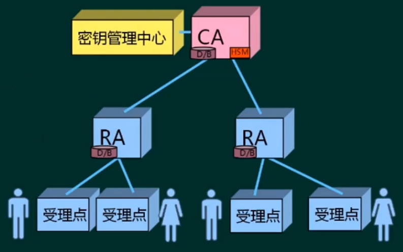
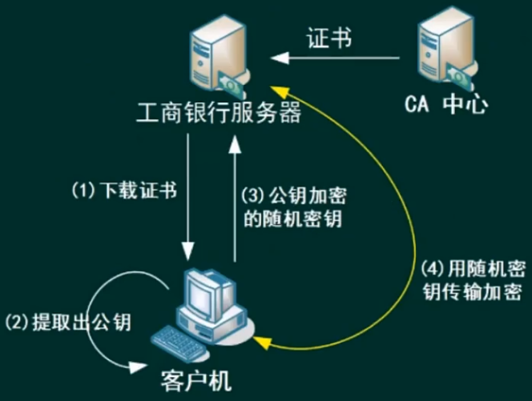

# 系统安全分析与设计

## 安全基础技术
### 对称与非对称加密
#### 对称加密 
对称加密算法就是传统的用一个密码进行加密和解密

缺陷：
- 加密强度不高（但效率高）
- 密钥分发困难

常见对称密钥算法：
- DES：替换+移位、56位密钥、64位数据块、速度快、密钥易产生
  - 3DES：两个56位密钥的K1、K2
    - 加密：K1加密 → K2解密 → K1加密
    - 解密：K1解密 → K2加密 → K1解密
- RC-5：RSA数据安全公司的很多产品都使用了RC-5
- IDEA算法：128密钥、64位数据块、比DES的加密性好对计算机功能要求相对较低，PGP
- AES算法：高级加密标准，又称Rijndael加密法，是美国政府使用的以中国区块加密标准

#### 非对称加密
对称加密算法就是传统的用一个密码进行加密和解密

缺陷：加密速度慢

常见的非对称加密算法：
- RAS：2048位（或1024位）密钥、计算量极大、难破解
- Elgamal：安全性依赖于计算有限域上离散对数这一难题
- ECC：椭圆曲线算法

> - Pa加密的只能Sa解密，Sa加密的只能Pa解密
> - A向B发送消息
>   - 从保密性的角度来看：如果使用Sa加密，因为Pb是公开的，所以起不到保密的作用（任何人都可以解密），如果使用Pb加密，则只能用Sb才能解开，就保证了发送消息的保密性
>   - 从防抵赖的角度来看：消息能使用Pa解开，那么说明它是经过了Sa的加密，而只有A持有Pa对应的私钥Sa，说明消息是A发过来的。这就是`数字签名`的应用，它可以识别发送者的身份，以及防抵赖。其中，用Sa加密的过程就是`签名`，而使用Pa解密的过程就是`验证签名`
> 
> `私钥一般用来签名和解密，反之，公钥一般用来验证签名和加密`

### 信息摘要
将明文通过`单向`散列函数处理，得到固定长度的散列值的算法

常用的消息摘要算法有MD5、SHA等，市场上广泛使用的MD5、SHA算法的散列值分别为128位和160位，由于SHA通常采用的密钥长度较长，一次安全性高于MD5

信息摘要一般用于保障数据的`完整性`，因为原文变，摘要也会变

### 数字签名
数字签名（又称公钥数字签名）是只有信息的发送者才能产生的别人无法伪造的一段数字串，这段数字串同时也是对信息的发送者发送信息真实性的一个有效证明。它是一种类似写在纸上的普通的物理签名，但是在使用了公钥加密领域的技术来实现的，用于鉴别数字信息的方法。一套数字签名通常定义两种互补的运算，一个用于签名，另一个用于验证。`数字签名是非对称密钥加密技术与数字摘要技术的应用`

#### 加密技术、信息摘要、数字签名的应用的例子

> 使用非对称加密方式加密对称密钥的技术称为`数字信封`

### 数字证书
- 证书的`版本信息`
- 证书的`序列号`，每个证书都有唯一的证书序列号
- 证书所使用的签名算法
- 证书的发行机构名称，命名规则一般采用X.500格式
- 正式的`有效期`，现在通过的证书一般采用UTC时间格式，它的计算范围为1950-2049
- 证书所有人的名称，命名规则一般采用X.500格式
- 证书所有人的`公开密钥`
- `证书发行者对证书的签名`（CA使用CA的私钥对数字证书进行签名，所以需要使用CA的公钥对数字证书来进行验证）

#### PKI公钥体系
- CA（Certificate Authority）认证中心
- RA（Registration Authority）注册审批机构
- 证书受理点
- 密钥管理中心-KMC

## 网络安全
### 安全协议

- PGP（Pretty Good Privacy）：优良保密协议，针对邮件、文件的混合加密系统
- SSL（Secure Sockets Layer）：安全套接字协议，工作在传输层至应用层
- TLS（Transport Layer Security）：传输层安全协议
- SET（Secure Electronic Transaction）：安全电子交易协议，用于电子商务
- IPSEC（Internet Protocol Security）：互联网安全协议，对IP包加密

### 网络攻击
#### 被动攻击
收集信息为主，破坏保密性

| 攻击名称     | 描述                                                                 |
|----------|--------------------------------------------------------------------|
| 窃听（网络监听） | 用各种可能的合法或非法手段窃取系统中的`信息资源和敏感信息`                                     |
| 业务流分析    | 通过对系统进行长期监听，利用统计分析方法对诸如`通信频度、通信的信息流向`、通信的总量变化等参数进行研究，从而发现有价值的信息和规律 |
| 非法登录     | 有些资料将这种方式归为被动攻击                                                    |

#### 主动攻击
主动攻击的类别主要有：
- 中断（破坏可用性）
- 篡改（破坏完整性）
- 伪造（破坏真实性）

| 攻击名称           | 描述                                                           |
|----------------|--------------------------------------------------------------|
| 假冒身份           | 通过欺骗通信系统（或用户）达到非法用户冒充合法用户，或者特权小的用户冒充成特权大的用户的目的。黑客大多是采用假冒进行攻击 |
| 抵赖             | 这是一种来自用户的攻击，比如：否认自己曾经发布过某条消息、伪造一份对方来信等                       |
| 旁路控制           | 攻击者利用系统的安全缺陷或安全性上的脆弱之处获得非授权的权力或特权                            |
| 重放攻击           | 所截获的某次合法通信数据拷贝，处于非法的目的而被重新发送。加时间戳能识别并应对重放攻击                  |
| 拒绝服务（DOS/DDOS） | 对信息或其他资源的合法访问被无条件的阻止                                         |

### 等级保护保准
计算机信息系统安全保护等级划分准则（GB17859-1999）
- **用户自主保护级**：适用于普通内联网用户
  - 系统被破坏后，对`公民、法人和其他组织权益有损害`，但不损害国家安全社会秩序和公共利益
- **系统审计保护级**：适用于通过内联网或国际网进行商务活动，需要保密的非重要单位
  - 系统被破坏后，对`公民、法人和其他组织权益有严重损害`，或`损害社会秩序和公共利益`，但不损害国家安全
- **安全标记保护级**：适用于地方各级国家机关、金融机构、邮电通信、能源与水源供给部门、交通运输、大型工商与信息技术企业、重点工程建设等单位
  - 系统被破坏后，对`社会秩序和公共利益造成严重损害`，或对`国家安全造成损害`
- **结构化保护级**：适用于中央级国家机关、广播电视部门、虫咬物资储备单位、社会应急部门、尖端科技企业集团、国家重点科研机构和国防建设等部门
  - 系统被破坏后，对`社会秩序和公共利益造成特别严重损害`，或对`国家安全造成严重损害`
- **访问验证保护级**：适用于国防关键部门和依法需要对计算机信息系统实施特殊隔离的单位
  - 系统被破坏后，对`国家安全造成特别严重损害`

#### 速记表格
|         | 公民、法人和其他组织权益 | 社会秩序和公共利益 | 国家安全   |
|---------|--------------|-----------|--------|
| 用户自主保护级 | 损害           |           |        |
| 系统审计保护级 | 严重损害         | 损害        |        |
| 安全标记保护级 |              | 严重损害      | 损害     |
| 结构化保护级  |              | 特别严重损害    | 严重损害   |
| 访问验证保护级 |              |           | 特别严重损害 |

#### 信息安全体系结构

- 鉴别服务
  - 用户名 + 口令
  - 数字证书
  - 生物特征识别
- 访问控制
  - **自主访问控制（DAC）**：对主体指定哪些客体的访问权
  - 访问控制列表（ACL）：对客体指定允许的主体
  - **强制访问控制（MAC）**：主体客体分级
  - **基于角色的访问控制（RBAC）**
  - 基于任务的访问控制（TBAC）
- 数据完整性
  - 阻止对媒体访问的机制：隔离，访问控制，路由控制
  - 探测非授权修改的机制：数字签名，数据重复，数字指纹，消息序列号
- 数据保密性
  - 通过禁止访问提供机密性
  - 通过加密提供机密性
- 抗抵赖
  - 数字签名