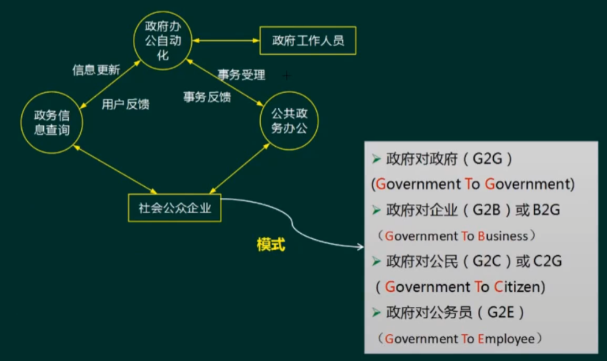
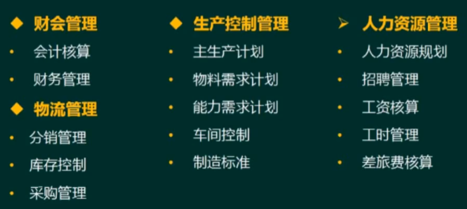

# 信息与信息化的概念

## 信息的定义

1. 香农：信息就是不确定性的减少
2. 维纳：信息就是信息，既不是物质，也不是能量

## 信息的特点

* 客观性（真伪性）：也叫事实性，不符合事实的信息不仅没价值，还有副作用
* 动态性：信息随着时间的变化而变化
* 层次性：信息可以分为战略级、管理级和操作级
* 传递性：信息在`时间上的传递即是存储`；在`空间上的传递即是转移或扩散`
* 滞后性：信息是数据加工后的产物，所以相对数据有滞后性
* 扩压性：信息和实物不同，它可以扩散也可以压缩
* 分析性：信息可以分享，这和物质不同，并且信息分享具有非零和性

## 信息化及其意义

### 信息化的概念

* 信息化是从`工业社会到信息社会的演进与变革`
* 信息化的主体是全体社会成员（政府、企业、团体和个人），时域是一个长期过程，空域是经济和社会的一切领域，手段是先进社会生产工具

### 信息化对组织的意义

* 组织的结构创新：如虚拟企业、虚拟社区
* 组织的管理创新：实施电子政务、建立电子政府、建立电子社区以提升管理水平
* 组织经营创新：利用信息化将经营和管理融为一体
* 造就信息化人才队伍：三类人才（IT专才、业务人才、专家型人才）

# 信息系统生命周期

* 立项阶段：企业全局、形成概念、需求分析
* 开发阶段：单个系统开发（总体规划→系统分析→系统设计→系统实施→系统验收）
* 运维阶段：通过验证、移交之后
* 消亡阶段：更新改造、功能拓展、报废重建

| 阶段   | 工作                                     | 产出                                                 |
|------|----------------------------------------|----------------------------------------------------|
| 系统规划 | 初步调查、分析系统目标、子系统组成、拟实施方案、可行性研究、指定系统建设方案 | 系统设计任务书（系统建设方案、实施计划）                               |
| 系统分析 | 业务流程分析、数据与数据流程分析、软件需求分析、网络需求分析         | 系统需求规格说明书、软件需求规格说明书、确定测试计划、系统测试计划、初步的用户手册          |
| 系统设计 | 软件架构设计、软件概要设计、详细设计、网络设计                | 架构设计文档、概要设计说明书、详细设计说明书、程序规格说明书、概要测试计划、详细测试计划、各类设计图 |
| 系统实施 | 软件编码、软件单元/集成/刺痛测试、综合布线                 | 源码、单元测试、集成测试报告、操作手册                                |
| 系统验收 | 确认测试、试运行                               | 确认测试报告、项目验收报告                                      |

# 信息系统战略规划

## 方法

| 阶段                                      | 方法                                                                                                                                                         |
|-----------------------------------------|------------------------------------------------------------------------------------------------------------------------------------------------------------|
| 第一阶段   `以数据处理为核心`，围绕只能部门需求          | 企业系统规划法（`BSP`）：`自上而下`识别系统目标，自下而上设计信息系统，对组织机构的变动具有适应性   关键成功因素法（`CSF`）:找实现目标的`关键信息集合，从而确定开发优先次序`   战略集合转化法（`SST`）：把战略目标看成`“信息集合”，把战略目标转变成信息系统的战略目标` |
| 第二阶段   `以企业内部MIS为核心`，围绕企业整体需求       | 战略数据规划法（`SDP`）、信息工程法（`IE`）、战略栅格法（`SG`）                                                                                                                     |
| 第三阶段   综合考虑企业内外环境，`以集成为核心`，围绕企业战略需求 | 价值链分析法（VCA）、战略一致性模型（SAM）                                                                                                                                   |

# 政府信息化与电子政务

# 企业信息化与电子商务

## 企业资源计划（ERP）

* 物料需求计划（Material Requirement Planning, MRP）：物料单系统
* 制造资源计划（Manufacturing Resource Planning, MRPⅡ）：增加库存、分销等等
* 企业资源计划（Enterprise Resource Planning, ERP）：打通了供应链、把财务、人力资源、销售管理等纳入

- 管理思想：他是管理思想的变革
- 软件产品：但不是直接买来就用，需要个性化开发与部属
- 管理系统：存在众多的子系统，这些子系统有统一的规划，是`互联互通的，便于事前事中监控`

## 客户关系管理（CRM）

市场营销和客户服务是CRM的支柱性功能。通过维护客户关系，让企业获得利益

- 客户服务与支持
- 客户群维系
- 商机管理
+ 触发中心
+ 挖掘中心
* 自动化销售
* 自动化市场营销
* 自动化客户服务

## 供应链管理（SCM）

`SCM理念`：强强联合，整合与优化“三流”，打通企业间“信息孤岛”，严格的数据交换标准

`信息化的三流`
* 信息流
  * 需求信息流：如客户订单、胜场计划、采购合同等
  * 供应信息流：如入库单、完工报告单、库存计划、可供销售量、提货发运单等
* 资金流
* 物流

## 产品数据管理
## 商业智能（BI）

- 需求分析
- 数据仓库建模
- 数据抽取
- 建立BI分析报表
- 用户培训和数据模拟测试
- 系统改进和完善

总结：数据仓库、数据挖掘、OLAP（联机分析处理）

### 数据仓库

特点：
- `面对主题`：数据按主题组织
- `集成的`：消除了数据源中的不一致性，提供整个企业的一致全局信息
- `相对稳定的（非易失的）`：主要进行查询操作，只有少量的修改和删除操作（或不是删除）
- `反映历史变化（随着时间变化）`：记录企业从过去某一时刻到当前各个阶段的信息，可对发展历程和未来趋势做定量分析和预测

### 数据挖掘

方法
- 决策树（构造树结构进行分析）
- 神经网络（类似统计学中的判别、回归、聚类等功能）
- 遗传算法（三个基本过程：繁殖（选择）、交叉（重组）、变异（交叉））
- 关联规则挖掘算法（关联规则是描述数据之间存在的关系的规则）

分类
- 关联分析：挖掘出隐藏在数据间的相互关系
- 序列模式分析：侧重点是分析数据间的前后关系（因果关系）
- 分类分析：为每一个记录赋予一个标记再按标记分类
- 聚类分析：分类分析法的逆过程

### 数据湖

`数据湖`是一个存储企业各种各样原始数据的大型仓库，其中的数据可供存取、处理、分析与传输

数据湖从企业的多个数据源获取原始数据，并且针对不同的目的，同一份原始数据还有可能有多种满足特定内部模型格式的数据副本。因此，数据湖中被处理的数据可能是任意类型的信息，`从结构化数据到完全非结构化数据`

`数据仓库仅支持分析处理；数据湖既支持分析处理，也支持事务处理`

| 维度   | 数据仓库                                      | 数据湖                                       |
|------|-------------------------------------------|-------------------------------------------|
| 数据   | 清洗过的数据 结构化的数据                          | 原始数据 结构化、半结构化数据                        |
| 模式   | 数据存储之前定义数据模式 数据集成之前完成大量工作 数据的价值提前明确 | 数据存储之后定义数据模式 提供敏捷，简单的数据集成 数据的价值尚未明确 |
| 存取方法 | 标准SQL语言                                   | 应用程序，类SQL的程序                              |
| 优势   | 多数据源集成 干净，安全的数据 转换一次，多次使用           | 无限扩展 并行执行 支持编程框架 数据经济            |

## 决策支持系统
## 知识管理
## 业务流程重组

# 企业门户

# 企业应用集成