# 软件开发方法

## 软件开发方法

### 结构化法
- 用户至上
- 严格区分工作阶段，每阶段有任务与成果
- 强调系统开发过程的整体性与全局性
- 系统开发过程工程化，文档资料标准化
- 自顶向下，逐级分解（求精）

面向过程，不能灵活变动

### 原型法
- 适用于需求不明确的开发
- 包括抛弃型原型和进化型原型

用于需求分析阶段

### 面向对象方法
- 更好的复用性
- 关键在于建立一个全面、合理、统一的模型
- 分析、设计、实现三个阶段，界限不明确

### 面向服务方法
- SO方法有三个主要抽象级别：操作、服务、业务流程
- SOAD分为三个层次：基础设计蹭（底层服务构件）、应用结构层（服务之间的接口和服务级协定）和业务组织层（业务员流程建模和服务流程编排）
- 服务建模：分为服务发现、服务规约和服务实现三个阶段

## 软件开发模型

- `瀑布模型（SDLC）`  
  - 适合与需求明确的项目  
  - 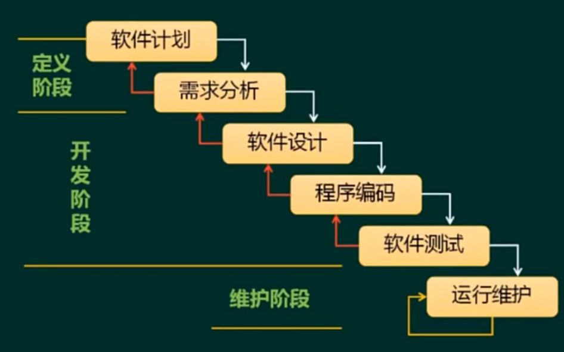
- 演化模型
- 增量模型
  - 
- `螺旋模型`
  - 适合与大型系统，引入了风险分析
  - 
- `原型模型`
  - 抛弃型原型（快速原型模型）
  - 进化型模型
- 喷泉模型
  - 面向对象模型
- V模型
  - 强调测试贯穿与始终的模型（测试尽早做、提前做）
  - 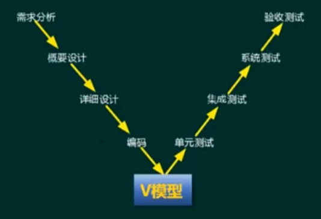
- 迭代模型/迭代开发方法
- 快速应用开发（RAD）
  - 
- 构建组装模型/基于构件的开发方法（CBSD）
  - 构件库是快的核心
  - 优点：快、节省成本、可靠性高
  - 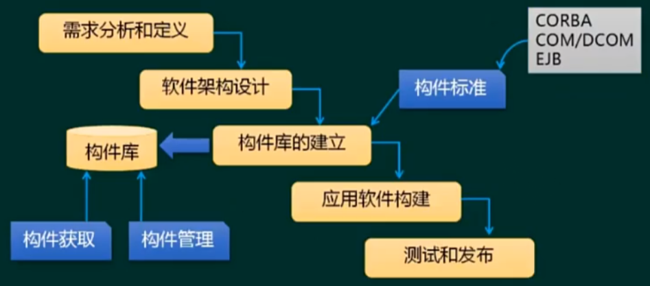
- `统一过程/统一过程开发（UP/RUP）`
  - 
- `敏捷开发方法`
  - 小步快跑模式，适合小型项目开发
  - 4大价值观；5大原则；12大最佳实践
  - 开发方法：
    - XP(Extreme Programming, 极限编程)在一些`对费用控制严格的公司中使用`，已经被证实是`非常有效`的
    - 水晶方法：`用最少纪律约束仍能成功的方法`
    - 开放式源码：指`程序开发人员在地域上分布很广`
    - SCRUM：`明确定义了可重复的方法过程`
      - 2-4周一个冲刺（发布一个可用版本）
      - 
    - FDD(Feature Driven Development, 功用驱动开发方法)：开发人员分为两类：`首席程序员和类程序员`
    - ASD(Adaptive Software Development, ASD方法)：其核心是三个非线性的、重叠的开发阶段：`猜测、合作与学习`
  - 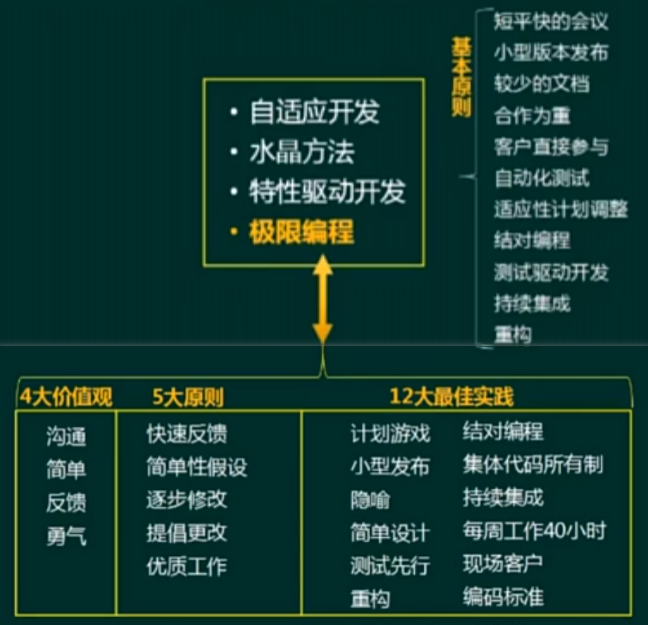
- 模型驱动的开发方法
- `基于架构的开发方法`

> 其他经典模型
> 
> 

## 逆向工程

- 实现级：包括程序的`抽象语法树`、`符号表`、`过程`的设计表示
- 结构级：包括反映`程序分量之间相互依赖关系`的信息，例如调用图、结构图、程序和数据结构
- 功能级：包括反映`程序段功能及程序段`之间关系的信息，例如数据和控制流模型
- 领域级：包括反映程序分量或程序诸如实体与`应用领域概念之间的对应关系`的信息，例如实体关系模型

## 净室软件工程

- 净室即无尘室、洁净室，也就是一个受控污染级别的环境
- 使用盒结构规约（或形式化方法）进行分析和设计建模，并且强调将正确性验证，而不是测试，作为发现和消除错误的主要机制
- 使用统计的测试来获取认证被交付的软件的可靠性所必须的出错率信息

# 需求工程

概述：
- 软件需求是指用户对系统在功能、行为、性能、设计约束等方面的期望
- 软件需求是指用户解决问题或达到目标所需的条件或能力，是系统或系统部件要满足合同、标准、规范或其他正式规定文档所需具有的条件或能力，以及反映这些条件或能力的文档说明

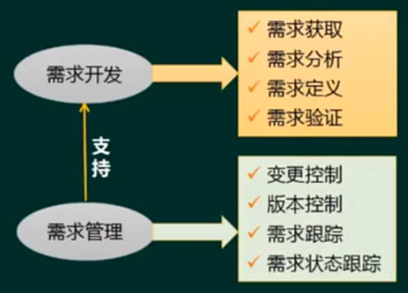

> - 需求开发偏向技术维度
>   - 需求定义产出 SRS（需求规格说明书）
>   - 需求验证产出 需求的基线（文档）

## 需求开发

### 需求获取

从技术角度分类：
- 业务需求 → 层级较高的需求
- 用户需求
- 系统需求 → 计算机化

对`系统需求`进一步细分：
- 功能需求
- 性能需求：例子：加载速度、响应速度
- 设计约束：例子：客户提出要用xx数据库、xx系统

从`项目管理`角度分类：
- 基本需求：用户明确提出来的
- 期望需求：隐含需求，对客户来说不需要提出就应该有的
- 兴奋需求：（镀金）客户没有提出但系统提供

需求获取的方法
- 收集资料
- 联合讨论会
- 用户访谈
- 书面调查
- 现场观摩
- 参加业务实践
- 阅读历史文档
- 抽样调查（节省成本，以小概全）

### 需求分析

结构分析（SA）：
- 数据字典：数据元素、数据结构、数据流、数据存储、加工逻辑、外部实体
- 功能模型
  - 数据流图（DFD）：数据流、加工、数据存储、外部实体
- 数据模型
  - E-R图：实体、联系
- 行为模型
  - 状态转换图：状态（初态、终态）、事件

面向对象分析（OOA）：

修相关概念：对象(对象、属性、名称(id))、类（实体类、边界类、控制类）、抽象、封装、继承与泛化、多态、接口（只有方法的定义，没有方法实现）、消息、组件、模式和复用

- 实体类：映射需求中的每个实体，实体类保存需要存储在永久存储体中的信息
- 控制类：用于控制用力工作的类，一般由动宾结构的短语转化来的名词
- 边界类：用于封装在用例内、外流动的信息回数据流。边界类位于系统于外界的交界处，包括所有窗体、报表、打印机和扫描仪等硬件接口，以及其他系统的接口

### 需求定义
- 用结构化和自然语言编写文本型文档
- 建立图形化模型
- 编写形式化规格说明书

> 产出SRS（需求规格说明书）

严格定义法：
- 所有需求都能够被预先定义
- 开发人员与用户只i按能够准确而清晰地交流
- 采用图形/文字可以充分体现最终系统

原型法：
- 并非所有需求都能够在开发前被准确地说明
- 项目参加者之间通常都存在交流上的困难
- 需要实际的、可供用户参考的系统模型
- 有合适的系统开发环境
- 反复是完全需要和值得提倡的，需求一旦确定，就应遵从严格的方法

### 需求验证

需求验证 → 需求评审/需求测试 → 正式评审/非正式评审

### 需求管理

#### 定义需求基线
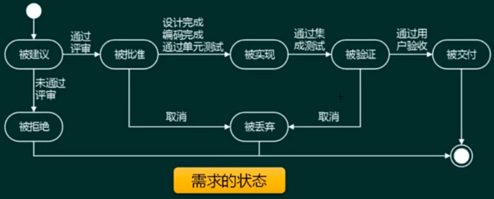

#### 需求跟踪
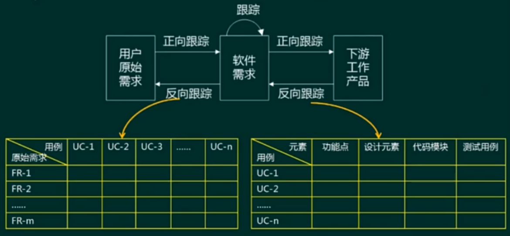

> 1. 下游工作产品：代码模块、测试用例
> 2. 黄色是需求矩阵

#### 变更控制
- 变更流程
  - 

- 工作状态变化
  - 

## UML

- 构造块
  - 事物
    - 结构事物：`最静态的部分`，包括：类、接口、协作、用例、活动类、构件和节点
    - 行为事物：代表时间和空间上的`动作`，包括：消息、动作次序、连接
    - 分组事物：看成一个盒子，如：包、构件
    - 注释事物：UML模型的`解释部分`。描述、说明和标注模型的元素
  - 关系
  - 图
- 规则
  - 范围：给一个名字以特定含义的语境
  - 可见性：怎样使用或看见名字
  - 完整性：事物如何正确、一致地相互联系
  - 执行：运行或模拟动态模型的含义是什么
- 公共机制
  - 规格说明：事物语义的细节描述，它是模型真正的核心
  - 修饰：通过修饰来表达更多的信息
  - 公共分类：类属于对象、接口以实现
  - 扩展机制：允许添加新的规则

### 4+1视图
- 1：这个1跟其他4个都有联系
  - 用例视图（use-case view）: 需求分析模型 —— 最终用户
- 4
  - 逻辑视图（logical view）: 表现为：类与对象（系统的功能） —— 系统分析、设计人员
  - 实现视图（implementation view）: 表现为：物理代码文件和组件 —— 程序员
  - 进程视图（process view）: 表现为：线程、进程、`并发` —— 系统集成人员
  - 部署视图（deployment view）: 表现为：软件到硬件的映射 —— 系统和网络工程师

逻辑视图 → 实现试图/进程试图 → 部署试图

### UML图

- 静态图（结构图）
  - 类图：一组类、接口、协作和它们之间的关系
  - 对象图：一组对象及它们之间的关系
  - 构件图：一个封装的类和它的接口
  - 部署图：`软硬件之间的映射`
  - 制品图：系统的物理结构
  - 包图：由模型本身分解而成的组织单元，以及它们之间的依赖关系
  - 组合机构图

- 动态图（行为图）
  - `用例图：系统与外部参与者的交互`
  - `顺序图：强调按时间顺序`
  - `通信图（协作图）`
  - 状态图：状态转换变迁
  - `活动图：类似程序流程图，并行行为`
  - 定时图：强调实际时间
  - 交互概览图

#### 用例模型（用例图）
`用例图描述一组用例、参与者及它们之间的关系`
1. 用户角度描述系统功能；
2. 参与者是外部触发因素（包括用户、组织、外部系统、时间）；
3. 用例是功能单元

用例建模的流程：
1. 识别参与者（必须）
2. 合并需求获得用例（必须）
3. 细化用例描述（必须） 
   1. 用例名称
   2. 简要说明
   3. 事件流
   4. 非功能性需求
   5. 前置条件
   6. 后置条件
   7. 扩展点
   8. 优先级
4. 调整用例模型（可选）
   1. 包含关系（使用关系）：当可以从两个或两个以上的用例中提取公共行为时，应该使用包含关系来表示。提取出来公共的用例称为抽象用例，把原始用例称为基本用例或基础用例。`基础用例 ——<<include>>--> 抽象用例`
   2. 扩展关系：一个用例明显混合了两种或两种以上的不同场景，即根据情况可能发生多种分支，应使用扩展关系。分为一个基本用例和一个或多个扩展用例。`基础用例 <——<<extend>>—— 扩展用例`
   3. 泛化关系：当多个用例共同拥有一种类似的结构和行为的社会，可以将它们的共性抽象成父用例，其他用例作为泛化关系中的子用例。`子用例 ————▷ 父用例`

> - **包含关系**与**泛化关系**的区别在于是否存在父子关系
> - **包含关系**与**扩展关系**都可以称为依赖关系

#### 分析模型（类图）
  - 定义概念类
  - 识别类之间的关系
  - 为类添加职责
  - 建立交互图

类图（class diagram）：类图描述一组类、接口、协作和它们之间的关系
对象图（object diagram）：对象图描述一组对象及它们之间的关系。对象图描述了在类图中所建立的事物实例的静态快照

- 类名，方法名，属性名
- 多重度
  - `1`：表示一个集合中的一个对象对应的另一个集合中的一个对象
  - `0..*`：表示一个集合中的一个对象对应另一个集合中的0个或多个对象（可以不对应）
  - `1..*`：表示一个集合中的一个对象对应另一个集合中的1个或多个对象（至少对应一个）
  - `*`：表示一个集合中的一个对象对用另一个集合中的多个对象
- 关系
  - 依赖关系：一个事物发生变化影响另一个事物
  - 关联关系：描述了一组链，链是对象之间的连接
    - 聚合关系：整体与部分的生命周期`不同`
    - 组合关系：整体与部分的生命周期`相同`
  - 泛化关系：特殊（子类）/一般（父类）关系
  - 实现关系：接口与类之间的关系

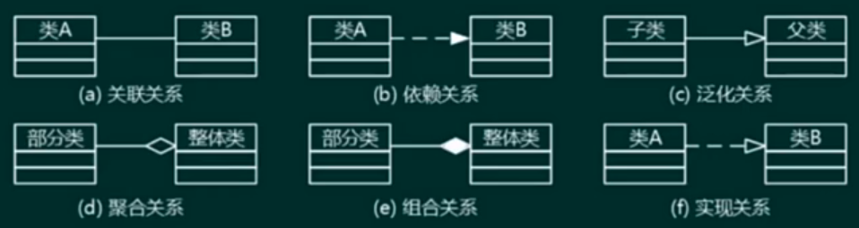

#### 顺序图（时序图）
顺序图（sequence diagram， 序列图）是一种交互图，他强调对象之间消息发送的顺序，同属显示对象之间的交互

#### 活动图
活动图（activity diagram）将进程或其他计算结构展示为计算内部一步步的控制流和数据流。活动图专注于系统的动态视图。它对系统的功能建模和业务流程建模特别重要，并强调对象间的控制流程。

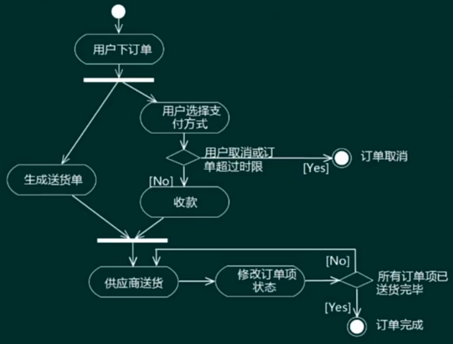

> 泳道式活动图
> 
> 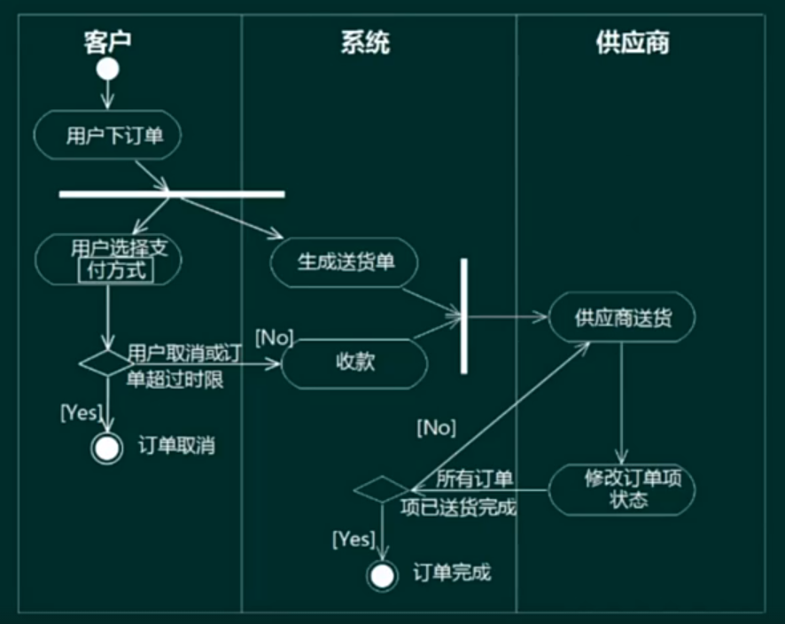

#### 状态图
状态图（state diagram）描述一个状态机，它由状态、转移、事件和活动组成。状态图给出了对象的动态视图。它对于接口、类或协作的行为建模尤为重要，而且它强调事件导致的对象行为，这非常有助于反应式系统建模

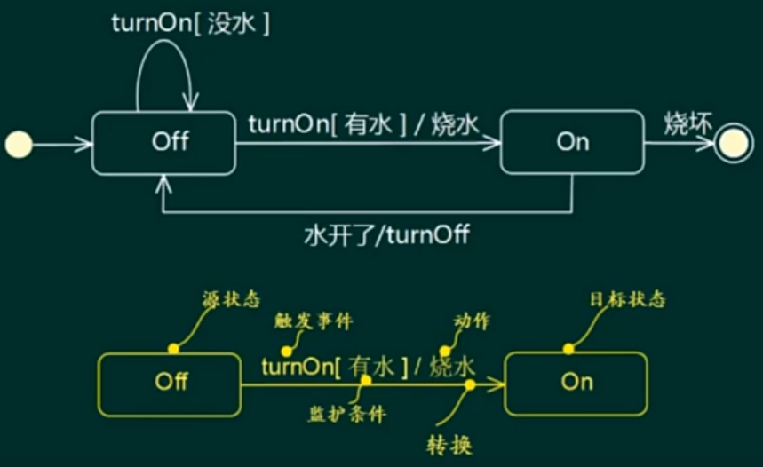

#### 通信图（协作图）
通信图（communication diagram）也是一种交互图，它强调收发消息的对象或参与者的组织结构。顺序图和通信图表达了类似的基本概念，但它们所强调的概念不同，顺序图强调的是时序，通信图强调的是对象之间的组织结构（关系）

# 软件系统建模

> 虚线上部分其实就是逆向工程，虚线下面是正向工程

建模方法：
1. 结构化建模方法  
一种以过程为中心的技术，可用于分析一个现有的系统以及定义新系统的业务需求。结构化建模方法所绘制的模型称为数据流图（DFD）。对于流程较为稳定的系统可以考虑结构化建模
2. 信息工程建模方法（或数据库建模方法）  
一种以数据为中心，但过程敏感的技术，它强调在分析和研究过程需求之前，首先学研究和分析数据需求。信息工程建模方法所创建的模型被称为实体联系图（ERD）。主要用于数据建模
3. 面向对象建模方法  
将“数据”和“过程”集成到被称为“对象”的结构中，消除了数据个过程的认为分离现象。面向对象建模方法所创建的模型被称为对象模型。随着面向对象技术的不断发展和应用，形成了面向对象的建模标准，即统一建模语言（UML）。UML定义了几种不同类型的模型图，这些模型图以对象的形式共建一个信息系统回应用系统。目前比较常用的建模方法

# 软件设计

## 界面设计

人机界面设计
- `置于用户控制之下`
  - 以不强迫用户进入不必要的或不希望的动作的方式来定义交互方式
  - 提供灵活的交互
  - 允许用户交互可以被中断和撤销
  - 当技能级别增加时可以使交互流水化并允许定制交互
  - 使用户隔离内部技术细节
  - 设计应允许用户和出现在屏幕上的丢向直接交互
- `减少用户的记忆负担`
  - 减少对短期记忆的要求
  - 建立有意义的缺省
  - 定义直觉性的捷径
  - 界面的视觉布局应该基于真实的世界隐喻
  - 以不断进展的方式解释信息
- `保持界面的一致性`
  - 允许用户将当前任务放入有意义的语境
  - 在应用系统内保持一致
  - 如过去的交互模型已建立起了用户期望，除非迫不得已的理由，不要改变它

## 结构化设计

- 概要设计：模块的划分，模块接口的设计 → 对应集成测试
- 详细设计：基于概要设计的模块，针对模块内部的设计

### 基本思想：
- 抽象化
- 自顶而下，逐步求精
- 信息隐蔽
- 模块独立（高内聚，低耦合）

### 基本设计原则：
- 保持模块的大小适中
- 尽可能减少调用的深度（一般不超过7层）
- 多扇入，少扇出
- 单入口，单出口
- 模块的作用域应该在模块之内
- 功能应该是可预测的

## 面向对象设计

### 基本过程

### 设计原则
- 单一职责原则：设计目的单一的类
- 开放-封闭原则：对扩展开放，对修改关闭
- 里氏替换原则：子类可以替换父类
- 依赖倒置原则：要依赖于抽象，而不是具体实现；增对接口编程，不要针对实现编程
- 接口隔离原则：使用多个专门的接口比使用单一的总接口要好
- 组合重用原则：要尽量使用组合，而不是继承关系达到重用目的
- 迪米特原则（最少知道法则）：一个对象应当对其他对象有尽可能少的了解

### 设计模式的概念
- `架构模式`：软件设计中的高层决策，例如C/S结构就属于架构模式，架构模式反映了开发软件系统过程中所作的基本设计决策
- `设计模式`：主要关注软件系统的设计，与具体的实现语言无关
- `惯用法`：是最低层的模式，关注软件系统的设计与实现，实现时通过某种特定的程序设计语言来描述构件与构件之间的关系。每种编程语言都有它自己特定的模式，即语言的惯用法。例如引用-计数就是C++语言中的一种惯用法

> 模式是解决一类问题的解决方案

### 设计模式的分类
- 创建型模式：创建对象
  - <u>工厂方法模式</u>
  - 抽象工厂模式
  - 原型模式
  - 单例模式
  - 构造器模式
- 结构型模式：更大的结构
  - <u>`适配器模式`</u>
  - `桥接模式`
  - `组合模式`
  - `装饰模式`
  - 外观模式
  - 享元模式
  - 代理模式
- 行为型模式：交互职责分配
  - `职责链模式`
  - `命令模式`
  - <u>解释器模式</u>
  - 迭代器模式
  - `中介者模式`
  - 备忘录模式
  - `观察者模式`
  - `状态模式`
  - `策略模式`
  - <u>模板方法模式</u>
  - 访问者模式

> 有下划线的表示既可以是类模式，也可以是对象模式；无下划线的表示只是对象模式

#### 创建型模式
| 设计模式名称                       | 简要说明                                         | 速记关键字    |
|------------------------------|----------------------------------------------|----------|
| Factory Method   工厂方法模式   | 定义一个创建对象的接口，但由子类决定需要实例化哪一个类。工厂方法使得子类实例化的过程推迟 | 动态产生对象   |
| Abstract Factory   抽象工厂模式 | 提供一个接口，可以创建一系列相关或相互依赖的对象，而无需指定它们具体的类         | 生产成系列的对象 |
| Builder   构造器模式           | 将一个复杂类的表示与其构造相分离，使得相同的构造过程能够得到不同的表示          | 复杂对象构造   |
| Prototype   原型模式          | 用原型实例指定创建对象的类型，并且通过拷贝这个原型来创建新的对象             | 克隆对象     |
| Singleton   单例模式          | 保证一个类只有一个实例，并提供一个访问它的全局访问点                   | 单实例      |

#### 结构型模式
| 设计模式名称              | 简要说明                                              | 速记关键字    |
|---------------------|---------------------------------------------------|----------|
| Adapter   适配器模式  | 将一个类的接口转换成用户希望得到的另一种接口。它使原本不相容的接口得以协同工作           | `转换`接口   |
| Bridge   桥接模式    | 将类的抽象部分和它的实现部分分离开来，使他们可以独立地变化                     | 继承树拆分    |
| Composite   组合模式 | 将对象组合成树形结构以表示“整体-部分”的层次结构，使得用户对单个对象和组合对象的使用具有一致性  | 树形目录结构   |
| Decorator   装饰模式 | 动态地给一个对象添加一些额外的职责。它提供了用子类扩展功能的一个灵活的替代，比派生一个子类更加灵活 | `动态附加职责` |
| Facade   外观模式    | 顶一个高层的接口，为子系统中的一组接口提供一个一致的外观，从而简化该子系统的使用          | 对外统一接口   |
| Flyweight   享元模式 | 提供支持大量细粒度对象共享的有效方法                                | 汉字编码     |
| Proxy   代理模式     | 为其他对象提供一种代理以控制这个对象的访问                             | 快捷方式     |

#### 行为型模式
| 设计模式名称              | 简要说明                                              | 速记关键字    |
|---------------------|---------------------------------------------------|----------|
||||

# 测试与评审

# 系统运行与维护