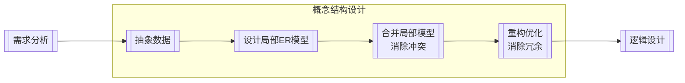

## 数据库模式与范式

### 数据库的结构与模式

#### 三级抽象

数据库系统划分为三个抽象级：用户级、概念级、物理级

##### 用户级数据库

用户级数据库对应于外模式，是最接近用户的一级数据库，是用户可以看到和使用的数据库，又称用户视图。用户级数据库主要由外部记录组成，不同的用户视图可以互相重叠，用户的所有操作都是针对用户视图进行的

##### 概念级数据库

概念级数据库对应于概念模式，介于用户级和物理级之间，是所有用户视图的最小并集，是数据库管理员可看到和使用的数据库，又称 DBA（DataBase Administrator，数据库管理员）视图。概念级数据库由概念记录组成，一个数据库可有多个不同的用户视图，每个用户视图由数据库某一部分的抽象表示所组成。一个数据库应用系统只存在一个 DBA 视图，它把数据库作为一个整体的抽象表示。概念级模式把用户视图有机地结合成一个整体，综合平衡考虑所有用户要求，实现数据的一致性、最大限度降低数据冗余、准确地反映数据间的联系

##### 物理级数据库

物理级数据库对应于内模式，是数据库的低层表示，它描述数据的实际存储组织，是最接近于物理存储的级，又称内部视图。物理级数据库由内部记录组成，物理级数据库并不是真正的物理存储，而是最接近于物理存储的级

#### 三级模式

数据库系统的三级模式为外模式、概念模式、内模式

##### 概念模式

概念模式（模式、逻辑模式）用以描述整个数据库中数据库的逻辑结构，描述现实世界中的实体及其性质与联系，定义记录、数据项、数据的完整性约束条件及记录之间的联系，是数据项值的框架

数据库系统概念模式通常还包含有访问控制、保密定义、完整性检查等方面的内容，以及概念/物理之间的映射

概念模式是数据库中全体数据的逻辑结构和特征的描述，是所有用户的公共数据视图。一个数据库只有一个概念模式

外模式是数据库用户（包括程序员和最终用户）能够看见和使用的局部数据的逻辑结构和特征的描述，是数据库用户的数据视图，是与某一应用有关的数据的逻辑表示。一个数据库可以有多个外模式。一个应用程序只能使用一个外模式。

##### 外模式

外模式（子模式、用户模式）用以描述用户看到或使用的那部分数据的逻辑结构，用户根据外模式用数据操作语句或应用程序去操作数据库中的数据。外模式主要描述组成用户视图的各个记录的组成、相互关系、数据项的特征、数据的安全性和完整性约束条件

##### 内模式

内模式是整个数据库的最低层表示，不同于物理层，它假设外存是一个无限的线性地址空间。内模式定义的是存储记录的类型、存储域的表示以及存储记录的物理顺序，指引元、索引和存储路径等数据的存储组织

内模式是数据物理结构和存储方式的描述，是数据在数据库内部的表示方式。一个数据库只有一个内模式

内模式、模式和外模式之间的关系如下：
1. 模式是数据库的中心与关键
2. 内模式依赖于模式，独立于外模式和存储设备
3. 外模式面向具体的应用，独立于内模式和存储设备
4. 应用程序依赖于外模式，独立于模式和内模式

#### 两级独立性

数据库系统两级独立性是指物理独立性和逻辑独立性。三个抽象级间通过两级映射（外模式—模式映射，模式—内模式映射）进行相互转换，使得数据库的三级形成一个统一的整体。

##### 物理独立性

物理独立性是指用户的应用程序与存储在磁盘上的数据库中的数据是相互独立的。当数据的物理存储改变时，应用程序不需要改变

物理独立性存在于概念模式和内模式之间的映射转换，说明物理组织发生变化时应用程序的独立程度

##### 逻辑独立性

逻辑独立性是指用户的应用程序与数据库中的逻辑结构是相互独立的。当数据的逻辑结构改变时，应用程序不需要改变

逻辑独立性存在于外模式和概念模式之间的映射转换，说明概念模式发生变化时应用程序的独立程度

::: tip 数据库视图
它是一个虚拟表（逻辑上的表），其内容由查询定义（仅保存SQL查询语句）。同真实的表一样，视图包含一系列带有名称的列和行数据（一般是多表联合查询）。但是，视图并没有真正存储这些数据，而是通过查询原始表动态生成所需要的数据

优点：
1. 视图能简化用户操作
2. 视图使用户能以多种角度看待同一数据
3. 视图对重构数据库提供了一定程度的逻辑独立性
4. 视图可以对机密数据提供安全保护

缺点：
1. 查询之后再展示，效率比较低

> 物化视图：它不是传统意义上的虚拟试图，是实体视图，其本身会存储数据。同时当原始表中数据更新时，物化视图也会更新。但是它仅适合查询较多的数据，增/删/改较多的情况下不适合物化视图

:::

### 数据模型

数据模型主要有两大类，分别是概念数据模型（实体—联系模型）和基本数据模型（结构数据模型）

概念数据模型是按照用户的观点来对数据和信息建模，主要用于数据库设计。概念模型主要用实体—联系方法（Entity-Relationship Approach）表示，所以也称 E-R 模型

基本数据模型是按照计算机系统的观点来对数据和信息建模，主要用于 DBMS 的实现。基本数据模型是数据库系统的核心和基础。基本数据模型通常由数据结构、数据操作和完整性约束三部分组成。其中数据结构是对系统静态特性的描述，数据操作是对系统动态特性的描述，完整性约束是一组完整性规则的集合

常用的基本数据模型有层次模型、网状模型、关系模型和面向对象模型

### 关系代数

垂直方向的为属性列，称为目或元；水平方向的为元组行，称为记录或实例

关系代数的基本运算主要有并、交、差、笛卡尔积、选择、投影、连接和除法运算

#### 并（Union）

设关系R和关系S具有相同的目n（即两个关系都有n个属性），且相应的属性取自同一个域，则关系R与关系S的并由属于R且属于S的元组组成。其结果关系仍为n目关系。记作
$$
R \cup S = \lbrace t \lvert t \in R \lor t \in S \rbrace
$$

#### 交（Intersection）

设关系R和关系S具有相同的目n，且相应的属性取自同一个域，则关系R与关系S的交由既属于R又属于S的元组组成。其结果关系仍为n目关系。记作
$$
R \cap S = \lbrace t \lvert t \in R \land t \in S \rbrace \\ R \cap S = R - (R - S)
$$

#### 差（Difference）

设关系R和关系S具有相同的目n，且相应的属性取自同一个域，则关系R与关系S的差由属于R而不属于S的所有元组组成。其结果关系仍为n目关系。记作
$$
R - S = \lbrace t \lvert t \in R \land t \notin S \rbrace
$$

#### 笛卡尔积（Extended Cartesian Product）

这里的笛卡尔积严格地讲是广义笛卡尔积（Extended Cartesian Product）。在不会出现混淆的情况下广义笛卡尔积也称为笛卡尔积

两个分别为n目和m目的关系R和S的广义笛卡尔积是一个(n+m)列的元组的集合。元组的前n列是关系R的一个元组，后m列是关系S的一个元组。若R有k1个元组，S有k2个元组，则关系R和关系S的广义笛卡尔积有k1×k2个元组。记作：
$$
R \times S = \lbrace \mathop{t_r t_s}\limits^{\frown} \lvert t_r\in R \land t_s \in S \rbrace
$$

#### 投影（Projection）

投影运算是从关系的垂直方向进行运算，在关系R中选择出若干个属性列A组成新的关系，记作
$$
\Pi_A(R) = \lbrace t[A] \lvert t \in R \rbrace \text{，其中A是R中的属性列}
$$

#### 选择（Selection）

选择运算是从关系的水平方向进行运算，是从关系R中选择满足给定条件的诸元组，记作
$$
\sigma_F(R) = \lbrace t \lvert t \in R \land F(t) = \text{true} \rbrace \text{，其中F是选择条件，取值为真或假}
$$

#### 自然连接（Natural join）

自然连接是关系R和S在所有公共属性（common attribute）上的等接（Equijoin）。但在得到的结果中公共属性只保留一次，其余删除

自然连接(Natural join)是一种特殊的等值连接，它要求两个关系中进行比较的分量必须是相同的属性组，并且在结果中把重复的属性列去掉

$$
R \bowtie S = \lbrace \mathop{t_r t_s}\limits^{\frown}[U-B] \lvert t_r\in R \land t_s \in S \land t_r[B] = t_s[B] \rbrace \text{，R和S具有相同的属性组B}
$$

::: tip
- 并、交、差都是集合运算，且关系结构都一样（因为集合运算的前提是关系结构一致）
- 在多表联合查询语句中`select A from B where C`这个句式中，A部分可以理解为投影，B部分可以理解为为笛卡尔积，C部分可以理解为选择
- $\mathop{t_r t_s}\limits^{\frown}$ 称为元组的连接。R为有m元的关系，S为有n元的关系，$t_r \in R$，$t_s \in S$，$\mathop{t_r t_s}\limits^{\frown}$ 是一个$m+n$元的元组，前m个分量为R中的一个m元组，后n个分量为S中的一个n元组。
- 自然连接 → 等价笛卡尔积：先选择，再投影
- 一般认为自然连接的性能由于笛卡尔积。如果可以的话，先将操作的对象子表尽可能的压缩
:::

### 规范化理论

#### 价值与用途

非规范化的关系模式可能存在的问题包括：数据冗余、更新异常、插入异常、删除异常

#### 函数依赖

设R(U)是属性U上一个关系模式，X和Y是U的子集，r为R上任意关系，如果对于r中的任意两个元组u、v，只要有u[X]=v[X]，就有u[Y]=v[Y]，则称X函数决定Y，或称Y函数依赖于X，记为$X \to Y$

通俗地说，就像自变量 x 确定之后，相应的函数值 f(x) 也就唯一确定了一样，函数依赖是衡量和调整数据规范化的最基础的理论依据

- 部分依赖  
  关系模式：$R_1(A,B,C,D)$，依赖集：$\lbrace AB \to D, A \to C \rbrace$  
  
- 传递依赖  
  关系模式：$R_2(A,B,C)$，依赖集：$\lbrace A \to B, B \to C \rbrace$  
  

##### 键

- 候选键：唯一标识元组，且无冗余
- 主键：任选一个候选键
- 外键：其他关系的主键

> 主键唯一决定元组，逐渐可以决定所有其他的属性

求候选键的步骤：
- 将关系模式的函数依赖关系用"有向图"的方式表示
- 找入度为0的属性，并以该属性集合的起点，尝试遍历有向图，若能正常遍历图中所有结点，则该属性集即为关系模式的候选键
- 若入度为0的属性集不能遍历图中所有结点，则需要尝试性的将一些中间结点（既有入度，又有出度的结点）并入入度为0的属性集中，直至该集合能遍历所有结点，集合为候选键

#### 范式

- 第一范式：如果关系 R 中所有属性的值域都是简单域，其元素（即属性）不可再分，是属性项而不是属性组，那么关系模型 R 是第一范式的。1NF是最低的规范化要求
- 第二范式：如果一个关系$R \in 1NF$，且所有的非主属性都完全依赖于主属性，则称之为第二范式
- 第三范式：如果一个关系$R \in 2NF$，且每个非主属性不传递依赖于主属性，这种关系是第三范式
- BC范式：BC 范式的定义：如果关系模型$R \in 1NF$，且 R 中每一个函数依赖关系中的决定因素都包含候选键，则 R 是满足 BC 范式的关系

从上至下逐步优化，以解决：插入异常、删除异常、更新异常

::: tip 
简记
1. 属性值都不可再分的原子值（1NF）
2. 消除非主属性对候选键的部份依赖（2NF）
3. 消除非主属性对候选键的传递依赖（3NF）
4. 消除主属性对候选键的部分和传递依赖（BCNF）

快速判断
- 候选键使单属性则至少满足2NF
- 没有非主属性则至少满足3NF
:::

#### 无损分解

- 保持函数依赖分解
  - 设数据库模式$p=\lbrace R_1,R_2,\dots,R_k \rbrace$是关系模式R的一个分解，F是R上的函数依赖集，p中每个模式R~i~上的FD集是F~i~。如果$\lbrace F_1,F_2,\dots,F_k \rbrace$与F是等价的（即相互逻辑蕴含），那么称分解p保持FD
  - 函数依赖存在于属性本身
  - 冗余函数依赖：可以推导出来的函数依赖（$A \to B, B \to C, A \to C \text{就是冗余的}$）
- 无损分解
  - 可以还原的关系模式分解称为无损分解，反之则为有损分解
  - 无损联接分解：指将一个关系模式分解成若干个关系模式后，通过自然联接和投影运算仍能还原到原来的关系模式

##### 表格法

1. 把属性列作为表格的列
2. 把分解的关系模式列为元组行，勾上对应的属性
3. （通过自然连接）两两关系模式的同名属性，判断是否能够通过同名属性列作为决定因素的函数依赖还原除被决定因素，如果可以，则将对应的属性列勾上
4. 重复3，直至全部判断完。如果有一个元组行全是勾，说明可以无损分解，反之则是有损分解

::: tip 例子
- 有关系模式$R(A,B,C), F = \lbrace A \to B \rbrace$，其分解$p_1 = \lbrace R_1(AB), R_2(AC) \rbrace$与分解$p_2 = \lbrace R_1(AB), R_2(BC) \rbrace$，是否都为无损分解?  

|               | A                           | B                          | C            |
|---------------|-----------------------------|----------------------------|--------------|
| p~1~.R~1~(AB) | $\color{yellow} \checkmark$ | $\checkmark$               |              |
| p~1~.R~2~(AC) | $\color{yellow} \checkmark$ | $\color{green} \checkmark$ | $\checkmark$ |
| ---           | ---                         | ---                        | ---          |
| p~2~.R~1~(AB) | $\checkmark$                | $\color{red} \checkmark$   |              |
| p~2~.R~2~(BC) |                             | $\color{red} \checkmark$   | $\checkmark$ |

> - p~1~.R~1~(AB)、p~1~.R~2~(AC)有同名属性A，且有$A \to B$，所以p~1~.R~2~(AC)的B列可以勾上，此时p~1~.R~2~(AC)元组行有关系模式R的所有属性，所以是无损分解
> - p~2~.R~1~(AB)、p~2~.R~2~(BC)有同名属性B，但B不是决定因素，没有函数依赖无法还原，所以是有损分解

:::

##### 公式法

如果R的分解为$p=\lbrace R_1, R_2 \rbrace$，F为R所满足的函数依赖集和，分解p具有无损联接性的充分必要条件是
$$
R_1 \cap R_2 \to (R_1 - R_2) \text{ 或 } R_1 \cap R_2 \to (R_2 - R_1)
$$
就是通过关系模式的交集能推导关系模式的差集，那么分解是无损的（但是仅适用于两个关系模式的情况）

##### Armstrong公理

关系模式R<U, F>来说有以下的推理规则
- A1.自反律（Reflexivity）：若$Y \sube X \sube U$，则$X \to Y$成立
- A2.增广律（Augmentation）：若$Z \sube U \text{ 且 } X \to Y$，则$XZ \to YZ$成立
- A3.传递律（Transitivity）：若$X \to Y \text{ 且 } Y \to Z$，则$X \to Z$成立

根据A1，A2，A3这三条推理规则可以得到下面三条推理规则
- 合并规则：由$X \to Y, X \to Z, \text{有} X \to YZ$（A2，A3）
- 伪传递规则：由$X \to Y, WY \to Z, \text{有} XW \to Z$（A2，A3）
- 分结规则：有$X \to Y, Z \sube Y, \text{有} X \to Z$（A1，A3）

### 反规范化

由于规范化会使表不断拆分，从而导致数据表过多。这样虽然减少了数据冗余，提高了增、删、改的速度，但会增加查询的工作量。系统需要进行多次连接，才能进行查询操作，使得系统的效率大大降低

数据库设计过程中遵循规范化理论，根据业务逻辑进行反规范化操作

技术手段：
- 增加派生性冗余列
- 增加冗余列
- 重新组表
- 分割表
  - 水平分割：选择某些元组行分表（比如按时间段分表）
  - 垂直分割：选择某些属性列分表

反规范化会带来规范化理论需要解决的问题：更新异常、插入异常、删除异常，以及数据一致性的问题（解决方案有：通过触发器解决，应用程序解决），规范化和反规范化其实也是一个权衡的过程

## 数据库设计

### 设计过程

各步骤的产出物：
- 需求分析：数据流图、数据字典、需求说明书（偏向数据建模，与软件工程的需求说明书有区别）
- 概念结构设计：ER模型
- 逻辑结构设计：关系模式（需要应用规范化理论）

> 聚簇索引在物理设计阶段考虑

### 概念设计

ER模型的转换：一个实体转换成一个关系模式
- 1:1联系可以转换成一个关系模式，也可以与任意一端实体的关系模式合并
- 1:n联系可以转换成一个关系模式，也可以与n端实体的关系模式合并
- m:n联系必须转换成一个单独的关系模式

> 三个以上实体间的一个多元联系优先考虑单独的关系模式

集成的方法：
- 多个局部E-R图一次继承
- 追捕集成，用累加的方式一次继承两个局部E-R图

集成产生的冲突及解决办法：
- 属性冲突：包括属性域冲突和属性取值冲突
- 命名冲突：包括同名异义和异名同义
- 结构冲突：包括同一对象在不同应用中具有不同的抽象，以及同一实体在不同局部E-R图中所包含的属性个数和属性排列次序不完全相同

### 逻辑设计

## 事务管理

数据库系统运行的基本工作单位是事务，事务相当于操作系统中的进程，是用户定义的一个数据库操作序列，这些操作序列要么全做要么全不做，是一个不可分割的工作单位。事务具有以下特性：
1. 原子性（Atomicity）：数据库的逻辑工作单位
2. 一致性（Consistency）：使数据库从一个一致性状态变到另一个一致性状态
3. 隔离性（Isolation）：不能被其他事务干扰
4. 持续性（永久性）（Durability）：一旦提交，改变就是永久性的

事务通常以 BEGIN TRANSACTION（事务开始）语句开始，以 COMMIT 或 ROLLBACK 语句结束

### 并发控制

在多用户共享系统中，许多事务可能同时对同一数据进行操作，称为“并发操作”，此时数据库管理系统的并发控制子系统负责协调并发事务的执行，保证数据库的完整性不受破坏，同时避免用户得到不正确的数据

#### 并发产生的问题

数据库的并发操作带来的问题有：丢失更新（修改）问题、不可重复读、"脏"数据的读出

#### 封锁协议

处理并发控制的主要方法是采用封锁技术。它有两种类型：排他型封锁（X 封锁，写锁）和共享型封锁（S 封锁，读锁）

- 一级封锁协议
  - 事务T在修改数据R之前必须先对其加X锁，直到事务结束才释放
  - ==可防止丢失修改==
- 二级封锁协议
  - 一级封锁协议加上事务T在读取数据R之前先对其加S锁，读完后即可释放S锁
  - ==可防止丢失修改，还可防止读“脏”数据==
- 三级封锁协议
  - 一级封锁协议加上事务T在读取数据R之前先对其加S锁，直到事务结束才释放
  - ==可防止丢失修改、防止读“脏”数据与防止数据重复读==
- 两段锁协议
  - 所有事务必须分两个阶段对数据项加锁和解锁。其中扩展阶段是在对任何数据进行读、写操作之前，首先要申请并获得对该数据的封锁；收缩阶段是在释放一个封锁之后，事务不能再申请和获得任何其他封锁。若并发执行的所有事务均遵守两段封锁协议，则对这些事务的任何并发调度策略都是==可串行化==的
  - 可能发生死锁

::: info 表格说明
丢失更新

|     | T1     | T2     |
|-----|--------|--------|
| 1   | 读A=10  |        |
| 2   |        | 读A=10  |
| 3   | 写A=A-5 |        |
| 4   |        | 写A=A-8 |

加上（一级）封锁协议

|     | T1      | T2      |
|-----|---------|---------|
| 1   | 对A加写锁   |         |
| 2   | 读A=10   |         |
| 3   |         | 对A加写锁   |
| 4   | 写A=A-5  | 等待      |
| 5   | 释放对A的写锁 | 等待      |
| 6   |         | 读A=5    |
| 7   |         | 写A=A-8  |
| 8   |         | 释放对A的写锁 |

读"脏"数据

|     | T1       | T2     |
|-----|----------|--------|
| 1   | 读A=20    |        |
| 1   | 写A=A+50  |        |
| 2   |          | 读A=70  |
| 3   | Rollback |        |

加上（二级）封锁协议

|     | T1       | T2    |
|-----|----------|-------|
| 1   | 对A加写锁    |       |
| 2   | 读A=20    |       |
| 3   | 写A=A+50  |       |
| 4   |          | 对A加读锁 |
| 5   | Rollback | 等待    |
| 6   | A恢复为20   | 等待    |
| 7   |          | 读A=20 |

不可重复读

|     | T1              | T2      |
|-----|-----------------|---------|
| 1   | 读A=20           |         |
| 2   | 读B=30           |         |
| 3   | 求和A+B=50        |         |
| 4   |                 | 读A=20   |
| 5   |                 | 写A=A+50 |
| 6   | 读A=70           |         |
| 7   | 读B=30           |         |
| 8   | 求和A+B=100（验算不对） |         |

加上（三级）封锁协议

|     | T1        | T2      |
|-----|-----------|---------|
| 1   | 对A、B加读锁   |         |
| 2   | 读A=20     |         |
| 3   |           | 对A加写锁   |
| 4   | 读B=30     | 等待      |
| 5   | 求和A+B=50  | 等待      |
| 6   | 释放对A、B的读锁 | 等待      |
| 7   |           | 读A=20   |
| 8   |           | 写A=A+50 |
| 9   |           | 释放对A的写锁 |
:::

## 备份与恢复

## 分布式数据库系统 

## 数据仓库与数据挖掘

## NoSQL

## 大数据