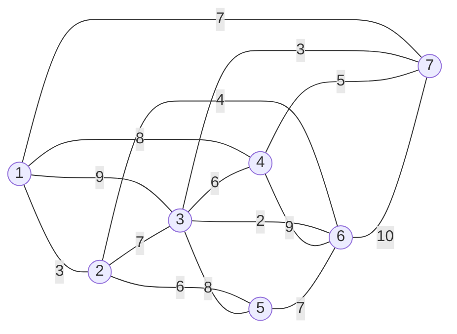

## 图论应用

### 最小生成树

所谓一个==带权图==的最小生成树，就是原图中==边的权值最小的生成树==，所谓最小是指边的权值之和小于或者等于其它生成树的边的权值之和

#### 克鲁斯卡尔（Kruskal）算法

克鲁斯卡尔算法（Kruskal）是一种使用贪婪方法的最小生成树算法。该算法初始将图视为森林，图中的每一个顶点视为一棵单独的树。一棵树只与它的邻接顶点中权值最小且不违反最小生成树属性（不构成环）的树之间建立连边

> 每次都找权值最小且不成环的边，直到所有顶点都找到

#### 普里姆（Prim）算法

普里姆算法在找最小生成树时，将顶点分为两类，一类是在查找的过程中已经包含在生成树中的顶点（假设为 A 类），剩下的为另一类（假设为 B 类）

对于给定的连通网，起始状态全部顶点都归为 B 类。在找最小生成树时，选定任意一个顶点作为起始点，并将之从 B 类移至 A 类；然后找出 B 类中到 A 类中的顶点之间权值最小的顶点，将之从 B 类移至 A 类，如此重复，直到 B 类中没有顶点为止。所走过的顶点和边就是该连通图的最小生成树

> 任选一个顶点，找选该顶点权值最小边，将顶点组成一个集合，再从集合找下一个权值最小且不成环的边

::: tip 例题

某小区有7栋楼房1~7，各楼房之间可修燃气管道线路的长度（单位：百米）已经标记在连线旁。为修建连通各个楼房的燃气管道，该小区内部燃气管道的总长度至少是多少百米？

- 克鲁斯卡尔算法：
  - 第一次找到 2，得到 ==3-6==
  - 第二次找到 3，得到 3-6、==3-7==、==1-2==
  - 都三次找到 4，得到 3-6、3-7、1-2、==2-6==
  - 第四次找到 5，得到 3-6、3-7、1-2、2-6、==4-7==
  - 第五次找到 6，得到 3-6、3-7、1-2、2-6、4-7、==2-5==
  - 所有顶点都找到，权值和为 $2+3+3+4+5+6=23$
- 普利姆算法：
  - 任选顶点[1]，得到 ==1-2==
  - 顶点[1,2]，得到 1-2、==2-6==
  - 顶点[1,2,6]，得到 1-2、2-6、==6-3==
  - 顶点[1,2,3,6]，得到 1-2、2-6、6-3、==3-7==
  - 顶点[1,2,3,6,7]，得到 1-2、2-6、6-3、3-7、==7-4==
  - 顶点[1,2,3,4,6,7]，得到 1-2、2-6、6-3、3-7、7-4、==2-5==
  - 所有顶点都找到，权值和为 $3+4+2+3+5+6=23$

:::
### 最短路径

### 网络与最大流量

## 运筹方法

### 线性规划

### 动态规划

### 预测与决策

## 数学建模