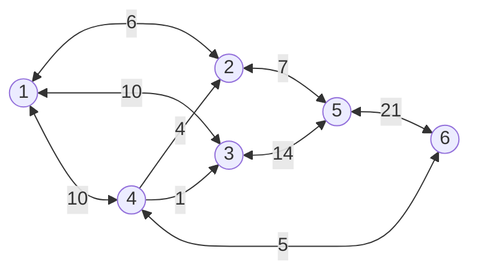
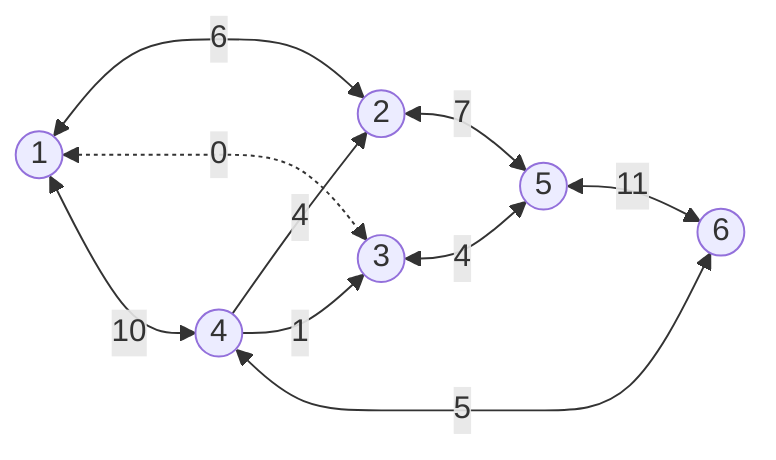
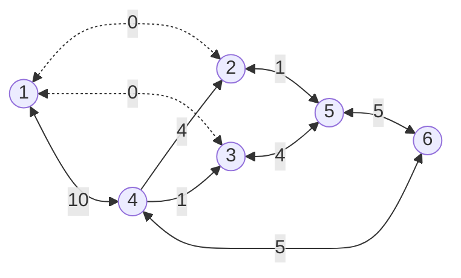
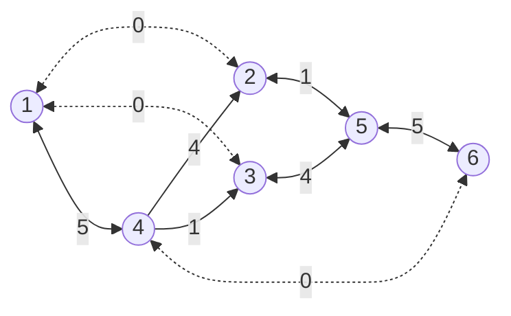
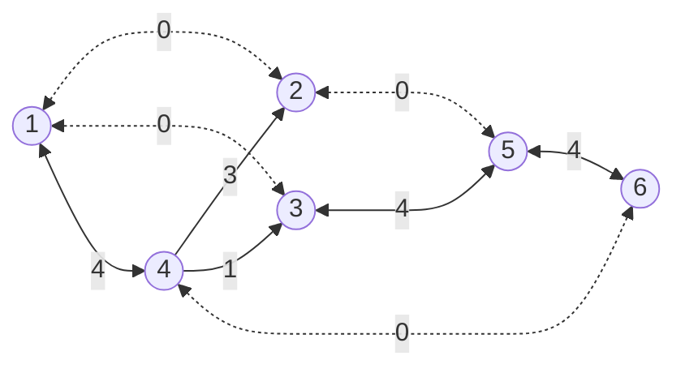
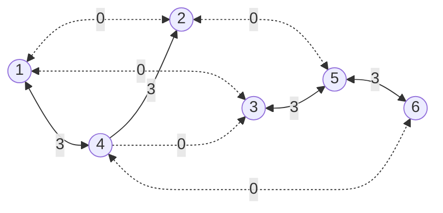

## 网络理论

图论基础上研究网络一般规律和网络流问题各种优化理论和方法的学科，是运筹学的一个分支。网络是用节点和边联结构成的图，表示研究诸对象及其相互关系，如铁路网、电力网和通信网等

在图论基础上研究网络一般规律和网络流问题各种优化理论和方法的学科，是运筹学的一个分支。网络是用节点和边联结构成的图，表示研究诸对象及其相互关系，如铁路网、电力网和通信网等。网络中的节点代表任何一种流动的起点、运转点和终点（如车站、港口、城镇、计算机终端和工程项目的事件等）。网络中的边代表任何物流、能流或信息流通过的通道（如输电线、通信线、铁路线和各事件之间的次序等）。在网络中每条边上赋予某个正数，称为该边的权，它可以表示路程、流量、时间和费用等。建立网络的目的都在于把某种规定的物质、能量或信息从某个供应点最优地输送到另一个需求点去。例如，在管道网络中要以最短的距离、最大的流量和最小的费用把水、石油或天然气从供应点送到用户那里

- 最大流量问题
- 最短路径问题
- 最短树问题
- 最小费用流

### 最小生成树

所谓一个==带权图==的最小生成树，就是原图中==边的权值最小的生成树==，所谓最小是指边的权值之和小于或者等于其它生成树的边的权值之和

#### 克鲁斯卡尔（Kruskal）算法

克鲁斯卡尔算法（Kruskal）是一种使用贪婪方法的最小生成树算法。该算法初始将图视为森林，图中的每一个顶点视为一棵单独的树。一棵树只与它的邻接顶点中权值最小且不违反最小生成树属性（不构成环）的树之间建立连边

> 每次都找权值最小且不成环的边，直到所有顶点都找到

#### 普里姆（Prim）算法

普里姆算法在找最小生成树时，将顶点分为两类，一类是在查找的过程中已经包含在生成树中的顶点（假设为 A 类），剩下的为另一类（假设为 B 类）

对于给定的连通网，起始状态全部顶点都归为 B 类。在找最小生成树时，选定任意一个顶点作为起始点，并将之从 B 类移至 A 类；然后找出 B 类中到 A 类中的顶点之间权值最小的顶点，将之从 B 类移至 A 类，如此重复，直到 B 类中没有顶点为止。所走过的顶点和边就是该连通图的最小生成树

> 任选一个顶点，找选该顶点权值最小边，将顶点组成一个集合，再从集合找下一个权值最小且不成环的边

::: tip 例题1
某小区有7栋楼房1~7，各楼房之间可修燃气管道线路的长度（单位：百米）已经标记在连线旁。为修建连通各个楼房的燃气管道，该小区内部燃气管道的总长度至少是多少百米？


- 克鲁斯卡尔算法：
  - 第一次找到 2，得到 ==3-6==
  - 第二次找到 3，得到 3-6、==3-7==、==1-2==
  - 都三次找到 4，得到 3-6、3-7、1-2、==2-6==
  - 第四次找到 5，得到 3-6、3-7、1-2、2-6、==4-7==
  - 第五次找到 6，得到 3-6、3-7、1-2、2-6、4-7、==2-5==
  - 所有顶点都找到，权值和为 $2+3+3+4+5+6=23$
- 普利姆算法：
  - 任选顶点[1]，得到 ==1-2==
  - 顶点[1,2]，得到 1-2、==2-6==
  - 顶点[1,2,6]，得到 1-2、2-6、==6-3==
  - 顶点[1,2,3,6]，得到 1-2、2-6、6-3、==3-7==
  - 顶点[1,2,3,6,7]，得到 1-2、2-6、6-3、3-7、==7-4==
  - 顶点[1,2,3,4,6,7]，得到 1-2、2-6、6-3、3-7、7-4、==2-5==
  - 所有顶点都找到，权值和为 $3+4+2+3+5+6=23$
:::

### 最短路径

最短路问题（short-path problem）是网络理论解决的典型问题之一，可用来解决管路铺设、线路安装、厂区布局和设备更新等实际问题。基本内容是：若网络中的每条边都有一个数值（长度、成本、时间等），则找出两节点（通常是源节点和阱节点）之间总权和最小的路径就是最短路问题

::: tip 例题2
有一批货物从城市s发往城市t，线条上的数字代表通过这条路的费用（单位为万元）。那么。运送这批货物，至少需要花费多少元？


用贪心法考虑，s到t的路径最短，那么s到t的前一个顶点的路径也是最短

- s 出发
  - 到 1，最短 25
  - 到 2，花费 21
- 1 出发
  - 到 8，最短 31
  - 到 7，最短 36
- 2 出发
  - 到 3，最短 41
  - 到 4，最短 46
- 8 出发
  - 到 9，最短 64
  - ~~到 7，最短 56~~
- 7 出发
  - ~~到 9，最短 91~~
  - ~~到 8，最短 61~~
- 3 出发
  - 到 5，最短 61
  - ~~到 4，最短 53~~
- 4 出发
  - 到 6，最短 81
- 5 出发
  - ~~到 7，最短 96~~
  - 到 t，最短 82
  - 到 6，最短 69（最短：$min(81,69)=69$）
- 6 出发
  - 到 t，最短 81
- 9 出发
  - 到 t，最短 82

最短路径 81
:::

### 网络与最大流量

当物质流或信息流通过给定的网络时，在流过每条边的流量x不超过该边允许通过的流量c的条件下,求出从发点s向收点t输出的最大流量f，即在满足的条件下，使f最大

::: tip 例题3
下图标出了某地区的运输网，各节点之间的运输能力如下表所示。那么，从节点1到节点6的最大运输能力（流量）可以达到多少万吨/小时？


画图


按流量大小排序，有以下路径
1. $1 \to 3 \to 5 \to 6$（流量大小：10）
2. $1 \to 2 \to 5 \to 6$（流量大小：6）
3. $1 \to 4 \to 6$（流量大小：5）
4. $1 \to 4 \to 2 \to 5 \to 6$（流量大小：4）
5. $1 \to 4 \to 3 \to 5 \to 6$（流量大小：1）

初始流量为0，先走1号路线

此时流量为$0+10=10$，再走2号路线

此时流量为$10+6=16$，再走3号路线

此时流量为$16+5=21$，再走4号路线

此时流量为$21+1=22$，再走5号路线

此时流量为$22+1=23$，此时1到6之间已无通路
:::

## 运筹方法

运筹学是近代应用数学的一个分支，主要是将生产、管理等事件中出现的一些带有普遍性的运筹问题加以提炼，然后利用数学方法进行解决。前者提供模型，后者提供理论和方法。运筹学可以根据问题的要求，通过数学上的分析、运算，得出各种各样的结果，最后提出综合性的合理安排，以达到最好的效果

运筹学作为一门用来解决实际问题的学科，在处理千差万别的各种问题时，一般有以下几个步骤：确定目标、制订方案、建立模型、制订解法

### 线性规划

线性规划（Linear programming,简称LP），是运筹学中研究较早、发展较快、应用广泛、方法较成熟的一个重要分支，是辅助人们进行科学管理的一种数学方法，是研究线性约束条件下线性目标函数的极值问题的数学理论和方法

线性规划是运筹学的一个重要分支，广泛应用于军事作战、经济分析、经营管理和工程技术等方面。为合理地利用有限的人力、物力、财力等资源作出的最优决策，提供科学的依据

数学模型
1. 列出约束条件及目标函数
2. 画出约束条件所表示的可行域
3. 在可行域内求目标函数的最优解及最优值

::: tip 例题4
某企业需要采用甲、乙、丙三种原材料生产Ⅰ、Ⅱ两种产品，生产两种产品所需原材料数量、单位产品可获得利润以及企业现有原材料树如下图所示，则公司可以获得最大利润是多少万元？此时原料是否有剩余？
<table>
  <thead>
    <tr><td colspan="2" rowspan="2"></td><td colspan="2">产品（吨）</td><td colspan="2" rowspan="2">现有原材料（吨）</td></tr>
    <tr><td>Ⅰ</td><td>Ⅱ</td></tr>
  </thead>
  <tbody>
    <tr><td rowspan="3">所需资源</td><td>甲</td><td>1</td><td>1</td><td>4</td></tr>
    <tr><td>乙</td><td>4</td><td>3</td><td>12</td></tr>
    <tr><td>丙</td><td>1</td><td>3</td><td>6</td></tr>
    <tr><td colspan="2">单位利润（万元）</td><td>9</td><td>12</td><td colspan="2"></td></tr>
  </tbody>
</table>

设：产品Ⅰ生产$x$吨，产品Ⅱ生产$y$吨，列出约束条件
$$
\begin{cases} x+y \le 4 \\ 4x+y \le 12 \\ x+3y \le 6 \end{cases} \text{ 且 } \begin{cases} x \ge 0 \\ y \ge 0 \end{cases} \\
$$
问题为求解$9x+12y$的最大值，不难解得$x=2,y=\frac 4 3$，所以最大利润$9 \times 2+12 \times \frac 4 3=34$，原材料只有甲有剩余

::: echarts
```js
function func(t, x) {
  if (t == 1) return 4 - x;
  if (t == 2) return 12 - 4 * x;
  if (t == 3) return (6 - x) / 3;
}

function generateData(n) {
  let data = [];
  for (let i = -50; i <= 50; i += 0.1) {
    data.push([i, func(n, i)]);
  }
  return data;
}

module.exports = {
  animation: false,
  grid: {
    top: 40,
    left: 50,
    right: 40,
    bottom: 50
  },
  xAxis: {
    name: 'x',
    min: -5,
    max: 10,
    minorTick: {
      show: true
    },
    minorSplitLine: {
      show: false
    }
  },
  yAxis: {
    name: 'y',
    min: -5,
    max: 15,
    minorTick: {
      show: true
    },
    minorSplitLine: {
      show: false
    }
  },
  series: [
    {
      type: 'line',
      showSymbol: false,
      clip: true,
      data: generateData(1)
    },
    {
      type: 'line',
      showSymbol: false,
      clip: true,
      data: generateData(2)
    },
    {
      type: 'line',
      showSymbol: false,
      clip: true,
      data: generateData(3)
    }
  ]
}
```
:::

:::

### 动态规划

### 预测与决策

## 数学建模