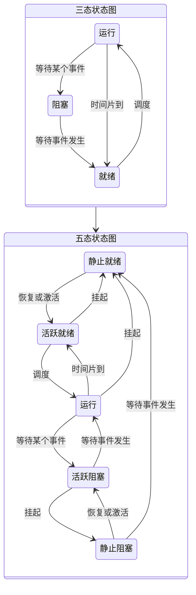
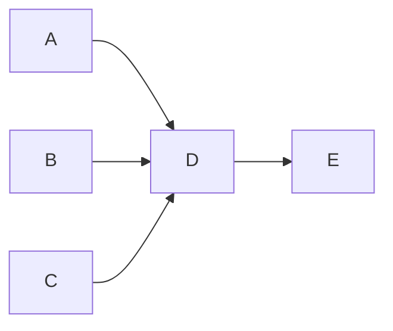

## 操作系统概述

### 操作系统定义

操作系统（Operating System，OS）是计算机系统中的核心系统软件，负责管理和控制计算机系统中的硬件和软件资源，合理地组织计算机工作流程和有效地利用资源，在计算机与用户之间起接口的作用。操作系统为用户提供的接口表现形式一般为：命令、菜单、窗口之类的，而操作系统为应用程序提供的接口为 API

### 操作系统分类

按照操作系统的功能划分，操作系统的基本类型有批处理操作系统、分时操作系统、实时操作系统、网络操作系统、分布式操作系统、嵌入式操作系统、微内核操作系统等

## 操作系统基本原理

### 进程管理

#### 进程的状态

##### 三态模型与五态模型

> 五态模型中的`挂起`：将进程从内存中淘汰出去

#### 前趋图

前趋图是一个由结点和有向边构成的有向无循环图。该图通常用于表现事务之间先后顺序的制约关系。图中的每个结点可以表示一个语句、一个程序段或是一个进程，结点间的有向边表示两个结点之间存在的前趋关系

::: tip eg
包饺子的工序有：A:绞肉、B:切葱末、C:切姜末、D:搅拌、E:包饺子

按顺序来操作就是：

但是一些准备工作是可以同时进行的：

对于上面的前趋图的可以记作：=={(A,D),(B,D),(C,D),(D,E)}==，其实就是记录每个箭线起止的关系
:::

#### 进程的互斥与同步

进程互斥定义为：一组并发进程中一个或多个程序段，因共享某一共有资源而导致必须以一个不允许交叉执行的单位执行。也就是说互斥是要保证临界资源在某一时刻只被一个进程访问

进程同步定义为：把异步环境下的一组并发进程因直接制约而互相发送消息而进行互相合作、互相等待，使得各进程按一定的速度执行的过程称为进程同步。也就是说进程之间是异步执行的，同步即是使各进程按一定的制约顺序和速度执行

> - 同步 → 直接制约
> - 异步 → 间接制约
> - 简单来说，互斥是资源的竞争关系，而同步是进程间的协作关系

::: tip 同步模型

:::

##### PV操作

> P是荷兰语的 Passeren，V是荷兰语的 Verhoog

- 临界资源：诸进程间需要互斥方式对其进行共享的资源，如打印机、磁带机等
- 临界区：每个进程中访问临界区的`那段代码称为临界区`
- 信号量：指一种特殊的变量（全局变量）

- P操作
  - 申请资源
  - 判断资源是否足够（$S \lt 0$） → 如果不足则把进程放入阻塞队列，否则继续执行
- V操作
  - 释放资源
  - 检查是否有进程排队（$S \ge 0$） → 如果有则通知阻塞进程，否则继续执行（为什么等于0也需要通知，因为是先操作S再判断大小，S在释放资源之前是-1，也就是还有一个进程在排队的）

> PV操作的信号量 → 如果信号量大于等于0，表示现有资源数量；如果信号量小于0，表示有多少个排队进程
> 前趋图中的PV操作：前驱节点活动做完之后`通知`后继节点可以执行活动，而后继节点需要`检查`前驱节点是否做完。简单而言就是`箭线的起点是V操作，终点是P操作`

#### 死锁资源

进程管理是操作系统的核心，但如果设计不当，就会出现死锁的问题。如果一个进程在等待一件不可能发生的事件，则进程就死锁了。而如果一个或多个进程产生死锁，就会造成系统死锁

##### 产生死锁的条件

产生死锁的主要原因是供共享的系统资源不足，资源分配策略和进程的推进顺序不当。系统资源既可能是可重复使用的永久性资源，也可能是消耗性的临时资源

- 互斥条件
- 保持和等待条件
- 不剥夺条件
- 环路等待条件

##### 解决死锁的策略

- 在死锁发生前采用的预防和避免策略
- 在死锁发生后采用的检测与恢复策略

死锁的预防主要是通过打破死锁产生的 4 个必要条件之一来保证不会产生死锁。采用的死锁预防策略通常有资源的静态分配法或有序分配法，它们分别打破了资源动态分配条件和循环等待条件，因此不会发生死锁。但这样做会大大降低系统资源的利用率和进程之间的
并行程度。

死锁避免策略，则是在系统进行资源分配时，先执行一个死锁避免算法（典型的如银行家算法），以保证本次分配不会导致死锁发生。由于资源分配很频繁，因此死锁避免策略要耗费大量的 CPU 和时间。

### 存储管理

### 文件管理

### 作业管理

### 设备管理