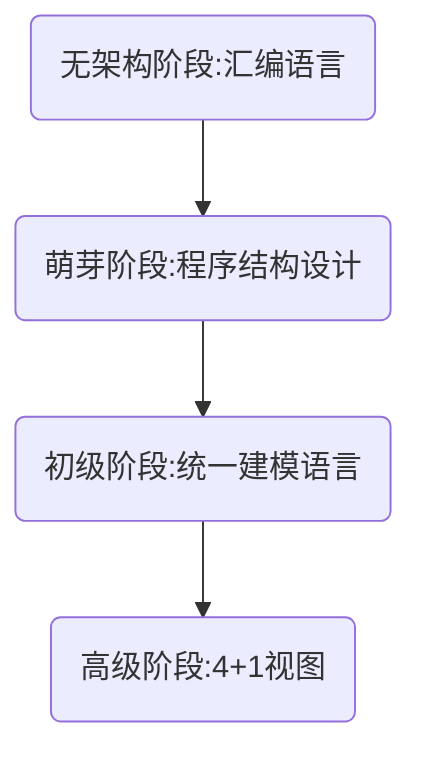
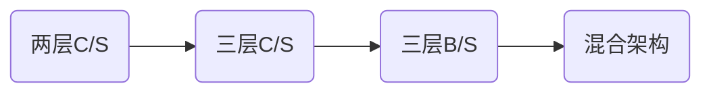
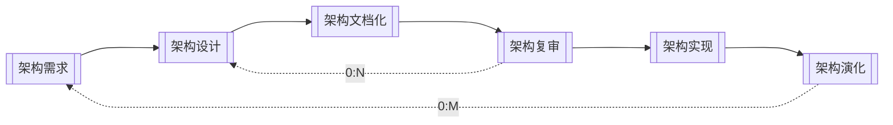
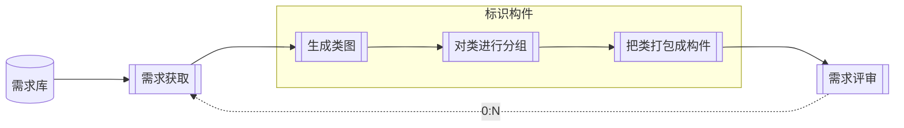
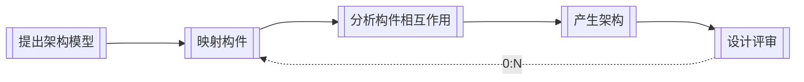
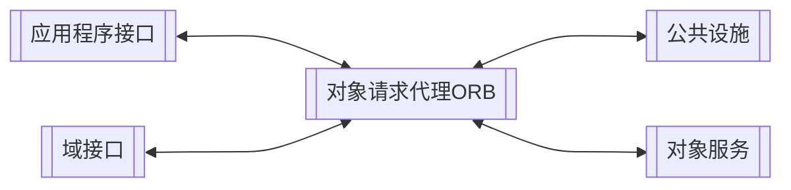

## 软件架构


> - 需求分析偏向于`业务`,软件设计偏向于`技术`，架构在需求分析之后，在软件设计之前，承前启后成为了处理两者关系的桥梁
> - 架构设计就是需求分配，即将满足需求的职责分配到组件上

==架构 = 体系结构==

- 软件架构风格是描述某一特定应用领域中系统组织方式的管用模式。架构风格定义一个系统家族，即一个体系结构定义一个词汇表和一组约束。词汇表中包含一些构件和连接件类型，而这组约束指出系统是如何将这些构件和连接件组合起来的
- 软件架构为软件系统提供了一个结构、行为和属性的高级抽象，由构成系统的元素的描述、这些元素的相互作用、指导元素集成的模式以及这些模式的约束组成
- 软件架构是项目干系人进行交流的手段，明确了对系统实现的约束条件，决定了开发和维护组织的组织结构，制约者系统的质量属性
- 软件架构使推理和控制的更改更加简单，有助于循序渐进的原型设计，可以作为培训的基础
- 软件架构是可传递和可复用的模型，通过研究软件架构可能预测软件的质量

### 软件架构的发展史



### 软件架构建模

- `结构模型（静态）`：以架构的构件、连接件和其他概念来刻画结构
- 框架模型：不太侧重描述结构的细节而更侧重于整体的结构
- `动态模型`：系统的"大颗粒"的行为性质
- 过程模型：构建系统的步骤和过程
- 功能模型：由一组功能构件按层次组成，下层向上层提供服务

#### 4+1模型


==架构的"4+1"模型对应的UML的"4+1"视图==

| 架构视图 | 人员      | 关注点             | UML视图 |
|------|---------|-----------------|-------|
| 场景视图 | 分析/测试人员 | 系统行为（用例图）       | 用例视图  |
| 逻辑视图 | 最终用户    | 系统功能（对象图或类图）    | 逻辑视图  |
| 开发视图 | 程序员     | 源代码、组件、DLL（构件图） | 实现视图  |
| 进程视图 | 集成人员    | 并发（活动类）         | 进程视图  |
| 物理视图 | 系统工程师   | 软件到硬件的映射关系（部署图） | 实现视图  |

## 软件架构风格

- 架构设计的一个核心问题是能否达到架构级的复用
- 架构分风格反映了领域中众多系统所共有的结构和语义特征，并指导如何将各个构建有效的组织成一个完整的系统
- 架构风格定义了用于描述系统的术语表和一组指导构建系统的规则

分类：

- 数据流风格：批处理序列、管道-过滤器
- 调用/返回风格：主程序/子程序、面向对象、层次结构
- 独立构件风格：进程通信、事件驱动系统（隐式调用）
- 虚拟机风格：解释器、基于规则的系统
- 仓库风格：数据库系统、超文本系统、黑板系统

> 仅仅只是分类，实际使用一般不可能只用单一类型

### 数据流风格


> 特点：数据处理、严格流程

#### 批处理序列

构件为一系列固定顺序的计算单元，构件之间只通过数据传递交互。每个处理步骤是一个独立的程序，每一步必须在其前一步结束后才能开始，`数据必须是完整的，以整体的方式传递`

#### 管道-过滤器

每个构件都有一组输入和输出，构件读输入的数据流，经过内部处理，然后产生输出数据流。这个过程通常是对输入数据流变换或计算来完成的，包括通过计算和增加信息以丰富数据、通过浓缩和删除以精简数据、通过改变记录方式以转化数据和传递地转化数据等。这里的构件称为过滤器，连接件就是数据流传输的管道，将一个过滤器的输出传输到另一个过滤器的输入

`早期编译器就是采用的这种架构。（要一步一步处理的，均可考虑采用此架构）`

### 调用/返回风格


#### 主程序/子程序

单线程控制，把问题划分为若干个处理步骤，构件即为主程序和子程序，子程序通常可以合成为模块。过程调用作为交互机制，即充当连接件的角色。调用关系具有层次性，其语义逻辑变现为主程序的正确性取决于它调用的子程序的正确性

#### 面向对象

构件是对象，对象是抽象数据类型的实例。在抽象数据类型中，数据的表示和它们的相应操作被封装起来，对象的行为体现在其接受和请求的动作。连接件即是对象间交互的方式，对象是通过函数和过程的调用来交互的

#### 层次结构

构件组织成一个层次结构，连接件通过决定层间如何交互的协议来定义。每层为上一层提供服务，使用下一层的服务，只能见到与自己邻接的层。通过层次结构，可以将大的问题分解为若干个渐进的小问题逐步解决，可以隐藏问题的复杂度。修改某一层，最多影响其相邻的两层（通常只能影响上层）

::: tip 分布式系统开发
分布式系统开发分为五个逻辑计算层

- 表示层实现用户界面
- 表示逻辑层为了生成数据表示而必须进行的处理任务，如输入数据编辑等
- 应用逻辑层包括为实际业务应用和规则所需的应用逻辑和处理过程，如信用检查、数据计算和分析等
- 数据处理层包括存储和访问数据库中数据所需的应用逻辑和命令，如查询语句和存储过程等
- 数据层是数据库中实际存储的业务数据

客户机/服务器系统开发时可以采用不同的分布式计算架构

- 分布式表示架构：将表示层和表示逻辑层放置于客户机，应用逻辑层、数据处理层和数据层仁表留在服务器上
- 分布式数据架构：将应用逻辑层、表示逻辑层和表示层放置于客户机，数据层和数据处理层放置于服务器上
- 分布式数据和应用架构：将表示逻辑层和表示层放置在客户机，应用逻辑层放置在应用服务器上，数据层和数据处理层放置在数据服务器上
:::

::: tip 调用/返回风格（层次结构）的优缺点
- 优点：
  1. 这种风格支持基于可增加抽象层的设计，`允许将一个复杂问题分解成一个增量步骤序列的实现`
  2. 不同的层次处于不用的抽象级别：
     1. 越靠近底层，抽象级别越高
     2. 越靠近顶层，抽象级别越低
  3. 由于每一层最多只影响`两层`，同时只要给相邻层提供相同的接口，允许每层用不同的方法实现，同样为`软件复用`提供了强大的支持
- 缺点：
  1. 并不是每个系统都可以很容易地划分为层的模式
  2. 很难找到一个合适的、正确的层次抽象方法
:::

### 独立构件风格

#### 进程通信

构件是独立的过程，连接件是消息传递。构件通常是命名过程，消息传递的方式可以是点对点、异步或同步方式，以及远程过程（方法）调用等

#### 事件驱动系统（隐式调用）

构件不直接调用一个过程，而是触发或广播一个或多个事件。构件中的过程在一个或多个事件中注册，当某个事件被触发时，系统自动调用在这个事件中注册的所有过程。一个事件的触发就导致了另一个模块中的过程调用。这种风格的构件就是匿名的过程，它们之间交互的连接件往往是以过程之间的隐式调用来实现的。主要优点是为软件复用提供了强大的支持，为构建的维护和演化带来了方便；其缺点是构件放弃了对系统计算的控制

### 虚拟机风格

> 适用于自定义需求的场景

#### 解释器

解释器通常包括一个完成解释工作的解释引擎、一个包含将被解释的代码的存储区、一个记录解释引擎当前工作状态的数据结构，以及一个记录源代码被解释执行的精度的数据结构。具有解释器风格的软件含有一个虚拟机，可以仿真硬件的执行过程和一些关键应用，其缺点是执行效率比较低

#### 基于规则的系统

基于规则的系统包括规则集、规则解释器、规则/数据选择器和工作内存，一般用在人工智能领域和DSS中

### 仓库风格

仓库风格中构件分为两种：一种是`中央数据结构`，保存系统当前的状态；另一种是`独立构件`，对中间存储进行操作

- 以数据为中心的风格
- `现代集成编译环境一般采用这种架构风格`

#### 数据库系统

#### 黑板系统

包括知识源、黑板和控制三部分。知识源包括若干独立计算的不同单元，提供解决问题的知识。知识源响应黑板的变化，也只修改黑板；黑板是一个全局数据库，包含问题域解空间全部状态，是知识源相互作用的唯一媒介；知识源响应是通过黑板状态的变化来控制的。黑板系统通常应用在对于解决问题没有确定性算法的软件中（`信号处理（语音识别）、问题规划和编译器优化等`）


#### 超文本系统

构件以网状连接方式相互连接，用户可以在构件之间进行按照人类的联想思维发过誓任意跳转到相关构件。超文本是一种非线性的网状信息组织方法，它以结点为基本单位，链作为结点之间的联想是关联。超文本系统通常应用于互联网领域

::: tip 传统编译器与现代编译器的区别
- 传统编辑器（数据流风格）
  ```mermaid
  graph TD
      A[源代码]-->B[词法分析]
      B-->C[语法分析]
      C-->D[语义分析]
      D-->E[编译]
      E-->F[连接]
      F-->G[最终生成可执行程序,exe]
  ```
- 现代编译器（仓库风格）
  ```mermaid
  graph LR
      B[编译器] --- A[语法树]
      C[调试器] --- A
      A --- D[变量监控]
      A --- E[断点追踪]
  ```
:::

### 其他风格

#### 闭环控制架构（过程控制）

当软件被用来操作一个物理系统时，软件与硬件之间可以粗略地表示为一个反馈循环，这个反馈循环通过接受一定的输入，确定一些列的输出，最终使环境达到一个新的状态。`适合嵌入式系统，涉及连续的动作与状态`


> - 遥控器就是一个开环控制系统的实例。用遥控器调电视频道
> - 空调就是一个闭环控制系统的实例。eg: 夏天室温30度，空调设定18度，给定温度比室温低，制冷~，获取室温（*反馈量*），如果给定温度比室温低，则继续制冷，否则，停止制冷

#### C2风格

C2是一种并行构件网络。如下图所示：  


C2架构的基本规则：

- 构件和连接件都有一个顶部和一个底部
- 构件的定语要连接到连接件的底部，构件的底部要连接到连接件的顶部，构件之间不允许直连
- 一个连接件可以和任意数目的其他构件和连接件连接
- 当两个连接件进行直接连接时，必须由其中一个的底部到另一个的顶部

### 层次型架构风格演化过程



#### 两层C/S架构


- 开发成本较高
- 客户端程序设计复杂
- 信息内容和形式单一
- 用户界面风格不一
- 软件移植困难
- 软件维护和升级困难
- 新技术不能轻易应用

#### 三层C/S架构


#### 三层B/S架构


- B/S架构缺乏对动态页面的支持能力，没有集成有效的数据库处理功能
- B/S架构的安全性难以控制
- 采用B/S架构的应用系统，在数据查询等响应速度上，要远低于C/S架构
- B/S架构的数据提交一版以页面为单位，数据的动态交互性不强，不利于OLTP应用


> 哪三层：表现层、数据库访问层、数据架构层

##### MVC架构风格

- 各层的含义：
  - Model（模型）是应用程序中用于`处理应用程序数据逻辑的部分`。通常模型对象负责在数据库中存取数据
  - View（视图）是应用程序中`处理数据显示的部分`。通常视图是依据模型数据创建的
  - Controller（控制器）是应用程序中`处理用户交互的部分`。通常控制器负责从视图读取数据，控制用户输入，并向模型发送数据
- J2EE体系结构中：
  - Model: EJB(Entity Bean、Session Bean)
  - View: JSP
  - Controller: Servlet
- 可以分为主动MVC和被动MVC两种

  

##### MVP架构风格


- MVP是MVC的变种
- MVP实现了V与M之间的解耦（V不直接使用M，修改V不会影响M）
- MVP更好的支持单元测试（业务逻辑在P中，可以脱离V来测试这些逻辑；可以将一个P用于多个V，而不需要改变P的逻辑）
- MVP中V要处理界面事件，业务逻辑在P中，MVC中界面事件由C处理

##### MVVM架构风格


#### 混合架构风格


::: tip
#### 富互联网应用（RIA）


- RIA结合了C/S架构反映速度快、交互性强的优点，以及B/S架构传播范围广及容易传播的特性
- RIA简化并改进了B/S架构的用户交互
- 数据能够被缓存在客户端，从而可以实现一个比基于HTML的响应速度更快且数据往返于服务器次数更少的用户界面

> 因为需要加载所以打开慢，但加载完成后的运行表现力强

:::

### 面向服务的架构风格-SOA(Service-Oriented Architecture)

服务是一种为了满足某项业务需求的操作、规则等的逻辑组合，它包含一些列有序活动的交互，为实现用户目标提供支持


> `服务总线ESB`充当了*中介者*的角色


- 服务构件粗粒度，传统构件细粒度居多
- 服务构件的接口是标准的，主要是WSDL接口，传统构件经常以具体API形式出现
- 服务构件的实现与语言无关，传统构件绑定某种特定语言
- 服务构建可以通过构件容器提供QoS的服务，传统构件完全由程序代码直接控制

#### SOA的实现方式

##### Web Service


- 底层传输层
- 服务通信协议层
- 服务描述层
- 服务层
- 业务流程层
- 服务注册层

##### ESB


- 提供位置透明性的消息路由和寻址服务
- 提供服务注册和命名的管理功能
- 支持多种的消息传递范型
- 支持多种可以广泛使用的传输协议
- 支持多种数据格式及其相互转换
- 提供日志和监控功能

##### 服务注册表

- 服务注册：应用开发者（服务提供者）想注册表公布服务的功能
- 服务位置：服务使用者（服务应用开发者）帮助他们查询注册服务，寻找符合自身要求的服务
- 服务绑定：服务使用者利用检索到的服务接口来编写代码，所编写的代码将与注册的服务绑定、调用注册的服务，以及他们实现互动

#### SOA的关键技术

| 功能    | 协议                                                                      |
|-------|-------------------------------------------------------------------------|
| 发现服务  | UDDI（Universal Description, Discovery and Integration，统一描述、发现和集成）、DISCO |
| 描述服务  | WSDL、XML Schema                                                         |
| 消息格式层 | SOAP、REST                                                               |
| 编码格式层 | XML(DOM,SAX)                                                            |
| 传输协议层 | HTTP、TCP/IP、SMTP等                                                       |

- WSDL就是WebService接口对应的WSDL文件，该文件通过XML格式说明如何调用，可以看做WebService的接口文档（使用说明书）
- SOAP, Simple Object Access Protocol
  - 简单对象访问协议，简单说就是用于访问网络服务的协议；它是基于XML的简易协议，可使应用程序在HTTP之上进行信息交换。SOAP是一种网络通信协议，用于网络上、不同平台上、不同语言的应用程序之间的通讯
  - `SOAP协议 = HTTP协议 + XML数据格式`
- REST（Representational State Transfer)
  - 是一种只使用HTTP和XML进行基于Web通信的技术，可以降低开发的复杂性，提高系统的可伸缩性
  - 特点：
    - HTTP + XML进行基于Web通信的技术
    - 简单性，缺少严格配置文件
    - 只支持几个操作（POST\GET\PUT\DELETE）
    - 强调信息本身，称为资源
  - `5个原则`：
    - 网络上多有的事务都被抽象为资源
    - 每个资源对应一个唯一的资源标识
    - 通过通用的连接器接口对资源进行操作
    - 对资源的各种操作不会改变资源标识
    - 所有的操作都是无状态的

#### 微服务

微服务顾名思义，就是很小的服务，所以它属于面向服务的一种

微服务架构是一种架构模式，它提倡将单一应用程序划分成一组小的服务，服务之间互相协调、互相配合，为用户提供最终价值。每个服务运行在其独立的进程中，服务与服务之间采用轻量级的通信机制互相沟通（通常是基于HTTP协议的RESTful
API)。每个服务都围绕这具体的业务进行构建，并且能够被独立的部署到生产环境、类生产环境等。另外，应当尽量避免统一的、集中式的服务管理机制，对具体一个服务而言，应根据业务上下文，选择合适的语言、工具对其进行构建

特点：

- 小，且专注于多一件事情
- 轻量级的通信机制
- 松耦合、独立部署


优势：

- 技术异构性
- 弹性
- 扩展
- 简化部署（前提是实现自动化部署）
- 与组织结构相匹配
- 可组织性
- 对可替代性的优化

面临的挑战：

- 分布式系统的复杂度
- 运维成本
- 部署自动化
- DevOps与组织结构
- 服务间依赖测试
- 服务间依赖管理

#### 微服务与SOA的区别

| 微服务              | SOA                     |
|------------------|-------------------------|
| 能拆分就拆分           | 是整体的，服务能放一起的都放一起        |
| 纵向业务划分           | 横向分多层                   |
| 由单一组织负责          | 按层级划分不用部门的组织负责          |
| 细粒度              | 粗粒度                     |
| 两句话可以解释清楚        | 几百字相只当于SOA目录            |
| 类似独立的子公司         | 类似大公司里面划分了一些业务单元（BU）    |
| 组件小              | 存在较复杂的组件                |
| 业务逻辑存在每一个服务中     | 业务逻辑横跨多个业务领域            |
| 使用轻量级的通信方式，如HTTP | 企业服务总线（ESB）充当了服务之间通信的角色 |

| 微服务架构实现                | SOA实现               |
|------------------------|---------------------|
| 团队级，自底向上开展实施           | 企业级，自顶向下开展实施        |
| 一个系统被拆分成多个服务，粒度细       | 服务由多个子系统组成，粒度粗      |
| 无集中式总线，松散的服务架构         | 企业服务总线，集中式的服务架构     |
| 集成方式简单（HTTP/REST/JSON） | 继承方式复杂（ESB/WS/SOAP） |
| 服务能独立部署                | 单块架构系统，相互依赖，部署复杂    |

### 模型驱动架构-MDA(Model Driven Architecture)

- Model：客观事物的抽象表示
- Architecture：构成系统的部件、连接件及其约束的规约
- Model-Driven：使用模型完成软件的分析、设计、构件、部署、维护等开发活动

MDA起源于分离系统规约和平台实现的思想

MDA的主要目标：可移植性（portability）、互通性（interoperability）、可重用性（reusability）

MDA的3中核心模型：

- 平台（无关）独立模型（PIM）：具有高抽象层次、独立于热河实现技术的模型
- 平台相关模型（PSM）：为某种特定实现技术量身定做，用这种技术中可用的实现构造来描述系统的模型。PIM会被变换成一个或多个PSM
- 代码（Code）：用源代码对系统的描述（规约），每个PSM都将被变换成代码


> PIM的典型代表：UML

## 架构描述语言（ADL）

ADL是一种形式化语言，在底层语义模型的支持下，为软件系统的概念体系结构建模提供了具体语法和概念框架。基于底层语义的工具为体系结构的表示、分析、演化、细化、设计过程等提供支持

`ADL的三个基本元素`：

- 构件：计算或数据存储单元
- 连接件：用于构件之间交互建模的体系结构构造块及其支配这些交互的规则
- 架构配置：描述体系结构的构件与连接件的连接图

主要的架构描述语言：

- Aesop：支持体系结构风格的应用
- MetaH：为设计者提供了关于实时电子控制软件系统的设计指导
- C2：支持基于消息传递风格的用户界面系统的描述
- Rapide：支持体系结构设计的模拟并提供了分析模拟结果的工具
- SADL：提供了关于体系结构加细的形式化基础
- Unicon：支持异构的构件和连接类型并提供了关于体系结构的高层编译器
- Wright：支持体系结构构件之间的交互的说明和分析

## 特定领域软件架构（DSSA）

### 基本活动


### 领域分析机制


1. 领域专家：有经验的用户、从事该领域中系统的需求分析、设计、实现以及项目管理的有经验的软件工程师等<br>
   领域专家的主要任务包括提供关于领域中系统的`需求规约和实现的知识`
2. 领域分析人员：领域分析人员应由具有知识工程背景的有经验的系统分析师来担任
3. 领域设计人员：领域设计人员应由有经验的软件设计人员来担任
4. 领域实现人员：领域实现人员应由有经验的程序设计人员来担任

> 通俗来理解：领域专家相当于军师的角色，其他人员才是干活的

### 建立过程


### 三层次模型


## 基于架构的软件开发

### 基于架构的软件设计（ABSD）

- ABSD方法是架构驱动，即`强调由业务、质量和功能需求的组合驱动架构设计`
- 使用ABSD方法，设计活动可以从项目总体功能框架明确就开始，这意味着需求获取和分析还没有完成（甚至远远没有完成），就开始了软件设计
- ABSD方法有三个基础
  - 第一个基础是`功能的分解`。在功能分解中，ABSD方法使用已有的基于模块的内聚合耦合技术
  - 第二个基础是通过`选择架构风格来实现质量和业务需求`
  - 第三个基础是`软件模板的使用`。软件模板利用了一些软件系统的结构
- ABSD方法的是递归的，且迭代每一步骤都是清晰地定义的。因此，不管设计是否完成，架构总是清晰的，这有助于降低架构设计的随意性
- 视角与视图：从不同的视角来检查，所以会有不同的视图
- <span style="color:green">用例来<b>捕获功能需求</b>、特定场景来<b>捕获质量需求</b>（*质量需求*指非功能性需求，类似性能、可靠性、可维护性等）</span>

> ABSD强调采用视角和视图来描述软件架构，采用用例和质量属性场景来描述需求

### 开发过程



ABSD能很好的支持软件重用

#### 架构需求与架构设计

架构需求过程



结构设计过程




#### 架构文档化

架构文档化过程的主要输出结果是`架构规格说明`和`测试架构需求的质量设计说明书`这两个文档

文档的`完整性和质量`是软件架构成功的关键因素

**关于文档的三大注意事项：**
- 文档要从使用者的角度进行编写
- 必须分发给所有与系统有关的开发人员
- 且必须保证开发者手上的文档是最新的

#### 架构复审

架构复审的目的是标识潜在的风险，及早发现架构设计中的缺陷和错误

- 参加人员：在一个主版本的软件架构分析之后，要安排一次由==外部人员（用户代表和领域专家）==参加的复审
- 复审方式：通常会对一个可运行的最小化系统进行架构评估和测试
- 复审目标：标识潜在的风险，及早发现架构设计的缺陷和错误

#### 架构实现与架构演化


## 软件质量属性

### `性能`

性能（performance）是指`系统的响应能力`，即要经过多长时间才能对某个时间做出响应，或者在某段时间内系统能处理的事件的个数

`代表参数：响应时间、吞吐量`

`设计策略：优先级队列、资源调度（负载均衡）`

### `可用性`

可用性（availability）是系统能够正常运行的时间的比例。经常用两次故障之间的时间长度或再出现故障时系统能够恢复正常的速度来表示

`代表参数：故障间隔时间`

`设计策略：冗余、心跳线`

### `安全性`

安全性（security）是指系统在`向合法用户提供服务的同时能够阻止非授权用户使用的企图或拒绝服务的能力`。安全性又分为机密性、完整性、不可否认性及可控制性等特性

`设计策略：追踪审计`

### `可修改性`

可修改性（modifiability）是指能够快速地以`较高的性能价格比对系统进行变更的能力`。通常以某些具体的变更为基准，通过考察这些变更的代价衡量可修改性

`主要策略：信息隐藏（接口-实现分离）`

### 可靠性

可靠性（reliability）是软件系统在应用或系统错误面前，在意外或错误使用的情况下维持软件系统的功能特性的基本能力。主要考虑两个方面：容错、健壮性

`代表参数：MTTF、MTBF`

`设计策略：冗余、心跳线`

> 可靠性决定了可用性，所以一般优先考虑*可用性*，论文主要考虑*可靠性*

### 功能性

功能性（functionality）是系统所能完成所期望的工作的能力。一项任务的完成需要系统中许多或大多数构建的相互协作

### 可变性

可变性（changeability）是指体系结构经扩充或变更而成为新体系结构的能力。这种新体系结构应该符合预先定义的规则，在某些具体方面不同于原有的体系结构。当要将某个体系结构作为一系列相关产品（例如，软件产品线）的基础时，可变性是很重要的

### 互操作性

作为系统组成部分的软件不是独立存在的，经常与其他系统或自身环境相互作用。为了支持互操作性（interoperation），软件体系结构必须为外部可视的功能特性和数据结构提供精心设计的软件入口。程序和用其它编程语言编写的软件系统的交互作用就是互操作性的问题，这种互操作性也影响应用的软件体系结构

## 软件架构评估

> 为什么要进行架构评估?<br>
> 架构评估到底评什么?<br>
> 架构评估专门评?<br>

- `风险点`：系统架构风险是指架构设计中潜在的、存在问题的架构决策所带来的隐患
- 非风险点：一般句式形如：`xxxx（用户提出的某某要求），xxx是可以接受的/完成的`
- `敏感点`：是指为了实现某种特定的质量属性，一个或多个构件所具有的特性
- `权衡点`：是影响多个质量属性的特性，是多个质量属性的*敏感点*

架构评估的方式：

- 基于调查问卷（检查表）的方式
- 基于度量的方式（偏理论）
- `基于场景的方式`

<table>
  <thead style="font-weight: bold;text-align: center">
    <tr>
      <td rowspan="2">评估方式</td>
      <td colspan="2">调查问卷或检查表</td>
      <td rowspan="2">场景</td>
      <td rowspan="2">度量</td>
    </tr>
    <tr>
      <td>调查问卷</td>
      <td>检查表</td>
    </tr>
  </thead>
  <tbody>
    <tr>
      <td>通用性</td>
      <td>通用</td>
      <td>特定领域</td>
      <td>特定系统</td>
      <td>通用或特定领域</td>
    </tr>
    <tr>
      <td>评估者对架构的了解程度</td>
      <td>粗略了解</td>
      <td>无限制</td>
      <td>中等了解</td>
      <td>精确了解</td>
    </tr>
    <tr>
      <td>实施阶段</td>
      <td>早</td>
      <td>中</td>
      <td>中</td>
      <td>中</td>
    </tr>
    <tr>
      <td>客观性</td>
      <td>主观</td>
      <td>主观</td>
      <td>较主观</td>
      <td>较客观</td>
    </tr>
  </tbody>
</table>

> 什么是场景? - 系统环境对刺激做出相应的响应
>
> 

### 基于场景的方式

- 确定应用领域的功能和软件架构的结构之间的映射
- 设计用于体现待评估质量属性的场景
- 分析软件架构对场景的支持程度

分类：

#### 软件架构分析法（SAAM）

软件架构分析方法（Software Architecture Analysis Method，SAAM）最初用于分析架构`可修改性`，后扩展到其他质量属性


==用例获取功能需求，场景获取非功能需求==

五个步骤：场景开发、体系结构开发、单个场景评估、场景交互和总体评估

#### 架构权衡分析法（ATAM）

架构权衡分析法（Architecture Tradeoff Analysis Method，ATAM）在`SAAM的基础`上发展起来的，主要针对性能、实用性（可用性）、安全性和可修改性，在系统开发之前，`对这些质量属性进行评价和折中`

- 第一阶段：场景和需求收集
  - 收集场景
  - 收集需求/约束/环境
- 第二阶段：架构视图和场景实现
  - 描述架构视图
  - 实现场景
- 第三阶段：属性模型构造和分析
  - 特定属性分析（优秀的单一理论）
- 第四阶段：折中
  - 标志折中
  - 标志敏感度

==4个活动阶段：需求收集、架构视图描述、属性模型构造和分析、结构决策与折中，整个过程中强调以属性座位架构评估的核心概念==

> 需要注意的问题：需求可能很多，但是需求的优先级是不一样的 → 需求的优先级 → 场景的优先级 ——→ 质量属性有优先级

九个步骤：ATAM方法的表述、业务动机的表述、架构的表述、对架构方法进行分类、生成质量属性效用树、分析架构方法、集体讨论和并确定场景的优先级、（再次）分析架构方法、结果的表述

##### 质量效用树


#### 成本效益分析法（CBAM）

成本效益分析法（the Cost Benefit Analysis Method，CBAM）是在 ATAM 上构建，用来对架构设计决策的成本和收益进行建模，是优化此类决策的一种手段

## 软件产品线

### 基本概念


> 软件产品线是多种技术综合运用的产出物

### 过程模型

#### 双生命周期模型


> 上面做共性；下面做个性（化）

#### SEI模型


#### 三生命周期模型


### 建立方式

|               | 演化方式                                                                                 | 革命方式                                                                     |
|---------------|--------------------------------------------------------------------------------------|--------------------------------------------------------------------------|
| <b>基于现有产品</b> | 基于现有的产品架构设计产品线的架构，经演化现有构件，开发产品线构件<span style="color:red;margin-left:10px">低风险</span> | 核心资源的开发基于现有产品的需求和可预测的、将来需求的超集                                            |
| <b>全新产品线</b>  | 产品线核心资源随产品新成员的需求而演化                                                                  | 开发满足所有预期产品线成员的需求的核心资源<span style="color:red;margin-left:10px">高风险</span> |

- 将现有产品演化为产品线
- 用软件产品线替代现有产品集
- 全新软件产品线的演化
- 全新软件产品线的开发

### 组织结构

类型：

- 设立独立的核心资源小组
- 不设立独立的核心资源小组
- 动态的组织结构

要成功实施产品线，主要取决与以下因素：

- 对该领域具备长期和深厚的经验
- 一个用于构建产品的好的核心资源库
- 好的产品线架构
- 好的管理（软件资源、人员组织、过程）支持

## 构件与中间件技术

### 概念

#### 构件的定义

- 定义1：软件构件是一种组装单元，它具有规范的结构规约和显式的语境依赖。软件构件可以被独立地部署并由第三方任意地组装
- 定义2：构件是某系统中有价值的、几乎独立的并可替换的一个部分，它在良好定义的体系结构内满足某清晰的功能
- 定义3：构件是一个独立发布的功能部分，可以通过其接口访问它的服务

<table>
  <thead style="font-weight: bold;text-align: center">
    <tr>
      <td><b>构件</b>的特性</td>
      <td><b>对象</b>的特性</td>
      <td><b>模块</b>的特性</td>
    </tr>
  </thead>
  <tbody>
    <tr>
      <td>
        1. 独立部署单元<br>
        2. 作为第三方的组装单元<br>
        3. 没有（外部的）可见状态
      </td>
      <td>
        1. 一个实例一个单元，具有唯一的标志<br>
        2. 可能具有状态，此状态外部可见<br>
        3. 封装了自己的状态和行为
      </td>
      <td>结构化开发的产物</td>
    </tr>
  </tbody>
</table>

::: tip 构建分类
如果把软件系统看成是构件的集合，那么从构件的外部形态来看，构成一个系统的构件可以分为5类：

- 独立而成熟的构件。指得到了实际运行环境的多次检验，该类构件隐藏了所有接口，用户秩序哟过对定好的命令进行使用。例如，数据库管理系统和操作系统
- 有限制的构件。指提供了接口，指出了使用的条件和前提，这种构件在装配时，会产生资源冲突、覆盖等影响，在使用时需要加以测试。例如，各种面向对象程序设计语言中的基础类库
- 适应性构件。指进行了包装或使用了接口技术，把不兼容、资源冲突等进行了处理，可以直接使用。这种构件可以不加修改地使用在各种环境中。例如，ActiveX等
- 装配的构件.指在安装时，已经装配在操作系统、数据库管理系统或信息系统不同层次上，是用胶水代码就可以进行连接使用。目前一些软件商提供的大多数软件产品都属于这一类
- 可修改的构件。指可以进行版本替换的构件。如果对原构件修改错误、增加新功能，可以利用重新"包装"或写接口来实现构件的替换。这种构建在应用系统开发中使用的比较多

:::

#### 构件系统架构特性

构件系统体系结构由一组平台决策、一组构件框架和构件框架之间的互操作设计组成

构件框架是一种专用的体系结构（通常围绕一些关键的机制），同时也是一组固定地作用于构件层次机制的策略

概念框架的互操作设计包括系统体系结构连接的所有框架间的互操作的规则

构件是一组通常需要同时部署的原子构件。构件和原子构件之间的区别在于，大多数原子构件永远都不会被单独部署，尽管它们可以被单独部署

一个原子构件是一个模块和一组资源

模块是一组类和可能的非面向对象的结构体，比如过程或者函数

资源是一个类型化的项的固定集合。资源这个概念可以包含代码资源，进而包含模块。问题在于除了编译器编译一个模块或包生成的资源外，还可能存在其他的资源。在"纯对象"的方法中，资源是外部不可改变的对象——不可改变是因为构件没有持久化的标志，而且复制不能被区分

::: tip 面向构件编程
面向构件编程（COP）关注于如何支持建立面向构件的解决方案。一个基于一般OOP风格的COP定义如下：

面向构件编程需要下列基本的支持：
- 多态性（可替换性）
- 模块封装性（高层次信息的隐藏）
- 后期的绑定和装载
- 安全性（类型和模块安全性）

:::

### 构件的复用

流程：检索与提取构件 → 理解与评价构件 → 修改构件 → 组装构件

- 检索与提取构件
  - 基于关键字的检索
  - 刻面检索法
  - 超文本检索法
- 理解和评价构件
- 修改构件
  - 无需修改，直接复用（理想状态）
  - 可以在原构件上进行修改开发完成需求
  - 完全无法复用构件，就需要新开发
- 组装构件
  - 基于功能的组装技术
  - 基于数据的组装技术
  - 面向对象的组装技术
  > 在构件组装阶段失配问题主要包括：
  >
  > 1. 由构件引起的失配，包括由于系统对构建基础设计、构件控制模型和构件数据模型的假设存在冲突引起失配
  > 2. 由连接子引起的失配，包括由于系统对构件交互协议、连接子数据模型的假设存在冲突引起的失配
  > 3. 由于系统成分对全局体系结构的假设存在冲突引起的失配等。要解决失配问题，首先需要检测出失配问题，并在此基础上通过适当的手段消除检测出的失配问题

::: tip 软件重用
软件重用是指两次或多次不同的软件开发过程中重复使用相同或相似软件元素的过程。按照重用活动是否跨越相似性较少的多个应用领域，软件重用可以区别为横向重用和纵向重用

- 横向重用是指重用不同应用领域中的软件元素，例如数据结构、分类算法和人机界面构建等。标准函数库是一种典型的、原始的横向重用机制
- 纵向重用是指在一类具有较多公共性的应用领域之间进行软部件重用。纵向重用活动的主要关键点是域分析：根据应用领域的特征及相似性预测软部件的可重用性
:::

### 中间件


> 中间件是构件的一种，属于一类系统软件

中间件是一种独立的系统软件或服务程序，可以帮助分布式应用软件在不同的技术之间共享资源

- 负责客户机与服务器之间的连接和通信，以及客户机与应用层之间的高效率通信机制
- 提供应用层不同服务之间的互操作机制，以及应用层与数据库之间的连接和控制机制
- 提供多层架构的应用开发和运行的平台，以及应用开发框架，支持模块化的应用开发
- 屏蔽硬件、操作系统、网络和数据库之间的差异
- 提供应用的负载均衡和高可用性、安全机制与管理功能，以及交易管理机制，保证交易的一致性
- 提供一组通用的服务去执行不同的功能，避免重复的工作和使应用之间可以协作

#### 采用中间件技术的优点

- `面向需求`。及设计师集中精力于业务逻辑本身
- `业务的分割和包容性`。应用开发人员可以按照不同的业务进行功能的划分，体现为不同的接口或交互模式
- `设计与实现隔离`。构件对外发生作用或构件间的交互，都是通过接口进行的，构件使用者只需要知道构件的接口，而不必关心其内部实现，这是设计与实现分离的关键
- `隔离复杂的系统资源`。架构很重要的一个功能就是将系统资源与应用构件隔离，这是保证构件可复用甚至"即插即用"的基础，与中间件的意图也是一致的
- `符合标准的交互模型`。中间件则实现了架构的模型，实现了标准的协议
- `软件复用`。中间件提供了构建封装、交互规则、与环境的隔离等机制，这些都为软件复用提供了方便的解决方案
- `提供对应用构件的管理`。基于中间件的软件可以方便地进行管理，因为构件总可以通过标识机制进行划分

#### 主要的中间件


- 远程过程调用
- 对象请求代理
- 远程方法调用
- 面向消息的中间件
- 事务处理监听器

##### 公共对象请求代理体系结构（Corba）


> - 伺服对象（Servant）：Corba对象的真正实现，负责完成客户端请求
> - 对象适配器（Object Adapter）：用于屏蔽ORB内核的实现细节，服务器对象的实现提供抽象接口，以便他们使用ORB内部的某些功能。（可移植对象适配器（POA）：是对象实现与ORB其他组件之间的中介，它将客户请求传送到伺服对象，按需创建子POA，提供管理伺服对象的策略）
> - 对象请求代理（Object Request Broker）：解释调用并负责查找实现该请求的对象，将参数传给找到的对象，并调用方法返回结果。客户方不需要了解服务对象的位置、通信方式、实现、激活或存储机制



CORBA体系结构主要包括以下几个部分

1. 对象请求代理（Object Request Broker，ORB）：负责对象在分布环境中透明的收发请求和响应，它是构件分布对象应用、在异构或同构环境下实现与硬件互操作的基础
2. 对象服务（Object Services）：为使用和实现对象而提供的基本对象集合，这些服务应独立于应用领域
3. 公共设施（Common Facilities）：向终端用户提供一组共享的服务接口，例如系统管理、组合文档和电子邮件等
4. 应用接口（Application Interfaces）：由销售商提供的可控制其接口的产品，相应于传统的应用层表示，处于参考模型的最高层
5. 领域接口（Domain Interfaces）：为应用领域而提供的接口，如OMG组织为PDM系统制定的规范

对象管理组织（OMG）基于CORBA基础设施定义了四种构建标准

- 实体（Entity）构件需要长期持久化并要用与事务性行为，由容器管理其持久化
- 加工（Process）构件同样需要容器管理其持久化，但没有客户端可以访问的主键
- 会话（Session）构件不许呀容器管理器持久化，其状态信息必须由构建自己管理
- 服务（Service）构件是无状态的

### 典型应用架构 - J2EE

#### 分布式多层应用程序


Bean运行与EJB容器之中，共分三类：

- 会话Bean：描述了与客户端的一个短暂会话
- 实体Bean：吃就会数据，O/R映射
- 消息驱动Bean：会话Bean + JMS，客户把消息发送给JMS目的地，然后JMS提供者和EJB容器协作，把消息发送给消息驱动Bean，支持异步消息

#### J2EE 核心组成


## Web架构设计


### 单台机器 到 数据库与Web服务器分离


### 应用服务器集群


> 系统演变的过程中，出现了以下问题：
> - 用户请求由谁来转发到具体的应用服务器
> - 用户如果每次访问到的服务器不一样，那么如何维护session的一致性
>
> 

有状态和无状态

- 无状态服务（stateless service）：对单次请求的处理，不依赖其他请求，也就是说，处理一次请求所需的全部信息，要么都包含在这个请求里，妖媚可以从外部获取到（比如说数据库），服务器本身不存储任何信息
- 有状态服务（stateful service）：与无状态相反，它会在自身保存一些数据，先后请求是有关联的

#### 负载均衡技术

- `基于特定软件的负载均衡（HTTP重定向）（应用层）`
  - 特点：实现简单，但性能较差
- 反向代理负载均衡（应用层）
  - 特点：部署简单，但代理服务器可能成为性能的瓶颈
- `基于DNS的负载均衡（传输层）`
  - 特点：效率比HTTP重定向高，减少维护负载均衡服务器成本。但一个应用服务器故障，不能及时通知DNS，而且DNS负载均衡的控制权在域名服务商那里，网站无法做更多的改善和更强大的管理
- 基于NAT的负载均衡（传输层）
  - 特点：技术较为成熟，一般在网关位置，可以通过硬件实现。像四层交换机一般就采用这种技术
- `混合型负载均衡`

算法层次：

- 静态算法：轮转算法、加权轮转算法、源地址哈希散列算法、目标地址哈希散列算法、随机算法
- 动态算法：最小连接数算法、加权最小连接数算法、加权百分比算法

> 区分动态和静态：策略是不是事先定死的，不考虑服务器负载

软硬件层次：

- 硬件负载均衡：F5
- 软件负载均衡：LVS、Nginx、HAproxy

#### 数据库读写分离化

应用服务器的问题解决之后，瓶颈又来到了数据这边。所以数据库也要集群，因为数据库不像应用服务器，只需要处理业务逻辑，它持有数据，如何保证数据的一致性、完整性就成了数据库集群需要解决的问题。现在的策略一般是`（一）主（写），（多）从（读）`


#### 用缓存缓解读库的压力

随着访问量的增大，还是会有瓶颈：磁盘I/O，硬盘的效率瓶颈


Memcached 是一个自由开源的，高性能，分布式内存对象缓存系统。简洁的key-value存储系统。通过缓存数据查询结果，减少数据库访问次数，以提高动态Web应用的速度、体改可扩展性

##### 缓存技术

- MemCache：是一个高性能的分布式的内存对象缓存系统，用于动态Web应用以减轻数据库负载。MemCache通过在内存里维护一个统一的巨大hash表，它能够用来存储各式各样的数据，包括图像、视频、文件以及数据库检索的结果等
- Redis：是一个开源的使用ANSI C语言编写、支持网络、可基于内存亦可持久化的日志型、key-value数据库，并提供多种语言的API
- Squid：是一个高性能的代理缓存服务器。Squid支持FTP、gopher、HTTPS和HTTP协议。和一般的代理缓存软件不同，Squid用一个单独的、非模块化的、I/O驱动的进程来处理所有的客户段请求

::: info Redis常见问题

##### Redis数据类型

| 类型          | 特点                                                 | 示例                             |
|-------------|----------------------------------------------------|--------------------------------|
| String（字符串） | 存储二进制，任何类型数据，最大521MB                               | 缓存，计数，共享Session                |
| Hash（字典）    | 无序字典，数组+链表，适合存对象<br/>Key对应一个==HashMap==。==针对一组数据== | 存储、读取、修改用户属性                   |
| List（列表）    | 双向链表，有序，增删快，==查询慢==                                | 消息队列，文章列表<br/>记录前N个最新登录的用户ID列表 |
| Set（集合）     | 键值对==无序==，==唯一==<br/>增删差复杂度均为$O(1)$，支持交/并/差操作      | 独立IP，公共爱好，标签                   |
| ZSet（有序集合）  | 键值对==有序==，==唯一==，自带==按权重排序==效果                     | 排行榜                            |

##### 两种持久化存储的机制

分别是RDB（Redis DataBase）持久化方式和AOF（Append Only File）持久化方式。RDB持久化方式是指在指定时间间隔内将内存中的数据集快照写入磁盘，是Redis默认的持久化方式。AOF方式是指Redis会将每一个收到的写命令都通过write函数追加到日志文件中

两种方式各有优缺点

- 磁盘更新频率：AOF比RDB文件更新频率高（RDB是分钟级别的周期性备份；AOF是秒钟级别的）
- 数据安全：AOF比RDB更安全（服务奇故障时RDB会丢失数据；AOF有重写机制，保证数据不丢失）
- 数据一致性：RDB间隔一段时间存储，可能发生数据丢失和不一致；AOF通过append模式写文件，即使发生宕机，也可以通过redis-check-aof工具解决数据一致性问题
- 重启性能：RDB比AOF好
- 数据文件大小：AOF文件比RDB文件大（RDB是一个非常紧凑的文件，保存了Redis某个时间点上的数据集；AOF会记录服务器接受的每个写操作）

##### 内存淘汰机制

- 定期删除：每隔一段时间就去（随机）删除一些过了过期时间的key
- 惰性删除：在访问key的时候进行检查，如果过期就立即删除，什么也不返回

由于redis定期删除是随机抽取检查，不可能扫描清除掉所有过期的key并删除，然后一些key由于未被请求，惰性删除也未触发。这样redis的内存占用就会越来越高。此时就需要内存淘汰机制

1. noeviction：当内存使用超过配置的时候会返回错误，不会驱逐任何键
2. allkeys-lru：加入键的时候，如果过限，首先通过LRU算法驱逐最久没有使用的键
3. volatile-lru：加入键的时候如果过限，首先从设置了过期时间的键集合中驱逐最久没有使用的键
4. allkeys-random：加入键的时候如果过限，从所有key随机删除
5. volatile-random：加入键的时候如果过限，从过期键的集合中随机驱逐
6. volatile-ttl：从配置了过期时间的键中驱逐马上就要过期的键
7. volatile-lfu：从所有配置了过期时间的键中驱逐使用频率最少的键
8. allkeys-lfu：从所有键中驱逐使用频率最少的键

##### 分布式存储方案

- 主从模式（Master/Slave）
- 哨兵模式（Sentinel）
- 集群模式（Cluster）

##### 集群切片的常见方式

- 客户端分片，即在客户端通过key的hash值对用到不同的服务器
- 中间件实现分片，在应用软件和Redis中间，由中间件实现服务到后台Redis节点的路由分派。例如：Twemproxy、Codis等
- 客户端服务端协作分片，RedisCluster模式，客户端可采用一致性哈希，服务端提供错误节点的重定向服务slot上。不同的slot对应到不同的服务器

##### 缓存雪崩

- 大部分缓存失效 → 数据库奔溃

- 解决方案：
  - 缓存的高可用性
  - 缓存降级
  - Redis备份
  - 提前演练

##### 缓存穿透

- 查询无数据返回 → 直接查数据库
- 解决方案：
  - 如果查询结构为空，直接设置一个默认值存放到缓存，这样第二次到缓存中取就有值了。设置一个不超过5min的过期时间，以便能正常更新缓存
  - 设置布隆过滤器，将所有可能存在的数据hash到一个足够大的bitmap中，一个一定不存在的数据会被这个bitmap拦截掉，从而避免了对底层存储系统的查询压力

:::

### CDN（内容分发网络）

CDN的全程是Content Delivery Network，即内容分发网络。其基本思路是尽可能的避开互联网上有可能影响数据传输速度和稳定性的瓶颈和缓环节，是内容传输的更快、更稳定


### XML与JSON

- XML：扩展标记语言（Extensible Markup Language，XML）用于标记电子文件使其具有结构性的标记语言，可以用来标记数据、定义数据类型，是一种允许用户对自己的标记语言进行定义的源语言
  - 优点：
    - 格式统一，符合标准
    - 容易与其他系统进行远程交互，数据共享比较方便
  - 缺点：
    - XML文件过于庞大，文件格式复杂，传输占带宽
    - 服务器端和客户端都需要花费大量代码来解析XML，导致服务器端和客户端代码变得异常复杂且不易与维护
    - 客户端不同浏览器之间解析XML的方式不一致，需要重复编写很多代码
    - 服务器端和客户端解析XML花费较多的资源和时间
- JSON：Javascript Object Notation，一种轻量级的数据交互格式，具有良好的可读性和便于快速编写的特性。可在不同平台之间进行数交换
  - 优点：
    - 数据格式比较简单，易于读写，格式都是压缩的，占用带宽小
    - 易于解析，客户端Javascript可以简单的通过`eval()`进行JSON数据的读取
    - 支持多种语言，包括ActionScript、C、C#、ColdFusion、Java、Javascript、Perl、PHP、Python、Ruby等服务器端语言，便于服务器端的解析
    - 因为JSON格式能直接为服务器端代码使用，大大简化了服务器端和客户端的代码开发量，且完成任务不变，并且易于维护
  - 缺点：
    - 没有XML格式这么推广的深入人心和喜用广泛
    - 没有XML那样的通用性

### Web应用服务器

Web应用服务器可以理解为两层意思：

- Web服务器：其职能较为单一，就是八浏览器发过来的Request请求，返回HTML页面
- 应用服务器：进行业务逻辑的处理

Web应用服务器：

- Apache：Web服务器，市场上占有率达60%左右。它可以运行在几乎所有的Unix、Windows、Linux系统平台上
- IIS：早期的Web服务器，目前小规模站点仍有应用
- Tomcat：开源、运行servlet和JSP Web应用软件的基于Java的Web应用软件容器
- JBoss：JBoss是基于J2EE的开放源代码的应用服务器。一般与Tomcat或Jetty绑定使用
- WebSphere：一种功能完善、开放的Web应用程序服务器，它是基于Java的应用环境，用于建立、部署和管理Internet和Internet Web应用程序，
- WebLogic：BEA WebLogic Server 是一种多功能、基于标准的web应用服务器，为企业构件自己的应用提供了坚实的基础
- Jetty：Jetty是一个开源的servlet容器，它为基于Java的web容器

### 响应式Web设计

响应式Web设计是一种网络页面设计布局，其理念是：集中创建页面的图片排版大小，可以智能地根据用户行为以及使用的设备环境进行相应的布局

方法与策略：

- 采用流式布局和弹性化设计：使用相对单位，设定百分比而非具体值的方式设置页面元素的大小
- 响应式图片：不仅要同比的缩放图片，还要在小设备上较低图片自身的分辨率

### 中台

中台是一套结合互联网技术和行业特性，将企业核心能力以共享服务形式沉淀，形成"大中台、小前台"的组织和业务机制，供企业快速低成本的进行业务创新的企业架构。中台又可以进一步细分，比如业务中台、数据中台、XX中台。本质上，都是对企业通用能力在不同层面的沉淀，并对外能力开放

中台的践行者：

- Supercell：芬兰移动游戏巨头，2015年世界游戏前10占5席，员工仅200多人，因使用中台，具有小团队快速开发能力，后被腾讯86亿美金收购
- 阿里：2015年参观Supercell，而后推行中台