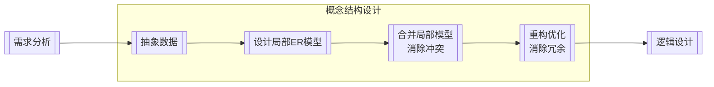

## 数据库模式与范式

### 数据库的结构与模式

#### 三级抽象

数据库系统划分为三个抽象级：用户级、概念级、物理级

##### 用户级数据库

用户级数据库对应于外模式，是最接近用户的一级数据库，是用户可以看到和使用的数据库，又称用户视图。用户级数据库主要由外部记录组成，不同的用户视图可以互相重叠，用户的所有操作都是针对用户视图进行的

##### 概念级数据库

概念级数据库对应于概念模式，介于用户级和物理级之间，是所有用户视图的最小并集，是数据库管理员可看到和使用的数据库，又称 DBA（DataBase Administrator，数据库管理员）视图。概念级数据库由概念记录组成，一个数据库可有多个不同的用户视图，每个用户视图由数据库某一部分的抽象表示所组成。一个数据库应用系统只存在一个 DBA 视图，它把数据库作为一个整体的抽象表示。概念级模式把用户视图有机地结合成一个整体，综合平衡考虑所有用户要求，实现数据的一致性、最大限度降低数据冗余、准确地反映数据间的联系

##### 物理级数据库

物理级数据库对应于内模式，是数据库的低层表示，它描述数据的实际存储组织，是最接近于物理存储的级，又称内部视图。物理级数据库由内部记录组成，物理级数据库并不是真正的物理存储，而是最接近于物理存储的级

#### 三级模式

数据库系统的三级模式为外模式、概念模式、内模式

##### 概念模式

概念模式（模式、逻辑模式）用以描述整个数据库中数据库的逻辑结构，描述现实世界中的实体及其性质与联系，定义记录、数据项、数据的完整性约束条件及记录之间的联系，是数据项值的框架

数据库系统概念模式通常还包含有访问控制、保密定义、完整性检查等方面的内容，以及概念/物理之间的映射

概念模式是数据库中全体数据的逻辑结构和特征的描述，是所有用户的公共数据视图。一个数据库只有一个概念模式

外模式是数据库用户（包括程序员和最终用户）能够看见和使用的局部数据的逻辑结构和特征的描述，是数据库用户的数据视图，是与某一应用有关的数据的逻辑表示。一个数据库可以有多个外模式。一个应用程序只能使用一个外模式。

##### 外模式

外模式（子模式、用户模式）用以描述用户看到或使用的那部分数据的逻辑结构，用户根据外模式用数据操作语句或应用程序去操作数据库中的数据。外模式主要描述组成用户视图的各个记录的组成、相互关系、数据项的特征、数据的安全性和完整性约束条件

##### 内模式

内模式是整个数据库的最低层表示，不同于物理层，它假设外存是一个无限的线性地址空间。内模式定义的是存储记录的类型、存储域的表示以及存储记录的物理顺序，指引元、索引和存储路径等数据的存储组织

内模式是数据物理结构和存储方式的描述，是数据在数据库内部的表示方式。一个数据库只有一个内模式

内模式、模式和外模式之间的关系如下：

1. 模式是数据库的中心与关键
2. 内模式依赖于模式，独立于外模式和存储设备
3. 外模式面向具体的应用，独立于内模式和存储设备
4. 应用程序依赖于外模式，独立于模式和内模式

#### 两级独立性

数据库系统两级独立性是指物理独立性和逻辑独立性。三个抽象级间通过两级映射（外模式—模式映射，模式—内模式映射）进行相互转换，使得数据库的三级形成一个统一的整体。

##### 物理独立性

物理独立性是指用户的应用程序与存储在磁盘上的数据库中的数据是相互独立的。当数据的物理存储改变时，应用程序不需要改变

物理独立性存在于概念模式和内模式之间的映射转换，说明物理组织发生变化时应用程序的独立程度

##### 逻辑独立性

逻辑独立性是指用户的应用程序与数据库中的逻辑结构是相互独立的。当数据的逻辑结构改变时，应用程序不需要改变

逻辑独立性存在于外模式和概念模式之间的映射转换，说明概念模式发生变化时应用程序的独立程度

::: tip 数据库视图
它是一个虚拟表（逻辑上的表），其内容由查询定义（仅保存 SQL 查询语句）。同真实的表一样，视图包含一系列带有名称的列和行数据（一般是多表联合查询）。但是，视图并没有真正存储这些数据，而是通过查询原始表动态生成所需要的数据

优点：

1. 视图能简化用户操作
2. 视图使用户能以多种角度看待同一数据
3. 视图对重构数据库提供了一定程度的逻辑独立性
4. 视图可以对机密数据提供安全保护

缺点：

1. 查询之后再展示，效率比较低

> 物化视图：它不是传统意义上的虚拟试图，是实体视图，其本身会存储数据。同时当原始表中数据更新时，物化视图也会更新。但是它仅适合查询较多的数据，增/删/改较多的情况下不适合物化视图

:::

### 数据模型

数据模型主要有两大类，分别是概念数据模型（实体—联系模型）和基本数据模型（结构数据模型）

概念数据模型是按照用户的观点来对数据和信息建模，主要用于数据库设计。概念模型主要用实体—联系方法（Entity-Relationship Approach）表示，所以也称 E-R 模型

基本数据模型是按照计算机系统的观点来对数据和信息建模，主要用于 DBMS 的实现。基本数据模型是数据库系统的核心和基础。基本数据模型通常由数据结构、数据操作和完整性约束三部分组成。其中数据结构是对系统静态特性的描述，数据操作是对系统动态特性的描述，完整性约束是一组完整性规则的集合

常用的基本数据模型有层次模型、网状模型、关系模型和面向对象模型

### 关系代数

垂直方向的为属性列，称为目或元；水平方向的为元组行，称为记录或实例

关系代数的基本运算主要有并、交、差、笛卡尔积、选择、投影、连接和除法运算

#### 并（Union）

设关系 R 和关系 S 具有相同的目 n（即两个关系都有 n 个属性），且相应的属性取自同一个域，则关系 R 与关系 S 的并由属于 R 且属于 S 的元组组成。其结果关系仍为 n 目关系。记作

$$
R \cup S = \lbrace t \lvert t \in R \lor t \in S \rbrace
$$

#### 交（Intersection）

设关系 R 和关系 S 具有相同的目 n，且相应的属性取自同一个域，则关系 R 与关系 S 的交由既属于 R 又属于 S 的元组组成。其结果关系仍为 n 目关系。记作

$$
R \cap S = \lbrace t \lvert t \in R \land t \in S \rbrace \\ R \cap S = R - (R - S)
$$

#### 差（Difference）

设关系 R 和关系 S 具有相同的目 n，且相应的属性取自同一个域，则关系 R 与关系 S 的差由属于 R 而不属于 S 的所有元组组成。其结果关系仍为 n 目关系。记作

$$
R - S = \lbrace t \lvert t \in R \land t \notin S \rbrace
$$

#### 笛卡尔积（Extended Cartesian Product）

这里的笛卡尔积严格地讲是广义笛卡尔积（Extended Cartesian Product）。在不会出现混淆的情况下广义笛卡尔积也称为笛卡尔积

两个分别为 n 目和 m 目的关系 R 和 S 的广义笛卡尔积是一个(n+m)列的元组的集合。元组的前 n 列是关系 R 的一个元组，后 m 列是关系 S 的一个元组。若 R 有 k1 个元组，S 有 k2 个元组，则关系 R 和关系 S 的广义笛卡尔积有 k1×k2 个元组。记作：

$$
R \times S = \lbrace \mathop{t_r t_s}\limits^{\frown} \lvert t_r\in R \land t_s \in S \rbrace
$$

#### 投影（Projection）

投影运算是从关系的垂直方向进行运算，在关系 R 中选择出若干个属性列 A 组成新的关系，记作

$$
\Pi_A(R) = \lbrace t[A] \lvert t \in R \rbrace \text{，其中A是R中的属性列}
$$

#### 选择（Selection）

选择运算是从关系的水平方向进行运算，是从关系 R 中选择满足给定条件的诸元组，记作

$$
\sigma_F(R) = \lbrace t \lvert t \in R \land F(t) = \text{true} \rbrace \text{，其中F是选择条件，取值为真或假}
$$

#### 自然连接（Natural join）

自然连接是关系 R 和 S 在所有公共属性（common attribute）上的等接（Equijoin）。但在得到的结果中公共属性只保留一次，其余删除

自然连接(Natural join)是一种特殊的等值连接，它要求两个关系中进行比较的分量必须是相同的属性组，并且在结果中把重复的属性列去掉

$$
R \bowtie S = \lbrace \mathop{t_r t_s}\limits^{\frown}[U-B] \lvert t_r\in R \land t_s \in S \land t_r[B] = t_s[B] \rbrace \text{，R和S具有相同的属性组B}
$$

::: tip

- 并、交、差都是集合运算，且关系结构都一样（因为集合运算的前提是关系结构一致）
- 在多表联合查询语句中`select A from B where C`这个句式中，A 部分可以理解为投影，B 部分可以理解为为笛卡尔积，C 部分可以理解为选择
- $\mathop{t_r t_s}\limits^{\frown}$ 称为元组的连接。R 为有 m 元的关系，S 为有 n 元的关系，$t_r \in R$，$t_s \in S$，$\mathop{t_r t_s}\limits^{\frown}$ 是一个$m+n$元的元组，前 m 个分量为 R 中的一个 m 元组，后 n 个分量为 S 中的一个 n 元组。
- 自然连接 → 等价笛卡尔积：先选择，再投影
- 一般认为自然连接的性能由于笛卡尔积。如果可以的话，先将操作的对象子表尽可能的压缩

:::

### 规范化理论

#### 价值与用途

非规范化的关系模式可能存在的问题包括：数据冗余、更新异常、插入异常、删除异常

#### 函数依赖

设 R(U)是属性 U 上一个关系模式，X 和 Y 是 U 的子集，r 为 R 上任意关系，如果对于 r 中的任意两个元组 u、v，只要有 u[X]=v[X]，就有 u[Y]=v[Y]，则称 X 函数决定 Y，或称 Y 函数依赖于 X，记为$X \to Y$

通俗地说，就像自变量 x 确定之后，相应的函数值 f(x) 也就唯一确定了一样，函数依赖是衡量和调整数据规范化的最基础的理论依据

- 部分依赖  
  关系模式：$R_1(A,B,C,D)$，依赖集：$\lbrace AB \to D, A \to C \rbrace$  
  
- 传递依赖  
  关系模式：$R_2(A,B,C)$，依赖集：$\lbrace A \to B, B \to C \rbrace$  
  

##### 键

- 候选键：唯一标识元组，且无冗余
- 主键：任选一个候选键
- 外键：其他关系的主键

> 主键唯一决定元组，主键可以决定所有其他的属性

求候选键的步骤：

- 将关系模式的函数依赖关系用"有向图"的方式表示
- 找入度为 0 的属性，并以该属性集合的起点，尝试遍历有向图，若能正常遍历图中所有结点，则该属性集即为关系模式的候选键
- 若入度为 0 的属性集不能遍历图中所有结点，则需要尝试性的将一些中间结点（既有入度，又有出度的结点）并入入度为 0 的属性集中，直至该集合能遍历所有结点，集合为候选键

#### 范式

- 第一范式：如果关系 R 中所有属性的值域都是简单域，其元素（即属性）不可再分，是属性项而不是属性组，那么关系模型 R 是第一范式的。1NF 是最低的规范化要求
- 第二范式：如果一个关系$R \in 1NF$，且所有的非主属性都完全依赖于主属性，则称之为第二范式
- 第三范式：如果一个关系$R \in 2NF$，且每个非主属性不传递依赖于主属性，这种关系是第三范式
- BC 范式：BC 范式的定义：如果关系模型$R \in 1NF$，且 R 中每一个函数依赖关系中的决定因素都包含候选键，则 R 是满足 BC 范式的关系

从上至下逐步优化，以解决：插入异常、删除异常、更新异常

::: tip
简记

1. 属性值都不可再分的原子值（1NF）
2. 消除非主属性对候选键的部份依赖（2NF）
3. 消除非主属性对候选键的传递依赖（3NF）
4. 消除主属性对候选键的部分和传递依赖（BCNF）

快速判断

- 候选键是单属性则至少满足 2NF
- 没有非主属性则至少满足 3NF

:::

#### 无损分解

- 保持函数依赖分解
  - 设数据库模式$p=\lbrace R_1,R_2,\dots,R_k \rbrace$是关系模式 R 的一个分解，F 是 R 上的函数依赖集，p 中每个模式 R~i~上的 FD 集是 F~i~。如果$\lbrace F_1,F_2,\dots,F_k \rbrace$与 F 是等价的（即相互逻辑蕴含），那么称分解 p 保持 FD
  - 函数依赖存在于属性本身
  - 冗余函数依赖：可以推导出来的函数依赖（$A \to B, B \to C, A \to C \text{就是冗余的}$）
- 无损分解
  - 可以还原的关系模式分解称为无损分解，反之则为有损分解
  - 无损联接分解：指将一个关系模式分解成若干个关系模式后，通过自然联接和投影运算仍能还原到原来的关系模式

##### 表格法

1. 把属性列作为表格的列
2. 把分解的关系模式列为元组行，勾上对应的属性
3. （通过自然连接）两两关系模式的同名属性，判断是否能够通过同名属性列作为决定因素的函数依赖还原除被决定因素，如果可以，则将对应的属性列勾上
4. 重复 3，直至全部判断完。如果有一个元组行全是勾，说明可以无损分解，反之则是有损分解

::: tip 例子

- 有关系模式$R(A,B,C), F = \lbrace A \to B \rbrace$，其分解$p_1 = \lbrace R_1(AB), R_2(AC) \rbrace$与分解$p_2 = \lbrace R_1(AB), R_2(BC) \rbrace$，是否都为无损分解?

|               | A                           | B                          | C            |
| ------------- | --------------------------- | -------------------------- | ------------ |
| p~1~.R~1~(AB) | $\color{orange} \checkmark$ | $\checkmark$               |              |
| p~1~.R~2~(AC) | $\color{orange} \checkmark$ | $\color{green} \checkmark$ | $\checkmark$ |
| ---           | ---                         | ---                        | ---          |
| p~2~.R~1~(AB) | $\checkmark$                | $\color{red} \checkmark$   |              |
| p~2~.R~2~(BC) |                             | $\color{red} \checkmark$   | $\checkmark$ |

> - p~1~.R~1~(AB)、p~1~.R~2~(AC)有同名属性 A，且有$A \to B$，所以 p~1~.R~2~(AC)的 B 列可以勾上，此时 p~1~.R~2~(AC)元组行有关系模式 R 的所有属性，所以是无损分解
> - p~2~.R~1~(AB)、p~2~.R~2~(BC)有同名属性 B，但 B 不是决定因素，没有函数依赖无法还原，所以是有损分解

:::

##### 公式法

如果 R 的分解为$p=\lbrace R_1, R_2 \rbrace$，F 为 R 所满足的函数依赖集和，分解 p 具有无损联接性的充分必要条件是

$$
R_1 \cap R_2 \to (R_1 - R_2) \text{ 或 } R_1 \cap R_2 \to (R_2 - R_1)
$$

就是通过关系模式的交集能推导关系模式的差集，那么分解是无损的（但是仅适用于两个关系模式的情况）

##### Armstrong 公理

关系模式 R<U, F>来说有以下的推理规则

- A1.自反律（Reflexivity）：若$Y \sube X \sube U$，则$X \to Y$成立
- A2.增广律（Augmentation）：若$Z \sube U \text{ 且 } X \to Y$，则$XZ \to YZ$成立
- A3.传递律（Transitivity）：若$X \to Y \text{ 且 } Y \to Z$，则$X \to Z$成立

根据 A1，A2，A3 这三条推理规则可以得到下面三条推理规则

- 合并规则：由$X \to Y, X \to Z, \text{有} X \to YZ$（A2，A3）
- 伪传递规则：由$X \to Y, WY \to Z, \text{有} XW \to Z$（A2，A3）
- 分结规则：有$X \to Y, Z \sube Y, \text{有} X \to Z$（A1，A3）

### 反规范化

#### 定义

数据库中的数据规范化的优点是减少了数据冗余，节约了存储空间，相应逻辑和物理的 I/O 次数减少，同时加快了增、删、改的速度，但是对完全规范的数据库查询，通常需要更多的连接操作，从而影响查询速度。因此，有时为了提高某些查询或应用的性能而破坏规范规则，即反规范化

#### 技术手段

- 增加派生列（需要计算得出的结果）
- 增加冗余列（相同列）
- 重新组表（把常用的表连接的结果组成一个表）
- 分割表
  - 水平分割：选择某些元组行分表（根据一列或多列数据的按值区分）
  - 垂直分割：选择某些属性列分表（把常用的列和不常用的列分开）

#### 优缺点

- 好处：降低连接操作的需求、降低外码何所营的数目，还可能减少表的数目，能够提高查询效率
- 坏处：
  - 数据重复存储，浪费磁盘空间
  - 可能出现数据完整性以及数据一致性的问题（解决方案有：通过触发器解决，应用程序解决），为了保障数据的一致性，增加了数据维护的复杂性，也降低了修改的速度
  - 反规范化会带来规范化解决的问题：更新异常、插入异常、删除异常

## 数据库设计

### 设计过程

各步骤的产出物：

- 需求分析：数据流图、数据字典、需求说明书（偏向数据建模，与软件工程的需求说明书有区别）
- 概念结构设计：ER 模型
- 逻辑结构设计：关系模式（需要应用规范化理论）

> 聚簇索引在物理设计阶段考虑

### 概念设计

ER 模型的转换：一个实体转换成一个关系模式

- 1:1 联系可以转换成一个关系模式，也可以与任意一端实体的关系模式合并
- 1:n 联系可以转换成一个关系模式，也可以与 n 端实体的关系模式合并
- m:n 联系必须转换成一个单独的关系模式

> 三个以上实体间的一个多元联系优先考虑单独的关系模式

集成的方法：

- 多个局部 E-R 图一次继承
- 追捕集成，用累加的方式一次继承两个局部 E-R 图

集成产生的冲突及解决办法：

- 属性冲突：包括属性域冲突和属性取值冲突
- 命名冲突：包括同名异义和异名同义
- 结构冲突：包括同一对象在不同应用中具有不同的抽象，以及同一实体在不同局部 E-R 图中所包含的属性个数和属性排列次序不完全相同

### 逻辑设计

数据库逻辑结构设计的任务就是把概念结构设计阶段设计好的基本 E-R 图转换为与具体机器上的 DBMS 产品所支持的数据模型相符合的逻辑结构。这一阶段是数据库结构设计的重要阶段

逻辑结构设计一般分为以下几个步骤：

1. 将概念结构向一般关系模型转化
2. 将第一步得到的结构向特定的 DBMS 支持下的数据模型转换
3. 依据应用的需求和具体的 DBMS 的特征进行调整与完善

### 数据库完整性约束

- 实体完整性约束：主键，唯一且非空
- 参照完整性约束：外键，其他关系的主键，可以为空
- 用户自定义完整性约束：Check、Assertion 约束（年龄为 0~120、性别为男或女）

> 触发器：可以解决复杂==完整性约束==问题、一致性问题

### 数据库安全性

| 措施           | 说明                                                                                                       |
| -------------- | ---------------------------------------------------------------------------------------------------------- |
| 用户标识和鉴定 | 最外层的安全保护措施，可以使用用户账号、口令及随机数检验等方式（`身份验证`）                               |
| 存储控制       | 对用户进行授权，包括操作类型（如查找、插入、删除、修改等动作）和数据对象（主要是数据范围）的权限（`权限`） |
| 密码存储和传输 | 对远程终端信息用密码传输（`加密和摘要`）                                                                   |
| 视图的保护     | 对视图进行授权                                                                                             |
| 审计           | 使用一个专用文件或数据库，自动将用户对数据库的所有操作记录下来（`日志记录，时候审查，可追溯`）             |

### 数据表分区

表分区：就是将一个数据量比较大的表，用某种方法把数据从物理上分成若干个小表来存储，从逻辑上看还是一个大表

#### 分区与分表的区别与联系

- 两者都针对数据表，将数据做到分布式，提高数据检索的效率，降低数据库的频繁 I/O 压力
- 分表是真正的生成数据表，是将一张大数据量的表分成多个小表实现数据均衡
- 分区并不是生成数据表，而是将表发数据均很分摊到不同的硬盘、系统或是不用服务器存储介质中，实际上还是一张表

#### 分区的优点

- 相对于单个文件系统或是硬盘，分区可以存储更多的数据
- 数据管理比较方便（如果需要清理或废弃某年的数据，就可以直接删除该日期的分区数据即可）
- 精准定位分区查询数据，不需要全表扫描查询，大大提高数据检索效率
- 可跨多个分区磁盘查询，来提高查询的吞吐量
- 在涉及聚合函数查询时，可以很容易进行数据的合并

#### 分区的策略

- 范围分区（RANGE）：根据数据库表中某一个字段的指的范围来划分分区
- 列表分区（LIST）：明确指定了根据某个字段的某个具体值进行分区，而不是像范围分区那样根据字段的值来划分
- 散列分区（HASH）：根据字段的 hash 值进行均匀分布，尽可能的实现个分区所散列的数据相等

::: tip 数据库性能优化

#### 集中式数据库优化

- 硬件系统：CPU，内存，I/O（硬盘，阵列），网络
- 系统软件：参数，如进程优先级，CPU 使用权，内存使用
- 数据库设计
  - 表与视图
    - 表的规划
    - 建立物化视图
  - 索引
    - 常查询 → 建索引
    - 常修改 → 避免索引
  - SQL 优化
    - 以不相干子查询替代相干子查询
    - 只检索需要的列
    - 用带 in 的条件子句等价替换 or 子句
    - 经常提交 commit，以尽早释放锁
    - 尽可能减少多表查询
- 应用软件
  - 数据库连接池

#### 分布式数据库优化

- 通信代价
  - 全局查询树的变换
  - 多副本策略
  - 查询树的分解
  - 半连接与直接连接

:::

## 事务管理

数据库系统运行的基本工作单位是事务，事务相当于操作系统中的进程，是用户定义的一个数据库操作序列，这些操作序列要么全做要么全不做，是一个不可分割的工作单位。事务具有以下特性：

1. 原子性（Atomicity）：数据库的逻辑工作单位
2. 一致性（Consistency）：使数据库从一个一致性状态变到另一个一致性状态
3. 隔离性（Isolation）：不能被其他事务干扰
4. 持续性（永久性）（Durability）：一旦提交，改变就是永久性的

事务通常以 BEGIN TRANSACTION（事务开始）语句开始，以 COMMIT 或 ROLLBACK 语句结束

### 并发控制

在多用户共享系统中，许多事务可能同时对同一数据进行操作，称为"并发操作"，此时数据库管理系统的并发控制子系统负责协调并发事务的执行，保证数据库的完整性不受破坏，同时避免用户得到不正确的数据

#### 并发产生的问题

数据库的并发操作带来的问题有：丢失更新（修改）问题、不可重复读、"脏"数据的读出

#### 封锁协议

处理并发控制的主要方法是采用封锁技术。它有两种类型：排他型封锁（X 封锁，写锁）和共享型封锁（S 封锁，读锁）

- 一级封锁协议
  - 事务 T 在修改数据 R 之前必须先对其加 X 锁，直到事务结束才释放
  - ==可防止丢失修改==
- 二级封锁协议
  - 一级封锁协议加上事务 T 在读取数据 R 之前先对其加 S 锁，读完后即可释放 S 锁
  - ==可防止丢失修改，还可防止读"脏"数据==
- 三级封锁协议
  - 一级封锁协议加上事务 T 在读取数据 R 之前先对其加 S 锁，直到事务结束才释放
  - ==可防止丢失修改、防止读"脏"数据与防止数据重复读==
- 两段锁协议
  - 所有事务必须分两个阶段对数据项加锁和解锁。其中扩展阶段是在对任何数据进行读、写操作之前，首先要申请并获得对该数据的封锁；收缩阶段是在释放一个封锁之后，事务不能再申请和获得任何其他封锁。若并发执行的所有事务均遵守两段封锁协议，则对这些事务的任何并发调度策略都是==可串行化==的
  - 可能发生死锁

::: info 表格说明
丢失更新

|     | T1       | T2       |
| --- | -------- | -------- |
| 1   | 读 A=10  |          |
| 2   |          | 读 A=10  |
| 3   | 写 A=A-5 |          |
| 4   |          | 写 A=A-8 |

加上（一级）封锁协议

|     | T1              | T2              |
| --- | --------------- | --------------- |
| 1   | 对 A 加写锁     |                 |
| 2   | 读 A=10         |                 |
| 3   |                 | 对 A 加写锁     |
| 4   | 写 A=A-5        | 等待            |
| 5   | 释放对 A 的写锁 | 等待            |
| 6   |                 | 读 A=5          |
| 7   |                 | 写 A=A-8        |
| 8   |                 | 释放对 A 的写锁 |

读"脏"数据

|     | T1        | T2      |
| --- | --------- | ------- |
| 1   | 读 A=20   |         |
| 1   | 写 A=A+50 |         |
| 2   |           | 读 A=70 |
| 3   | Rollback  |         |

加上（二级）封锁协议

|     | T1          | T2          |
| --- | ----------- | ----------- |
| 1   | 对 A 加写锁 |             |
| 2   | 读 A=20     |             |
| 3   | 写 A=A+50   |             |
| 4   |             | 对 A 加读锁 |
| 5   | Rollback    | 等待        |
| 6   | A 恢复为 20 | 等待        |
| 7   |             | 读 A=20     |

不可重复读

|     | T1                       | T2        |
| --- | ------------------------ | --------- |
| 1   | 读 A=20                  |           |
| 2   | 读 B=30                  |           |
| 3   | 求和 A+B=50              |           |
| 4   |                          | 读 A=20   |
| 5   |                          | 写 A=A+50 |
| 6   | 读 A=70                  |           |
| 7   | 读 B=30                  |           |
| 8   | 求和 A+B=100（验算不对） |           |

加上（三级）封锁协议

|     | T1                 | T2              |
| --- | ------------------ | --------------- |
| 1   | 对 A、B 加读锁     |                 |
| 2   | 读 A=20            |                 |
| 3   |                    | 对 A 加写锁     |
| 4   | 读 B=30            | 等待            |
| 5   | 求和 A+B=50        | 等待            |
| 6   | 释放对 A、B 的读锁 | 等待            |
| 7   |                    | 读 A=20         |
| 8   |                    | 写 A=A+50       |
| 9   |                    | 释放对 A 的写锁 |

:::

## 备份与恢复

### 物理备份

物理备份是在操作系统层面上对数据库的数据文件进行备份

#### 冷备份和热备份

- 冷备份：也称静态备份。是将数据库正常关闭，在停止状态下将数据库的文件全部备份（复制）下来
- 热备份：也称动态备份。是利用备份软件，在数据库正常运行的状态下，将数据库中的数据文件备份出来

| 对比   | 优点                                                                                                                                                                                                  | 缺点                                                                                                                                                                                                            |
| ------ | ----------------------------------------------------------------------------------------------------------------------------------------------------------------------------------------------------- | --------------------------------------------------------------------------------------------------------------------------------------------------------------------------------------------------------------- |
| 冷备份 | 1. 非常快速的备份方法（只复制文件） 2. 容易归档（简单复制即可） 3. 容易恢复到某个时间点上（只需将文件再复制回去） 4. 能与归档方法结合，做数据库"最佳状态"的恢复 5. 低度维护，高度安全 | 1. 单独使用时，只能提供到某一时间点上的恢复 2. 在实施备份的全过程中 m，数据库必须要作备份而不能做其他工作 3. 若磁盘空间有限，只能复制到磁带或其他外部存储设备上，速度会很慢 4. 不能按表或按用户恢复 |
| 热备份 | 1. 可在表空间或数据库文件级备份，备份的时间短 2. 备份时数据库仍可使用 3. 可达到秒级恢复（可恢复到某一时间点上） 4. 可对几乎所有数据库实体做恢复 5. 恢复是快速的                       | 1. 不能出错，否则后果很严重 2. 若热备份不成功，所得结果不可用于时间点的恢复 3. 困难于维护，所以要特别小心，不允许"以失败告终"                                                                           |

#### 完全、差量、增量备份

- 完全备份：备份所有数据
- 差量备份：仅备份上一次完全备份之后变化的数据
- 增量备份：备份上一次备份之后变化的数据

> 日志文件：事务日志是针对数据库改变所做的记录，它可以记录针对数据库的任何操作，并将记录结果保存在独立的文件中

### 逻辑备份

逻辑备份是指利用各数据库系统自带的工具软件备份和恢复数据库的内容，例如，Oracle 的导出工具为 exp，导入工具为 imp，可以按照表、表空间、用户、全库等四个层次备份和恢复数据；Sybase 的全库备份命令是 dump database，全库恢复命令是 load database，另外也可利用 BCP 命令来备份和恢复指定表。

### 数据库故障与恢复

| 故障关系               | 故障原因               | 解决方法                                                                 |
| ---------------------- | ---------------------- | ------------------------------------------------------------------------ |
| 事务本身的可预期故障   | 本身逻辑               | 在程序中预先设置的 Rollback 语句                                         |
| 事务本身的不可预期故障 | 算术溢出、违反存储保护 | 由 DBMS 的回复子系统通过日志，撤销事务对数据库的修改，回退到事务初始状态 |
| 系统故障               | 系统停止运转           | 通常使用检查点法                                                         |
| 介质故障               | 外存损坏               | 一般使用日志重做业务（需要 DBA 介入）                                    |

## 分布式数据库系统

分布式数据库系统是相对于集中式数据库系统而言的，是将数据库技术与网络技术相结合的产物。分布式数据库（Distributed DataBase，DDB）比较确切的定义是：分布式数据库是由一组数据组成的，这组数据分布在计算机网络的不同计算机上，网络中的每个结点具有独立处理的能力，成为场地自治，它可以执行局部应用，同时，每个结点也能通过网络通信子系统执行全局应用。负责分布式数据库的建立、查询、更新、复制、管理和维护的软件，称为分布式数据库管理系统（Distributed DataBase Management System， DDBMS）。一个计算机网络组成的计算机系统，在配置了分布式数据库管理系统，并在其上建立了分布式数据库和相应的应用程序后，就称其为分布式数据库系统（Distributed DataBase System，DDBS）。分布式数据库管理系统是分布式数据库系统的核心

### 特点

#### 数据的分布性

分布式数据库中的数据分布于网络中的各个结点，它既不同于传统的集中式数据库，也不同于通过计算机网络共享的集中式数据库系统。

#### 统一性

主要表现在数据在逻辑上的统一性和数据在管理上的统一性两个方面。分布式数据库系统通过网络技术把局部的、分散的数据库构成一个在逻辑上单一的数据库，从而呈现在用户面前的就如同是一个统一的、集中式的数据库。这就是数据在逻辑上的统一性，因此，它不同于由网络互联的多个独立数据库。分布式数据库是由分布式数据库管理系统统一管理和维护的，这种管理上的统一性又使它不同于一般的分布式文件系统

#### 透明性

用户在使用分布式数据库时，与使用集中式数据库一样，无须知道其所关心的数据存放在哪里，存储了几次。用户需要关心的仅仅是整个数据库的逻辑结构

### 优缺点

与集中式数据库相比，分布式数据库具有下列优点：

1. 坚固性好。由于分布式数据库系统是由多个位置上的多台计算机构成的，在个别结点或个别通信链路发生故障的情况下，它仍然可以降低级别继续工作，如果采用冗余技术，还可以获得一定的容错能力。因此，系统的坚固性好，即系统的可靠性和可用性好
2. 可扩充性好。可根据发展的需要增减结点，或对系统重新配置，这比用一个更大的系统代替一个已有的集中式数据库要容易得多
3. 可改善性能。在分布式数据库中可按就近分布，合理地冗余的原则来分布各结点上的数据，构造分布式数据库，使大部分数据可以就近访问，避免了集中式数据库中的瓶颈问题，减少了系统的响应时间，提高了系统的效率，而且也降低了通信费用
4. 自治性好。数据可以分散管理，统一协调，即系统中各结点的数据操纵和相互作用是高度自治的，不存在主从控制，因此，分布式数据库较好地满足了一个单位中各部门希望拥有自己的数据，管理自己的数据，同时又想共享其他部门有关数据的要求

虽然分布式数据库系统与集中式数据库相比有不少优点，但同时也需要解决一些集中式数据库所没有的问题。首先，异构数据库的集成问题是一项比较复杂的技术问题，目前还很难用一个通用的分布式数据库管理系统来解决这一问题。其次，如果数据库设计得不好，数据分布不合理，以致远距离访问过多，尤其是分布连接操作过多，不但不能改善性能，反而会使性能降低

### 分类

分布式数据库及其分布式数据库管理系统，根据许多因素有不同的分类方法，总的原则是分布式数据库及 DDBMS 必须是其数据和软件必定分布在用计算机网络连接的多个场地上。从应用需要或本身的特征方面考虑可将它从以下几个方面来划分：

1. 按 DDBMS 软件同构度来分。当所有服务器软件（或每个 LDBMS）和所有客户软件均用相同的软件时称为同构型分布式数据库；反之，则称为异构型分布式数据库
2. 按局部自治度来分。当对 DDBMS 的存取必须通过客户软件，则系统称为无局部自治；当局部事务允许对服务器软件进行直接存取，则系统称为有一定的局部自治。自治的两个分别是无局部自治和联邦型 DDBMS 或称多数据库系统。多数据库系统本质上是集中式与分布式的混合体：对一个局部用户而言，它是自治的，那么是一个集中式 DBS；对一个全局用户而言，则是一个分布式 DBS，但这个 DDBS 没有全局概念模式，只有一个由各局部数据库提供给全局允许共享的有关模式的集成
3. 按分布透明度来分。分布透明度的另一个概念是模式集成度。若用户可以对集成模式操作不需要涉及任何片段、重复、分布等信息时，则这类 DDBMS 称为有高度分布透明（或高度模式集成）；若用户必须知道所有关于片段、分配、重复等信息时，则这类 DDBMS 没有分布透明，没有模式集成度。当系统不提供分布透明，用户查询时必须指定特定的场地、特定的片段等信息，当然 DDBMS 可以部分分布透明（介于两者之间）

### 目标

理想的分布式系统使用时应该精确得像一个非分布式系统。概括起来有以下 12 条具体规则和目标：

1. 局部结点自治性。网络中的每个结点是独立的数据库系统，它有自己的数据库，运行它的局部 DBMS，执行局部应用，具有高度的自治性
2. 不依赖中心结点。即每个结点具有全局字典管理、查询处理、并发控制和恢复控制等功能
3. 能连续操作。该目标使中断分布式数据库服务情况减至最少，当一个新场地合并到现有的分布式系统或从分布式系统中撤离一个 场地不会导致任何不必要的服务中断；在分布式系统中可动态地建立和消除片段，而不中止任何组成部分的场地或数据库；应尽可能在不使整个系统停机的情况下对组成分布式系统的场地的 DBMS 进行升级
4. 具有位置独立性（或称位置透明性）。用户不必知道数据的物理存储地，可工作可像数据全部存储在局部场地一样。一般位置独立性需要有分布式数据命名模式和字典子系统的支持
5. 分片独立性（或称分片透明性）。分布式系统如果可将给定的关系分成若干块或片，可提高系统的处理性能。利用分片将数据存储在最频繁使用它的位置上，使大部分操作为局部操作，减少网络的信息流量。如果系统支持分片独立性，那么用户工作起来就像数据全然不是分片的一样
6. 数据复制独立性。是指将给定的关系（或片段）可在物理级用许多不同存储副本或复制品在许多不同场地上存储。支持数据复制的系统应当支持复制独立性，用户工作可像它全然没有存储副本一样地工作
7. 支持分布式查询处理。在分布式数据库系统中有三类查询：局部查询、远程查询和全局查询。局部查询和远程查询仅涉及单个结点的数据（本地的或远程的），查询优化采用的技术是集中式数据库的查询优化技术。全局查询涉及多个结点上的数据，其查询处理和优化要复杂得多
8. 支持分布事务管理。事务管理有两个主要方面：恢复控制和并发控制。在分布式系统中，单个事务会涉及多个场地上的代码执行，会涉及多个场地上的更新，可以说每个事务是由多个"代理"组成的，每个代理代表在给定场地上的给定事务上执行的过程。在分布式系统中必须保证事务的代理集或者全部一致交付，或者全部一致回滚
9. 具有硬件独立性。希望在不同硬件系统上运行同样的 DBMS
10. 具有操作系统独立性。希望在不同的操作系统上运行 DBMS
11. 具有网络独立性。如果系统能够支持多个不同的场地，每个场地有不同的硬件和不同的操作系统，则要求该系统能支持各种不同的通信网络
12. 具有 DBMS 独立性。实现对异构型分布式系统的支持。理想的分布式系统应该提供 DBMS 独立性

上述的全功能分布式数据库系统的准则和目标起源于：一个分布式数据库系统，对用户来说，应当看上去完全像一个非分布式系统。值得指出的是，现实系统出于对某些方面的特别考虑，对上述各方面做出了种种权衡和选择

### 架构

从整体上可以分为两大部分：下半部分是集中式数据库的模式结构，代表了各局部场地上局部数据库系统的基本结构；上半部分是分布式数据库系统增加的模式级别

#### 与并行数据库系统的区别

相似点：它们都是通过网络连接各个数据处理结点的，整个网络中的所有结点构成一个逻辑上统一的整体，用户可以对各个结点上的数据进行透明存取等

区别：

1. 应用目标不同
2. 实现方式不同
3. 各结点的地位不同

#### 数据分片和透明性

将数据分片，使数据存放的单位不是关系而是片段，这既有利于按照用户的需求较好地组织数据的分布，也有利于控制数据的冗余度。分片的方式有多种，水平分片和垂直分片是两种基本的分片方式，混合分片和导出分片是较复杂的分片方式

分布透明性指用户不必关心数据的逻辑分片，不必关心数据存储的物理位置分配细节，也不必关心局部场地上数据库的数据模型。分布透明性包括：分片透明性、位置透明性和局部数据模型透明性

> - 分片透明性：是指全局数据模式如何分片对用户和应用程序不可见，其只需要按全局模式进行操作，会由分布式系统映像到不同的分片上实现
> - 场地透明：是指用户和应用程序不需要指出对哪个场地上的片段进行操作，场地的变换不会引起用户和应用程序使用上的改变
> - 局部模型透明性：是指各场地数据的数据模型（关系模型、非关系模型）和数据的逻辑结构以及选用的 DBMS 等对用户和应用程序是不可见的，用户和应用程序只需要按全局关系模式进行操作，而由分布式数据库系统来实现转换

#### 分布式数据库管理系统的组成

DDBMS 由 4 部分组成：

1. LDBMS（局部 DBMS）。局部场地上的数据库管理系统的功能是建立和管理局部数据库，提供场地自治[^1]能力、执行局部应用及全局查询的子查询
2. GDBMS（全局 DBMS）。全局数据库管理系统的主要功能是提供分布透明性，协调全局事务的执行，协调各局部 DBMS 以完成全局应用，保证数据库的全局一致性，执行并发控制，实现更新同步，提供全局恢复功能
3. 全局数据字典。存放全局概念模式、分片模式、分布模式的定义及各模式之间映像的定义；存放有关用户存取权限的定义，以保证全局用户的合法权限和数据库的安全性；存放数据完整性约束条件的定义，其功能与集中式数据库的数据字典类似
4. CM（Communication Management，通信管理）。在分布数据库各场地之间传送消息和数据，完成通信功能

[^1]: 场地自治：指各场地上的数据库具有独立处理的能力，可以执行该场地上的局部应用

#### 分布式数据库管理系统的结构

1. 全局控制集中的 DDBMS。这种结构的特点是全局控制成分 GDBMS 集中在某一结点上，由该结点完成全局事务的协调和局部数据库转换等一切控制功能，全局数据字典只有一个，也存放在该结点上，它是 GDBMS 执行控制的依据。它的优点是控制简单，易实现更新一致性。但由于控制集中在某一特定的结点上，不仅容易形成瓶颈而且系统较脆弱，一旦该结点出故障，整个系统就会瘫痪
2. 全局控制分散的 DDBMS。这种结构的特点是全局控制成分 GDBMS 分散在网络的每一个结点上，全局数据字典也在每个结点上有一份，每个结点都能完成全局事务的协调和局部数据库转换，每个结点既是全局事务的参与者又是协调者，一般称这类结构为完全分布的 DDBMS。它的优点是结点独立，自治性强，单个结点退出或进入系统均不会影响整个系统的运行，但是全局控制的协调机制和一致性的维护都比较复杂
3. 全局控制部分分散的 DDBMS。这种结构是根据应用的需要将 GDBMS 和全局数据字典分散在某些结点上，是介于前两种情况之间的架构

::: tip 联邦数据库
联邦数据库系统（Federated Database System，FDBS）是一个彼此协作却又相互独立的成员数据库（CDBS）的集合，它将成员数据库系统按不同程度进行集成，对该系统整体提供控制和协同操作的软件叫做联邦数据库管理系统（Federated Database Management System，FDBMS）

- 联邦数据库特征
  - 分布性
  - 异构性
  - 自治性
  - 透明性
- 联办数据库分类
  - 紧耦合
  - 松耦合

:::

## NoSQL

NoSQL 即 Not Only SQL，直译"不仅仅是 SQL"，泛指非关系型数据库

> 关系数据库的缺陷:
>
> - 高并发读写的性能低
> - 支撑容量有限
> - 数据库的可扩展性和可用性低
> - 建设和运维成本高

### 与关系型数据库的对比

|            | 关系型数据库             | NoSQL 数据库             |
| ---------- | ------------------------ | ------------------------ |
| 并发支持   | 支持并发、效率低         | 并发性能高               |
| 存储与查询 | 关系表方式存储，SQL 查询 | 海量数据存储，查询效率高 |
| 扩展方式   | 向上扩展（垂直）         | 向外扩展（水平）         |
| 索引方式   | B 树、hash               | 键值索引                 |
| 应用领域   | 面向通用领域             | 特定应用领域             |

### 各类 NoSQL 数据库对比

| 分类                | 典型应用场景                                                                         | 数据模型                                          | 优点                                                                   | 缺点                                                                               | 举例                                               |
| ------------------- | ------------------------------------------------------------------------------------ | ------------------------------------------------- | ---------------------------------------------------------------------- | ---------------------------------------------------------------------------------- | -------------------------------------------------- |
| 键值（key-value）   | 内容缓存，主要用于处理大量数据的高仿文法在，也用于一些日志系统等                     | key 指向 value 的键值对，通常用 hash table 来实现 | 查找速度快                                                             | 数据无结构化，通常只被当作字符串或者二进制数据                                     | Redis，Tokyo Cabinet/Tyrant，Voldemort，Oracle BDB |
| 列存储数据库        | 分布式的文件系统                                                                     | 以列簇式存储，将同一列数据存在一起                | 查找速度快，可扩展性强，更容易进行分布式扩展                           | 功能相对局限                                                                       | HBase，Cassandra，Riak                             |
| 文档型数据库        | Web 应用（于 key-value 类似，value 是结构化的，不同的是数据库能够了解 value 的内容） | key-value 对应的键值对，value 为结构化数据        | 数据结构要求不严格，表结构可变，不需要像关系型数据库一样预先定义表结构 | 查询性能不高，而且缺乏统一的查询语句                                               | CouchDB，MongoDB                                   |
| 图形数据库（Graph） | 社交网络，推荐系统等。专注于构建关系图谱                                             | 图结构                                            | 利用图结构相关算法，比如最短路径寻址、N 度关系查找等                   | 很多时候需要对整个图做计算才能得出需要的信息，而且这种结构不太好做分布式的集群方案 | Neo4J,InfoGrid,Infinite Graph                      |

## 内存数据库

内存数据库抛弃了磁盘数据管理的传统方式，==基于全部数据都在内存中==重新设计了体系结构，并且在数据缓存、快速算法、并行操作方面也进行了相应的改进，所以数据处理速度比传统数据库的数据处理速度要快很多，一般都在 10 倍以上。内存数据库的最大特点是其"主拷贝"或"工作版本"常驻内存，及活动事务只与实时内存数据库的内存拷贝打交道

常见内存数据库：

- Redis
- eXtremeDB
- TT
- FastDB
- SQLite
- Microsoft SQL Serve Compact
- MySQL 的 MEMORY 存储引擎

## 大数据

### 特征

业界通常用 4 个 V(即 Volume、Variety、Value、Velocity)来概括大数据的特征

- Volume：指的是数据体量巨大
- Variety：指数据类型繁多
- Value：指的是数据密度低
- Velocity：指的是处理速度快

大数据处理系统应该具有的重要特征

- 高度可扩展性
- 高性能
- 高度容错
- 支持异构环境
- 较短的分析延迟
- 易用且开放的接口
- 较低成本
- 向下兼容性

### 与传统数据的对比

| 比较维度     | 传统数据             | 大数据                         |
| ------------ | -------------------- | ------------------------------ |
| 数据量       | GB 或 TB             | PB 级以上                      |
| 数据分析需求 | 现有数据的分析与检测 | 深度分析（关联分析、回归分析） |
| 硬件平台     | 高端服务器           | 集群平台                       |

> $1 ZB = 2^{10} EB, 1 EB = 2^{10} PB, 1 PB = 2^{10} TB, 1 TB = 2^{10} GB$

### 处理关键技术及应用

关键技术一般包括：大数据采集、大数据预处理、大数据存储及管理、大数据分析与挖掘、大数据展现和应用（大数据检索、大数据可视化、大数据应用、大数据安全等）

大数据可以在各行各业得以应用，如金融服务、医疗保健、零售业、制造业、政府机构等
