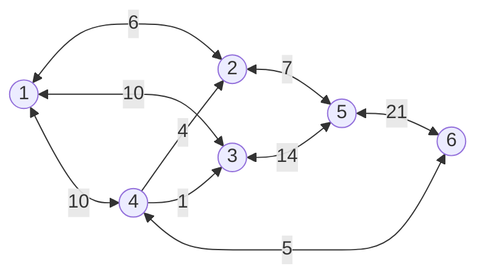
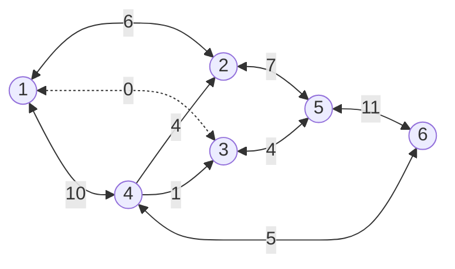
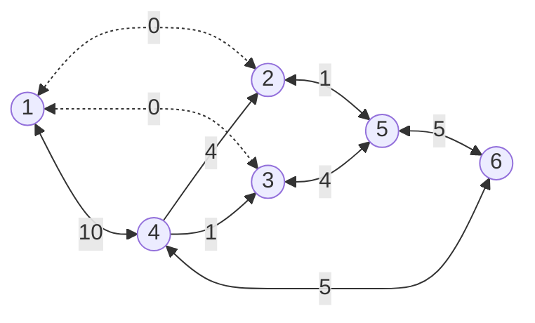
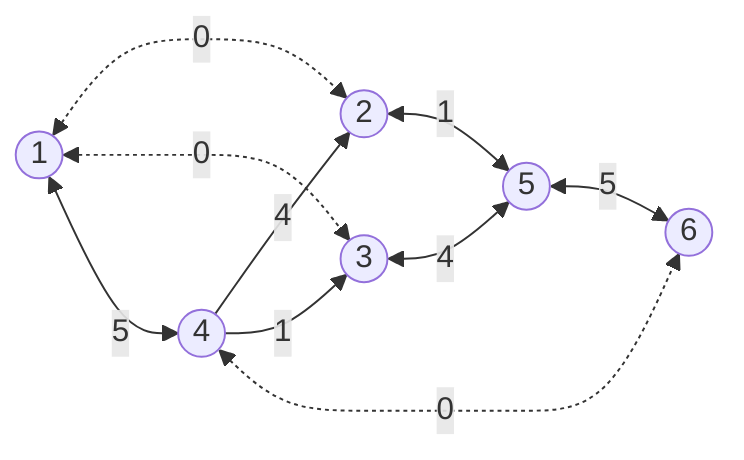
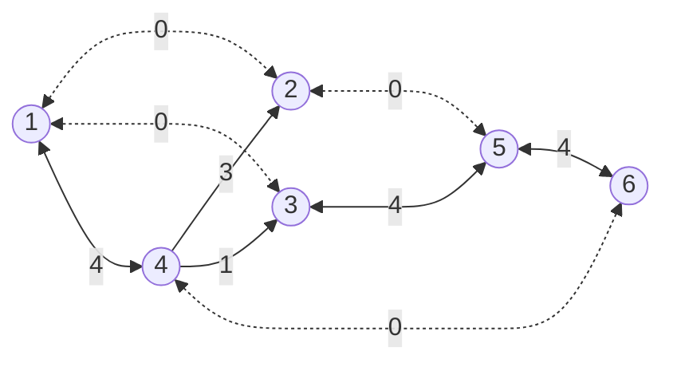
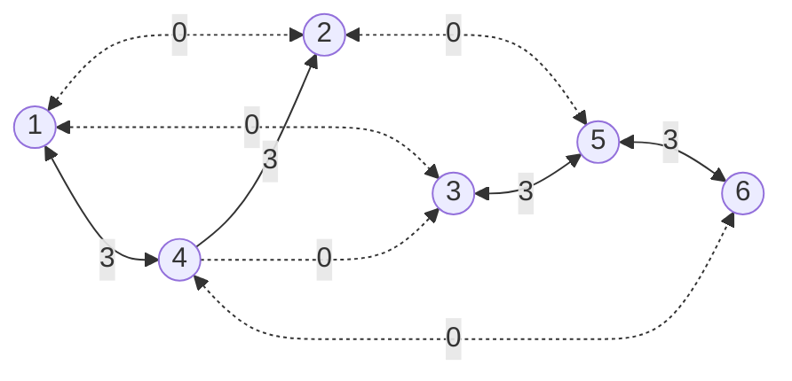

## 网络理论

图论基础上研究网络一般规律和网络流问题各种优化理论和方法的学科，是运筹学的一个分支。网络是用节点和边联结构成的图，表示研究诸对象及其相互关系，如铁路网、电力网和通信网等

在图论基础上研究网络一般规律和网络流问题各种优化理论和方法的学科，是运筹学的一个分支。网络是用节点和边联结构成的图，表示研究诸对象及其相互关系，如铁路网、电力网和通信网等。网络中的节点代表任何一种流动的起点、运转点和终点（如车站、港口、城镇、计算机终端和工程项目的事件等）。网络中的边代表任何物流、能流或信息流通过的通道（如输电线、通信线、铁路线和各事件之间的次序等）。在网络中每条边上赋予某个正数，称为该边的权，它可以表示路程、流量、时间和费用等。建立网络的目的都在于把某种规定的物质、能量或信息从某个供应点最优地输送到另一个需求点去。例如，在管道网络中要以最短的距离、最大的流量和最小的费用把水、石油或天然气从供应点送到用户那里

- 最大流量问题
- 最短路径问题
- 最短树问题
- 最小费用流

### 最小生成树

所谓一个==带权图==的最小生成树，就是原图中==边的权值最小的生成树==，所谓最小是指边的权值之和小于或者等于其它生成树的边的权值之和

#### 克鲁斯卡尔（Kruskal）算法

克鲁斯卡尔算法（Kruskal）是一种使用贪婪方法的最小生成树算法。该算法初始将图视为森林，图中的每一个顶点视为一棵单独的树。一棵树只与它的邻接顶点中权值最小且不违反最小生成树属性（不构成环）的树之间建立连边

> 每次都找权值最小且不成环的边，直到所有顶点都找到

#### 普里姆（Prim）算法

普里姆算法在找最小生成树时，将顶点分为两类，一类是在查找的过程中已经包含在生成树中的顶点（假设为 A 类），剩下的为另一类（假设为 B 类）

对于给定的连通网，起始状态全部顶点都归为 B 类。在找最小生成树时，选定任意一个顶点作为起始点，并将之从 B 类移至 A 类；然后找出 B 类中到 A 类中的顶点之间权值最小的顶点，将之从 B 类移至 A 类，如此重复，直到 B 类中没有顶点为止。所走过的顶点和边就是该连通图的最小生成树

> 任选一个顶点，找选该顶点权值最小边，将顶点组成一个集合，再从集合找下一个权值最小且不成环的边

::: tip 例题 1
某小区有 7 栋楼房 1~7，各楼房之间可修燃气管道线路的长度（单位：百米）已经标记在连线旁。为修建连通各个楼房的燃气管道，该小区内部燃气管道的总长度至少是多少百米？


- 克鲁斯卡尔算法：
  - 第一次找到 2，得到 ==3-6==
  - 第二次找到 3，得到 3-6、==3-7==、==1-2==
  - 都三次找到 4，得到 3-6、3-7、1-2、==2-6==
  - 第四次找到 5，得到 3-6、3-7、1-2、2-6、==4-7==
  - 第五次找到 6，得到 3-6、3-7、1-2、2-6、4-7、==2-5==
  - 所有顶点都找到，权值和为 $2+3+3+4+5+6=23$
- 普利姆算法：
  - 任选顶点[1]，得到 ==1-2==
  - 顶点[1,2]，得到 1-2、==2-6==
  - 顶点[1,2,6]，得到 1-2、2-6、==6-3==
  - 顶点[1,2,3,6]，得到 1-2、2-6、6-3、==3-7==
  - 顶点[1,2,3,6,7]，得到 1-2、2-6、6-3、3-7、==7-4==
  - 顶点[1,2,3,4,6,7]，得到 1-2、2-6、6-3、3-7、7-4、==2-5==
  - 所有顶点都找到，权值和为 $3+4+2+3+5+6=23$

:::

### 最短路径

最短路问题（short-path problem）是网络理论解决的典型问题之一，可用来解决管路铺设、线路安装、厂区布局和设备更新等实际问题。基本内容是：若网络中的每条边都有一个数值（长度、成本、时间等），则找出两节点（通常是源节点和阱节点）之间总权和最小的路径就是最短路问题

::: tip 例题 2
有一批货物从城市 s 发往城市 t，线条上的数字代表通过这条路的费用（单位为万元）。那么。运送这批货物，至少需要花费多少元？


用贪心法考虑，s 到 t 的路径最短，那么 s 到 t 的前一个顶点的路径也是最短

- s 出发
  - 到 1，最短 25
  - 到 2，花费 21
- 1 出发
  - 到 8，最短 31
  - 到 7，最短 36
- 2 出发
  - 到 3，最短 41
  - 到 4，最短 46
- 8 出发
  - 到 9，最短 64
  - ~~到 7，最短 56~~
- 7 出发
  - ~~到 9，最短 91~~
  - ~~到 8，最短 61~~
- 3 出发
  - 到 5，最短 61
  - ~~到 4，最短 53~~
- 4 出发
  - 到 6，最短 81
- 5 出发
  - ~~到 7，最短 96~~
  - 到 t，最短 82
  - 到 6，最短 69（最短：$min(81,69)=69$）
- 6 出发
  - 到 t，最短 81
- 9 出发
  - 到 t，最短 82

最短路径 81
:::

### 网络与最大流量

当物质流或信息流通过给定的网络时，在流过每条边的流量 x 不超过该边允许通过的流量 c 的条件下,求出从发点 s 向收点 t 输出的最大流量 f，即在满足的条件下，使 f 最大

::: tip 例题 3
下图标出了某地区的运输网，各节点之间的运输能力如下表所示。那么，从节点 1 到节点 6 的最大运输能力（流量）可以达到多少万吨/小时？


画图



按流量大小排序，有以下路径

1. $1 \to 3 \to 5 \to 6$（流量大小：10）
2. $1 \to 2 \to 5 \to 6$（流量大小：6）
3. $1 \to 4 \to 6$（流量大小：5）
4. $1 \to 4 \to 2 \to 5 \to 6$（流量大小：4）
5. $1 \to 4 \to 3 \to 5 \to 6$（流量大小：1）

初始流量为 0，先走 1 号路线



此时流量为$0+10=10$，再走 2 号路线



此时流量为$10+6=16$，再走 3 号路线



此时流量为$16+5=21$，再走 4 号路线



此时流量为$21+1=22$，再走 5 号路线



此时流量为$22+1=23$，此时 1 到 6 之间已无通路
:::

## 运筹方法

运筹学是近代应用数学的一个分支，主要是将生产、管理等事件中出现的一些带有普遍性的运筹问题加以提炼，然后利用数学方法进行解决。前者提供模型，后者提供理论和方法。运筹学可以根据问题的要求，通过数学上的分析、运算，得出各种各样的结果，最后提出综合性的合理安排，以达到最好的效果

运筹学作为一门用来解决实际问题的学科，在处理千差万别的各种问题时，一般有以下几个步骤：确定目标、制订方案、建立模型、制订解法

### 线性规划

线性规划（Linear programming,简称 LP），是运筹学中研究较早、发展较快、应用广泛、方法较成熟的一个重要分支，是辅助人们进行科学管理的一种数学方法，是研究线性约束条件下线性目标函数的极值问题的数学理论和方法

线性规划是运筹学的一个重要分支，广泛应用于军事作战、经济分析、经营管理和工程技术等方面。为合理地利用有限的人力、物力、财力等资源作出的最优决策，提供科学的依据

数学模型

1. 列出约束条件及目标函数
2. 画出约束条件所表示的可行域
3. 在可行域内求目标函数的最优解及最优值

:::: tip 例题 4
某企业需要采用甲、乙、丙三种原材料生产 Ⅰ、Ⅱ 两种产品，生产两种产品所需原材料数量、单位产品可获得利润以及企业现有原材料树如下图所示，则公司可以获得最大利润是多少万元？此时原料是否有剩余？

<table>
  <thead>
    <tr><td colspan="2" rowspan="2"></td><td colspan="2">产品（吨）</td><td colspan="2" rowspan="2">现有原材料（吨）</td></tr>
    <tr><td>Ⅰ</td><td>Ⅱ</td></tr>
  </thead>
  <tbody>
    <tr><td rowspan="3">所需资源</td><td>甲</td><td>1</td><td>1</td><td>4</td></tr>
    <tr><td>乙</td><td>4</td><td>3</td><td>12</td></tr>
    <tr><td>丙</td><td>1</td><td>3</td><td>6</td></tr>
    <tr><td colspan="2">单位利润（万元）</td><td>9</td><td>12</td><td colspan="2"></td></tr>
  </tbody>
</table>

设：产品 Ⅰ 生产$x$吨，产品 Ⅱ 生产$y$吨，列出约束条件
$$\begin{cases} x+y \le 4 \\ 4x+y \le 12 \\ x+3y \le 6 \end{cases} \text{ 且 } \begin{cases} x \ge 0 \\ y \ge 0 \end{cases} $$
问题为求解$9x+12y$的最大值
::: echarts

```js
function func(t, x) {
  if (t == 1) return 4 - x;
  if (t == 2) return 12 - 4 * x;
  if (t == 3) return (6 - x) / 3;
}

function generateData(n) {
  let data = [];
  for (let i = -50; i <= 50; i += 0.1) {
    data.push([i, func(n, i)]);
  }
  return data;
}

module.exports = {
  animation: false,
  grid: {
    top: 40,
    left: 50,
    right: 40,
    bottom: 50,
  },
  xAxis: {
    name: 'x',
    min: -5,
    max: 10,
    minorTick: {
      show: true,
    },
    minorSplitLine: {
      show: false,
    },
  },
  yAxis: {
    name: 'y',
    min: -5,
    max: 15,
    minorTick: {
      show: true,
    },
    minorSplitLine: {
      show: false,
    },
  },
  series: [
    {
      type: 'line',
      showSymbol: false,
      clip: true,
      data: generateData(1),
    },
    {
      type: 'line',
      showSymbol: false,
      clip: true,
      data: generateData(2),
    },
    {
      type: 'line',
      showSymbol: false,
      clip: true,
      data: generateData(3),
    },
  ],
};
```

:::
问题的解的范围在三个不等式的函数图像与$x$轴、$y$轴所构成的三角形的重叠区域，不难得出最优解为：$x=2,y=\frac 4 3$，此时最大利润为$9 \times 2+12 \times \frac 4 3=34$，剩余的原材料
$$\text{甲：} 1 \times 2 + 1 \times \frac 4 3 = \frac {10} 3 \\ \text{乙：} 4 \times 2 + 3 \times \frac 4 3 = 12 \\ \text{丙：} 1 \times 2 + 3 \times \frac 4 3 = 6$$
所以只有甲有剩余
::::

### 动态规划

动态规划（Dynamic Programming，DP）是运筹学的一个分支，是求解决策过程最优化的过程。20 世纪 50 年代初，美国数学家贝尔曼（R.Bellman）等人在研究多阶段决策过程的优化问题时，提出了著名的最优化原理，从而创立了动态规划。动态规划的应用极其广泛，包括工程技术、经济、工业生产、军事以及自动化控制等领域，并在背包问题、生产经营问题、资金管理问题、资源分配问题、最短路径问题和复杂系统可靠性问题等中取得了显著的效果

### 转移矩阵

转移概率矩阵（又叫跃迁矩阵，英文名：transition matrix）是俄国数学家马尔科夫提出的，他在 20 世纪初发现：一个系统的某些因素在转移中，第 n 次结果只受第 n-1 的结果影响，即只与当前所处状态有关，而与过去状态无关。 在马尔科夫分析中，引入状态转移这个概念。所谓状态是指客观事物可能出现或存在的状态；状态转移是指客观事物由一种状态转移到另一种状态的概率

转移矩阵：矩阵各元素都是非负的，并且各行元素之和等于 1，各元素用概率表示，在一定条件下是互相转移的，故称为转移概率矩阵。如用于市场决策时，矩阵中的元素是市场或顾客的保留、获得或失去的概率。P^(k)表示 k 步转移矩阵

::: tip 例题 5
假设市场上某种商品有两种品牌 A 和 B，当前的市场占有率各为 50%。根据历史经验估计，这种商品当月与下月占有率的变化可用转移矩阵 P 来描述
$$P= \begin{bmatrix} p(A \to A) & p(A \to B) \\ p(B \to A) & p(B \to B) \end{bmatrix} = \begin{bmatrix} 0.8 & 0.2 \\ 0.4 & 0.6 \end{bmatrix}$$
其中，$p(A \to B)$是 A 的市场占有份额种转移给 B 的概率，以此类推，这样 2 个月后的这种商品市场占有率为多少？

使用矩阵乘法来计算，当前的占有率矩阵为$\begin{bmatrix} 0.5 & 0.5 \end{bmatrix}$，1 个月后的占有率即$\text{当前的占有率矩阵} \times \text{转移矩阵}$，2 个月后的占有率为在 1 个月的基础上再乘以一次转移矩阵
$${\begin{bmatrix} 0.5 & 0.5 \end{bmatrix}} \times {\begin{bmatrix} 0.8 & 0.2 \\ 0.4 & 0.6 \end{bmatrix}} \times {\begin{bmatrix} 0.8 & 0.2 \\ 0.4 & 0.6 \end{bmatrix}}$$
先算第一部分
$${\begin{bmatrix} 0.5 & 0.5 \end{bmatrix}} \times {\begin{bmatrix} 0.8 & 0.2 \\ 0.4 & 0.6 \end{bmatrix}} = {\begin{bmatrix} {0.5 \times 0.8 + 0.5 \times 0.4} & {0.5 \times 0.2 + 0.5 \times 0.6} \end{bmatrix}} = {\begin{bmatrix} 0.6 & 0.4 \end{bmatrix}}$$
再算第二部分
$${\begin{bmatrix} 0.6 & 0.4 \end{bmatrix}} \times {\begin{bmatrix} 0.8 & 0.2 \\ 0.4 & 0.6 \end{bmatrix}} = {\begin{bmatrix} {0.6 \times 0.8 + 0.4 \times 0.4} & {0.6 \times 0.2 + 0.4 \times 0.6} \end{bmatrix}} = {\begin{bmatrix} 0.64 & 0.36 \end{bmatrix}}$$

> 状态转移计算：$\text{自己的份额} \times \text{保留的概率} + \text{别人的份额} \times \text{抢来的概率}$

所以，A 的份额增加了 14%，B 的份额减少了 14%
:::

### 排队论

排队论 (queuing theory) ，是研究系统随机聚散现象和随机服务系统工作过程的数学理论和方法，又称随机服务系统理论，为运筹学的一个分支

排队论 (queuing theory)，或称随机服务系统理论， 是通过对服务对象到来及服务时间的统计研究，得出这些数量指标（等待时间、排队长度、忙期长短等）的统计规律，然后根据这些规律来改进服务系统的结构或重新组织被服务对象，使得服务系统既能满足服务对象的需要，又能使机构的费用最经济或某些指标最优。它是数学运筹学的分支学科，也是研究服务系统中排队现象随机规律的学科。广泛应用于计算机网络、生产、运输、库存等各项资源共享的随机服务系统。 排队论研究的内容有 3 个方面：统计推断，根据资料建立模型；系统的性态，即和排队有关的数量指标的概率规律性；系统的优化问题。其目的是正确设计和有效运行各个服务系统，使之发挥最佳效益

::: tip 例题 6
某博览会每天 8:00 开始让观众通过各入口处检票进场，8:00 前已经有很多观众再排队等候。假设 8:00 后还有不少观众均匀地陆续到达，而每个入口对每个人的检票速度都相同。根据以往经验，若开设 8 个入口，则要 60 分钟才能让观众全部入场，若开设 10 个入口，则需要 40 分钟才能消除排队现象。为以尽量少的入口数确保 20 分钟后消除排队现象，博览会应该在 8:00 和 8:20 开设的入口数分别为多少？

设 8 点前已排队等候的人数为 A，每分钟来 X 人，每个入口每分钟来 Y 个人，根据题意可得：
$$\begin{cases} \text{\textcircled 1  } 8 \times 60 \times Y = 60 \times X + A \\ \text{\textcircled 2  } 10 \times 40 \times Y = 40 \times X + A \end{cases}$$
$\text{式子\textcircled 1}-\text{式子\textcircled 2}$ 得到 $\text{式子\textcircled 3  }80 \times Y = 20 \times X$，把 $\text{式子\textcircled 3}$ 代入 $\text{式子\textcircled 1}$ 得 $A = 240 \times Y$

设需要开设 M 个入口，所以要 20 分钟消除排队现象的话，有 $M \times 20 \times Y = 20 \times (4 \times Y) + 240Y$，求得 M=16

所以 8:00 应开入口 16 个，而 8:20 由于消除了排队，开口数量只需要 4 个就可以了（依据 $80 \times Y = 20 \times X$）
:::

### 预测与决策

#### 不确定型决策

| 决策准则     | 说明                                                                                                                                                                                                                                                                               |
| ------------ | ---------------------------------------------------------------------------------------------------------------------------------------------------------------------------------------------------------------------------------------------------------------------------------- |
| 乐观主义准则 | maxmax 准则，其决策的原则式"大中取大"，总抱有乐观和冒险的态度，绝不放弃任何获得好结果的机会。==决策者在决策表中各个方案对各个状态的结果中选出最大者，记在表的最右列，再从该列中选出最大者==                                                                                        |
| 悲观主义准则 | maxmin 准则，其决策的原则是"小中取大"，抱有悲观和保守的态度，在各种最坏的可能结果中选择最好的。==决策时从决策表中各方案对各个状态的结果中选出最小者，记在表的最右列，再从该列中选出最大者==                                                                                        |
| 折中主义准则 | 折中主义准则也称为赫尔威斯（Harwicz）准则，既不乐观冒险，也不悲观保守，而是从中折中平衡一下，用一个系数 α（称为折中系数）来表示，并规定 0≤α≤1，用以下公式计算结果：cvi=α×max{aij}+(1−α)×min{aij}，然后再比较 cvi，从中选择最大者                                                   |
| 等可能准则   | 等可能准则也称为拉普拉斯（Laplace）准则。当决策者无法事先确定每个自然状态出现的概率时，就可以把每个状态出现的概率定为 1/n（n 是自然状态数），然后按照最大期望值准则决策                                                                                                            |
| 后悔值准则   | 后悔值（遗憾值）准则也称为萨维奇（Savage）准则、最小机会损失准则。是每个自然状态的最大收益值（损失矩阵取为最小值），作为该自然状态的理想目标，并将该状态的其他值与最大值相减所得的差作为未达到理想目标的后悔值。决策的原则是最大后悔值达到最小（minmax，大中取小，最小最大后悔值） |

> - 乐观：大中取大。横向比较每一项，取项中的最大值，再取所有项中的最大值
> - 悲观：小中取大。横向比较每一项，取项中的最小值，再取所有项中的最大值
> - 等可能：计算平均值
> - 后悔值：大中取小。垂直比较每一列，计算后悔值，再横向比较取项中最大的后悔值，再取所有项中的最小值（最不会后悔的选择）

#### 风险决策

风险决策是指决策者对客观情况不甚了解，但对将发生各事件的概率是已知的。在风险决策中，一般采用期望值作为决策准则，常用的有最大期望收益决策准则（Expected Monetary Value，EMV）和最小机会损失决策准则（Expected Opportunity Loss，EOL）

> 计算方式类似于`加权平均数`

::: tip 例题 7、8

#### 决策树

某电子商务公司要从 A 地向 B 地的用户发送一批价值为 90000 元的货物。从 A 地到 B 地有水、陆两条路线。走陆路时比较安全，其运输成本为 10000 元；走水路时一般情况下的运输成本只要 7000 元，不过一旦遇到暴风雨天气，则会造成相当于这批货物总价值的 10%的损失。根据历年情况，这期间出现暴风雨天气的概率为 1/4，那么该电子商务公司该如何选择呢？


走水路时，成本为 7000 元的概率为 75%，成本为 16000 元的概率为 25%，因此，走水路的期望成本为$(7000 \times 75\%)+(16000 \times 25\%) = 9250$ （元）；走陆路时，其成本为$(10000 \times 75\%)+(10000 \times 25\%)=10000$（元）。所以，走水路的期望成本小于走陆路的成本，应该选择走水路

#### 决策表

某公司需要根据下一年度宏观经济的增长趋势预测决定投资策略。宏观经济增长趋势有不景气、不变和景气 3 种，投资策略有积极、稳健和保守 3 种，各种状态的收益如表

<table>
  <thead>
    <tr><td colspan="2" rowspan="2">预计收益（单位：百万人民币）</td><td colspan="3">经济趋势预测</td></tr>
    <tr><td>不景气</td><td>不变</td><td>景气</td></tr>
  </thead>
  <tbody>
    <tr><td rowspan="3">投资策略</td><td>积极</td><td>50</td><td>150</td><td>500</td></tr>
    <tr><td>稳健</td><td>150</td><td>200</td><td>300</td></tr>
    <tr><td>保守</td><td>400</td><td>250</td><td>200</td></tr>
  </tbody>
</table>

- 乐观：最后选 $max(500,300,400) \to \text{积极}$
  - 积极 最多赚 500
  - 稳健 最多赚 300
  - 保守 最多赚 400
- 悲观：最后选 $max(50,150,200) \to \text{保守}$
  - 积极 最少赚 50
  - 稳健 最少赚 150
  - 保守 最少赚 200
- 折中
- 等可能：最后选 $max(700/3,650/3,850/3) \to \text{保守}$
  - 积极 平均赚 700/3
  - 稳健 平均赚 650/3
  - 保守 平均赚 850/3
- 后悔值：最后选 $min(350,200,300) \to \text{稳健}$
  - 积极 后悔值 最大 350
  - 稳健 后悔值 最大 200
  - 保守 后悔值 最大 300

后悔值矩阵

<table>
  <thead>
    <tr><td colspan="2" rowspan="2">预计收益（单位：百万人民币）</td><td colspan="3">经济趋势预测</td></tr>
    <tr><td>不景气</td><td>不变</td><td>景气</td></tr>
  </thead>
  <tbody>
    <tr><td rowspan="3">投资策略</td><td>积极</td><td>350</td><td>100</td><td>0</td></tr>
    <tr><td>稳健</td><td>250</td><td>50</td><td>200</td></tr>
    <tr><td>保守</td><td>0</td><td>0</td><td>300</td></tr>
  </tbody>
</table>
:::

## 数学建模

数学建模是一种数学的思考方法，是运用数学的语言和方法，通过抽象和简化，建立能近似刻画并解决实际问题的模型的一种强有力的数学手段

### 数学模型

数学模型是客观世界中的实际事物的一种数学简化，它常常是以某种意义上接近实际事物的抽象形式存在的，但它和真实的事物有着本质的区别。要描述一个实际现象可以有很多种方式，例如，录音、录像、比喻等。为了使描述更具科学性、逻辑性、客观性和可重复性，人们采用一种普遍认为比较严格的语言来描述各种现象，这种语言就是数学。使用数学语言描述的事物就称为数学模型

对实际应用问题建立数学模型并求得结果后，还需要根据建模的目的和要求，利用相关知识，结合研究对象的特点，进行模型分析。模型分析工作主要包括

- 模型的合理性分析
- 模型的误差分析
- 参数的灵敏性分析

> 对不同的问题，有不同的评价标准，数学模型难有统一的普适标准来评价

### 数学建模的过程

1. 模型准备：了解问题的实际背景，明确其实际意义，掌握对象的各种信息。用数学语言来描述问题
2. 模型假设：根据实际对象的特征和建模的目的，对问题进行必要的简化，并用精确的语言提出一些恰当的假设
3. 模型建立：在假设的基础上，利用适当的数学工具来刻画各变量之间的数学关系，建立相应的数学结构。只要能够把问题描述清楚，尽量使用简单的数学工具
4. 模型求解：利用获取的数据资料，对模型的所有参数作出计算（估计）
5. 模型分析：对所得的结果进行数学上的分析
6. 模型检验：将模型分析结果与实际情形进行比较，以此来验证模型的准确性、合理性和适用性。如果模型与实际较吻合，则要对计算结果给出其实际含义，并进行解释。如果模型与实际吻合较差，则应该修改假设，再次重复建模过程
7. 模型应用：应用方式因问题的性质和建模的目的而异

### 数学建模的方法

1. 直接分析法：根据对问题内在机理的认识，直接构造出模型
2. 类比法：根据类似问题的模型构造新模型
3. 数据分析法：通过试验，获得与问题密切相关的大量数据，用统计分析方法进行建模
4. 构想法：对将来可能发生的情况给出逻辑上合理的设想和描述，然后用已有的方法构造模型，并不断修正完善，直至用户比较满意为止
