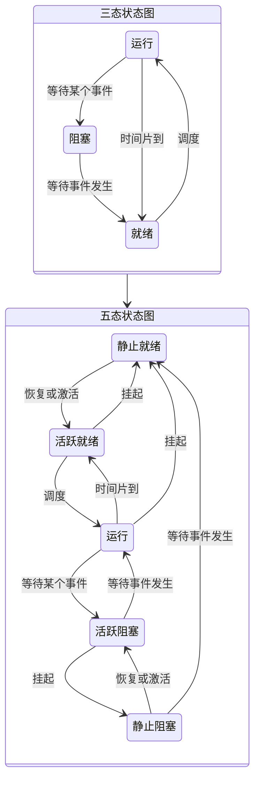
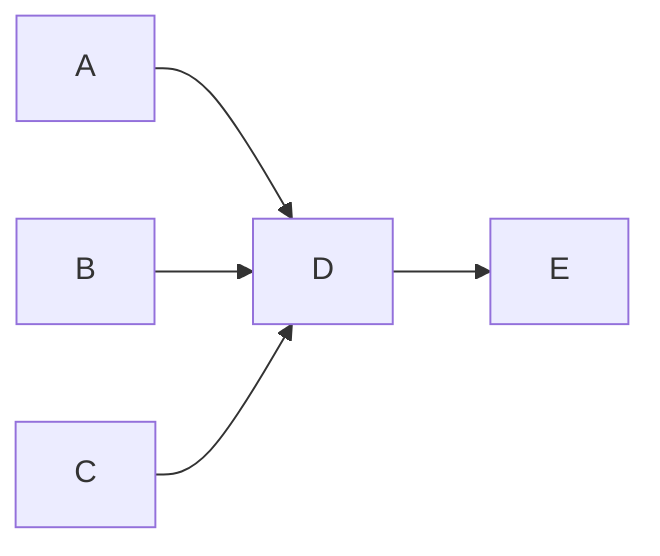
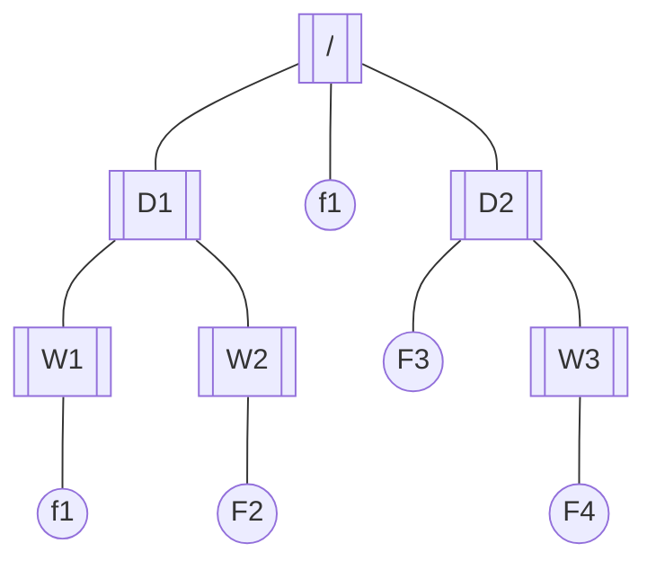

## 操作系统概述

### 操作系统定义

操作系统（Operating System，OS）是计算机系统中的核心系统软件，负责管理和控制计算机系统中的硬件和软件资源，合理地组织计算机工作流程和有效地利用资源，在计算机与用户之间起接口的作用。操作系统为用户提供的接口表现形式一般为：命令、菜单、窗口之类的，而操作系统为应用程序提供的接口为 API

::: tip 操作系统接口
操作系统是管理计算机硬件与软件资源的程序，同事也是硬件与用户之间的接口。操作系统既提供了与用户交互的接口，也提供了与应用程序交互的接口

- 用户可以通过菜单、命令、窗口与操作系统进行交互
- 应用程序通过系统调用（如调用系统 API）来与操作系统交互

:::

### 操作系统分类

按照操作系统的功能划分，操作系统的基本类型有批处理操作系统、分时操作系统、实时操作系统、网络操作系统、分布式操作系统、嵌入式操作系统、微内核操作系统等

## 操作系统基本原理

### 进程管理

#### 进程的状态

##### 三态模型与五态模型

> 五态模型中的`挂起`：将进程从内存中淘汰出去

#### 前趋图

前趋图是一个由结点和有向边构成的有向无循环图。该图通常用于表现事务之间先后顺序的制约关系。图中的每个结点可以表示一个语句、一个程序段或是一个进程，结点间的有向边表示两个结点之间存在的前趋关系

::: tip eg
包饺子的工序有：A:绞肉、B:切葱末、C:切姜末、D:搅拌、E:包饺子

按顺序来操作就是：

但是一些准备工作是可以同时进行的：

对于上面的前趋图的可以记作：=={(A,D),(B,D),(C,D),(D,E)}==，其实就是记录每个箭线起止的关系
:::

#### 进程的互斥与同步

进程互斥定义为：一组并发进程中一个或多个程序段，因共享某一共有资源而导致必须以一个不允许交叉执行的单位执行。也就是说互斥是要保证临界资源在某一时刻只被一个进程访问

进程同步定义为：把异步环境下的一组并发进程因直接制约而互相发送消息而进行互相合作、互相等待，使得各进程按一定的速度执行的过程称为进程同步。也就是说进程之间是异步执行的，同步即是使各进程按一定的制约顺序和速度执行

> 直接制约（同步，进程的协作关系）是由于进程间的相互合作而引起的，而间接制约（互斥，资源的竞争关系）则是由于进程间共享临界资源而引起的
>
> - 同步 → 直接制约
> - 异步 → 间接制约

::: tip 同步模型

:::

##### PV 操作

> P 是荷兰语的 Passeren，V 是荷兰语的 Verhoog

- 临界资源：诸进程间需要互斥方式对其进行共享的资源，如打印机、磁带机等
- 临界区：每个进程中访问临界区的`那段代码称为临界区`
- 信号量：指一种特殊的变量（全局变量）

- P 操作
  - 申请资源
  - 判断资源是否足够（$S \lt 0$） → 如果不足则把进程放入阻塞队列，否则继续执行
- V 操作
  - 释放资源
  - 检查是否有进程排队（$S \ge 0$） → 如果有则通知阻塞进程，否则继续执行（为什么等于 0 也需要通知，因为是先操作 S 再判断大小，S 在释放资源之前是-1，也就是还有一个进程在排队的）

> PV 操作的信号量 → 如果信号量大于等于 0，表示现有资源数量；如果信号量小于 0，表示有多少个排队进程
> 前趋图中的 PV 操作：前驱节点活动做完之后`通知`后继节点可以执行活动，而后继节点需要`检查`前驱节点是否做完。简单而言就是`箭线的起点是V操作，终点是P操作`

#### 死锁

进程管理是操作系统的核心，但如果设计不当，就会出现死锁的问题。如果一个进程在等待一件不可能发生的事件，则进程就死锁了。而如果一个或多个进程产生死锁，就会造成系统死锁

::: tip 死锁资源数问题
假设 n 个进程，m 个资源，其中每个资源都需要 w 个资源，则==不可能发生死锁==的条件是：
$$n \times (w-1)+1 \le m$$
:::

##### 产生死锁的条件

产生死锁的主要原因是供共享的系统资源不足，资源分配策略和进程的推进顺序不当。系统资源既可能是可重复使用的永久性资源，也可能是消耗性的临时资源

- 互斥条件
- 保持和等待条件
- 不剥夺条件
- 环路等待条件

##### 解决死锁的策略

- 在死锁发生前采用的预防和避免策略
- 在死锁发生后采用的检测与恢复策略

死锁的预防主要是通过打破死锁产生的 4 个必要条件之一来保证不会产生死锁。采用的死锁预防策略通常有资源的静态分配法或有序分配法，它们分别打破了资源动态分配条件和循环等待条件，因此不会发生死锁。但这样做会大大降低系统资源的利用率和进程之间的并行程度

死锁避免策略，则是在系统进行资源分配时，先执行一个死锁避免算法（典型的如银行家算法），以保证本次分配不会导致死锁发生。由于资源分配很频繁，因此死锁避免策略要耗费大量的 CPU 和时间

##### 银行家算法

`银行家算法`是一种分配资源的原则

- 当一个进程对资源的最大需求量不超过系统中的资源数时可以接纳该进程
- 进程可以分期请求资源，但请求的总数不能超过最大需求量
- 当系统现有的资源不能满足进程尚需资源数时，对进程的请求可以推迟分配，但总能使进程在有限的时间里得到资源

计算步骤：

1. 统计已分配的资源总数
2. 计算剩余可用资源数
3. 计算所有进程的仍需资源数

### 存储管理

#### 页式存储管理

分页的基本思想是把程序的逻辑空间和内存的物理空间按照同样的大小划分成若干页面，并以页面为单位进行分配

高级程序语言使用逻辑地址；运行状态，内存中使用物理地址

$$
\text{逻辑地址} = \text{页号} + \text{页内地址} \\ \text{物理地址} = \text{块号} + \text{页内地址}
$$

- 页内地址就是页内偏移量，相对与页的起始位置的偏移量。
- 物理块号又称页帧号
- 查找的页不存在时就产生了`缺页中断`，由操作系统把当前所需的页面装入内存储器中
- 优缺点
  - 优点：利用率高，碎片小，分配及管理简单
  - 缺点：增加了系统开销；可能产生抖动现象

> - 抖动：刚被调出的页面又立即要用，因而又要把它装入，而装入不久又被选中调出，调出不久又被装入，如此反复，使调度非常频繁的现象
> - 可以根据页的大小来计算页内地址长度，物理地址/逻辑地址除去业内地址的长度剩下的高位就是物理块号/逻辑页号

当内存中无空闲块时，为了装入一个页面而必须按某种算法从已在内存的页中选择一页，将它暂时调出内存，让出内存空间以存放所需装入的页面，这个工作称为"页面调度"

常用的页面调度算法有：

1. 最优（OPT）算法。选择不再使用或最远的将来才被使用的页，这是理想的算法，但是难以实现，常用于淘汰算法的比较
2. 随机（RAND）算法。随机地选择被淘汰的页，开销小，但是可能选中立即就要访问的页
3. 先进先出算法。选择在内存驻留时间最长的页似乎合理，但可能淘汰掉频繁使用的页。另外，使用 FIFO 算法时，在未给予进程分配足够的页面数时，有时会出现给予进程的页面数增多，缺页次数反而增加的异常现象。FIFO 算法简单，易实现。可以把装入内存储器的那些页的页号按进入的先后顺序排成队列，每次总是调出队首的页，当装入一个新页后，把新页的页号排到队尾
4. 最近最少使用（Least Recently Used，LRU）算法。选择离当前时间最近的一段时间内使用得最少的页。这个算法的主要出发点是，如果某个页被访问了，则它可能马上就要被访问；反之，如果某个页长时间未被访问，则它在最近一段时间也不会被访问

> 页面淘汰：优先淘汰访问位为 0 的页，其次是修改位为 0 的页

#### 段式存储管理

分段的基本思想是把用户作业按逻辑意义上有完整意义的段来划分，并以段为单位作为内外存交换的空间尺度

$$
\text{逻辑地址} = \text{段号} + \text{段内偏移量} \\ \text{物理地址} = \text{基址} + \text{段内偏移量}
$$

- 如果要访问的段不在内存中，则产生一个"缺段中断"，由操作系统把当前需要的段装入内存
- 判断是否为`合法地址段`：$\text{段内偏移量} \le \text{段长}$ 就是合法地址段，否则就是非法地址段
- 优缺点
  - 优点：多道程序共享内存，隔断程序修改互不影响
  - 缺点：内存利用率低，内存碎片浪费大

#### 段页式存储管理

段页式管理是段式和页式两种管理方法结合的产物，综合了段式组织与页式组织的特点，将程序模块分为若干段，每个段内再分为若干页，每个页的大小相同，但每个段的大小不同

- 优缺点
  - 优点：空间利用率高、存储共享容易、存储保护容易、能动态连接
  - 缺点：由于管理软件的增加，复杂性和开销也随之增加，需要的硬件以及占用的内容页有所增加，是的执行速度大大下降

::: tip 快表
快表是一块小容量的相联存储器（Association Memory），由高速缓存器组成，速度快，并且可以从硬件上保证按内容并行查找，一般用来存放当前访问最频繁的少数活动页面的页号

`快表：将页表存于Cache上；慢表：将页表存于内存上`
:::

### 文件管理

文件管理的功能包括：建立、修改、删除文件；按文件名访问文件；决定文件信息的存放位置、存放形式及存取权限；管理文件间的联系及提供对文件的共享、保护和保密等。允许多个用户协同工作又不引起混乱。文件的共享是指一个文件可以让多个用户共同使用，它可以减少用户的重复性劳动，节省文件的存储空间，减少输入/输出文件的次数等。文件的保护主要是为防止由于错误操作而对文件造成的破坏。文件的保密是为了防止未经授权的用
户对文件进行访问

#### 文件的逻辑结构

文件的结构是指文件的组织形式，从用户角度所看到的文件组织形式，称为文件的逻辑结构。一般文件的逻辑结构可以分为两种：无结构的字符流文件和有结构的记录文件

记录文件有顺序文件、索引顺序文件、索引文件和直接文件。

1. 顺序文件。大多数文件是顺序文件。顺序文件的记录定长，记录中的数据项的类型长度与次序固定，一般还有一个可以唯一标识记录的数据项，称为键（key），记录是按键值的约定次序组织的。顺序文件常用于批处理应用，对于查询或更新某个记录的处理性能不太好
2. 索引顺序文件。索引顺序文件是基于键的约定次序组织的，而且维护键的索引和溢出区域。键的索引也可以是多级索引。索引顺序文件既适用于交互方式应用，也适用于批处理方式应用
3. 索引文件。索引文件是基于记录的一个键数据项组织的。许多应用需按照别的数据项访问文件，为此，常采用索引文件方法，即对主文件中的记录按需要的数据项（一个或几个）建索引，索引文件本身是顺序文件组织
4. 直接文件。直接文件又称哈希（Hash）文件。记录以它们在直接访问存储设备上的物理地址直接（随机地）访问。直接文件常用 于需要高速访问文件而且每次仅访问一条记录的应用中

#### 文件的物理结构

文件的物理结构是指文件在存储设备上的存放方法。文件的物理结构侧重于提高存储器的利用效率和降低存取时间。文件的存储设备通常划分为大小相同的物理块，物理块是分配和传输信息的基本单位。文件的物理结构涉及文件存储设备的组块策略和文件分配策略，决定文件信息在存储设备上的存储位置

常用的文件分配策略有：

1. 顺序分配（连续分配）。这是最简单的分配方法。在文件建立时预先分配一组连续的物理块，然后，按照逻辑文件中的信息（或记录）顺序，依次把信息（或记录）按顺序存储到物理块中。这样，只需知道文件在文件存储设备上的起始位置和文件长度，就能进行存取，这种分配方法适合于顺序存取，在连续存取相邻信息时，存取速度快。其缺点是在文件建立时必须指定文件的信息长度，以后不能动态增长，一般不宜用于需要经常修改的文件。
2. 链接分配（串联分配）。这是按单个物理块逐个进行的。每个物理块中（一般是最后一个单元）设有一个指针，指向其后续连接的下一个物理块的地址，这样，所有的物理块都被链接起来，形成一个链接队列。在建立链接文件时，不需要指定文件的长度，在文件的说明信息中，只需指出该文件的第一个物理块块号，而且链接文件的文件长度可以动态地增长。只调整物理块间的指针就可以插入或删除一个信息块。  
   链接分配的优点是可以解决存储器的碎片问题，提高存储空间利用率。由于链接文件只能按照队列中的链接指针顺序查找，因此搜索效率低，一般只适用于顺序访问，不适用于随机存取。
3. 索引分配。这是另一种对文件存储不连续分配的方法。采用索引分配方法的系统，为每一个文件建立一张索引表，索引表中每一表项指出文件信息所在的逻辑块号和与之对应的物理块号。

##### UNIX 采用的三级索引结构

总共 13 个索引节点，前面十个是直接索引，然后是一个一级间接索引，然后是一个二级间接索引，最后是一个三级间接索引

#### 文件存储设备管理

文件存储设备管理，就是操作系统要有效地进行存储空间的管理。由于文件存储设备是分成许多大小相同的物理块，并以块为单位交换信息，因此，文件存储设备的管理实质上是对空闲块的组织和管理问题。它包括空闲块的组织，空闲块的分配与空闲块的回收等问题。

有 3 种不同的空闲块管理方法，它们分别是索引法、链接法和位示图法

1. 索引法。索引法把空闲块作为文件并采用索引技术。为了有效，索引对应于一个或由几个空闲块构成的空闲区。这样，磁盘上每一个空闲块区都对应于索引表中一个条目，这个方法能有效地支持每一种文件分配方法
2. 链接法。链接法使用链表把空闲块组织在一起，当申请者需要空闲块时，分配程序从链首开始摘取所需的空闲块。反之，管理程序把回收的空闲块逐个挂入队尾，这个方法适用于每一种文件分配方法。空闲块的链接方法可以按释放的先后顺序链接，也可以按空闲块区的大小顺序链接。后者有利于获得连续的空闲块的请求，但在分配请求和回收空闲块时系统开销多一点
3. 位示图法。该方法是在外存上建立一张位示图（Bitmap），记录文件存储器的使 用情况。每一位仅对应文件存储器上的一个物理块，取值 0 和 1 分别表示空闲和占用。文件存储器上的物理块依次编号为：0、1、2、…。假如系统中字长为 32 位，有 4096 个物理块，那么在位示图中的第 1 个字对应文件存储器上的 0、1、2、…、31 号物理块；第 2 个字对应文件存储器上的 32、33、34、…、63 号物理块；第 128 字对应文件存储器上的 4064、4065、…、4095 号物理块。这样位示图的大小为 32 字

> 默认情况下，==位从 0 开始编号，字从 1 开始编号==

#### 树形目录结构

在计算机的文件系统中，一般采用树型目录结构。在树型目录结构中，树的根结点为根目录，数据文件作为树叶，其他所有目录均作为树的结点

根目录隐含于一个硬盘的一个分区中，根目录在最顶层。它包含的子目录是一级子目录。每一个一级子目录又可以包含若干二级子目录，…，这样的组织结构就叫作目录树

当前盘和当前目录是系统默认的操作对象。如果用户没有指明操作对象，系统就将用户命令指向当前盘和当前目录

- 文件属性
  - R 只读文件属性
  - A 存档属性
  - S 系统文件
  - H 隐藏文件
- 文件名组成
  - 驱动器号
  - 路径
  - 主文件名
  - 扩展名
- 路径
  - 绝对路径：是从盘符开始的路径
  - 相对路径：是从当前目录开始的路径

### 作业管理

从用户的角度看，作业是系统为完成一个用户的计算任务（或一次事务处理）所做的工作总和。例如，对于用户编制的源程序，需经过对源程序的编译、连接编辑或连接装入及运行产生计算结果。这其中的每一个步骤，常称为作业步，作业步的顺序执行即完成了一个作业

从系统的角度看，作业则是一个比程序更广的概念。它由程序、数据和作业说明书组成。系统通过作业说明书控制文件形式的程序和数据，使之执行和操作。而且，在批处理系统中，作业是占据内存的基本单位

用户的作业可以通过直接的方式，由用户自己按照作业步顺序操作；也可以通过间接的方式，由用户率先编写的作业步依次执行的说明，一次交给操作系统，由系统按照说明依次处理。前者称为联机方式，后者称为脱机方式

#### 作业状态及其转换

一个作业从交给计算机系统到执行结束退出系统，一般都要经历提交、后备、执行和完成 4 个状态

1. 提交状态。作业由输入设备进入外存储器（也称输入井）的过程称为提交状态。处于提交状态的作业，其信息正在进入系统
2. 后备状态。当作业的全部信息进入外存后，系统就为该作业建立一个作业控制块（Job Control Block，JCB）。系统通过 JCB 感知作业的存在。JCB 主要内容包括作业名、作业状态、资源要求、作业控制方式、作业类型及作业优先权等
3. 执行状态。一个后备作业被作业调度程序选中而分配了必要的资源并进入了内存，作业调度程序同时为其建立了相应的进程后，该作业就由后备状态变成了执行状态
4. 完成状态。当作业正常运行结束，它所占用的资源尚未全部被系统回收时的状态为完成状态

#### 用户接口

用户接口也称为用户界面，其含义有两种，一种是指用户与操作系统交互的途径和通道，即操作系统的接口；另一种是指这种交互环境的控制方式，即操作环境。

1. 操作系统的接口。操作系统的接口又可分成命令接口和程序接口。命令接口包含键盘命令和作业控制命令；程序接口又称为编程接口或系统调用，程序经编程接口请求系统服务，即通过系统调用程序与操作系统通信。系统调用是操作系统提供给编程人员的唯一接口。系统调用对用户屏蔽了操作系统的具体动作而只提供有关功能。系统调用大致分为设备管理、文件管理、进程控制、进程通信和存储管理等
2. 操作环境。操作环境支持命令接口和程序接口，提供友好的、易用的操作平台。操作系统的交互界面已经从早期的命令驱动方式，发展到菜单驱动方式、图符驱动方式和视窗操作环境

### 设备管理

在计算机系统中，除了处理器和内存之外，其他的大部分硬设备称为外部设备。它包括输入/输出设备，辅存设备及终端设备等。这些设备种类繁多，特性各异，操作方式的差异很大，从而使操作系统的设备管理变得十分繁杂

#### 数据传输控制方式

设备管理的主要任务之一是控制设备和内存或 CPU 之间的数据传送，选择和衡量控制方式的原则如下：

1. 数据传送速度足够高，能满足用户的需要但又不丢失数据
2. 系统开销小，所需的处理控制程序少
3. 能充分发挥硬件资源的能力，使得 I/O 设备尽量处于使用状态中，而 CPU 等待时间少

外围设备和内存之间常用的数据传送控制方式主要有以下几种（==以下方式的处理效率越来越高==）：

1. 程序控制（查询）方式。处理器启动数据传输，然后等设备完成。分为无条件传送和程序查询方式两种，方法简单，硬件开销小，但 I/O 能力不高，严重影响 CPU 的利用率
2. 中断方式。程序控制方式不能实现并发，与程序控制方式相比，中断方式因为 CPU 无需等待而提高了传输请求的响应速度
   > - 中断方式的数据传输过程：进程启动数据传输（如读）后，该进程放弃处理器，当数据传输完成，设备控制器产生中断请求，中断处理程序对数据传输工作处理之后，让相应进程成为就绪状态。以后，该进程就可以得到所需要的数据
   > - 设备：键盘
3. 直接存储访问（Direct Memory Access，DMA）方式。指外部设备和内存之间开辟直接的数据交换通路。除了控制状态寄存器和数据缓冲寄存器外，DMA 控制器中还包括传输字节计数器、内存地址寄存器等。DMA 方式采用窃取（或挪用）处理器的工作周期和控制总线而实现辅助存储器和内存之间的数据交换。有的 DMA 方式也采用总线浮起方式传输大批量数据
   > - DMA 方式是为了在主存与外设之间实现高速、批量数据交换而设置的。DMA 方式比程序控制方式与中断方式都高效
   > - 对于通用计算机 PC 而言，DMA 控制逻辑由 CPU 和 DMA 控制接口逻辑芯片共同组成，嵌入式系统的 DMA 控制器内建在处理器芯片内部，一般称为 DMA 控制器（DMAC）
   > - 设备：硬盘
4. 通道方式。通道又称为输入/输出处理器（Input/Output Processor，IOP），可以独立完成系统交付的输入/输出任务，通过执行自身的输入/输出专用程序（称通道程序）进行内存和外设之间的数据传输。主要有 3 种通道：字节多路通道、选择通道和成组多路通道

#### 虚设备与 SPOOLING 技术

采用假脱机技术，可以将低速的独占设备改造成一种可共享的设备，而且一台物理设备可以对应若干台虚拟的同类设备。假脱机（Simultaneous Peripheral Operation On Line，SPOOLING）的意思是外部设备同时联机操作，又称为假脱机输入/输出操作，采用一组程序或进程模拟一台输入/输出处理器

## 微内核操作系统

微内核是内核的一种精简形式。通常系统服务层是和内核集成在一起的，而微内核将系统服务层被分离出来，变成可以根据需求加入的选件，这样就可以提供更好的可扩展性和更加有效的应用环境

由于客户/服务器（Client/Server）模式，具有非常多的优点，故在单机微内核操作系统中几乎无一例外地都采用客户/服务器模式，将操作系统中最基本的部分放入内核中，而把操作系统的绝大部分功能都放在微内核外面的一组服务器(进程)中实现。例如用于提供对进程(线程)进行管理的进程(线程)服务器，提供虚拟存储器管理功能的虚拟存储器服务器，提供 I/O 设备管理的 I/O 设备管理服务器等，它们都是被作为进程来实现的，运行在用户态，客户与服务器之间是借助微内核提供的消息传递机制来实现信息交互的

> 用户态包含核心以外的功能，核心态只实现基本功能

### 单体内核与微内核的区别

|          | 实质                                                                           | 优点                                                                                                                               | 缺点                                                             |
| -------- | ------------------------------------------------------------------------------ | ---------------------------------------------------------------------------------------------------------------------------------- | ---------------------------------------------------------------- |
| 单体内核 | 将图形、设备驱动及文件系统等功能全部在内核中实现，运行在内核状态和同一地址空间 | 减少进程间通信和状态切换的系统开销，获得较高的==运行效率==                                                                         | 内核庞大，占用资源较多且不易剪裁 ==系统的稳定性和安全性不好== |
| 微内核   | 只实现基本功能，将图形系统、文件系统、设备驱动及通信功能放在内核之外           | 内核精炼，便于剪裁和移植。 系统服务程序运行在用户地址空间，系统的==可靠性==、==稳定性==和==安全性==较高 ==可用于分布式系统== | 用户状态和内核状态需要频繁切换，从而导致系统效率不如单体内核     |

## 嵌入式操作系统

- 嵌入式操作系统特点
  - 微型化：从性能和成本角度考虑，希望占有资源和系统代码量少，如内存少、字长短、运行速度有限、能源少（微型电池）
  - 可定制：从减少成本和缩短研发周期考虑，要求嵌入式操作系统能运行在不同的微处理器平台上，能针对硬件变化进行结构与功能上的配置，以满足不同应用需要
  - 实时性：嵌入式操作系统主要应用于过程控制、数据采集、传输通信、多媒体及关键要害领域需要迅速相应的场合，所以对实时性要求高
  - 可靠性：系统构件、模块和体系结构必须达到应有的可靠性，对关键要害应用还要提供容错和防故障措施
  - 易移植性：为了提高系统的易移植性，通常采用硬件抽象层（Hardware Abstraction Level，HAL）和板级支持包（Board Support Package，BSP）的底层设计技术（对于嵌入式系统本身来说就是硬件无关性）
- 实时嵌入式系统的内核服务
  - 异常和中断
  - 计时器
  - I/O 管理
- 常见嵌入式 RTOS（实时操作系统，Real-Time Operating System）
  - VxWorks
  - RT-Linux
  - QNX
  - pSOS

> 实时是指计算机对于外来信息能供以足够快的速度进行处理，并在==被控对象允许的时间范围内做出快速响应==。实时操作系统是保证在一定时间限制内完成特定功能的操作系统

::: tip 板级支持包（BSP）

> 嵌入式的可移植性（易移植性）基于 BSP，所以它的可移植性是硬件无关性（BSP 做了这部分的事情）

板级支持包（BSP，也称为硬件抽象层 HAL）一般包含相关底层硬件的初始化、数据的输入/输出操作和硬件设备的配置等功能，它主要具有一下两个特点：

- ==硬件相关性==。因为嵌入式实时系统的硬件环境具有也有相关性，而作为上层软件与硬件平台之间的接口，BSP 需为操作系统提供操作和控制具体硬件的方法
- ==操作系统相关性==。不同的操作系统具有各自的软件层次结构，因此不同操作系统只有特定的硬件接口形式

:::

| 比较类型   | VxWorks                            | RT-Linux                           |
| ---------- | ---------------------------------- | ---------------------------------- |
| 工作方式   | 操作系统与应用程序处于统一存储空间 | 操作系统与应用程序处于不同存储空间 |
| 多任务支持 | 支持多任务（线程）操作             | 支持多进程、多线程操作             |
| 实时性     | 实时系统                           | 实时系统                           |
| 安全性     | 任务间无隔离保护                   | 支持进程间隔离保护                 |
| 标准 API   | 支持                               | 支持                               |
