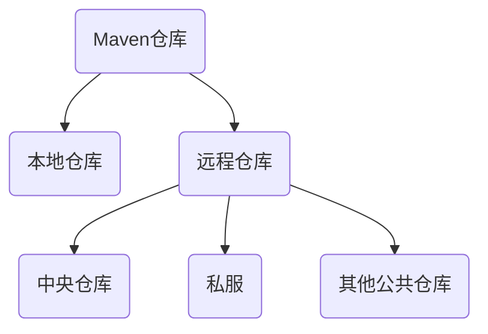

## 简介

::: info
以下内容摘自[官网](https://maven.apache.org/)

Apache Maven is a software project management and comprehension tool. Based on the concept of a project object model (POM), Maven can manage a project's build, reporting and documentation from a central piece of information.

Apache Maven 的本质是一个软件项目管理和理解工具. 基于项目对象模型 (Project Object Model, POM) 的概念, Maven 可以从一条中心信息管理项目的构建、报告和文档
:::

Maven 是一款基于 Java 平台的项目管理和整合工具, 只需要做一些简单的配置, Maven 就可以自动完成项目的编译、测试、打包、发布以及部署等工作

### POM

POM（Project Object Model, 项目对象模型）是 Maven 的基本组件, 它是以 xml 文件的形式存放在项目的根目录下, 名称为 `pom.xml`

POM 中定义了项目的基本信息, 用于描述项目如何构建、声明项目依赖等等

### 约定优于配置

约定优于配置（Convention Over Configuration）其是 Maven 最核心的设计理念之一, Maven 对项目的目录结构、测试用例命名方式等内容都做了规定, 凡是使用 Maven 管理的项目都必须遵守这些规则

Maven 项目构建过程中, 会自动创建默认项目结构, 开发人员仅需要在相应目录结构下放置相应的文件即可

### 构件

在 Maven 中, 任何一个依赖、插件或者项目构建的输出, 都可以称为 **构件**

每个构件都有自己的唯一标识(唯一坐标), 由 groupId, artifactId, 和 version 等信息构成, 由此, Maven 就可以对构件进行版本控制、管理

## 坐标

说到坐标, 最熟悉的定义应该是来自平面几何, 即在一个平面坐标系中, 坐标（x, y）表示距离 x 轴为 y, 距离 y 轴距离为 x 的点, 任何一个坐标都能够唯一标识该平面上的一个点

在现实的生活中同样存在着很多坐标, 例如地址, 就可以通过国家、省、市、县、乡镇、村、门牌号等一些列信息唯一地标识一个地址

### 定义

Maven 规定: 世界上任何一个构件都可以使用 Maven 坐标并作为其唯一标识, Maven 坐标包括 groupId、artifactId、version、packaging 等元素, 只要用户提供了正确的坐标元素, Maven 就能找到对应的构件

- groupId: 必填. 定义了当前 Maven 项目隶属的组织或公司, 通常是唯一的. 它的取值一般是项目所属公司或组织的网址或 URL 的反写, 例如 `io.github.whitechen233`
- artifactId: 必填. 定义了当前 Maven 项目的名称, 项目的唯一的标识符, 对应项目根目录的名称
- version: 必填. 定义了 Maven 项目当前所处版本
- packaging: 选填. 定义了 Maven 项目的打包方式（比如 war、jar）, 默认为 `jar`
- classifier: 常用于区分从同一 POM 构建的具有不同内容的构件, 可以是任意的字符串, 附加在版本号之后

比如下面这个栗子

```xml
<dependency>
  <groupId>io.github.whitechen233</groupId>
  <artifactId>flyway-dm-support</artifactId>
  <version>1.0-RELEASE</version>
</dependency>
```

### 搜索构件

可以通过以下网站搜索可用的构件:

- [Maven Repository](https://mvnrepository.com)
- [Maven Central Repository](https://central.sonatype.dev)
- [Package Search](https://package-search.jetbrains.com)

## 依赖

通俗的说, 如果一个 Maven 构建所产生的构件（例如 Jar 文件）被其他项目引用, 那么该构件就是其他项目的依赖

### 依赖配置

比如, 在初始化一个新 Spring Boot 项目的时候, 想使用 log4j2 而不想使用 logback, 会有如下配置

```xml
<dependencies>
  <dependency>
    <groupId>org.springframework.boot</groupId>
    <artifactId>spring-boot-starter</artifactId>
    <version>xxx</version>
    <exclusions>
      <exclusion>
        <groupId>org.springframework.boot</groupId>
        <artifactId>spring-boot-starter-logging</artifactId>
        <version>xxx</version>
      </exclusion>
    </exclusions>
  </dependency>
  <dependency>
    <groupId>org.springframework.boot</groupId>
    <artifactId>spring-boot-starter-log4j2</artifactId>
    <version>xxx</version>
  </dependency>
</dependencies>
```

说明:

- dependencies: 管理所有依赖的根标签, 一个 pom.xml 文件中只能存在一个
- dependency: 包含在 dependencies 标签中, 可以有多个, 每一个表示项目的一个依赖
- groupId, artifactId, version: 必要. 声明依赖的坐标
- type: 可选. 依赖的类型, 对应项目坐标定义的 packaging, 默认值也与之相同
- scope: 可选. 依赖的生效范围, 默认是 compile
- optional: 可选. 依赖是否可选
- exclusions: 可选. 用来排除传递依赖

### 依赖范围

classpath 用于指定 `.class` 文件存放的位置, 类加载器会从该路径中加载所需要的 `.class` 文件到内存中

Maven 在编译、执行测试、实际运行有不同的 classpath:

- **编译 classpath**: 编译代码有效
- **测试 classpath**: 编译、运行测试有效
- **运行 classpath**: 项目运行时有效

Maven 的依赖范围如下

- **compile**: 编译依赖范围（默认）, 使用此依赖范围对于编译、测试、运行三种都有效, 即在编译、测试和运行的时候都要使用该依赖 Jar 包
- **test**: 测试依赖范围, 只能用于测试, 而在编译和运行项目时无法使用此类依赖. 典型的是 JUnit, 它只用于编译测试代码和运行测试代码的时候才需要
- **provided**: 对于编译和测试依赖范围有效, 而对运行时无效. 比如 servlet-api.jar 在 Tomcat 中已经提供了, 我们只需要的是编译期提供而已
- **runtime**: 运行时依赖范围, 对于测试和运行有效, 但是在编译主代码时无效. 典型的就是 JDBC 驱动实现
- **system**: 系统依赖范围, 使用 system 范围的依赖时必须通过 systemPath 元素显示地指定依赖文件的路径, ==不依赖 Maven 仓库解析, 所以可能会造成建构的不可移植, 所以尽可能不使用此方式==

### 依赖传递性

#### 依赖冲突

- 项目使用同一个 groupId, 同一个 artifactId 时, 只能使用一个 version

```xml
<dependencies>
  <dependency>
    <groupId>io.github.whitechen233</groupId>
    <artifactId>flyway-dm-support</artifactId>
    <version>1.0-RELEASE</version>
  </dependency>
  <!-- 最终使用的是这个版本的依赖 -->
  <dependency>
    <groupId>io.github.whitechen233</groupId>
    <artifactId>flyway-dm-support</artifactId>
    <version>1.0.1-RELEASE</version>
  </dependency>
</dependencies>
```

若相同类型但版本不同的依赖存在于同一个 pom 文件, 只会引入后一个声明的依赖

- 项目的两个依赖同时引入了某个依赖

Maven 在遇到这种问题的时候, 会遵循 `路径最短优先` 和 `声明顺序优先` 两大原则. 解决这个问题的过程也被称为 **Maven 依赖调解**

- **路径最短优先**: 依赖的层次路径越短的优先
- **声明顺序优先**: 如果路径长度一样, 那么先声明的优先

::: tip 栗子
假设有这样的一个依赖关系

```text
依赖一: A -> B -> C -> X(1.0)
依赖二: A -> D -> X(2.0)
```

那么根据路径最短优先规则, 最终生效的会是 X(2.0)

假设有这样的一个依赖关系

```text
依赖一: A -> B -> X(1.0)
依赖二: A -> C -> X(2.0)
```

如果根据路径最短优先规则, 会发现两条路径长度一样, 所以需要声明顺序优先, 最终生效的是 X(2.0)
:::

#### 排除依赖

如果单纯依赖 Maven 来进行依赖调解, 在某些情况下是不适用的, 这个时候就需要我们手动排除依赖

比如有这样一个依赖关系

```text
依赖一: A -> B -> X(1.0)
依赖二: A -> C -> D -> X(2.0)
```

在上面这个栗子中, 根据路径最短优先原则, X(1.0) 会被解析使用, 那么:

- 如果 D 依赖用到了 2.0 版本的 X 中才有的一个类, 运行项目就会报 `NoClassDefFoundError` 错误
- 如果 D 依赖用到了 2.0 版本的 X 中才有的一个方法, 运行项目就会报 `NoSuchMethodError` 错误

此时需要使用 `exclusions` 手动排除调 X(1.0) 的版本

```xml
<dependencyB>
  <exclusions>
    <exclusion>
      <artifactId>x</artifactId>
      <groupId>com.group</groupId>
    </exclusion>
  </exclusions>
</dependencyB>
```

因为大部分 jar 在升级的时候都会做到向下兼容, 使用一般在解决依赖冲突的时候, 都会优先保留版本较高的

如果高版本修改了低版本的一些类或者方法的话, 这个时候就不能直接保留高版本了, 而是应该考虑优化上层依赖, 比如升级上层依赖的版本

## 仓库

Maven 在某个统一的位置存储所有项目的构件, 这个统一的位置, 我们就称之为仓库. 任何的构件都有唯一的坐标, 该坐标定义了构件在仓库中的唯一存储路径. 当 Maven 项目需要某些构件时, 只要其 POM 文件中声明了这些构件的坐标, Maven 就会根据这些坐标找自动到仓库中找到并使用它们

项目构建完成生成的构件, 也可以安装或者部署到仓库中, 供其他项目使用

### 仓库的分类



- **本地仓库**: 运行 Maven 的计算机上的一个目录, 它缓存远程下载的构件并包含尚未发布的临时构件. `settings.xml` 文件中可以看到 Maven 的本地仓库路径配置, 默认本地仓库路径是在 `${user.home}/.m2/repository`
- **远程仓库**: 官方或者其他组织维护的 Maven 仓库

Maven 远程仓库又可以分为:

- **中央仓库**: 这个仓库是由 Maven 社区来维护的, 里面存放了绝大多数开源软件的包, 并且是作为 Maven 的默认配置, 不需要开发者额外配置. 另外为了方便查询, 还提供了一个[查询地址](http://search.maven.org), 开发者可以通过这个地址更快的搜索需要构件的坐标
- **私服**: 私服是一种特殊的远程 Maven 仓库, 它是架设在局域网内的仓库服务, 私服一般被配置为互联网远程仓库的镜像, 供局域网内的 Maven 用户使用
- **其他的公共仓库**: 有一些公共仓库是未来加速访问（比如[阿里云 Maven 镜像仓库](https://developer.aliyun.com/mvn/view)）或者部分构件不存在于中央仓库中

### 仓库的配置

修改 Maven 安装目录下的 `setting.xml` 文件

```xml
<settings xmlns="http://maven.apache.org/SETTINGS/1.0.0"
  xmlns:xsi="http://www.w3.org/2001/XMLSchema-instance"
  xsi:schemaLocation="http://maven.apache.org/SETTINGS/1.0.0
   http://maven.apache.org/xsd/settings-1.0.0.xsd">
  <!-- 通过 localRepository 指定本地仓库地址 -->
  <localRepository>D:/Maven/repository</localRepository>
  <!-- 通过 mirrors 下的 mirror 标签配置远程仓库（镜像）地址 -->
  <mirrors>
    <!-- 阿里云镜像地址 -->
    <mirror>
      <id>aliyun</id>
      <mirrorOf>central</mirrorOf>
      <name>aliyun</name>
      <url>https://maven.aliyun.com/repository/public</url>
    </mirror>
    <!-- 华为云镜像地址 -->
    <mirror>
      <id>huaweicloud</id>
      <name>mirror from maven huaweicloud</name>
      <mirrorOf>central</mirrorOf>
      <url>https://repo.huaweicloud.com/repository/maven/</url>
    </mirror>
  </mirrors>
</settings>
```

### 依赖包的搜索顺序

当通过 Maven 构建项目时, Maven 按照如下顺序查找依赖的构件:

- 先去本地仓库找寻, 有的话, 直接使用
- 本地仓库没有找到的话, 会去远程仓库找寻, 下载包到本地仓库
- 远程仓库没有找到的话, 会报错

## 生命周期

在 Maven 出现之前, 项目构建的生命周期就已经存在, 开发人员每天都在对项目进行清理, 编译, 测试及部署, 但由于没有统一的规范, 不同公司甚至不同项目之间的构建的方式都不尽相同

Maven 从大量项目和构建工具中学习和反思, 最后总结了一套高度完美的, 易扩展的生命周期. 这个生命周期将项目的清理、初始化、编译、测试、打包、集成测试、验证、部署和站点生成等几乎所有构建过程进行了抽象和统一

Maven 有以下三个标准的生命周期:

- clean: 项目清理的处理
- default(或 build): 项目部署的处理
- site: 项目站点文档创建的处理

### 特性

#### 构建阶段的依赖性

每个生命周期包含一系列的构建阶段（phase）, 这些阶段是有顺序的, 且后面的阶段依赖于前面的阶段

> 用户与 Maven 最直接的交互方式就是调用这些生命周期阶段

#### 生命周期的独立性

与构建阶段的前后依赖关系不同, 三套生命周期本身是相互独立的, 用户可以只调用 clean 生命周期的某个阶段, 也可以只调用 default 生命周期的某个阶段, 而不会对其他生命周期造成任何影响

### clean 生命周期

clean 生命周期包含以下 3 个阶段

| 阶段       | 描述                                    |
| ---------- | --------------------------------------- |
| pre-clean  | 执行一些需要在 clean 之前完成的工作     |
| clean      | 移除所有上一次构建生成的文件            |
| post-clean | 执行一些需要在 clean 之后立刻完成的工作 |

::: tip 如何理解阶段的依赖关系理论

以 clean 生命周期为例, 在上述 3 个阶段中

- 当用户调用 pre-clean 阶段时, 则只有 pre-clean 阶段执行
- 当用户调用 clean 阶段时, pre-clean 和 clean 阶段都会执行
- 当用户调用 post-clean 阶段时, 则 pre-clean、clean 以及 post-clean 三个阶段都会执行

:::

### default 生命周期

default 生命周期定义了项目真正构建时所需要的所有步骤, 它是所有生命周期中最核心, 最重要的部分

default 生命周期包含以下 23 个阶段

| 阶段                    | 描述                                                                     |
| ----------------------- | ------------------------------------------------------------------------ |
| validate                | 校验: 校验项目是否正确并且所有必要的信息可以完成项目的构建过程           |
| initialize              | 初始化: 初始化构建状态, 比如设置属性值                                   |
| generate-sources        | 生成源代码: 生成包含在编译阶段中的任何源代码                             |
| process-sources         | 处理源代码: 处理源代码, 比如说, 过滤任意值                               |
| generate-resources      | 生成资源文件: 生成将会包含在项目包中的资源文件                           |
| process-resources       | 处理资源文件: 复制和处理资源到目标目录, 为打包阶段最好准备               |
| compile                 | 编译: 编译项目的源代码                                                   |
| process-classes         | 处理类文件: 处理编译生成的文件, 比如说对 Java class 文件做字节码改善优化 |
| generate-test-sources   | 生成测试源代码: 生成包含在编译阶段中的任何测试源代码                     |
| process-test-sources    | 处理测试源代码: 处理测试源代码, 比如说, 过滤任意值                       |
| generate-test-resources | 生成测试资源文件: 为测试创建资源文件                                     |
| process-test-resources  | 处理测试资源文件: 复制和处理测试资源到目标目录                           |
| test-compile            | 编译测试源码: 编译测试源代码到测试目标目录.                              |
| process-test-classes    | 处理测试类文件: 处理测试源码编译生成的文件                               |
| test                    | 测试: 使用合适的单元测试框架运行测试（Juint 是其中之一）                 |
| prepare-package         | 准备打包: 在实际打包之前, 执行任何的必要的操作为打包做准备               |
| package                 | 打包: 将编译后的代码打包成可分发格式的文件, 比如 JAR、WAR 或者 EAR 文件  |
| pre-integration-test    | 集成测试前: 在执行集成测试前进行必要的动作比如说, 搭建需要的环境         |
| integration-test        | 集成测试: 处理和部署项目到可以运行集成测试环境中                         |
| post-integration-test   | 集成测试后: 在执行集成测试完成后进行必要的动作比如说, 清理集成测试环境   |
| verify                  | 验证: 运行任意的检查来验证项目包有效且达到质量标准                       |
| install                 | 安装: 安装项目包到本地仓库, 这样项目包可以用作其他本地项目的依赖         |
| deploy                  | 部署: 将最终的项目包复制到远程仓库中与其他开发者和项目共享               |

### site 生命周期

site 一般用来创建新的报告文档、部署站点等

site 生命周期包含以下 4 个阶段

| 阶段        | 描述                                                       |
| ----------- | ---------------------------------------------------------- |
| pre-site    | 执行一些需要在生成站点文档之前完成的工作                   |
| site        | 生成项目的站点文档                                         |
| post-site   | 执行一些需要在生成站点文档之后完成的工作, 并且为部署做准备 |
| site-deploy | 将生成的站点文档部署到特定的服务器上                       |

## 插件

Maven 实际上是一个依赖插件执行的框架, 它执行的每个任务实际上都由插件完成的. Maven 的核心发布包中并不包含任何 Maven 插件, 它们以独立构件的形式存在, 只有在 Maven 需要使用某个插件时, 才会去仓库中下载

Maven 提供了如下 2 种类型的插件:

- Build plugins: 在项目构建过程中执行, 在 pom.xml 中的 build 元素中配置
- Reporting plugins: 在网站生成过程中执行, 在 pom.xml 中的 reporting 元素中配置

除了 Maven 自带的插件之外, 还有一些三方提供的插件比如:

- jacoco-maven-plugin: 单测覆盖率插件
- maven-checkstyle-plugin: 帮助开发检测代码中不合规范的地方的插件
- sonar-maven-plugin: 分析代码质量的

### 插件目标

对于 Maven 插件而言, 为了提高代码的复用性, 通常一个 Maven 插件能够实现多个功能, 每一个功能都是一个插件目标, 即 Maven 插件是插件目标的集合. 我们可以把插件理解为一个类, 而插件目标是类中的方法, 调用插件目标就能实现对应的功能

#### 通用写法

插件目标的通用写法如下

```text
[插件名]:[插件目标]
```

例如, maven-compiler-plugin 插件的 compile 目标的通用写法如下

```text
maven-compiler-plugin:compiler
```

#### 执行插件目标

使用 Maven 命令执行插件的目标, 语法如下

```shell
mvn [插件名]:[目标名]
```

例如, 调用 maven-compiler-plugin 插件的 compile 目标, 命令如下

```shell
mvn compiler:compile
```

### 插件绑定

为了完成某个具体的构建任务, Maven 生命周期的阶段需要和 Maven 插件的目标相互绑定

#### 内置绑定

Maven 默认为一些核心的生命周期阶段绑定了插件目标, 当用户调用这些阶段时, 对应的插件目标就会自动执行相应的任务

<table>
<thead>
  <tr>
    <td>生命周期</td>
    <td>阶段</td>
    <td>插件目标</td>
    <td>执行的任务</td>
  </tr>
</thead>
<tbody>
  <tr>
    <td rowspan="3">clean</td>
    <td>pre-clean</td>
    <td></td>
    <td></td>
  </tr>
  <tr>
    <td>clean</td>
    <td>maven-clean-plugin:clean</td>
    <td>清理 Maven 的输出目录</td>
  </tr>
  <tr>
    <td>post-clean</td>
    <td></td>
    <td></td>
  </tr>
  <tr>
    <td rowspan="8">default</td>
    <td>process-resources</td>
    <td>maven-resources-plugin:resources</td>
    <td>复制资源文件到输出目录</td>
  </tr>
  <tr>
    <td>compile</td>
    <td>maven-compiler-plugin:compile</td>
    <td>编译代码到输出目录</td>
  </tr>
  <tr>
    <td>process-test-resources</td>
    <td>maven-resources-plugin:testResources</td>
    <td>复制测试资源文件到测试输出目录</td>
  </tr>
  <tr>
    <td>test-compile</td>
    <td>maven-compiler-plugin:testCompile</td>
    <td>编译测试代码到测试输出目录</td>
  </tr>
  <tr>
    <td>test</td>
    <td>maven-surefire-plugin:test</td>
    <td>执行测试用例</td>
  </tr>
  <tr>
    <td>package</td>
    <td>maven-jar-plugin:jar/maven-jar-plugin:war</td>
    <td>创建项目 jar/war 包</td>
  </tr>
  <tr>
    <td>install</td>
    <td>maven-install-plugin:install</td>
    <td>将项目输出的包文件安装到本地仓库</td>
  </tr>
  <tr>
    <td>deploy</td>
    <td>maven-deploy-plugin:deploy</td>
    <td>将项目输出的包文件部署到到远程仓库</td>
  </tr>
  <tr>
    <td rowspan="4">site</td>
    <td>pre-site</td>
    <td></td>
    <td></td>
  </tr>
  <tr>
    <td>site</td>
    <td>maven-site-plugin:site</td>
    <td>生成项目站点</td>
  </tr>
  <tr>
    <td>post-site</td>
    <td></td>
    <td></td>
  </tr>
  <tr>
    <td>site-deploy</td>
    <td>maven-site-plugin:deploy</td>
    <td>部署项目站点</td>
  </tr>
</tbody>
</table>

::: tip

上表中, default 生命周期中只列出了绑定了插件目标的阶段, 它还有很多其他的阶段, 但这些阶段默认没有绑定任何插件目标, 因此它们也没有任何实际的行为

:::

#### 自定义绑定

除了内置绑定之外, 用户也可以自己选择将某个插件目标绑定到 Maven 生命周期的某个阶段上, 这种绑定方式就是自定义绑定

自定义绑定能够让 Maven 在构建过程中执行更多更丰富的任务

## 多模块

## Profile
