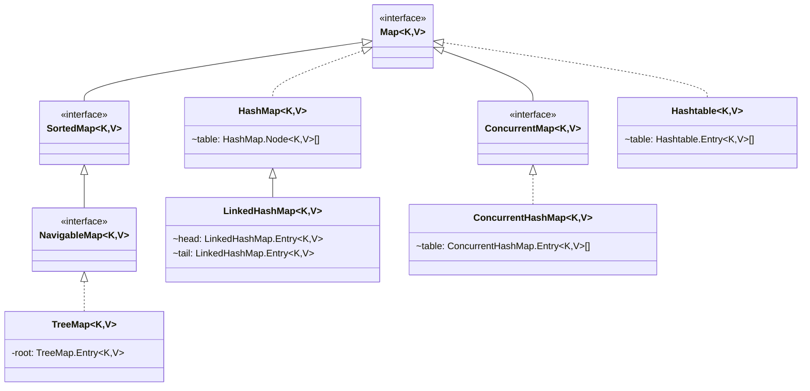

## 集合是什么

> 计算机科学中, 集合的定义是一组可变数量的数据项（也可能为 0 个）的组合, 这些数据项可能共享某些特征, 需要以某种操作方式一起进行操作

Java 集合框架是一个用来代表和操纵集合的统一架构, 它提供了一套性能优良, 使用方便的接口和类, Java 集合框架位于 `java.util` 包中

Java 集合也可以称为容器, 主要由两大接口派生而来: `java.util.Collection` 以及 `java.util.Map`, 其中 Collection 主要存放单个的数据对象, 而 Map 主要存放 key-value 的键值对对象

集合应用场景:

- 无法预测存储数据的数量: 由于数组容量是确定的, 因此集合存储不定量的数据更合适
- 存储具有关系的数据: 比如<打工人-工资>的关系, 就可以使用 Map 来处理
- 数据去重: 使用数组来实现去重的效率低, 而 Set 集合本身就具有元素不可重复的性质
- 数据的操作: 数组不能方便的处理元素增删、移动等操作

::: tip

如果没有特殊说明, 给出的代码均来自 JDK 1.8 版本

:::

## Collection

`java.util.Collection` 定义了一些集合的基本操作:

```java
public interface Collection<E> extends Iterable<E> {

    // 添加一个类型为E的元素
    boolean add(E e);

    // 添加一个类型为E的元素集合
    boolean addAll(Collection<? extends E> c);

    // 清空集合
    boolean void clear();

    // 判断集合是否包含给定的元素
    boolean contains(Object o);

    // 判断集合是否包含给定集合里的所有元素
    boolean containsAll(Collection<E> c);

    // 判断集合是否为空
    boolean isEmpty();

    // 从集合移除给定的元素
    boolean remove(Object o);

    // 从集合移除给定集合的所有元素
    boolean removeAll(Collection<?> c);

    // 集合的元素数量
    int size();

    // 转换为数组对象
    Object[] toArray();

    // 转换为指定类型的数组对象
    <T> T[] toArray(T[] a);

    // 重写父类方法
    @Override
    default Spliterator<E> spliterator() {
        return Spliterators.spliterator(this, 0);
    }

    // 创建一个流
    default Stream<E> stream() {
        return StreamSupport.stream(spliterator(), false);
    }

    // 创建一个并行流
    default Stream<E> parallelStream() {
        return StreamSupport.stream(spliterator(), true);
    }
}
```

上面代码可以看到 `java.util.Collection` 继承自 `java.util.Iterable`, 它提供了标准的迭代器模型, 定义了如下方法:

```java
public interface Iterable<E> {

    // 返回一个对象类型为E的迭代器
    Iterator<E> iterator();

    // 为每个元素都执行给定的操作
    default void forEach(Consumer<? super E> action) {
        Object.requireNonNull(action);
        for (E e : this) {
            action.accept(e);
        }
    }

    // 返回用于遍历和划分源元素的对象（可用于创建 Stream 对象）
    default Spliterator<E> spliterator() {
        return Spliterators.spliteratorUnknowSize(iterator(), 0);
    }
}
```

::: info Java 迭代器

Java 迭代器是 Java 集合框架中的一种机制, 是一种用于遍历集合的接口, 它提供了一种统一的方式来访问集合中的元素, 而不需要了解底层集合的具体实现细节

Java Iterator 比较常用的方法有如下几个:

```java
publi interface Iterator<E> {

    // 判断是否有后续元素
    boolean hasNext();

    // 获取后续元素
    E next();

    // 删除迭代器返回的最后一个元素
    default void remove() {
        throw new UnsupportedOperationException("remove");
    }
}
```

Java 迭代器不是集合, 而是一种访问集合的方法, 并且是单向遍历的机制, 只能从前往后遍历集合中的元素, 不能往回遍历

在使用迭代器遍历集合时, 不能直接修改集合中的元素, 而是需要使用迭代器的 `remove()` 方法来删除当前元素

:::

在 Collection 的基础上又定义了 3 种接口类, 分别是:

- List: 序列, 按照一定的顺序保存元素且可以重复
- Set: 集, 元素不能重复
- Queue: 队列, 按照排队规则来确定元素的顺序, 可以重复

它们以不同的方式操作集合对象, 而在它们的基础上还有不同的实现类: ArrayList、LinkedList、HashSet、TreeSet 等

以下是 Collection 的类图关系:


### List

List 接口是一个有序的集合, 它允许使用者像数组一样添加和删除元素

List 在 Collection 的基础上拓展了一些方法:

```java
public interface List<E> extends Collection<E> {

    // 添加元素到指定索引位置
    void add(int index, E e);

    // 添加整个集合的元素到指定索引位置
    boolean addAll(int index, Collection<? extends E> c);

    // 获取指定索引位置的元素
    E get(int index);

    // 获取元素的索引
    int indexOf(Object o);

    // 获取元素的最后一个索引位置（倒数的第一个索引）
    int lastIndexOf(Object o);

    // 返回类型为E的元素迭代器
    ListIterator<E> listIterator();

    // 返回类型为E的包含指定索引位置之后元素的的迭代器
    ListIterator<E> listIterator(int index);

    // 移除指定索引位置的元素
    E remove(int index);

    // 将集合的所有元素都替换成给定操作执行的结果
    void replaceAll(UnaryOperator<E> operator);

    // 将元素放至指定索引处
    E set(int index, E e);

    // 对集合的元素进行排序
    default void sort(Comparator<? super E> c) {
        Object[] a = this.toArray();
        Arrays.sort(a, (Comparator) c);
        ListIterator<E> li = this.listIterator();
        for (Object e : a) {
            i.next();
            i.set((E) e);
        }
    }

    // 截取从 from 到 to 的子列表
    List<E> subList(int from, int to);
}
```

#### List 的实现类

##### ArrayList

ArrayList 的底层是数组队列, 相当于动态数组（与数组相比, 它的长度能动态增长）. 在添加大量元素前, 其底层实现使用 `ensureCapacity` 操作来增加 ArrayList 对象的容量, 这样可以减少递增式再分配的数量

```java
// 部分源码
public class ArrayList<E> extends AbstractList<E>
        implements List<E>, RandomAccess, Cloneable, java.io.Serializable {

    /**
     * 默认初始容量大小
     */
    private static final int DEFAULT_CAPACITY = 10;

    /**
     * 空数组（用于空实例）
     */
    private static final Object[] EMPTY_ELEMENTDATA = {};

    /**
     * 用于默认大小空实例的共享空数组实例
     * 我们把它从EMPTY_ELEMENTDATA数组中区分出来, 以知道在添加第一个元素时容量需要增加多少
     */
    private static final Object[] DEFAULTCAPACITY_EMPTY_ELEMENTDATA = {};

    /**
     * 保存ArrayList数据的数组
     */
    transient Object[] elementData; // 非私有, 以简化嵌套类访问

    /**
     * ArrayList 所包含的元素个数
     */
    private int size;
}
```

ArrayList 的族谱:

- `List`: 说明它是一个列表, 支持添加、删除、查找等操作, 并且支持通过下标访问
- `RandomAccess`: 这是一个标记接口, 说明实现这个接口的子类是支持 **快速随机访问** 的
- `Cloneable`: 说明它支持拷贝操作
- `Serializable`: 说明它可以进行序列化操作

ArrayList 有三种方式来初始化:

- 无参构造函数: 创建一个默认容量为0的空列表
- 带初始容量参数的构造函数: 创建一个指定容量的列表
- 使用集合创建的构造函数: 使用给定的集合创建一个列表

::: tip

1. ArrayList 的底层是 Object[], 也就是说它是可以存储任意对象的, 包括 null 值. 但实际开发中一般避免这种情况以免代码发生 NPE
2. 使用无参构造函数创建 ArrayList 时, 实际上是一个空数组, 在第一次调用 `add(E)` 方法时才会真正的分配容量, 分配后的容量为 10
3. ArrayList 是线程不安全的, 所以它适用于频繁的查找工作. 而 Vector 是古早的实现类, 底层同样适用 Object[], 但是线程安全

:::

ArrayList 的扩容机制

```java{36}
/**
 * 要分配的最大数组大小
 */
private static final int MAX_ARRAY_SIZE = Integer.MAX_VALUE - 8;

// 根据给定的最小容量和当前数组元素来计算所需容量
private static int calculateCapacity(Object[] elementData, int minCapacity) {
    // 如果当前数组元素为空数组（初始情况）, 返回默认容量和最小容量中的较大值作为所需容量
    if (elementData == DEFAULTCAPACITY_EMPTY_ELEMENTDATA) {
        return Math.max(DEFAULT_CAPACITY, minCapacity);
    }
    // 否则直接返回最小容量
    return minCapacity;
}

// 确保内部容量达到指定的最小容量
private void ensureCapacityInternal(int minCapacity) {
    ensureExplicitCapacity(calculateCapacity(elementData, minCapacity));
}

// 判断是否需要扩容
private void ensureExplicitCapacity(int minCapacity) {
    modCount++;
    // 判断当前数组容量是否足以存储minCapacity个元素
    if (minCapacity - elementData.length > 0)
        // 调用grow方法进行扩容
        grow(minCapacity);
}

// 扩容的核心方法
private void grow(int minCapacity) {
    // oldCapacity 为旧容量, newCapacity 为新容量
    int oldCapacity = elementData.length;
    // 将 oldCapacity 右移一位, 其效果相当于 oldCapacity / 2,
    // 我们知道位运算的速度远远快于整除运算, 整句运算式的结果就是将新容量更新为旧容量的1.5倍
    int newCapacity = oldCapacity + (oldCapacity >> 1);

    // 然后检查新容量是否大于最小需要容量, 若还是小于最小需要容量, 那么就把最小需要容量当作数组的新容量
    if (newCapacity - minCapacity < 0)
        newCapacity = minCapacity;

    // 如果新容量大于 MAX_ARRAY_SIZE, 执行 `hugeCapacity()` 方法来比较 minCapacity 和 MAX_ARRAY_SIZE,
    // 如果 minCapacity 大于最大容量, 则新容量则为 `Integer.MAX_VALUE`, 否则, 新容量大小则为 MAX_ARRAY_SIZE 即为 `Integer.MAX_VALUE - 8`
    if (newCapacity - MAX_ARRAY_SIZE > 0)
        newCapacity = hugeCapacity(minCapacity);

    // minCapacity is usually close to size, so this is a win:
    elementData = Arrays.copyOf(elementData, newCapacity);
}

// 添加元素的方法
public boolean add(E e) {
    ensureCapacityInternal(size + 1);  // Increments modCount!!
    //这里看到ArrayList添加元素的实质就相当于为数组赋值
    elementData[size++] = e;
    return true;
}
```

假设现在通过无参构造函数创建一个列表, 它初始的 `elementData.length` 为 0

- 向列表中添加一个元素, 因为第一次调用 `calculateCapacity()`, 此时函数返回默认容量大小 10, 在函数 `ensureExplicitCapacity()` 中, `minCapacity - elementData.length > 0` 成立, 所以会调用 `grow()` 方法, 函数调用链: `add(E)` -> `ensureCapacityInternal()` -> `calculateCapacity()` -> `ensureExplicitCapacity()` -> `grow()`
- 再次向列表中添加一个元素, 此时 `minCapacity` 为 2, 而 `elementData.length` 已经变成了 10, `minCapacity - elementData.length > 0` 不成立, 所以不会执行 `grow()` 方法
- 依次向列表中添加第3、第4...第10个元素, 都不会执行 `grow()` 方法
- 直到第11个元素, `minCapacity` 为 11, 而 `elementData.length` 为 10, 此时又会进入 `grow()` 方法进行扩容

新的容量是通过 `oldCapacity + (oldCapacity >> 1)` 计算得出的, 这个值可以近似看成原本值的 1.5 倍, 因为 `>>` 的右移计算相当于数值原本的 1/2, 在奇数的情况下会丢掉小数(11 + 11/2 = 16)

::: info ensureCapacity 方法

理论上来说, 在向 ArrayList 中添加大量元素之前最好使用 `ensureCapacity()` 方法, 来减少扩容的分配次数

```java
public void ensureCapacity(int minCapacity) {
    int minExpand = (elementData != DEFAULTCAPACITY_EMPTY_ELEMENTDATA)
        // any size if not default element table
        ? 0
        // larger than default for default empty table. It's already
        // supposed to be at default size.
        : DEFAULT_CAPACITY;

    if (minCapacity > minExpand) {
        ensureExplicitCapacity(minCapacity);
    }
}
```

:::

##### LinkedList

LinkedList 是一个基于双向链表实现的集合类

```java
// 部分源码
public class LinkedList<E>
    extends AbstractSequentialList<E>
    implements List<E>, Deque<E>, Cloneable, java.io.Serializable {

}
```

LinkedList 的族谱:

- `List`: 说明它是一个列表, 支持添加、删除、查找等操作, 并且支持通过下标访问
- `Deque`: 继承自 `Queue` 接口, 具有双端队列的特性, 支持从两端插入和删除元素, 方便实现栈和队列等数据结构
- `Cloneable`: 说明它支持拷贝操作
- `Serializable`: 说明它可以进行序列化操作

LinkedList 中的元素是其内部类定义的

```java
private static class Node<E> {
    E item;// 节点值
    Node<E> next; // 指向的下一个节点（后继节点）
    Node<E> prev; // 指向的前一个节点（前驱结点）

    // 初始化参数顺序分别是: 前驱结点、本身节点值、后继节点
    Node(Node<E> prev, E element, Node<E> next) {
        this.item = element;
        this.next = next;
        this.prev = prev;
    }
}
```

::: tip

1. LinkedList 插入和删除的时间复杂度?

   - 头部插入/删除、尾部插入/删除: 只需要修改头、尾结点即可完成插入/删除操作, 时间复杂度为 $\mathcal{O}(1)$
   - 指定位置插入/删除: 需要移动到指定位置, 再修改指定结点的指针完成插入/删除操作, 因此需要移动平均 n/2 个元素, 时间复杂度为 $\mathcal{O}(n)$

2. LinkedList 为什么不能实现 RandomAccess 接口?

   LinkedList 底层数据结构是链表, 内存地址不连续, 只能通过指针来定位, 不支持随机快速访问, 所以不能实现 RandomAccess 接口

:::

##### ArrayList 与 LinkedList 的区别

- 线程安全: `ArrayList` 和 `LinkedList` 都不能保证线程安全
- 底层数据结构:
  - `ArrayList` 底层使用的是 **Object 数组**
  - `LinkedList` 底层使用的是 **双向链表**[^first]
- 插入/删除是否受元素位置影响:
  - `ArrayList` 采用数组存储, 插入和删除元素的时间复杂度受元素位置的影响, 在执行 `add(E e)` 时的时间复杂度是 $\mathcal{O}(1)$; 而在指定位置插入和删除的话, 因为第i个元素和第i-1个元素都要执行移位的操作, 所以时间复杂度为 $\mathcal{O}(n)$
  - `LinkedList` 采用链表存储, 在头尾插入和删除元素的时间复杂度不受元素位置的影响, 时间复杂度都为 $\mathcal{O}(1)$; 而在指定位置插入和删除的话, 因为需要先移动到指定位置再执行插入和删除, 所以时间复杂度为 $\mathcal{O}(n)$
- 是否支持快速随机访问:
  - `ArrayList` 实现了 `RandomAccess` 接口说明其支持快速随机访问
  - `LinkedList` 不支持随机元素访问
- 内存空间占用:
  - `ArrayList` 的空间浪费主要体现在列表的结尾会预留一定的容量空间
  - `LinkedList` 的空间花费主要体现在它每一个元素都要存放前驱和后继对象, 所以它比 ArrayList 要消耗更多的空间

[^first]: JDK1.6 之前为循环链表, JDK1.7 取消了循环

### Set

Set 接口允许使用者将元素存储在不同的集合中, 类似于数学中的集合, 且它不能有重复的元素

### Queue

Queue 接口支持以先进先出的方式存储和访问元素

## Map

Map 是一个接口, 它定义了一种特定的数据结构, 即键值对（key-value pairs）的集合. 在Map中, 每个键都映射到一个值, 且键是唯一的. 这意味着在一个Map中, 你不能有两个相同的键, 但可以有多个相同的值

Map 的特点:

- **无序性**: 与 List 或 Set 等集合不同, Map 中的元素（键值对）是无序的, 即它们的存储和迭代顺序可能与插入顺序不同
- **键的唯一性**: Map 中的键必须是唯一的, 不能有两个相同的键. 如果尝试插入具有相同键的新值, 那么旧的值将被新值覆盖
- **值的可重复性**: 与键不同, Map 中的值可以是重复. 也就是说, 可以有多个键值对具有相同的值

::: tip Map 对于 null 值的处理

Map 本身是支持 null 键以及 null 值的

- 对与 null 建: `HashMap`、`LinkedHashMap` 和 `TreeMap` 都是支持 null 键的, 但使用 null 键时必须确保其在 Map 中是唯一的, 因为 Map 的键必须是唯一的
- 对于 null 值: 所有的 Map 实现类都允许使用 null 值, 且一个 Map 中可以有多个 null 值

:::

以下是 Map 的类图关系:



### HashMap

HashMap 主要用来存放键值对, 它基于哈希表的 Map 接口实现, 是常用的 Java 集合之一, 是非线程安全的

在 JDK1.8 之前, HashMap 的底层存储是数据加链表实现的, 数组是 HashMap 的主体, 链表则是为了解决哈希冲突而存在的（_拉链法_[^second]）; 而在 JDK1.8 之后, 当链表长度大于阈值（默认值为 8）时, 链表将会转化为红黑树(将链表转换成红黑树前会判断, 如果当前数组的长度小于 64, 那么会选择先进行数组扩容, 而不是转换为红黑树), 以减少搜索时间

[^second]: 拉链法: 将链表和数组相结合. 也就是说创建一个链表数组, 数组中每一格就是一个链表, 若遇到哈希冲突, 则将冲突的值加到链表中即可

HashMap 默认的初始化大小为 16, 之后每次扩充, 容量变为原来的 2 倍, 并且 HashMap 总是使用 2 的幂作为哈希表的大小

::: tip

- loadFactor: 负载因子
  负载因子是控制数组存放数据的疏密程度, loadFactor 越趋近于 1, 那么数组中的数据机会越多、越密集, 也就是会让链表的长度增加; 而 loadFactor 越趋近于 0, 数组中存放的数据就越少、越稀疏

  loadFactor 太大会导致查找元素的效率低, 太小导致数组的利用率低, 存放的数据会很分散. 官方给的 0.75f 是一个比较好的临界值

- threshold: 扩容阈值
  **threshold = capacity × loadFactor**, 当 size > threshold 的时候, 就要考虑对数组的扩容了, 说白了它就是**衡量数组需不需要扩容的一个标准**

  默认容量为 16, 负载因子为 0.75, 不断的向 HashMap 中存放数据, 当数量超过了 16 \* 0.75 = 12 时, 就需要对当前容量进行扩容

:::

HashMap 通过 key 的 `hashCode` 经过扰动函数处理后得到的 hash 值, 然后通过 `(n-1) & hash` 确定当前元素存放的位置（n是数组长度）, 如果当前位置存在元素的话, 就判断该元素与要存入的元素的 hash 值以及 key 是否相同, 如果相同就直接覆盖, 不相同就通过拉链法解决冲突

所谓的扰动函数就是 HashMap 的 `hash` 方法. 使用扰动函数是为了防止一些实现比较差的 `hashCode()` 方法, 其实就是为了减少碰撞

JDK 1.7 和 JDK 1.8 的 `hash` 方法对比:

```java
// ^: 按位异或
// >>> : 无符号右移, 忽略符号位, 空位都以 0 补齐

// JDK 1.8
static final int hash(Object key) {
    int h;
    // key.hashCode(): 返回散列值也就是hashcode
    return (key == null) ? 0 : (h = key.hashCode()) ^ (h >>> 16);
}

// JDK 1.7
static int hash(int h) {
    // 此函数确保在每个位位置仅相差恒定倍数的hashCode具有有限数量的冲突（在默认负载因子下约为8）
    h ^= (h >>> 20) ^ (h >>> 12);
    return h ^ (h >>> 7) ^ (h >>> 4);
}
```

JDK 1.8 的 hash 方法相比于 JDK 1.7 的方法更加简化, 而且性能也更好, 但是它们的原理都不变

::: tip 红黑树

红黑树(Red Black Tree)是一颗自平衡(self-balancing)的二叉排序树(BST), 树上的每一个结点都遵循下面的规则:

- 每一个结点都有一个颜色, 要么红色, 要么黑色
- 树的根结点为黑色
- 每个叶子结点(NULL)都是黑色的
- 树中不存在两个相邻的红色结点（即红色结点的父子结点都不能是红色）
- 从任意一个结点（包括根结点）到其任何后代叶子结点(NULL, 默认是黑色)的每条路径都具有相同数量的黑色结点

因为最后一条规则的限制, 插入的数据总是红色的, 然后通过旋转(左旋\右旋)和变色来保证树平衡, 那么会有下面几种情况:

- 父结点是黑色, 不用调整
- 父结点是红色:
  - 叔结点是空的, 旋转+变色
  - 叔结点是红色, 父结点、叔结点变黑色, 祖父结点变红色
  - 叔结点是黑色, 旋转+变色

JDK 1.8 中 HashMap 的红黑树怎么声明的呢?

```java
static final class TreeNode<K,V> extends LinkedHashMap.Entry<K,V> {
    TreeNode<K,V> parent;  // red-black tree links
    TreeNode<K,V> left;
    TreeNode<K,V> right;
    TreeNode<K,V> prev;    // needed to unlink next upon deletion
    boolean red;
}
```

注意到红黑树继承了 `LinkedHashMap.Entry<K, V>`, 而 `Entry<K, V>` 又是继承自 `HashMap.Node<K, V>` 的:

```java
// LinkedHashMap.Entry<K, V>
static class Entry<K,V> extends HashMap.Node<K,V> {
    Entry<K,V> before, after;
}

// HashMap.Node<K, V>
static class Node<K,V> implements Map.Entry<K,V> {
    final int hash;
    final K key;
    V value;
    Node<K,V> next;
}
```

注意两个属性: `TreeNode<K, V>.prev` 和 `HashMap.Node<K, V>.next`, 这说明 HashMap 中的红黑树同时也是一个双向链表

:::

> TreeMap、TreeSet 以及 JDK1.8 之后的 HashMap 底层都用到了红黑树, 而红黑树就是为了解决二叉查找树的缺陷, 因为二叉查找树在某些情况下会退化成一个线性结构

看一下 `put()` 方法的源码, 了解底层是如何处理链表到红黑树的转换的

```java
// 使用列表而不是树的计数阈值
static final int TREEIFY_THRESHOLD = 8;

// 对列表进行树化的最小阈值
static final int MIN_TREEIFY_CAPACITY = 64;

public V put(K key, V value) {
    return putVal(hash(key), key, value, false, true);
}

final V putVal(int hash, K key, V value, boolean onlyIfAbsent, boolean evict) {
    Node<K,V>[] tab; Node<K,V> p; int n, i;
    if ((tab = table) == null || (n = tab.length) == 0)
        n = (tab = resize()).length;
    // 如果计算出的数组位置上没有元素
    if ((p = tab[i = (n - 1) & hash]) == null)
        // 创建一个新的结点并存入
        tab[i] = newNode(hash, key, value, null);
    // 如果计算出的数组位置上有元素
    else {
        Node<K,V> e; K k;
        // 且 hash 和 key 都相同, 那么就覆盖
        if (p.hash == hash && ((k = p.key) == key || (key != null && key.equals(k))))
            e = p;
        else if (p instanceof TreeNode)
            // 插入红黑树
            e = ((TreeNode<K,V>)p).putTreeVal(this, tab, hash, key, value);
        else {
            // for 循环遍历链表
            for (int binCount = 0; ; ++binCount) {
                // 遍历到最后一个结点
                if ((e = p.next) == null) {
                    // 尾插法插入数据
                    p.next = newNode(hash, key, value, null);
                    // 当链表元素个数大于等于8个的时候
                    if (binCount >= TREEIFY_THRESHOLD - 1) // -1 for 1st
                        // 转换红黑树（并不是执行了方法就会变成红黑树）
                        treeifyBin(tab, hash);
                    break;
                }
                if (e.hash == hash && ((k = e.key) == key || (key != null && key.equals(k))))
                    break;
                p = e;
            }
        }
        // 找到一个已经存在的 key 然后替换原本的 value 并返回
        if (e != null) { // existing mapping for key
            V oldValue = e.value;
            if (!onlyIfAbsent || oldValue == null)
                e.value = value;
            afterNodeAccess(e);
            return oldValue;
        }
    }
    ++modCount;
    // 添加元素后的数组长度大于扩容阈值了会触发 resize() 进行扩容
    if (++size > threshold)
        resize();
    afterNodeInsertion(evict);
    return null;
}

final void treeifyBin(Node<K,V>[] tab, int hash) {
    int n, index; Node<K,V> e;
    // 判断当前列表的长度是否达到了转换成树的阈值(64)
    if (tab == null || (n = tab.length) < MIN_TREEIFY_CAPACITY)
        /*
         * 如果长度小于 64, 那么只是对数组进行扩容. resize 会重新 hash,
         * 原本的链表的元素有可能变少, 也可以说一定程度上优化了存取性能
         */
        resize();
    else if ((e = tab[index = (n - 1) & hash]) != null) {
        // 数组长度大于 64, 转换成红黑树
        TreeNode<K,V> hd = null, tl = null;
        do {
            // 转换成 TreeNode
            TreeNode<K,V> p = replacementTreeNode(e, null);
            if (tl == null)
                // TreeNode 的第一个元素(双向链表的第一个结点)
                hd = p;
            else {
                // 这里的 TreeNode 变成了双向链表
                p.prev = tl;
                tl.next = p;
            }
            tl = p;
        } while ((e = e.next) != null);
        if ((tab[index] = hd) != null)
            /*
             * 真正转换的逻辑
             * 首先通过遍历链表, 依次通过 hashcode、compareTo(实现 Comparable<?> 接口)、
             * getClass().getName()、System.identityHashCode() 来比较各个结点的 key 值大小,
             * 构建出红黑树
             * 然后将 TreeNode 中变成了红黑树根结点的元素移动到链表的最前面
             * 最后验证一下红黑树是不是满足规范
             */
            hd.treeify(tab);
    }
}
```

#### 为什么 HashMap 的长的是 2 的幂次方

为了能让 HashMap 存取高效, 应当减少碰撞, 也就是要尽量把数据分配均匀. Hash 值的范围值是 -2147483648 到 2147483647, 大概有 40 亿的映射空间, 只要哈希函数映射得比较均匀松散, 一般应用是很难出现碰撞的. 但是问题是一个 40 亿长度的数组, 内存也是放不下的. 所以这个散列值不能拿来直接用, 一般都会对数组的长度取模运算, 得到的余数才是用来存放对应的数组下标. 而这个计算下标的方法是 `(n - 1) & hash` (n是数组长度)

**在取余(%)操作中, 如果除数是 2 的幂次则等价于与其除数减一的与(&)操作（也就是说 `hash % length == hash & (lenght - 1)`, 前提是 length 是 2 的 n 次方）**, 并且由于采用的是二进制位操作 &, 相对于 % 取余运算能够提高运算效率, 这就解释了为什么 HashMap 的长度是 2 的幂次方

#### 初始化 HashMap 时指定的大小等于它创建后的大小吗?

先说结论, **不等于**

在使用带有 `initialCapacity` 参数的构造方法创建 HashMap 时, 会执行一个 `tableSizeFor()` 的方法, 这个方法的计算结果会被赋值给 `threshold`(扩容时的阈值), 在第一次 put 元素的时候, 触发 `resize()`, 这里的逻辑会将 `threshold` 赋值给 `newCap`(新的容量), 然后再重新计算 `threshold`, 然后再创建 HashMap. 而 `tableSizeFor()` 计算的结果并不等于 `initialCapacity`, 所以初始化 HashMap 时指定的大小不等于它创建后的大小

下面看下源码的实现:

```java
public HashMap(int initialCapacity, float loadFactor) {
    if (initialCapacity < 0)
        throw new IllegalArgumentException("Illegal initial capacity: " +
                                            initialCapacity);
    if (initialCapacity > MAXIMUM_CAPACITY)
        initialCapacity = MAXIMUM_CAPACITY;
    if (loadFactor <= 0 || Float.isNaN(loadFactor))
        throw new IllegalArgumentException("Illegal load factor: " +
                                            loadFactor);
    this.loadFactor = loadFactor;
    this.threshold = tableSizeFor(initialCapacity);
}

/**
 * 这里是很牛逼的操作哦
 *
 * 简单来说这个算法是将给定的值的二进制的最高位通过不断右移使其后面的值全部为 1,
 * 再通过 +1 使其进位, 来得到一个大于 cap 的最小的 2 的幂次方的数
 *
 * n |= n >>> x; 为什么执行5次, 因为 2^5 = 32, 也就是一个 int 的长度,
 * 也就是说不管这个数是多少, 经过这些操作都能使 cap 的二进制值经转换后全变为 1
 */
static final int tableSizeFor(int cap) {
    // 先减一是为了保证 8 16 这种本就是 2 的幂次方的值不被扩大
    int n = cap - 1;
    // 将元素据右移x位并进行或操作
    n |= n >>> 1;
    n |= n >>> 2;
    n |= n >>> 4;
    n |= n >>> 8;
    n |= n >>> 16;
    // 最后保证值不会超过 MAXIMUM_CAPACITY, 然后 +1 来使其变成大于 cap 的最小的 2 的幂次方
    return (n < 0) ? 1 : (n >= MAXIMUM_CAPACITY) ? MAXIMUM_CAPACITY : n + 1;
}

final Node<K,V>[] resize() {
    Node<K,V>[] oldTab = table;
    int oldCap = (oldTab == null) ? 0 : oldTab.length;
    int oldThr = threshold;
    int newCap, newThr = 0;
    // 旧容量大于 0
    if (oldCap > 0) {
        if (oldCap >= MAXIMUM_CAPACITY) {
            threshold = Integer.MAX_VALUE;
            return oldTab;
        }
        // newCap = oldCap << 1 新容量为旧容量的两倍
        else if ((newCap = oldCap << 1) < MAXIMUM_CAPACITY &&
                  oldCap >= DEFAULT_INITIAL_CAPACITY)
            newThr = oldThr << 1; // double threshold
    }
    // 旧容量为 0 但扩容阈值大于 0
    else if (oldThr > 0) // initial capacity was placed in threshold
        // 使用带有初始化大小的构造函数创建 HashMap 第一次扩容就是这里初始化容量的
        // 把旧扩容阈值赋值给新容量
        newCap = oldThr;
    else {               // zero initial threshold signifies using defaults
        // 无参构造函数创建的 HashMap 第一次扩容就是这里初始化容量的
        newCap = DEFAULT_INITIAL_CAPACITY;
        newThr = (int)(DEFAULT_LOAD_FACTOR * DEFAULT_INITIAL_CAPACITY);
    }
    // 新扩容阈值为 0 则通过新容量计算
    if (newThr == 0) {
        float ft = (float)newCap * loadFactor;
        newThr = (newCap < MAXIMUM_CAPACITY && ft < (float)MAXIMUM_CAPACITY ?
                  (int)ft : Integer.MAX_VALUE);
    }
    threshold = newThr;
    // 使用新容量创建一个新的数组
    @SuppressWarnings({"rawtypes","unchecked"})
    Node<K,V>[] newTab = (Node<K,V>[])new Node[newCap];
    table = newTab;
    // 如果原本的数组不为空, 需要将原数据转移至新数组
    if (oldTab != null) {
        for (int j = 0; j < oldCap; ++j) {
            Node<K,V> e;
            if ((e = oldTab[j]) != null) {
                oldTab[j] = null;
                // 原本只有一个结点
                if (e.next == null)
                    // 重新计算数组索引
                    newTab[e.hash & (newCap - 1)] = e;
                // 处理红黑树
                else if (e instanceof TreeNode)
                    /*
                     * 遍历树的元素将它们重新计算 hash 放入新的数组中
                     * 按照和处理链表类似的处理逻辑变成两个链表,
                     * 当新的链表长度小于 6 时, 重新转换为链表,
                     * 否则将其索引指向相应的位置(index 或者 index + oldCap)
                     */
                    ((TreeNode<K,V>)e).split(this, newTab, j, oldCap);
                // 处理链表
                else { // preserve order
                    // 拆分链表 一个low 一个 high
                    Node<K,V> loHead = null, loTail = null;
                    Node<K,V> hiHead = null, hiTail = null;
                    Node<K,V> next;
                    // 遍历链表
                    do {
                        next = e.next;
                        // 拆分的标准
                        if ((e.hash & oldCap) == 0) {
                            if (loTail == null)
                                loHead = e;
                            else
                                loTail.next = e;
                            loTail = e;
                        }
                        else {
                            if (hiTail == null)
                                hiHead = e;
                            else
                                hiTail.next = e;
                            hiTail = e;
                        }
                    } while ((e = next) != null);
                    if (loTail != null) {
                        loTail.next = null;
                        // low 的链表直接在原位置
                        newTab[j] = loHead;
                    }
                    if (hiTail != null) {
                        hiTail.next = null;
                        // high 的链表在原位置+ oldCap 的位置
                        newTab[j + oldCap] = hiHead;
                    }
                }
            }
        }
    }
    return newTab;
  }
```

::: tip 关于拆分标准 (e.hash & oldCap) == 0 和数组下标 j、j+oldCap

首先要知道的是:

- oldCap 一定是 2 的整数次幂, 假设是 $2^m$
- newCap 是 oldCap 的 2 倍, 值是 $2^{m+1}$
- hash 对数组大小取模 `(n - 1) & hash` 其实就是取 hash 的低 $m$ 位

举个栗子, 假设 oldCap = 8, 即 $2^3$, (8 - 1 = 7) 的二进制为 `0000 0000 0000 0000 0000 0000 0000 0111`, 那么 `(8 - 1) & hash` 其实就是取 hash 值的低 3 位, 这里假设为 `abc`, 依次类推, 扩容后的大小为 16, 那么 `(16 - 1) & hash` 其实就是取 hash 的低 4 位, 也就两种情况:

> 0abc
> 1abc

`0abc` 跟原来的 index 值一致, 而 `1abc = 0abc + 1000 = 0abc + oldCap`, 重点来了, 虽然数组大小扩大了一倍, 但是同一个 key 在新旧 table 中对应的数组下标 index 却存在一定的联系: **要么跟以前一致, 要么相差一个 oldCap**

而新旧 index 是否跟原本一致就体现在 hash 的第 3 位(最低位是第0位), 怎么拿到这一位的值呢?

> `hash & 0000 0000 0000 0000 0000 0000 0000 1000`

上面的式子不就是 `hash & 8`, 而 8 不就是原本的数组长度吗, 所以:

> 如果 `(e.hash & oldCap) == 0` 则该节点在新数组的下标与原数组一致都为 `j`
> 如果 `(e.hash & oldCap) == 1` 则该节点在新数组的下标为原数组下标 `j + oldCap`

根据这个条件将原始的链表拆分为两个链表, 然后一次性将整个链表存入到新的数组中

:::

有个特殊情况需要注意下, 若指定初始容量为 0 或者 1 来创建 HashMap 时, 第一次调用 `put()` 方法时会触发两次 `resize()`, 因为不管指定容量为 0 还是 1 , 经 `tableSizeFor()` 方法计算出来的初始容量都为 1, 也就是说第一次执行 `resize()` 方法后数组的容量为 1 而 `threshold` 为 0, 在 `putVal()` 方法最后会判断一次 `++size > threshold`, 而此时条件成立`(size=1,threshold=0)`会再次执行 `resize()` 方法, 完成后数组的容量变为 2

#### HashMap 多线程操作导致死循环

JDK 1.7 及之前版本的 HashMap 在多线程环境下扩容操作可能存在死循环问题. 首先需要知道的是 JDK 1.7 链表采用的是头插法添加元素, 而在一个位置上有多个元素需要进行扩容时, 多个线程同时对链表进行操作, 头插法可能会导致链表中的结点指向错误的位置, 从而形成一个环形链表, 使得查询元素的操作陷入死循环. 可以在搜索引擎上查询关键字 [`HashMap Infinite Loop`](https://cn.bing.com/search?q=HashMap+Infinite+Loop) 了解更多

为了解决这个问题, JDK 1.8 的 HashMap 采用了尾插法来避免链表倒置, 避免变成环型结构. 但是依旧不建议在多线程中使用 HashMap, 会存在数据覆盖、不准确的问题

::: tip

- 头插法: 将元素插在链表头部

  - 做法是直接将新元素作为头结点, next 指向旧的头结点, 所以插入速度快
  - 因为头结点每次都会变化, 也就是最新的, 所以遍历是按照插入的相反顺序进行的
  - 因为头结点不断变化, 所以需要额外的维护头结点的引用

- 尾插法: 将元素插在链表尾部
  - 做法是将新元素插入到原本链表的尾部, 需要遍历链表直到某个结点的 next 为 null, 然后将其指向新添加的元素即可
  - 头结点固定不变
  - 遍历顺序就是插入顺序

:::

#### HashMap 为什么多线程不安全

前面也提到了, JDK 1.7 的 HashMap 在多线程下扩容可能会造成死循环和数据丢失问题, 虽然 JDK 1.8 做了改进, 但是依旧不能解决数据丢失的问题

数据丢失是怎么产生的呢?

- 在插入元素的时候, 如果两个线程同时进行 put, 并且发生了哈希冲突
- 不同的线程可能在不同的时间片获得CPU执行的机会, 当前线程1执行完哈希冲突判断后, 由于时间片耗尽挂起, 而线程2先完成了插入操作
- 随后, 线程1获得时间片, 由于之前已经进行过 hash 碰撞的判断, 所以此时会直接进行插入, 这就导致线程2插入的数据被线程1覆盖了

#### HashMap 的遍历方式

- 使用迭代器的方式遍历
  - 迭代器的 EntrySet
  - 迭代器的 KeySet
- ForEach方式遍历
  - ForEach EntrySet
  - ForEach KeySet
- 使用 Lambda 表达式遍历
- 使用 Stream API 遍历
  - Stream API 单线程遍历
  - Stream API 多线程遍历

### Hashtable

`Hashtable`类也是实现`Map`接口的一个类, 它提供了线程安全的哈希表实现. 与`HashMap`相比, `Hashtable`的主要区别在于它的线程安全性

`Hashtable`的一些特点和使用方法:

1. **线程安全性**: `Hashtable`是线程安全的, 因为它的大多数方法（如`put`、`get`、`remove`等）都是同步的. 这意味着在多线程环境中, 多个线程可以安全地同时访问和修改`Hashtable`, 而不需要额外的同步措施
2. **性能**: 由于`Hashtable`的同步机制, 它在单线程环境下的性能通常不如`HashMap`. 因为每次只有一个线程能够执行`Hashtable`的方法, 这会导致线程之间的竞争和阻塞, 从而降低程序的执行效率
3. **不允许`null`键和值**: 与`HashMap`不同, `Hashtable`不允许使用`null`作为键（key）或值（value）. 如果尝试插入`null`键或值, `Hashtable`会抛出`NullPointerException`
4. **失败率**: `Hashtable`使用了一种称为“失败率”的机制来处理哈希冲突. 当两个不同的键具有相同的哈希码时, `Hashtable`会将这些键存储在不同的桶（bucket）中, 以确保每个键都能被唯一地定位

下面是一个`Hashtable`的简单使用示例:

```java
import java.util.Hashtable;

public class HashtableExample {
    public static void main(String[] args) {
        // 创建一个Hashtable实例
        Hashtable<String, Integer> table = new Hashtable<>();

        // 向Hashtable中添加键值对
        table.put("apple", 1);
        table.put("banana", 2);
        table.put("orange", 3);

        // 获取键对应的值
        int appleCount = table.get("apple");
        System.out.println("Apple count: " + appleCount); // 输出: Apple count: 1

        // 检查Hashtable中是否包含某个键
        boolean hasBanana = table.containsKey("banana");
        System.out.println("Has banana: " + hasBanana); // 输出: Has banana: true

        // 遍历Hashtable
        for (Map.Entry<String, Integer> entry : table.entrySet()) {
            System.out.println("Key: " + entry.getKey() + ", Value: " + entry.getValue());
        }
    }
}
```

虽然 `Hashtable` 是线程安全的, 但 Java 5 及更高版本引入了 `ConcurrentHashMap` 类, 它提供了更高的并发性能, 是处理并发哈希表操作的推荐选择
