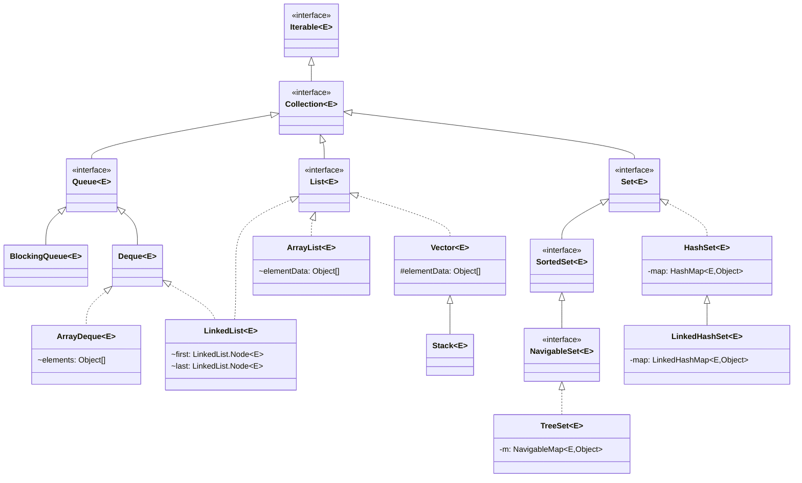
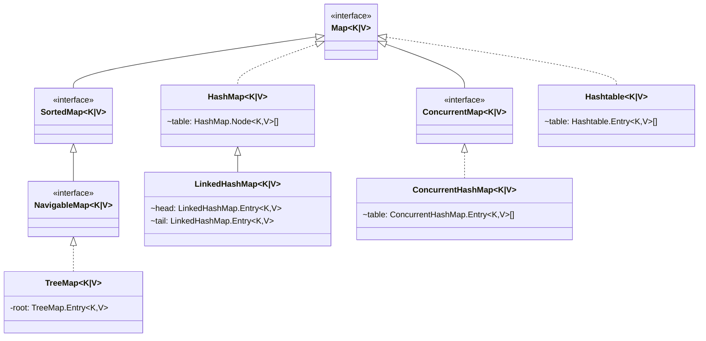

## 集合是什么

> 计算机科学中, 集合的定义是一组可变数量的数据项（也可能为 0 个）的组合, 这些数据项可能共享某些特征, 需要以某种操作方式一起进行操作

Java 集合框架是一个用来代表和操纵集合的统一架构, 它提供了一套性能优良，使用方便的接口和类，Java 集合框架位于 `java.util` 包中

Java 集合也可以称为容器, 主要由两大接口派生而来: `java.util.Collection` 以及 `java.util.Map`, 其中 Collection 主要存放单个的数据对象, 而 Map 主要存放 key-value 的键值对对象

集合应用场景:

- 无法预测存储数据的数量: 由于数组容量是确定的, 因此集合存储不定量的数据更合适
- 存储具有关系的数据: 比如<打工人-工资>的关系, 就可以使用 Map 来处理
- 数据去重: 使用数组来实现去重的效率低, 而 Set 集合本身就具有元素不可重复的性质
- 数据的操作: 数组不能方便的处理元素增删、移动等操作

::: tip

如果没有特殊说明, 给出的代码均来自 JDK 1.8 版本

:::

## Collection

`java.util.Collection` 定义了一些集合的基本操作:

```java
public interface Collection<E> extends Iterable<E> {

    // 添加一个类型为E的元素
    boolean add(E e);

    // 添加一个类型为E的元素集合
    boolean addAll(Collection<? extends E> c);

    // 清空集合
    boolean void clear();

    // 判断集合是否包含给定的元素
    boolean contains(Object o);

    // 判断集合是否包含给定集合里的所有元素
    boolean containsAll(Collection<E> c);

    // 判断集合是否为空
    boolean isEmpty();

    // 从集合移除给定的元素
    boolean remove(Object o);

    // 从集合移除给定集合的所有元素
    boolean removeAll(Collection<?> c);

    // 集合的元素数量
    int size();

    // 转换为数组对象
    Object[] toArray();

    // 转换为指定类型的数组对象
    <T> T[] toArray(T[] a);

    // 重写父类方法
    @Override
    default Spliterator<E> spliterator() {
        return Spliterators.spliterator(this, 0);
    }

    // 创建一个流
    default Stream<E> stream() {
        return StreamSupport.stream(spliterator(), false);
    }

    // 创建一个并行流
    default Stream<E> parallelStream() {
        return StreamSupport.stream(spliterator(), true);
    }
}
```

上面代码可以看到 `java.util.Collection` 继承自 `java.util.Iterable`, 它定义了如下方法:

```java
public interface Iterable<E> {

    // 返回一个对象类型为E的迭代器
    Iterator<E> iterator();

    // 为每个元素都执行给定的操作
    default void forEach(Consumer<? super E> action) {
        Object.requireNonNull(action);
        for (E e : this) {
            action.accept(e);
        }
    }

    // 返回用于遍历和划分源元素的对象（可用于创建 Stream 对象）
    default Spliterator<E> spliterator() {
        return Spliterators.spliteratorUnknowSize(iterator(), 0);
    }
}
```

::: info Java 迭代器

Java 迭代器是 Java 集合框架中的一种机制, 是一种用于遍历集合的接口, 它提供了一种统一的方式来访问集合中的元素, 而不需要了解底层集合的具体实现细节

Java Iterator 比较常用的方法有如下几个:

```java
publi interface Iterator<E> {

    // 判断是否有后续元素
    boolean hasNext();

    // 获取后续元素
    E next();

    // 删除迭代器返回的最后一个元素
    default void remove() {
        throw new UnsupportedOperationException("remove");
    }
}
```

Java 迭代器不是集合, 而是一种访问集合的方法, 并且是单向遍历的机制, 只能从前往后遍历集合中的元素, 不能往回遍历

在使用迭代器遍历集合时, 不能直接修改集合中的元素, 而是需要使用迭代器的 `remove()` 方法来删除当前元素

:::

在 Collection 的基础上又定义了 3 种接口类, 分别是:

- List: 序列, 按照一定的顺序保存元素且可以重复
- Set: 集, 元素不能重复
- Queue: 队列, 按照排队规则来确定元素的顺序, 可以重复

它们以不同的方式操作集合对象, 而在它们的基础上还有不同的实现类: ArrayList、LinkedList、HashSet、TreeSet 等

以下是 Iterable 及其子类的关系图:



### List

List 接口是一个有序的集合, 它允许使用者像数组一样添加和删除元素

List 在 Collection 的基础上拓展了一些方法:

```java
public interface List<E> extends Collection<E> {

    // 添加元素到指定索引位置
    void add(int index, E e);

    // 添加整个集合的元素到指定索引位置
    boolean addAll(int index, Collection<? extends E> c);

    // 获取指定索引位置的元素
    E get(int index);

    // 获取元素的索引
    int indexOf(Object o);

    // 获取元素的最后一个索引位置（倒数的第一个索引）
    int lastIndexOf(Object o);

    // 返回类型为E的元素迭代器
    ListIterator<E> listIterator();

    // 返回类型为E的包含指定索引位置之后元素的的迭代器
    ListIterator<E> listIterator(int index);

    // 移除指定索引位置的元素
    E remove(int index);

    // 将集合的所有元素都替换成给定操作执行的结果
    void replaceAll(UnaryOperator<E> operator);

    // 将元素放至指定索引处
    E set(int index, E e);

    // 对集合的元素进行排序
    default void sort(Comparator<? super E> c) {
        Object[] a = this.toArray();
        Arrays.sort(a, (Comparator) c);
        ListIterator<E> li = this.listIterator();
        for (Object e : a) {
            i.next();
            i.set((E) e);
        }
    }

    // 截取从 from 到 to 的子列表
    List<E> subList(int from, int to);
}
```

#### List 的实现类

ArrayList

LinkedList

### Set

Set 接口允许使用者将元素存储在不同的集合中, 类似于数学中的集合, 且它不能有重复的元素

### Queue

Queue 接口支持以先进先出的方式存储和访问元素

## Map



### HashMap

### Hashtable
