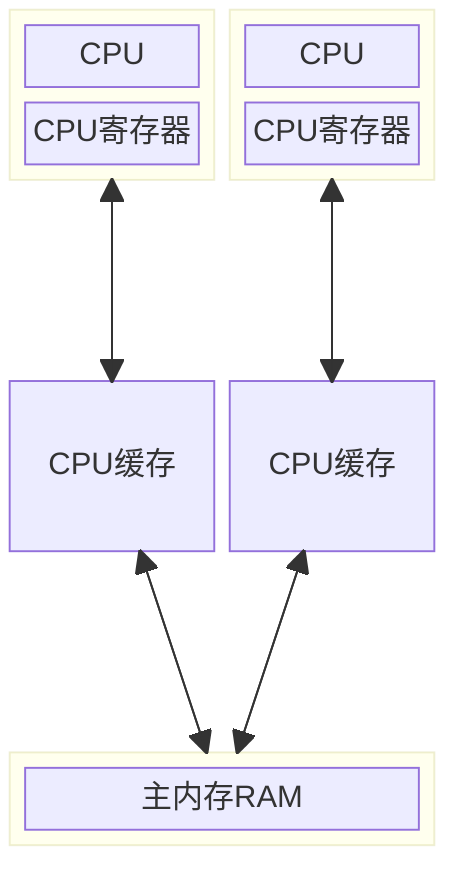

## 基本概念

### 进程、线程、纤程(协程/虚拟线程)

- 进程:
  - 在操作系统中, 进程是基本的资源分配单位, 操作系统通过进程来管理计算机的资源, 如 CPU、内存、磁盘等
  - 每个进程在操作系统中都有一个唯一的进程标识符: PID, 用于区分不同的进程
- 线程:
  - 线程是操作系统中的基本执行单元, 它是进程中的一个实体, 是 CPU 调度和分派的基本单位
  - 一个进程可以包含多个线程, 每个线程都可以独立执行不同的任务, 但它们共享进程的资源
- 纤程:
  - 纤程可以在一个线程内创建多个纤程, 这些纤程之间共享同一个线程的资源
  - 纤程是在同一个进程内部运行的, 不需要操作系统的介入, 可以在用户空间内实现写作式多任务助理. 因此纤程的创建和开销很小, 可以高效的利用系统资源

> 可以想象一下, 把进程当成一个饭店, 把线程当成饭店里面的饭桌, 每个饭桌可以点不一样的菜, 但是都可以共享饭店的服务员、厨师, 饭桌的多少决定客户的处理效率, 而纤程就可以理解为座椅

### 并发、并行、串行

- 并发(Concurrent), 在操作系统中, 是指一个时间段中有几个程序都处于已启动运行到运行完毕之间, 且这几个程序都是在同一个处理机上运行
- 并行(Parallel), 当系统有一个以上 CPU 时, 当一个 CPU 执行一个进程时, 另一个 CPU 可以执行另一个进程, 两个进程互不抢占 CPU 资源, 可以同时进行, 这种方式我们称之为并行(Parallel)
- 串行(serial), 系统中的几个程序按照顺序一个一个执行

> 再来想象一下, 并发就是饭店里面一个厨师给很多桌做菜(雨露均沾), 并行就是饭店里面的3个厨师分别给3桌做菜, 串行就是饭店只有一个服务员, 只能一桌一桌点菜

### 上下文切换

多线程往往会比单线程更快, 更能提高并发, 但是提高并发并不意味着启动更多的线程来执行, 因为更多的线程意味着线程创建的开销更大、上下文切换更频繁, 程序反而不能支持更多的 TPS

多任务系统往往需要同时执行多道作业, 作业数往往大于机器 CPU 数, 然而一颗 CPU 同时只能执行一项任务, 如何让用户感觉这些任务正在同时运行呢? 操作系统的设计者巧妙地利用了 **时间片轮转** 的方式来解决这个问题

时间片: 时间片是 CPU 分配给各个任务(线程)的时间

> 单核 CPU 为何支持多线程? 给每个进程分配时间片以及上下文切换来达到雨露均沾的效果, 从宏观上给用户感觉就是在多线程同时执行的错觉

线程上下文是指某一时间点 CPU 寄存器和程序计数器的内容, CPU 通过时间片分配算法来循环执行线程任务, 因为时间片非常短, 所以 CPU 通过不停地切换线程执行, 所以多核 CPU 一定程度上可以减少上下文切换频率的

- 主动让出 CPU, 比如调用了 sleep(), wait() 等
- 时间片用完, 因为操作系统要防止一个线程或者进程长时间占用 CPU 导致其他线程或者进程饿死
- 调用了阻塞类型的系统中断, 比如请求 IO, 线程被阻塞

上面三种情况都会发生线程切换, 线程切换意味着需要保存当前线程的上下文, 以便等到下次得到 CPU 的时候能恢复现场, 并加载下一个将要占用 CPU 的线程上下文, 这就是上下文切换

## Java 中的线程

### 如何创建线程

创建线程的方式有很多种, 比如实现 `Runnable`、`Callable` 接口、继承 `Thread` 类、创建线程池、使用 `CompletableFuture` 类等等, 不过这些方式并没有真正创建出线程, 准确来说这些都是使用线程的方法, 而非创建

严格来说, `Java` 创建线程的方式只有一种, 就是通过 `new Thread().start()` 创建的, 因为不管基于那种方式, 最终还是依赖于 `new Thread().start()`

> 这里其实涉及到一个 `线程体` 的概念, 它指在线程里面运行的那一段代码逻辑, 也就是 `run()` 方法体里面的逻辑, 可以认为 `Runnable`、`Callable` 这些对象其实就是线程体

### 线程的生命周期和状态

`java.lang.Thread` 类中定义了一个枚举类 `State`, 里面定义了 Java 线程拥有的状态:

```java
public enum State {
    // 初始状态, 线程被创建出来但没有立马被调用 `start()` 方法
    NEW,
    // 运行状态, 线程调用了 `start()` 方法等待运行的状态
    RUNNABLE,
    // 阻塞状态, 需要等待锁释放
    BLOCKED,
    // 等待状态, 表示该线程需要等待其他线程做出一些特定动作(通知或者中断)
    WAITING,
    // 超时等待状态, 可以在指定的时间后自行返回而不是像 WAITING 那样一直等待
    TIMED_WAITING,
    // 终止状态, 表示该线程已经运行完毕
    TERMINATED;
}
```

### Thread 类中的方法

| 方法               | 功能                                            | 说明                                                                                                                                                  |
| ------------------ | ----------------------------------------------- | ----------------------------------------------------------------------------------------------------------------------------------------------------- |
| start()            | 启动一个新线程; JVM 调用这个线程的 run 方法     | 调用 start() 方法让线程进入就绪状态, 里面的代码不一定立刻运行(CPU 的时间片还没分到该线程) <br> 该方法只能调用一次                                     |
| run()              | 线程启动后调用该方法                            | 如果构造线程时传递了 Runnable 参数, 那么线程启动后会执行 Runnable 中的 run 方法, 否则默认不执行如何操作, 但是可以通过创建 Thread 的子类来覆盖默认行为 |
| setName(String)    | 给当前线程设定名字                              | 默认是 "Thread-n", 主线程是 "main"                                                                                                                    |
| getName()          | 获取当前线程的名字                              |                                                                                                                                                       |
| currentThread()    | 获取当前线程对象, 代码在哪个线程中执行          | 静态方法 <br> 本地方法                                                                                                                                |
| sleep(long)        | 让当前线程休眠多少秒再继续执行                  | 静态方法 <br> 本地方法 <br> `Thread.sleep(0)` 让操作系统立刻重新进行一次 CPU 竞争                                                                     |
| yeild()            | 提示当前线程调度器尽量让出当前线程对 CPU 的占用 | 静态方法 <br> 本地方法 <br> 调用该方法并不能保证一定会让出 CPU 资源                                                                                   |
| setPriority(int)   | 设置当前线程优先级                              | Java 中的优先级是 1 ~ 10 的整数, 越大优先级越高, 常用的是1, 5, 10                                                                                     |
| getPriority()      | 获取当前线程优先级                              |                                                                                                                                                       |
| interrupt()        | 中断当前线程                                    | 该方法只是给线程设置中断标记, 并不是停止线程                                                                                                          |
| interrupted()      | 判断当前线程是否被中断, 并清除中断标记          | 静态方法                                                                                                                                              |
| isInterrupted()    | 判断当前线程是否被中断, 不清除中断标记          |                                                                                                                                                       |
| join()             | 等待当前线程终止                                | `join()` 实际上是调用 `join(0)`                                                                                                                       |
| isAlive()          | 线程是否存活(还没有运行完成)                    | 本地方法                                                                                                                                              |
| setDaemon(boolean) | 将此线程标记为守护线程或用户线程                | true: 守护线程, false: 用户线程 <br> 通过 `Thread.isDaemon()` 来判断是否是守护线程                                                                    |
| getId()            | 获取线程 id                                     | id 唯一                                                                                                                                               |
| getState()         | 获取线程状态                                    |                                                                                                                                                       |

#### start 和 run 方法

先 `new Thread()` 然后调用 `start()` 方法会启动一个线程并使线程进入就绪状态, 当分配到时间片后就可以开始运行了, 然后执行 `run()` 方法里面的逻辑, 这样才是多线程工作

如果直接调用 `run()` 只是相当于在主线程中调用普通方法, 并不会在新的线程中执行, 这样就不是多线程工作

#### sleep 和 wait 的区别

两者的相同点: 都可以暂停线程的执行

两者的不同点:

- `sleep()` 方法没有释放锁; `wait()` 方法释放了锁
- `sleep()` 通常用于暂停执行, 执行方法会使线程会变成 `TIMED_WAITING` 状态; `wait()` 通常用于线程交互/通信, 需要配合 `synchronized` 使用, 执行方法会使线程会变成 `WAITING` 状态
- `sleep()` 方法执行完成后, 线程会自动苏醒; `wait()` 方法被调用后, 线程不会自动苏醒, 需要别的线程用同一个对象上的 `notify()` 或者 `notifyAll()` 方法, 不过可以使用 `wait(long)` 设置超时后自动苏醒
- `sleep()` 是 `Thread` 类的静态本地方法; `wait()` 是 `Object` 类的本地方法

> 为什么 wait() 方法不定义在 Thread 类中?
>
> `wait()` 的目的是要让获得对象锁的线程实现等待, 会自动释放当前线程占有的对象锁. 每个对象都有对象锁, 既然要释放当前线程占有的对象锁并让其进入 WAITING 状态, 自然是要操作对象(Object)而非当前线程(Thread)了
> <br>
>
> 为什么 sleep() 方法不定义在 Object 类中?
>
> `sleep()` 是要暂停当前线程, 跟对象是没有关系

## JMM 内存模型

::: tip CPU的多核并发缓存架构



:::

JMM 全称为 Java Memory Model, Java 多线程内存模型跟 CPU 缓存模型类似, 是基于 CPU 缓存模型来建立的, Java 线程内存模型是标准化的, 屏蔽了底层不同计算机的区别

可以先看一个简单的 demo:

```java
public static boolean flag = false;

public static void main(String[] args) throws InterruptedException {
    new Thread(() -> {
        System.out.println("waiting data...");
        while (!flag) {

        }
        System.out.println("===== success");
    }).start();

    Thread.sleep(2000);

    new Tread(() -> prepareData());
}

public void prepareData() {
    System.out.println("prepare data...");
    flag = true;
    System.out.println("prepare data end...");
}
```

运行上面的代码后, 会发现第 9 行的代码并没有输出且程序没有退出, 说明 19 行的代码虽然执行了但是并没有影响到第 6 行的判断; 当将变量 `flag` 用 `volatile` 修饰后再运行代码, 程序最终会停止且第 9 行代码也会被执行

### JMM 的原子操作

- `read`: 读取, 从主内存读取数据
- `load`: 载入, 将主内存读取到的数据写入工作内存
- `use`: 使用, 从工作内存读取数据来计算
- `assign`: 赋值, 将计算好的值重新赋值到工作内存中
- `store`: 存储, 将工作内存数据写入主内存
- `write`: 写入, 将 store 过去的变量赋值给主内存中的变量
- `lock`: 锁定, 将主内存变量加锁, 标识为线程独占状态
- `unlock`: 解锁, 将主内存变量解锁, 解锁后其他线程可以锁定该变量

### JMM 缓存不一致问题

`缓存一致性协议(MESI)`: 多个 CPU 从主内存读取一个数据到各自的高速缓存, 当其中某个 CPU 修改了缓存里的数据, 该数据会**马上同步回主内存**, 其他 CPU 通过总线嗅探机制可以感知到数据的变化而将自己缓存里的数据失效

缓存加锁: 缓存锁的核心机制是基于缓存一致性协议来实现的, 一个处理器的缓存回写到内存会导致其他处理器的缓存无效, IA-32 和 Intel 64 处理器使用 MESI 实现缓存一致性协议

### volatile 缓存可见性实现原理

底层实现主要通过汇编 lock 前缀指令, 它会锁定这块内存区域的缓存(缓存行锁定)并写回到主内存

IA-32 和 Intel 64 架构软件开发手册对 lock 指令的解释:

- 会将当前处理缓存行的数据==立即==写回到系统内存
- 这个协会内存的操作会引起在其他 CPU 里缓存了该内存地址的数据无效(MESI 协议)
- 提供内存屏障功能, 使 lock 前后指令不能重排序

### 指令重排序与内存屏障

#### 指令重排序

并发编程的三大特性:

- **原子性**: 一个或多个操作要么全部执行成功, 要么全部执行失败
- **可见性**: 当一个线程对共享变量进行修改后, 其他线程可以立刻看到
- **有序性**: 程序的执行顺序会按照代码的先后顺序执行

volatile 保证可见性与有序性, 但是不保证原子性, 保证原子性需要借助 synchronized 这样的锁机制

指令重排序: 在不影响单线程程序执行结果的前提下, 计算机为了最大限度的发挥机器性能, 会对机器指令重排序优化

源代码->编译器优化重排序->指令级并行重排序->内存系统重排序->最终执行的指令序列

重排序会遵循 `as-if-serial` 与 `happens-before` 原则

#### 内存屏障

Java 规范定义的内存屏障:

| 屏障类型   | 指令示例                 | 说明                                                                   |
| ---------- | ------------------------ | ---------------------------------------------------------------------- |
| LoadLoad   | Load1;LoadLoad;Load2     | 保证 Load1 的读取操作在 Load2 及后续读取操作之前执行                   |
| StoreStore | Store1;StoreStore;Store2 | 在 Store2 及其后的写操作执行前, 保证 Store1 的写操作已经刷新到主内存   |
| LoadStore  | Load1;LoadStore;Store2   | 在 Store2 及其后的写操作执行前, 保证 Load1 的读取操作已经结束          |
| StoreLoad  | Store1;StoreLoad;Load2   | 保证 Store1 的写操作已经刷新到主内存之后, Load2 及其后的读操作才能执行 |

Java 规定 volatile 需要实现的内存屏障:

```java
// StoreStore 屏障
a = 1;  // volatile 写, a 为 volatile 变量
// StoreLoad 屏障
b = a;  // volatile 读
// LoadLoad 屏障
// LoadStore 屏障
```

- 不同 CPU 硬件对于 JVM 的内存屏障规范实现指令不一样
- Intel CPU 硬件级内存屏障指令
  - lfence: 是一种 Load Barrier 读屏障, 实现 LoadLoad 屏障
  - sfence: 是一种 Store Barrier 写屏障, 实现 StoreStore 屏障
  - mfence: 是一种全能型的屏障, 具备 lfence 和 sfence 的能力, 具有所有屏障能力
- JVM 底层简化了内存屏障硬件指令的实现
  - lock 前缀: lock 指令不是一种内存屏障, 但是它能完成类似内存屏障的功能

## 锁机制

### 锁的分类

#### 悲观锁与乐观锁

锁的一种宏观分类方式是悲观锁和乐观锁. 悲观锁与乐观锁并不是特指某个锁（Java 中没有哪个 Lock 实现类就叫PessimisticLock 或 OptimisticLock）, 只是在并发情况下的两种不同策略

悲观锁（Pessimistic Lock）, 就是很悲观, 每次去拿数据的时候都认为别人会修改. 所以每次在拿数据的时候都会上锁, 这样别人想拿数据就被挡住, 直到悲观锁被释放

乐观锁（Optimistic Lock）, 就是很乐观, 每次去拿数据的时候都认为别人不会修改. 所以不会上锁, 不会上锁！但是如果想要更新数据, 会在更新前检查在读取至更新这段时间别人有没有修改过这个数据. 如果修改过就重新读取, 再次尝试更新, 循环上述步骤直到更新成功（当然也允许更新失败的线程放弃操作）

> 悲观锁阻塞事务, 乐观锁回滚重试. 它们各有优缺点, 不能认为一种一定好于另一种. 像乐观锁适用于写比较少的情况下, 即冲突真的很少发生的时候, 这样可以省去锁的开销, 加大了系统的整个吞吐量. 如果经常产生冲突, 上层应用会不断的进行重试, 这样反倒是降低了性能, 这种情况下用悲观锁就比较合适

#### 自旋锁

当一个线程尝试去获取某一把锁的时候, 如果这个锁此时已经被别人获取(占用), 那么此线程就无法获取到这把锁, 该线程将会等待, 间隔一段时间后会再次尝试获取. 这种采用`循环加锁 -> 等待的机制`被称为`自旋锁(spinlock)`

> 刚刚的乐观锁就有类似的无限循环操作, 那它是自旋锁吗？
>
> 不是. 尽管自旋与 while(true) 的操作是一样的, 但还是应该将这两个术语分开. "自旋"这两个字, 特指自旋锁的自旋

#### 可重入锁(递归锁)

可重入锁的字面意思是“可以重新进入的锁”, 即**允许同一个线程多次获取同一把锁**. 比如一个递归函数里有加锁操作, 递归过程中这个锁会阻塞自己吗？如果不会, 那这个锁就是可重入锁（因为这个原因可重入锁也叫做递归锁）

Java 里只要以 `Reentrant` 开头命名的锁都是可重入锁, 而且 JDK 提供的所有现成的 Lock 实现类, 包括 `synchronized` 关键字锁都是可重入的

#### 公平锁和非公平锁

如果多个线程申请一把公平锁, 当锁释放的时候, 先申请的先得到, 非常公平. 如果是非公平锁, 后申请的线程可能先获取到锁, 是随机或者按照其他优先级排序的

对 `ReentrantLock` 类而言, 通过构造函数传参可以指定该锁是否是公平锁, 默认是非公平锁. 一般情况下, 非公平锁的吞吐量比公平锁大, 如果没有特殊要求, 优先使用非公平锁

对于 `synchronized` 而言, 它也是一种非公平锁, 但是并没有任何办法使其变成公平锁

### synchronized 锁

在多线程的环境下, 多个线程同时访问共享资源会出现一些问题, 而 `synchronized` 关键字就是用来保证线程同步的

> `synchronized` 可以保证原子性、可见性、有序性, 而 `volatile` 只能保证可见性和有序性

`synchronized` 主要有三种使用方式: 修饰普通同步方法、修饰静态同步方法、修饰同步代码块

```java
public class Test1 {
    private int num = 0;

    // 修饰普通同步方法
    public synchronized void add1() {
        num++;
    }

    public void add2() {
        // 修饰同步代码块
        synchronized(this) {
            num++;
        }
    }
}

public class Test2 {
    private static int num = 0;

    // 修饰静态同步方法
    public static synchronized void add() {
        num++;
    }
}
```

#### synchronized 的实现原理

通过对象锁(Monitor)机制, 如果是同步代码块, 在进入 synchronized 同步块时, 需要通过 `monitorenter` 指令获取到当前对象的 monitor (也就是对象锁), 执行完同步块的逻辑后, 通过 `monitorexit` 指令来释放所持有的 monitor; 如果是同步方法, 那么方法的 flag 上会被加上 synchronized 标记, 因为整个方法都是同步的, 处理逻辑跟代码块是一样的

:::: tip 如何查看字节码指令?

可以使用 `javap -v` 来查看下面代码的字节码指令

```java
public class Test {

    int i = 0;

    public void test1() {
        synchronized(this) {
            i ++;
        }
    }

    public synchronized void test2() {
        i ++;
    }
}

```

::::

> `monitorenter` 和 `monitorexit` 操作的对象都是 `monitor`(对象监视器), 在 Java 虚拟机中, Monitor 是基于 C++ 实现的, 由 ObjectMonitor 实现的. 每个对象中都内置了一个 ObjectMonitor 对象
> `wait/notify` 等方法也都依赖 `monitor` 对象, 这就是为什么只有在同步块或者方法中才能调用 `wait/notify` 等方法, 否则会抛出 `IllegalMonitorStateException` 异常的原因

#### synchronized 的锁升级

在 Java 6 之后, synchronized 引入了大量的优化如自旋锁、适应性自旋锁、锁消除、锁粗化、偏向锁、轻量级锁等技术来减少锁操作的开销, 这些优化让 synchronized 锁的效率提升了很多

升级过程: `无锁状态 -> 偏向锁状态 -> 轻量级锁状态 -> 重量级锁状态`, 它们会随着竞争的激烈而逐渐升级, 升级是单向的, 也就是只能升级不能降级, 这样做是为了提高获得锁和释放锁的效率

### CAS 锁机制

CAS 即 Compare And Swap, 翻译成中文就是"比较并替换", Java 中可以通过 CAS 操作来保证原子性

CAS 主要包含三个参数(V, expect, update), V 表示要更新的变量(内存值)、expect 表示预期值(旧值)、update 表示新值

CAS 的原理:

- 先比较 V 和 expect 的值, 如果相等则将 update 的值赋值给 V
- 如果不相等说明其他线程对该变量做了更新, 放弃本次操作, 然后循环上面的操作直到更新成功

一段用 `AtomicInteger` 实现的 CAS 锁:

```java
while(true) {
    int oldvalue = atomicInteger.get();
    int newValue = oldValue + 1;
    if (atomicInteger.compareAndSet(oldValue, newvalue)) {
        break;
    }
}
```

> AtomicInteger 中的 CAS 的底层是通过汇编语言的 `lock cmpxchgq` 指令来实现原子性操作的

#### CAS 和 syncronized 的比较

- syncronized 会阻塞线程, 会进行线程的上下文切换, 会由用户态切换到内核态, 切换前需要保存用户态的上下文, 而内核态恢复到用户态, 又需要恢复保存的上下文, 非常消耗资源
- CAS 能很大程度提高并发程序的执行效率, 因为线程没有被阻塞, 也就没有其他开销(上下文切换、用户态切换到内核态)

#### CAS 存在的问题

- ABA问题
- 循环时间过长导致开销太大: CAS 自旋时间过长会给 CPU 带来非常大的开销
- 只能保证一个共享变量的原子操作: 对多个共享变量进行操作时, CAS 无法保证操作的原子性, 这个时候就需要用锁了

::: tip ABA 问题

- 什么是ABA问题呢?

  假设有两个线程A、B,同时对一个共享变量 M 进行操作, 线程 A 将 M 的值从 1 改为 2, 线程 B 将 M 的值从 1 改为 3, 然后又改为 1, 两个线程同时获取到 M 的值, 但是线程 B 执行的更快, 在线程 A 将 1 改为 2 之前执行完成了, 此时线程 A 判断原本的值和内存的值一致, 执行修改. 这就是 ABA 问题

- 如何解决 ABA 问题呢?

  很简单, 对共享变量添加 version 标记就可以了. 在原本的 ABA 问题中:

  - 线程 A 获取到 M 的值为(1, 1), 线程 B 获取到 M 的值为 (1, 1)
  - 线程 B 将 M 的值做修改: (1, 1) -> (3, 2) -> (1, 3)
  - 线程 A 判断值是否相等: (1, 1) != (1, 3), 放弃本次操作

:::

#### 原子类

原子操作类是 CAS 在 Java 中的应用, 从 JDK 1.5 开始提供了 `java.util.concurrent.atomic` 包, 这个包中的原子操作提供了一种用法简单、性能高效、线程安全地更新变量的方式

Atomic 包里的类基本都是使用 `Unsafe` 实现的包装类

JUC包中的4种原子类

- 基本类型: 使用原子的方式更新基本类型
  - `AtomicInteger`: 整形原子类
  - `AtomicLong`: 长整型原子类
  - `AtomicBoolean`: 布尔型原子类
- 数组类型: 使用原子的方式更新数组里的某个元素
  - `AtomicIntegerArray`: 整形数组原子类
  - `AtomicLongArray`: 长整形数组原子类
  - `AtomicReferenceArray`: 引用类型数组原子类
- 引用类型:
  - `AtomicReference`: 引用类型原子类, 存在ABA问题
  - `AtomicStampedReference`: 原子更新带有版本号的引用类型. 该类将整数值与引用关联起来, 可以于原子的更新数据和数据的版本号, 可以解决使用 CAS 进行原子更新时可能出现的 ABA 问题
  - `AtomicMarkableReference`: 原子更新带有标记位的引用类型
- 原子更新字段类
  - `AtomicIntegerFieldUpdater`: 原子更新整型的字段的更新器
  - `AtomicLongFieldUpdater`: 原子更新长整型字段的更新器
  - `AtomicReferenceFieldUpdater`: 引用类型更新器原子类

## AQS

### AQS 是什么

AQS 就是抽象类 `AbstractQueuedSynchronizer` 的缩写, 翻译的意思是"抽象队列同步器", 它是 JUC 下的面的一个基类, JUC 中的很多类都是基于 AQS 实现了的一些功能, 比如 `ReentrantLock`、`ThreadPoolExecuter`、阻塞队列、`CountDownLatch`、`Semaphore`、`CycleBarrier` 等等

AQS 使用成员变量 **state** 表示同步状态, 通过内置的 **线程等待队列** 来完成获取资源线程的排队工作

```java
public abstract class AbstractQueuedSynchronizer
    extends AbstractOwnableSynchronizer
    implements java.io.Serializable {

    private volatile int state;

    private transient volatile Node head;

    private transient volatile Node tail;

}
```

AQS 核心思想是, 如果被请求的共享资源空闲, 则将当前请求资源的线程设置为有效的工作线程, 并且将共享资源设置为锁定状态。如果被请求的共享资源被占用, 那么就需要一套线程阻塞等待以及被唤醒时锁分配的机制, 这个机制 AQS 是用 CLH 队列锁 实现的, 即将暂时获取不到锁的线程加入到队列中

> CLH(Craig, Landin, and Hagersten) 队列是一个虚拟的双向队列（虚拟的双向队列即不存在队列实例, 仅存在结点之间的关联关系）, 它是一个 FIFO 队列

AQS 是将每条请求共享资源的线程封装成一个 CLH 锁队列的一个结点（Node）来实现锁的分配. 在 CLH 同步队列中, 一个节点表示一个线程, 它保存着线程的引用（thread）、当前节点在队列中的状态（waitStatus）、前驱节点（prev）、后继节点（next）

```java
static final class Node {

    /** 指示节点在共享模式下等待的标记 */
    static final Node SHARED = new Node();
    /** 指示节点在独占模式下等待的标记 */
    static final Node EXCLUSIVE = null;

    /** 表示线程已取消 */
    static final int CANCELLED =  1;
    /** 表示线程已经准备好了, 只等资源释放 */
    static final int SIGNAL    = -1;
    /** 表示节点在等待队列中, 节点线程等待唤醒 */
    static final int CONDITION = -2;
    /** 当前线程处在共享模式下, 该字段才会使用 */
    static final int PROPAGATE = -3;

    // 结点状态, 取值范围是 [CANCELLED, SIGNAL, CONDITION, PROPAGATE]
    volatile int waitStatus;
    // 前一个节点(线程)
    volatile Node prev;
    // 后一个节点(线程)
    volatile Node next;
    // 线程引用
    volatile Thread thread;

    Node nextWaiter;
}

public class ConditionObject implements Condition, java.io.Serializable {

    /** First node of condition queue. */
    private transient Node firstWaiter;
    /** Last node of condition queue. */
    private transient Node lastWaiter;
}
```

### AQS 的两种功能

从使用层面来说, AQS 功能分为两种: `独占` 和 `共享`

- 独占锁: 每次只能一个线程持有锁, 比如 `ReentrantLock` 就是独占锁
- 共享锁: 允许多个线程持有锁, 并发访问共享资源, 比如 `ReentrantReadWriteLock`

共享锁和独占锁的释放有一定区别, 前面部分是一致的, 先判断头结点是不是 signal 状态, 如果是则唤醒头节点的下一个节点, 并将该节点设置为头结点, 而共享锁不一样, 某个节点被设置为 head 之后, 如果它的后继节点是 shared 状态, 那么会尝试使用 doReleaseShared 方法尝试唤醒节点, 实现共享状态的传播

### AQS 的相关方法

#### 子类实现的方法, AQS 不做处理(模版方法)

- `tryAcquire(int arg)`: 独占获取同步状态, 获取同步状态成功后, 其他线程需要等待该线程释放同步状态才能获取同步状态
- `tryRelease(int arg)`: 独占式释放同步状态
- `tryAcquireShared(int arg)`: 共享式获取同步状态, 返回值大于等于0则表示获取成功, 否则获取失败
- `tryReleaseShared(int arg)`: 共享式释放同步状态
- `isHeldExclusively()`: 当前同步器是否在独占模式下被线程占用, 一般该方法表示同步器是否被当前线程独占

#### 通用实现的方法, AQS 本身实现的方法

- `aquire(int arg)`: 独占式的获取锁的操作, 独占式获取同步状态都调用者方法, 通过子类的 tryAquire 方法判断是否获取到锁
- `acquireShared(int arg)`: 共享式的获取锁的操作, 在读写锁中用到, 通过 tryAquireShared 方法判断是否获取同步状态
- `release(int args)`: 独占式的释放同步状态, 通过 tryRelease 方法判断是否释放了独占式同步状态
- `releaseShared(int arg)`: 共享式的释放同步状态, 通过 tryReleaseShared 方法判断是否已经释放了共享同步状态
