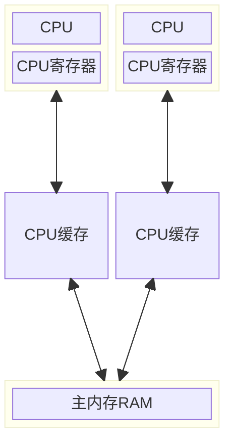

## JMM 内存模型

::: tip CPU的多核并发缓存架构



:::

JMM 全称为 Java Memory Model, Java 多线程内存模型跟 CPU 缓存模型类似, 是基于 CPU 缓存模型来建立的, Java 线程内存模型是标准化的, 屏蔽了底层不同计算机的区别

可以先看一个简单的 demo:

```java
public static boolean flag = false;

public static void main(String[] args) throws InterruptedException {
    new Thread(() -> {
        System.out.println("waiting data...");
        while (!flag) {

        }
        System.out.println("===== success");
    }).start();

    Thread.sleep(2000);

    new Tread(() -> prepareData());
}

public void prepareData() {
    System.out.println("prepare data...");
    flag = true;
    System.out.println("prepare data end...");
}
```

运行上面的代码后, 会发现第 9 行的代码并没有输出且程序没有退出, 说明 19 行的代码虽然执行了但是并没有影响到第 6 行的判断; 当将变量 `flag` 用 `volatile` 修饰后再运行代码, 程序最终会停止且第 9 行代码也会被执行

### JMM 的原子操作

- `read`: 读取, 从主内存读取数据
- `load`: 载入, 将主内存读取到的数据写入工作内存
- `use`: 使用, 从工作内存读取数据来计算
- `assign`: 赋值, 将计算好的值重新赋值到工作内存中
- `store`: 存储, 将工作内存数据写入主内存
- `write`: 写入, 将 store 过去的变量赋值给主内存中的变量
- `lock`: 锁定, 将主内存变量加锁, 标识为线程独占状态
- `unlock`: 解锁, 将主内存变量解锁, 解锁后其他线程可以锁定该变量

### JMM 缓存不一致问题

缓存一致性协议(MESI): 多个 CPU 从主内存读取一个数据到各自的高速缓存, 当其中某个 CPU 修改了缓存里的数据, 该数据会**马上同步回主内存**, 其他 CPU 通过总线嗅探机制可以感知到数据的变化而将自己缓存里的数据失效

缓存加锁: 缓存锁的核心机制是基于缓存一致性协议来实现的, 一个处理器的缓存回写到内存会导致其他处理器的缓存无效, IA-32 和 Intel 64 处理器使用 MESI 实现缓存一致性协议

### volatile 缓存可见性实现原理

底层实现主要通过汇编 lock 前缀指令, 它会锁定这块内存区域的缓存(缓存行锁定)并写回到主内存

IA-32 和 Intel 64 架构软件开发手册对 lock 指令的解释:

- 会将当前处理缓存行的数据==立即==写回到系统内存
- 这个协会内存的操作会引起在其他 CPU 里缓存了该内存地址的数据无效(MESI 协议)
- 提供内存屏障功能, 使 lock 前后指令不能重排序

### 指令重排序与内存屏障

#### 指令重排序

并发编程的三大特性:

- **原子性**: 一个或多个操作要么全部执行成功, 要么全部执行失败
- **可见性**: 当一个线程对共享变量进行修改后, 其他线程可以立刻看到
- **有序性**: 程序的执行顺序会按照代码的先后顺序执行

volatile 保证可见性与有序性, 但是不保证原子性, 保证原子性需要借助 synchronized 这样的锁机制

指令重排序: 在不影响单线程程序执行结果的前提下, 计算机为了最大限度的发挥机器性能, 会对机器指令重排序优化

源代码->编译器优化重排序->指令级并行重排序->内存系统重排序->最终执行的指令序列

重排序会遵循 `as-if-serial` 与 `happens-before` 原则

#### 内存屏障

Java 规范定义的内存屏障:

| 屏障类型   | 指令示例                 | 说明                                                                   |
| ---------- | ------------------------ | ---------------------------------------------------------------------- |
| LoadLoad   | Load1;LoadLoad;Load2     | 保证 Load1 的读取操作在 Load2 及后续读取操作之前执行                   |
| StoreStore | Store1;StoreStore;Store2 | 在 Store2 及其后的写操作执行前, 保证 Store1 的写操作已经刷新到主内存   |
| LoadStore  | Load1;LoadStore;Store2   | 在 Store2 及其后的写操作执行前, 保证 Load1 的读取操作已经结束          |
| StoreLoad  | Store1;StoreLoad;Load2   | 保证 Store1 的写操作已经刷新到主内存之后, Load2 及其后的读操作才能执行 |

Java 规定 volatile 需要实现的内存屏障:

```java
// StoreStore 屏障
a = 1;  // volatile 写, a 为 volatile 变量
// StoreLoad 屏障
b = a;  // volatile 读
// LoadLoad 屏障
// LoadStore 屏障
```

- 不同 CPU 硬件对于 JVM 的内存屏障规范实现指令不一样
- Intel CPU 硬件级内存屏障指令
  - lfence: 是一种 Load Barrier 读屏障, 实现 LoadLoad 屏障
  - sfence: 是一种 Store Barrier 写屏障, 实现 StoreStore 屏障
  - mfence: 是一种全能型的屏障, 具备 lfence 和 sfence 的能力, 具有所有屏障能力
- JVM 底层简化了内存屏障硬件指令的实现
  - lock 前缀: lock 指令不是一种内存屏障, 但是它能完成类似内存屏障的功能

## 锁机制

### 锁的分类

#### 悲观锁与乐观锁

锁的一种宏观分类方式是悲观锁和乐观锁. 悲观锁与乐观锁并不是特指某个锁（Java 中没有哪个 Lock 实现类就叫PessimisticLock 或 OptimisticLock）, 只是在并发情况下的两种不同策略

悲观锁（Pessimistic Lock）, 就是很悲观, 每次去拿数据的时候都认为别人会修改. 所以每次在拿数据的时候都会上锁, 这样别人想拿数据就被挡住, 直到悲观锁被释放

乐观锁（Optimistic Lock）, 就是很乐观, 每次去拿数据的时候都认为别人不会修改. 所以不会上锁, 不会上锁！但是如果想要更新数据, 会在更新前检查在读取至更新这段时间别人有没有修改过这个数据. 如果修改过就重新读取, 再次尝试更新, 循环上述步骤直到更新成功（当然也允许更新失败的线程放弃操作）

> 悲观锁阻塞事务, 乐观锁回滚重试. 它们各有优缺点, 不能认为一种一定好于另一种. 像乐观锁适用于写比较少的情况下, 即冲突真的很少发生的时候, 这样可以省去锁的开销, 加大了系统的整个吞吐量. 如果经常产生冲突, 上层应用会不断的进行重试, 这样反倒是降低了性能, 这种情况下用悲观锁就比较合适

#### 自旋锁

当一个线程尝试去获取某一把锁的时候, 如果这个锁此时已经被别人获取(占用), 那么此线程就无法获取到这把锁, 该线程将会等待, 间隔一段时间后会再次尝试获取. 这种采用`循环加锁 -> 等待的机制`被称为`自旋锁(spinlock)`

> 刚刚的乐观锁就有类似的无限循环操作, 那它是自旋锁吗？
>
> 不是. 尽管自旋与 while(true) 的操作是一样的, 但还是应该将这两个术语分开. "自旋"这两个字, 特指自旋锁的自旋

#### 可重入锁(递归锁)

可重入锁的字面意思是“可以重新进入的锁”, 即**允许同一个线程多次获取同一把锁**. 比如一个递归函数里有加锁操作, 递归过程中这个锁会阻塞自己吗？如果不会, 那这个锁就是可重入锁（因为这个原因可重入锁也叫做递归锁）

Java 里只要以 `Reentrant` 开头命名的锁都是可重入锁, 而且 JDK 提供的所有现成的 Lock 实现类, 包括 `synchronized` 关键字锁都是可重入的

#### 公平锁和非公平锁

如果多个线程申请一把公平锁, 当锁释放的时候, 先申请的先得到, 非常公平. 如果是非公平锁, 后申请的线程可能先获取到锁, 是随机或者按照其他优先级排序的

对 `ReentrantLock` 类而言, 通过构造函数传参可以指定该锁是否是公平锁, 默认是非公平锁. 一般情况下, 非公平锁的吞吐量比公平锁大, 如果没有特殊要求, 优先使用非公平锁

对于 `synchronized` 而言, 它也是一种非公平锁, 但是并没有任何办法使其变成公平锁

### synchronized

在多线程的环境下, 多个线程同时访问共享资源会出现一些问题, 而 `synchronized` 关键字就是用来保证线程同步的

> `synchronized` 可以保证原子性、可见性、有序性, 而 `volatile` 只能保证可见性和有序性

`synchronized` 主要有三种使用方式: 修饰普通同步方法、修饰静态同步方法、修饰同步代码块

```java
public class Test1 {
    private int num = 0;

    // 修饰普通同步方法
    public synchronized void add1() {
        num++;
    }

    public void add2() {
        // 修饰同步代码块
        synchronized(this) {
            num++;
        }
    }
}

public class Test2 {
    private static int num = 0;

    // 修饰静态同步方法
    public static synchronized void add() {
        num++;
    }
}
```

#### synchronized 的实现原理

通过对象锁(Monitor)机制, 如果是同步代码块, 在进入 synchronized 同步块时, 需要通过 `monitorenter` 指令获取到当前对象的 monitor (也就是对象锁), 执行完同步块的逻辑后, 通过 `monitorexit` 指令来释放所持有的 monitor; 如果是同步方法, 那么方法的 flag 上会被加上 synchronized 标记, 因为整个方法都是同步的, 处理逻辑跟代码块是一样的

:::: tip

可以使用 `javap -v` 来查看下面代码的字节码指令

```java
public class Test {

    int i = 0;

    public void test1() {
        synchronized(this) {
            i ++;
        }
    }

    public synchronized void test2() {
        i ++;
    }
}

```

::::

#### synchronized 的锁升级

升级过程: `偏向锁 -> 轻量级锁 -> 重量级锁`

### CAS 锁机制

CAS 即 Compare And Swap, 翻译成中文就是"比较并替换", Java 中可以通过 CAS 操作来保证原子性

CAS 主要包含三个参数(V, expect, update), V 表示要更新的变量(内存值)、expect 表示预期值(旧值)、update 表示新值

CAS 的原理:

- 先比较 V 和 expect 的值, 如果相等则将 update 的值赋值给 V
- 如果不相等说明其他线程对该变量做了更新, 放弃本次操作, 然后循环上面的操作直到更新成功

一段用 `AtomicInteger` 实现的 CAS 锁:

```java
while(true) {
    int oldvalue = atomicInteger.get();
    int newValue = oldValue + 1;
    if (atomicInteger.compareAndSet(oldValue, newvalue)) {
        break;
    }
}
```

> AtomicInteger 中的 CAS 的底层是通过汇编语言的 `lock cmpxchgq` 指令来实现原子性操作的

#### CAS 和 syncronized 的比较

- syncronized 会阻塞线程, 会进行线程的上下文切换, 会由用户态切换到内核态, 切换前需要保存用户态的上下文, 而内核态恢复到用户态, 又需要恢复保存的上下文, 非常消耗资源
- CAS 能很大程度提高并发程序的执行效率, 因为线程没有被阻塞, 也就没有其他开销(上下文切换、用户态切换到内核态)

#### CAS 存在的问题

- ABA问题
- 循环时间过长导致开销太大: CAS 自旋时间过长会给 CPU 带来非常大的开销
- 只能保证一个共享变量的原子操作: 对多个共享变量进行操作时, CAS 无法保证操作的原子性, 这个时候就需要用锁了

::: tip ABA 问题

- 什么是ABA问题呢?

  假设有两个线程A、B,同时对一个共享变量 M 进行操作, 线程 A 将 M 的值从 1 改为 2, 线程 B 将 M 的值从 1 改为 3, 然后又改为 1, 两个线程同时获取到 M 的值, 但是线程 B 执行的更快, 在线程 A 将 1 改为 2 之前执行完成了, 此时线程 A 判断原本的值和内存的值一致, 执行修改. 这就是 ABA 问题

- 如何解决 ABA 问题呢?

  很简单, 对共享变量添加 version 标记就可以了. 在原本的 ABA 问题中:

  - 线程 A 获取到 M 的值为(1, 1), 线程 B 获取到 M 的值为 (1, 1)
  - 线程 B 将 M 的值做修改: (1, 1) -> (3, 2) -> (1, 3)
  - 线程 A 判断值是否相等: (1, 1) != (1, 3), 放弃本次操作

:::

#### 原子类

原子操作类是 CAS 在 Java 中的应用, 从 JDK 1.5 开始提供了 `java.util.concurrent.atomic` 包, 这个包中的原子操作提供了一种用法简单、性能高效、线程安全地更新变量的方式

Atomic 包里的类基本都是使用 `Unsafe` 实现的包装类

JUC包中的4种原子类

- 基本类型: 使用原子的方式更新基本类型
  - `AtomicInteger`: 整形原子类
  - `AtomicLong`: 长整型原子类
  - `AtomicBoolean`: 布尔型原子类
- 数组类型: 使用原子的方式更新数组里的某个元素
  - `AtomicIntegerArray`: 整形数组原子类
  - `AtomicLongArray`: 长整形数组原子类
  - `AtomicReferenceArray`: 引用类型数组原子类
- 引用类型:
  - `AtomicReference`: 引用类型原子类, 存在ABA问题
  - `AtomicStampedReference`: 原子更新带有版本号的引用类型. 该类将整数值与引用关联起来, 可以于原子的更新数据和数据的版本号, 可以解决使用 CAS 进行原子更新时可能出现的 ABA 问题
  - `AtomicMarkableReference`: 原子更新带有标记位的引用类型
- 原子更新字段类
  - `AtomicIntegerFieldUpdater`: 原子更新整型的字段的更新器
  - `AtomicLongFieldUpdater`: 原子更新长整型字段的更新器
  - `AtomicReferenceFieldUpdater`: 引用类型更新器原子类
