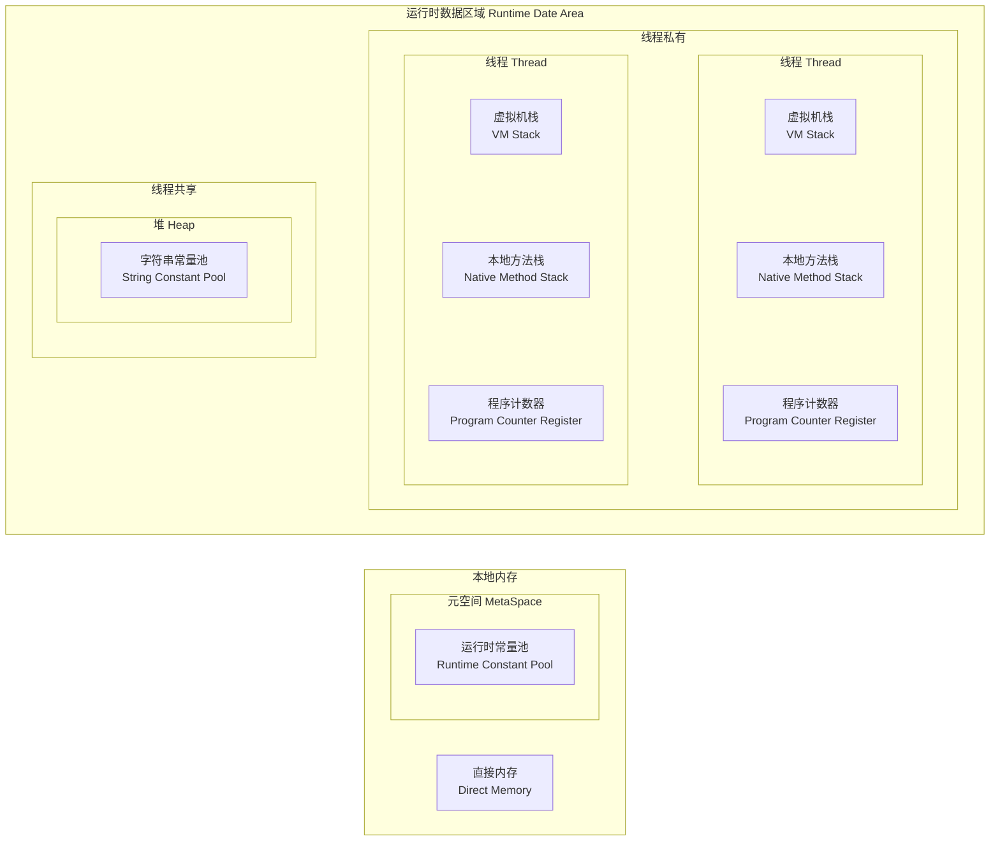

## JVM 是什么

JVM（Java Virtual Machine）是 Java 虚拟机的简称, 是用于在各种硬件和操作系统平台上执行 Java 字节码的虚拟机. JVM 是 Java 语言的核心, 也是其跨平台特性的关键支持

在 Java 程序中, 代码是先经过编译器编译成字节码文件, 然后由虚拟机执行这些字节码. 虚拟机会将字节码依次解释执行, 或通过即时编译技术（JIT）将字节码编译成本地代码执行, 从而实现高效的运行

JVM 是一个非常强大的虚拟机, 它有自己的内存管理机制（例如垃圾回收器）、线程模型、类加载机制等等. 这些机制与底层的硬件和操作系统无关, 使得 Java 程序能够实现跨平台的特性

JVM 的基本组成结构包括: 类加载器、运行时数据区域和执行引擎

## 类加载器

类加载器是 Java 虚拟机（JVM）的一个重要组成部分, 它的主要职责是将编译后的 Java 类文件加载到 JVM 内存中运行. 类加载器还会对类进行校验、解析和初始化

Java 类加载器主要分为以下三种类型:

1. 启动类加载器（Bootstrap ClassLoader）: 是 JVM 内置的类加载器, 用于加载 Java 平台核心库, 例如 java.lang 包中的类等. 启动类加载器是由 JVM 实现的, 它不是 Java 类, 因此没有对应的 Java 对象
2. 扩展类加载器（Extension ClassLoader）: 这个类加载器负责加载 Java 的扩展库, 例如 javax 包中的类等. 扩展类加载器是由 JVM 实现的, 它是 Java 类, 但它没有父类
3. 应用程序类加载器（Application ClassLoader）: 也叫系统类加载器, 用于加载应用程序的类. 这个类加载器是由用户自己编写的, 它通过 CLASSPATH 或其他自定义的类加载路径搜索 class 文件, 并加载到 JVM 内存中

除了这三种基本类加载器之外, 还有用户自定义的类加载器, 可以根据需要编写额外的类加载器来完成特定的加载任务

Java 的类加载器机制使得程序的架构更加灵活, 可以动态地加载类, 并且可以提供热部署和插件化等机制, 增强了程序的可维护性和可扩展性

## 运行时数据区域

运行时数据区域是 Java 虚拟机（JVM）在程序运行期间用于存储数据的区域. 在 Java 虚拟机规范中, 将运行时内存划分为以下五个区域:

- 程序计数器
- Java 虚拟机栈
- 本地方法栈
- Java 堆
- 方法区

这些区域有各自的用途, 以及创建和销毁的时间, 有的区域随着虚拟机进程的启动而存在, 有些区域则依赖用户线程的启动和结束而建立和销毁. 其中程序计数器、Java 虚拟机、本地方法栈是线程私有的, 而 Java 堆, 方法区（以及 Java 8 之后的直接内存）是线程共享的

JDK 1.8 以后 JVM 的结构与之前版本有一些区别, 下面是 JDK 1.7 的图示:

```mermaid
flowchart TD
  subgraph one [运行时数据区域 Runtime Date Area]
    direction TB
    subgraph two [线程共享]
      direction LR
      subgraph A [堆 Heap]
        b[字符串常量池\nString Constant Pool]
      end
      subgraph seven [方法区 Method Area]
        a[运行时常量池\nRuntime Constant Pool]
      end
      A ~~~ seven
    end
    subgraph three [线程私有]
      direction LR
      subgraph four [线程 Thread]
        direction TB
        B[虚拟机栈\nVM Stack]
        C[本地方法栈\nNative Method Stack]
        D[程序计数器\nProgram Counter Register]
        B ~~~ C ~~~ D
      end
      subgraph five [线程 Thread]
        direction TB
        E[虚拟机栈\nVM Stack]
        F[本地方法栈\nNative Method Stack]
        G[程序计数器\nProgram Counter Register]
        E ~~~ F ~~~ G
      end
      four ~~~ five
    end
    two ~~~ three
  end
  subgraph six [本地内存]
    I[直接内存\nDirect Memory]
  end
  one~~~three
  one~~~six
  four~~~five
```

下面是 JDK 1.8 的图示:



### 程序计数器

程序计数器（Program Counter Register）是一块较小的内存空间, 它可以看做是当前线程所执行的字节码的行号指示器. 分支、循环、跳转、异常处理、线程恢复等基础功能都需要依赖计数器来完成

由于 Java 虚拟机的多线程是通过线程轮流切换并分配处理器执行时间的方式来实现的, 在任何一个确定的时刻, 一个处理器（多核处理器就是一个内核）都只会执行一条线程的指令. 因此为了线程切换后能恢复到正确的执行位置, 每条线程都需要有一个独立的程序计数器, 各条线程之间计数器互不影响, 独立存储, 这类内存区域被称为"线程私有"的内存

如果线程执行的是一个 Java 方法, 那么计数器中记录的是执行的虚拟机字节码指令的地址；如果执行的是一个 Native 方法, 那么计数器中记录则是空（Undefined）, ==此内存区域是唯一一个在 Java 虚拟机规范中没有规定任何 OutOfMemoryError 情况的区域==

### Java 虚拟机栈

也称为 Java 方法栈, 用于存储方法调用时的局部变量、操作数栈和返回值. 每个线程有自己的 Java 虚拟机栈, 所以它是线程私有的, 它的生命周期与线程一致, 而且栈的大小可以动态调整

栈内创建的基本类型数据在超出其作用域后, 会被自动释放掉, **它不由 JVM GC 管理**, 而在栈内创建的引用类型实例, 则还是由 JVM GC 管理

虚拟机栈描述的是 Java 方法执行的内存模型: 每个方法在执行的同时都会创建一个栈帧（Stack Frame）用于存储局部变量表、操作数栈、动态链接、方法出口信息等. 每一个方法从调用直至执行完成的过程, 就对应这一个栈帧在虚拟机中入栈到出栈的过程

虚拟机栈中的栈帧包括以下几个要素:

- 局部变量表: 用于存储方法执行时的方法参数和局部变量（基本类型的数据存放在栈中的特性主要适用于局部变量和方法参数）
- 操作数栈: 用于存储方法执行过程中的操作数
- 动态链接: 用于指向运行时常量池中该方法所对应的常量
- 方法返回地址: 用于保存方法执行完毕后的返回地址

在 Java 虚拟机规范中, 对这个区域定义了两种异常:

- StackOverflowError: 如果线程请求的栈深度大于虚拟机所允许的深度, 将抛出此异常
- OutOfMemoryError: 在虚拟机栈可以动态扩展的前提下, 如果在扩展时无法申请到足够的内存, 就会抛出此异常

::: info OutOfMemoryError 不同的表现形式

| 错误                                   | 原因分析                                                                                                       | 场景列举与解决办法                                                                                                                                                                                                                                                                                                                                                                                                                                                                                                                                |
| -------------------------------------- | -------------------------------------------------------------------------------------------------------------- | ------------------------------------------------------------------------------------------------------------------------------------------------------------------------------------------------------------------------------------------------------------------------------------------------------------------------------------------------------------------------------------------------------------------------------------------------------------------------------------------------------------------------------------------------- |
| Java heap space                        | 堆内存没有足够的空间存放新创建的对象                                                                           | 通常只需要通过 `-Xmx` 参数调高 JVM 堆内存空间即可, 如果仍不能解决, 可以参考一下情况:<br/>1. 超大对象, 列表或数组: 检查合理性. 比如数据库查询分页等<br/>2. 超出预期的访问量: 如果是业务峰值压力, 可以考虑添加机器资源或者限流降级<br/>3. 过度使用终接器（Finalizer）, 该对象没有立即被 GC<br/>4. 内存泄露: 需要找到持有的对象, 找到问题并修改代码                                                                                                                                                                                                  |
| GC overhead limit exceeded             | 当 Java 进程花费 98% 以上的时间执行 GC, 但只恢复了不到 2% 的内存, 且该动作连续重复了 5 次                      | 类似 java heap space                                                                                                                                                                                                                                                                                                                                                                                                                                                                                                                              |
| Permgen space                          | （≤ JDK 1.7）永久代已用满, 通常是因为加载的 class 数目太多或体积太大                                           | 根据报错时机, 可以采用以下方案:<br/>1. 程序启动报错, 修改 `-XX:MaxPermSize`, 调大永久代空间<br/>应用重新部署时报错, 很可能应用没有正常停止, 导致加载了多份 class 信息, 重启 JVM 即可<br/>运行时报错, 应用程序可能会动态创建大量 class, 而这些 class 生命周期很短暂, 但是 JVM 默认不会卸载 class , 可以设置 `-XX:CMSClassUnloadingEnabled` 和 `-XX:UseConcMarkSweepGC` 这两个参数允许 JVM 卸载 class                                                                                                                                               |
| Metaspace                              | （＞ JDK 1.8）Metaspace 已被用满, 通常是因为加载的 class 数目太多或体积太大                                    | 类似 Permgen space, 调整 Metaspace 的空间大小的参数为 `-XX:MaxMetaspaceSize`                                                                                                                                                                                                                                                                                                                                                                                                                                                                      |
| Unable to create new native thread[^1] | 每个 Java 线程都需要占用一定的内存空间, 当 JVM 向底层操作系统请求创建一个新的 native 线程时没有足够的资源分配. | 常见的原因包括以下几类:<br/>1. 线程数超过操作系统最大线程数 ulimit 限制<br/>2. 线程数超过 kernel.pid_max（只能重启）<br/>3. native 内存不足<br/>解决方案:<br/>1. 升级配置<br/>2. 降低 Java Heap Space 大小<br/>3. 修复应用程序的线程泄露问题<br/>4. 使用 `-Xss` 参数减少线程栈大小<br/>5. 调高 SO 层面的线程最大数                                                                                                                                                                                                                                |
| Out of swap space?                     | 所有可用的虚拟内存已被耗尽                                                                                     | 常见原因包括以下几类:<br/>1. 地址空间不足<br/>2. 物理内存已经耗光<br/>3. 应用程序的本地内存泄露（native leak）, 例如不断申请本地内存, 却不释放<br/>4. 执行 `jamp -histo:live <pid>` 命令, 强制执行 Full GC; 如果执行了几次后内存明显下降, 则基本确认为 Direct Byte Buffer 问题                                                                                                                                                                                                                                                                    |
| Kill process or sacrifice child[^2]    | 不同于其他的 OOM 错误, Kill process or sacrifice child 错误不是由 JVM 层面触发的, 而是由操作系统层面触发的     | 默认情况下, Linux 内核允许进程申请的内存总量大于系统可用内存, 通过这种"错峰复用"的方式可以更有效的利用系统资源<br/>然而, 这种方式也会无可避免地带来一定的"超卖”风险. 例如某些进程持续占用系统内存, 然后导致其他进程没有可用内存. 此时, 系统将自动激活 OOM Killer, 寻找评分低的进程, 并将其"杀死”, 释放内存资源<br/>解决方案:<br/>1. 升级配置\隔离部署, 避免争用<br/>2. OOM Killer 调优                                                                                                                                                            |
| Requested array size exceeds VM limit  | JVM 限制了数组的最大长度[^3], 该错误表示程序请求创建的数组超过最大长度限制                                     | 此类问题比较罕见, 通常需要检查代码, 确认业务是否需要创建如此大的数组, 是否可以拆分为多个块, 分批执行                                                                                                                                                                                                                                                                                                                                                                                                                                              |
| Direct buffer memory[^4]               | Direct ByteBuffer 的默认大小为 64 MB, 一旦使用超出限制, 就会抛出 Direct buffer memory 错误                     | 1. Java 只能通过 ByteBuffer.allocateDirect 方法使用 Direct ByteBuffer, 需要通过 [arthas](https://arthas.aliyun.com/) 等工具拦截该方法进行排查<br/>2. 检查是否直接或间接使用了 NIO, 如 Jetty、Netty 等<br/>3. 通过 `-XX:MaxDirectMemorySize` 调整 Direct ByteBuffer 的上限值<br/>4. 检查 JVM 参数是否有 `-XX:DisableExplicitGC` 选项, 如果有就去掉, 该参数会使 `System.gc()` 失效<br/>5. 检查堆外内存使用代码, 确认是否存在内存泄露；或者通过放射调用 `sun.misc.CLeaner#clean()` 方法来主动释放被 Direct ByteBuffer 持有的内存空间<br/>6. 升级配置 |

[^1]:
    该问题发生的常见过程主要包括以下几步:
    a. JVM 内部的应用程序请求创建一个新的 Java 线程
    b. JVM native 方法代理了该次请求, 并向操作系统请求创建一个 native 线程
    c. 操作系统尝试创建一个新的 native 线程, 并为其分配内存
    d. 如果操作系统的虚拟内存已耗尽, 或是受到 32 位进程的地址空间限制, 操作系统就会拒绝本次 native 内存分配
    e. JVM 将抛出 java.lang.OutOfMemoryError: Unable to create new native thread 错误

[^2]: 有一种内核作业（Kernel Job）名为 Out of Memory Killer, 它会在可用内存极低的情况下"杀死"（kill）某些进程. OOM Killer 会对所有进程进行打分, 然后将评分较低的进程"杀死", 具体的评分规则可以参考 Surviving the Linux OOM Killer

[^3]: JVM 在为数组分配内存前, 会检查要分配的数据结构在系统中是否可寻址, 通常为 `Integer.MAX_VALUE - 2`

[^4]: Java 允许应用程序通过 Direct ByteBuffer 直接访问堆外内存, 许多高性能程序通过 Direct ByteBuffer 结合内存映射文件（Memory Mapped File）实现高速 IO

:::

### 本地方法栈

主要用于执行 JNI（Java Native Interface）方法, 它在程序调用或 JVM 调用本地方法接口时候启用

本地方法栈与虚拟机栈所发挥的作用非常的相似, 他们之间的区别不过是**虚拟机栈为虚拟机执行 Java 方法, 而本地方法栈为虚拟机使用的 Native 方法服务**

本地方法栈都不是 Java 语言编写的, 它可能由 C 或者其他语言编写, 本地方法也不由 JVM 去运行, 所以本地方法的运行不受 JVM 管理. 栈内的数据在超出其作用域后, 会被自动释放掉, 它不由 JVM GC 管理

与虚拟机栈一样, 也会抛出 StackOverflowError 和 OutOfMemoryError 异常

::: tip 本地方法接口(JNI)

#### JNI 的适用场景

- 已经存在一些库（用 C 语言编写的）, 要移植到 Java 上来非常浪费时间, 而 JNI 可以支持 Java 程序与 C 语言编写的库进行交互, 免去移植的工作
- 为了与硬件、操作系统进行交互、提高程序的性能等都可以使用 JNI

需要注意的是, 需要保证本地代码能工作在任何 Java 虚拟机环境

#### JNI 的副作用

一旦使用了 JNI, Java 程序将失去 Java 平台的两个优点:

- 程序不再跨平台, 要想跨平台, 必须在不同的系统环境下重新编译配置本地语言部分
- 程序不再是绝对安全的, 本地代码的使用不当会导致整个程序的崩溃. 一个通用规则是, 调用本地方法应该集中在少数几个类中, 来降低 Java 和其他语言之间的耦合

:::

### Java 堆

Java 堆是被所有线程共享的一块内存区域, 在虚拟机启动时创建. 此区域的唯一目的就是存放对象实例, 几乎所有的对象实例都在这里分配内存

虚拟机中只有一个堆, 程序中所有的线程都共享它

通常情况下, 堆占用的内存空间是最多的

堆的存取方式为管道类型, 先进先出

Java 堆是垃圾收集管理器管理的主要区域, 因此也被称为"GC 堆"（Garbage Collected Heap, 垃圾~~收集~~堆!!!:joy:）. Java 堆可以分为新生代和老年代, 再细致一点又可以分为 Eden、From Survivor、To Survivor 等

根据 Java 虚拟机规范的规定, Java 堆可以处于物理上不连续的内存空间中, 只要逻辑上是连续的即可, 就像磁盘空间一样. 在实现时, 既可以实现成固定大小的, 也可以是可扩展的, 不过当前主流的虚拟机都是按照可扩展来实现的（通过-Xmx 和-Xms 控制）. 如果在堆中没有内存完成实例分配, 并且堆也无法在扩展时, 将会抛出 OutOfMemoryError 异常

### 方法区

用于存储已被虚拟机加载的**类信息、字段信息、常量、静态变量、即时编译器编译后的代码等数据**. 方法区是所有线程共享的, 也可以动态地分配和回收

在 JDK 8 以前, 使用永久代的方式来实现方法区, JDK 8 之后, 永久代的概念就被废弃了, 方法区改用和 JRockit、J9 一样在本地内存中实现的元空间（Meta Space）来代替, 好处是元空间会在运行时根据需要动态调整, 只要没有超过当前进程可用的内存上限（32位和64位系统各不相同）, 就不会出现溢出的问题. 当要扩展时空间不足, 会出现 OutOfMemoryError 异常

方法区也可以被垃圾回收, 但条件非常严苛, 必须在该类没有任何引用的情况下

::: tip 类型信息包括什么

- The fully name of the type: 类型的全名
- The fully qualified name of the typeís direct superclass: 类型的父类全名（除非没有父类或者父类是 java.lang.Object）
- Whether or not the type is a class: 是不是一个 Class（还是一个接口）
- The typeís modifiers: 类型的修饰符
- An ordered list of the fully qualified names of any direct superinterfaces: 所有父接口的列表
- Field information: 类型的字段信息
- Method information: 类型的方法信息
- All class (static) variables declared in the type, except constants: 所有静态变量（非变量）信息
- A reference to class ClassLoader: 一个指向类加载器的引用
- A reference to class Class: 一个指向 Class 类的引用
- The constant pool for the type: 常量池

:::

### 常量池

Java 虚拟机中有几种不同的常量池, 它们分别是: Class 常量池、运行时常量池、字符串常量池

::: info 基本类型包装类的"常量池"

==这里说的常量池跟 JVM 中的常量池不是一个概念, 它只是包装类里面实现的一个内部类（一般是名为 XXXCache 的内部类或者单个的静态常量）==

Java 中基本类型的包装类的大部分类型: Byte、Short、Integer、Long、Character、Boolean 都有实现, 其中前面 4 个包装类的范围都是 [-128, 127], Character 的范围是 [0, 127], Boolean 是 [True|False], 另外两种浮点类型的包装类则没有实现

:::

#### Class 常量池

每个类文件都包含一个常量池表（Constant Pool Table）, 它是一种用于存储常量（字面量（Literal）和符号引用（Symbolic Reference））的表格结构

字面量包括:

- 文本字符串
- 八种基本类型的值
- 被声明为 final 的常量

符号引用包括:

- 类和方法的全限定名
- 字段的名称和描述符
- 方法的名称和描述符

在 JDK 1.8 环境中, Class 常量池在类加载过程中被加载到元空间中（JDK 1.7 是加载到方法区中）, 它提供了运行时所需的一些与类有关的信息, 并且在整个生命周期中都存在

#### 运行时常量池

Class 常量池是静态信息, 只有运行时被加载到内存后, 这些符号才有对应的内存地址信息, 这些常量池一旦被装入内存就变成运行时常量, 对应的符号引用在程序加载或运行时会被转变为被加载到内存区域的代码直接引用, 也就是常说的动态链接

运行时常量池在 JDK 1.8 之前存储在永久代（方法区）, JDK 1.8 之后存储在元空间

运行时常量池相对于 Class 常量池的另一个重要特征是具有动态性, 运行时常量池的内容并不全部来自 Class 常量池, 在运行时可以通过代码生成常量并将其放入运行时常量池中

#### 字符串常量池

字符串常量池是一块特殊的内存区域, 用于存储字符串常量的引用, 属于 Java 运行时数据区的一部分

##### 不同 Java 版本实现的字符串常量池

- JDK 1.6 及之前的版本: 字符串常量池位于永久代（PemGen）内存区中, 其大小受到 PemGen 的内存空间的大小限制, 此时常量池存储的是对象
- JDK 1.7 : 字符串常量池从永久代移到了堆内存中, 以便更好的进行内存管理, 此时存储的是对象引用
- JDK 1.8 : 引入了 String Deduplication 的特性. 这个特性可以分析常量池中的字符串对象并去重, 降低内存消耗

在使用字面量创建字符串对象时, 编译器会首先检查字符串常量池中是否存在相同的字符串, 如果存在则直接返回该字符串的引用, 反之则在字符串池中创建新的字符串对象, 并将其引用返回

::: tip 字符串常量池的本质

字符串常量池是 JVM 维护的一个字符串实例的引用表, 在 HotSpot VM 中, 它是一个叫做 String Table 的全局表, 底层是 C++ 实现的一个 hashtable[^hashtable]. 这些被维护的引用所指的字符串实例, 称作"被驻留的字符串(nterned string)"或者说"进入了字符串池的字符串", 这个 StringTable 在每个 HotSpot VM 的实例里只有一份, 被所有类共享

在 JDK 1.6 中, StringTable 的长度是固定的, 为 1009; 在 JDK 1.7 中, StringTable 的长度可以通过参数指定: `-XX:StringTableSize`

[^hashtable]: hashtable 底层是用数组+链表实现的, 通过 hash 算法计算出其存放在数组中的 index, 如果发生了 hash 碰撞（index 的位置上存在元素）, 那么就把元素插入到节点链表的尾部, 以此类推. 但随着链表长度增加, 元素的查询效率变低, 于是出现了数组+红黑树, 后面又发展出了数组+链表+红黑树结构, 逐步优化. Java 中的 HashMap 与 Hashtable 就是这么实现的

:::

## 执行引擎

JVM 执行引擎是 JVM 的核心组成部分之一, 它可以执行 Java 字节码文件中的指令

JVM 执行引擎包含两个主要组件:

- 解释器: 当 JVM 加载 Java 字节码文件时, 解释器会逐行解释执行字节码文件中的指令, 然后将执行结果返回. 解释器的优点是可以快速启动和执行代码, 但是执行效率相对较低
- 即时编译器: 在运行 Java 程序时, 即时编译器将字节码文件中的热点代码（即经常执行的代码）编译成本地机器代码, 以提高程序的执行效率. 即时编译器的优点是可以将执行效率提高到接近本地应用程序的水平, 但是编译过程会增加启动时间和内存消耗

JVM 执行引擎也有许多优化措施, 例如: 即时编译器支持的触发机制、JIT 的预热过程、指针的内存对齐等. 这些优化措施将有助于提高程序的执行效率和减少内存占用

JVM 规范中制定了==虚拟机字节码执行引擎==的概念模型, 这个模型称之为 JVM 执行引擎的统一外观, 各个 Java 虚拟机的发行厂商都需要按照这个规范来实现. 在不同的虚拟机实现中, 可能会有解释执行和编译执行两种执行方式, 虚拟机可以按照自身的需求, 采用一种或者同时采用多种组合的方式来实现引擎. 但无论内部怎么实现, 都要遵循**输入是字节码文件, 处理过程是等效字节码解析过程, 输出是执行结果**这个 JVM 规范要求
