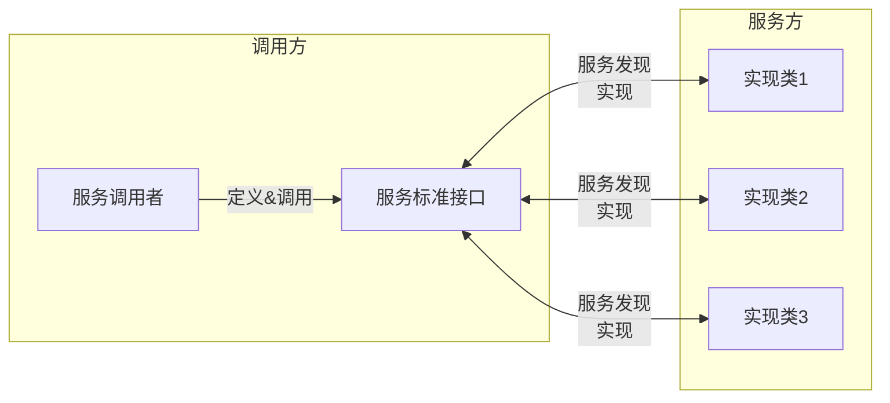

## SPI 是什么

面向的对象的设计里, 一般推荐模块之间基于接口编程, 模块之间不对实现类进行硬编码, 一旦代码里涉及具体的实现类, 就违反了可拔插的原则, 如果需要替换一种实现, 就需要修改代码. 为了实现在模块装配的时候不用在程序里动态指明, 这就需要一种服务发现机制

Java SPI 就是提供这样的一个机制: 为某个接口寻找服务实现的机制（这有点类似 IOC 的思想, 将装配的控制权移到了程序之外）

SPI 的全称是 Services Provider Interface, 翻译过来就是 **服务提供者接口**, 它所实现的是一种服务的发现机制, 可以用来启用框架扩展和替换组件

SPI 的整体机制如下:



### 与 API 的区别

API: Application Programming Interface

```mermaid
flowchart LR
  subgraph 调用方
  B[服务调用者]
  end
  B -- 调用 --> A[服务接口]
  subgraph 服务方
  A <-- 实现 --o 实现类1
  A <-- 实现 --o 实现类2
  A <-- 实现 --o 实现类3
  end
```

从上图就看出端倪:

- API 概念上更接近实现方, SPI 概念上更接近调用方
- API 组织上位于实现方所在的包中, SPI 组织上位于调用方所在的包中
- API 实现和接口在同一个包中, API 实现在独立的包中（也可认为在提供方中）

### 实现原理

确切来说, SPI 并不是 Java 独有的, 它是一种设计思想, SPI 的本质是通过事先定义的接口来找其所有的接口实现类（服务）, 而后通过反射逐个实例化对象. 其实现原理:

1. 服务调用方定义接口, 并在主干服务中设置接入点
2. 服务提供方实现接口, 并按照约定将实现类放在调用方可达的位置
3. 调用方基于约定找到对应位置, 将对应接口的实现类加载到内存并连接至接入点
4. 后续服务提供方发生变更、替换时, 只要仍然按照约定提供实现类到对应位置, 调用方无需任何更改

在 JDK6 里面引进的一个新的特性 `ServiceLoader`, 从 JDK 层面实现了一种服务提供发现机制. Java 的 SPI 机制包含了两类角色, 首先是服务定义者, 涉及的概念有:

- Service Provider Interface(SPI): 服务提供者接口, 通常是一组接口或者抽象类, 统一定义了服务的消费形式
- ServiceLoader: 服务在运行时的加载机制, 根据定义的 SPI 找到具体的实现

然后是服务实现类, 涉及的概念有:

- Service Provider: 服务的具体实现, 是服务提供者对 SPI 的实现

ServiceLoader 主要是用来装载一系列的 service provider, 而且它可以通过 service provider 的配置文件来装载指定的 service provider. 当服务的提供者提供了服务接口的一种实现之后, 我们只需要在 jar 包的 `META-INF/services/` 目录里同时创建一个以服务接口命名的文件, 该文件内容就是实现该服务接口的具体实现类. 而当外部程序装配这个模块的时候, 就能通过该 jar 包`META-INF/services/` 里的配置文件找到具体的实现类名, 并装载实例化, 完成模块的注入

## Java SPI 的缺点

注意这里说的是 Java SPI 的缺点, SPI 是一种机制, 而 Java SPI 只是它的其中一种实现

- 不能按需加载且获取某个实现类的方式不够灵活
  - 虽然 ServiceLoader 做了延迟载入, 但是实例化的时候是通过遍历将接口的实现类得全部载入, 造成资源浪费
  - 只支持通过 Iterator 形式迭代获取, 不能根据某个参数来获取对应的实现类
- 多线程并发使用 ServiceLoader 类的实例存在安全隐患
- ==实现类不能通过有参构造器实例化==（源码注释里面说明了, 因为通过反射实例化对象调用的是无参构造函数）

## 应用场景

- Spring 自动装配: 通过 `SpringFactoriesLoader.loadFactoryName()` 加载配置在 `META-INF/spring.factories` 中的类
- JDBC 驱动加载: 基于 SPI 机制实现不同驱动的加载（JDBC 4.0 之前都是用 `Class.forName()` 的硬编码方式）
- slf4j 日志门面
