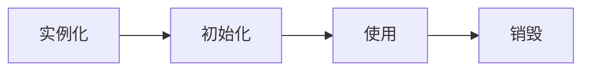
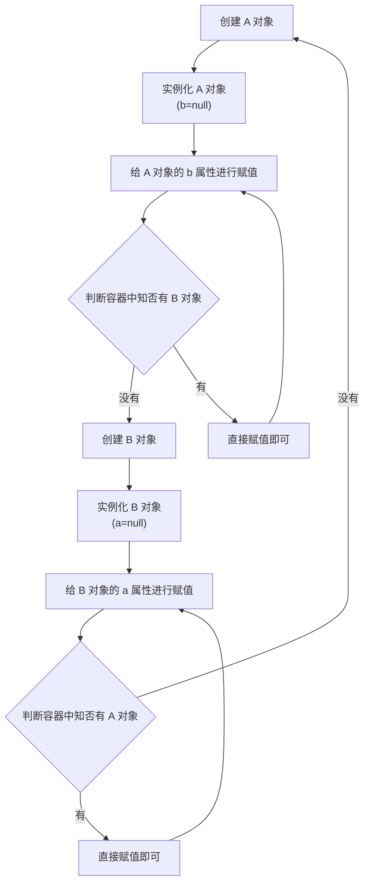

## Spring Bean

### 什么是 Spring Bean

简单来说, Bean 指代的就是那些被 IoC 容器所管理的对象


应用程序类（POJO）与配置元数据相结合, 在创建和初始化 ApplicationContext 后, 就拥有了一个完全配置和可执行的系统或应用程序

> 配置元数据可以是 XML 文件、注解或者 Java 配置类

### 如何声明一个 Bean

注解声明:

- `@Component`: 通用的注解, 可标记任意类为 Spring 组件, 下面是它的一些细分
  - `@Repository`: 持久层, 主要用于数据库相关操作
  - `@Service`: 服务层, 主要设计一些负载的逻辑
  - `@Controller`: MVC 的控制层, 用于接受用户请求并调用 `Service` 层返回数据给前端页面

Java Config 配置声明:

```java
@Configuration
public class AppConfig {

    @Bean
    public UserService userService() {
        return new UserServiceImpl();
    }
}
```

XML 配置声明:

```xml
  <beans>
      <bean id="user" class="com.demo.User" />
  </beans>
```

::: tip @Component 和 @Bean 的区别

| `@Component`                                                                    | `@Bean`                                                             |
| ------------------------------------------------------------------------------- | ------------------------------------------------------------------- |
| 作用于类                                                                        | 作用于方法                                                          |
| 通常类路径扫描来自动侦测以及自动装配到 Spring 容器中, 搭配 `@ComponentScan`使用 | 标记该方法返回的是一个 Spring Bean 对象, 搭配 `@Configuration` 使用 |
| 只能单纯的声明, 非常有限自定义                                                  | 自定义更强, 支持将第三方类变成组件                                  |

:::

### Bean 的生命周期

- Bean 容器找配置元数据中的 Spring Bean 定义
- Bean 容器利用 Java Reflection API 创建一个 Bean 实例
- 如果涉及到一些属性值, 那么通过 `set()` 方法设置一些属性值
- 检查 `Aware` 的相关接口并设置相关依赖
  - 如果 Bean 实现了 `BeanNameAware` 接口, 调用 `setBeanName()` 方法传入 Bean 的名字
  - 如果 Bean 实现了 `BeanClassLoaderAware` 接口, 调用 `setClassLoader()` 方法传入 ClassLoader 对象的实例
  - 如果 Bean 实现了 `BeanFactoryAware` 接口, 调用 `setBeanFactory()` 方法传入 BeanFactory 对象的实例
  - 如果 Bean 还实现了其他 `*Aware` 接口, 就调用相应的方法
- 如果有和加载这个 Bean 的 Spring 容器相关的 `BeanPostProcessor` 对象, 执行 `postProcessBeforeInitialization()` 方法
- 如果 Bean 实现了 `InitializingBean` 接口, 执行 `afterPropertiesSet()` 方法
- 如果 Bean 在配置元数据中定义了 `init-method` 属性, 执行指定的方法
- 如果有和加载这个 Bean 的 Spring 容器相关的 `BeanPostProcessor` 对象, 执行 `postProcessAfterInitialization()` 方法
- 当要销毁 Bean 的时候, 如果 Bean 实现了 `DisposableBean` 接口, 执行 `destroy()` 方法
- 当要销毁 Bean 的时候, 如果 Bean 在配置元数据中定义了 `destroy-method` 属性, 执行指定的方法

可以简单理解成下面几个流程:



> 实例化和初始化
>
> - 实例化: 在内存中申请空间
> - 初始化: 属性赋值

#### BeanDefinition

Spring IoC 容器管理一个或多个 Bean, 这些 Bean 是我们供给容器的配置元数据创建的, 在容器本身中, 这些 Bean 定义表示为 `BeanDefinition` 对象

元数据是为了转换构成每个 Bean 定义的一组属性, 如下所示:

| 属性                     | 解释             |
| ------------------------ | ---------------- |
| Class                    | 实例化 Bean      |
| Name                     | 命名 Bean        |
| Scope                    | Bean 范围        |
| Constructor arguments    | 构造方法依赖注入 |
| Properties               | 属性依赖注入     |
| Autowring mode           | 自动装配         |
| Lazy initialization mode | 延迟初始化 Bean  |
| Initialization method    | 初始化的回调函数 |
| Destruction method       | 销毁的回调函数   |

而 `BeanDefinitionReader` 接口则约束了如何读取这些 `BeanDefinition` 对象, 通过不同的子类实现来读取不同的配置文件信息, 生成 `BeanDefinition` 对象, 最终所有的 `BeanDefinition` 对象都会交由 `BeanDefinitionRegistry` 统一管理

#### \*PostProcessor

后置处理器(增强器): 提供某些额外的扩展功能

- BeanPostProcessor: 操作对象是 BeanFactory
- BeanFactoryPostProcessor: 操作对象是 Bean

## IoC 容器

IOC, 即Inversion of Control, 中文翻译为“控制反转”. 它是面向对象编程中的一种设计原则, 可以用来降低代码之间的耦合度. 在传统的编程方式中, 我们直接在对象内部通过new进行创建对象, 这种方式会造成对象与对象之间的高耦合度, 不利于代码的维护和扩展. 而控制反转就是将原本由代码直接操控的对象的调用权交给第三方（例如一个容器）来控制, 以解耦代码, 提高程序的可扩展性和可维护性

IoC 是 Spring 框架的各个功能模块的基础, 是创建和管理对象的容器

### BeanFactory

BeanFactory 是 Spring 框架中的一个核心接口, 用于管理和维护 Bean 的定义、创建以及生命周期. 它是 Spring IoC（控制反转）容器的基础, 负责从配置文件或者注解中读取 Bean 的定义信息, 并根据需要创建相应的 Bean 实例

BeanFactory 的主要职责包括:

- 解析配置文件, 读取 Bean 的定义信息
- 实例化 Bean, 处理依赖注入
- 管理 Bean 的作用域和生命周期

BeanFactory 的源码:

```java
public interface BeanFactory {
    String FACTORY_BEAN_PREFIX = "&";

    Object getBean(String var1) throws BeansException;

    <T> T getBean(String var1, Class<T> var2) throws BeansException;

    Object getBean(String var1, Object... var2) throws BeansException;

    <T> T getBean(Class<T> var1) throws BeansException;

    <T> T getBean(Class<T> var1, Object... var2) throws BeansException;

    <T> ObjectProvider<T> getBeanProvider(Class<T> var1);

    <T> ObjectProvider<T> getBeanProvider(ResolvableType var1);

    boolean containsBean(String var1);

    boolean isSingleton(String var1) throws NoSuchBeanDefinitionException;

    boolean isPrototype(String var1) throws NoSuchBeanDefinitionException;

    boolean isTypeMatch(String var1, ResolvableType var2) throws NoSuchBeanDefinitionException;

    boolean isTypeMatch(String var1, Class<?> var2) throws NoSuchBeanDefinitionException;

    @Nullable
    Class<?> getType(String var1) throws NoSuchBeanDefinitionException;

    @Nullable
    Class<?> getType(String var1, boolean var2) throws NoSuchBeanDefinitionException;

    String[] getAliases(String var1);
}
```

#### BeanFactory 和 ApplicationContext 的区别

ApplicationContext 是 BeanFactory 的子接口, 所以它具备 BeanFactory 的所有功能, 另外它还提供了更多面向企业的特定功能, 包括解析消息、支持国际化、发布事件以及应用层特定的上下文

ApplicationContext 的源码:

```java
public interface ApplicationContext extends
    EnvironmentCapable,
    ListableBeanFactory,
    HierarchicalBeanFactory,
    MessageSource,
    ApplicationEventPublisher,
    ResourcePatternResolver {

    @Nullable
    String getId();

    String getApplicationName();

    String getDisplayName();

    long getStartupDate();

    @Nullable
    ApplicationContext getParent();

    AutowireCapableBeanFactory getAutowireCapableBeanFactory() throws IllegalStateException;
}
```

不同点:

- 加载策略: `Beanfactory` 采用延迟加载策略, 只有在需要时才会实例化; `ApplicationContext` 在容器启动的过程中就完成了 Bean 的实例化
- 功能扩展: `BeanFactory` 是底层的IoC容器, 只有一些基本的操作, 而 `ApplicationContext` 在 `BeanFactory` 的基础上提供了更多的功能: 国际化、事件传播、AOP 代理等等
- 性能: `ApplicationContext` 会预先实例化 Bean, 因此在启动的时候会有其他的性能开销; 相比之下, `BeanFactory` 的性能更好, 因为它在使用时才实例化

::: tip BeanFactory 和 ApplicationContext 是如何创建容器的

首先定义一个 `beans.xml`, 如下:

```xml
<?xml version="1.0" encoding="UTF-8"?>
<beans xmlns="http://www.springframework.org/schema/beans"
    xmlns:xsi="http://www.w3.org/2001/XMLSchema-instance"
    xsi:schemaLocation="http://www.springframework.org/schema/beans
        http://www.springframework.org/schema/beans/spring-beans.xsd">

    <bean id="t" class="com.demo.Test">
        <property name="name" value="test" />
    </bean>

</beans>
```

使用 `BeanFactory` 的方式加载:

```java
public class App {
    public static void main(String[] args) {
        BeanFactory factory = new XmlBeanFactory(new ClassPathResource("beans.xml"));
        System.out.println(factory.getBean("t"))
    }
}
```

使用 `ApplicationContext` 的方式加载:

```java
public class App {
    public static void main(String[] args) {
        ApplicationContext context = new ClassPathXmlApplicationContext("beans.xml");
        System.out.println(context.getBean("t"))
    }
}
```

:::

#### BeanFactory 和 FactoryBean 的区别

FactoryBean 是一个接口, 允许开发者创建定制化的Bean创建逻辑. 通过实现 FactoryBean 接口, 开发者可以控制 Bean 的创建过程, 从而实现更加灵活和复杂的 Bean 实例化

FactoryBean 的源码:

```java
public interface FactoryBean<T> {
    String OBJECT_TYPE_ATTRIBUTE = "factoryBeanObjectType";

    @Nullable
    T getObject() throws Exception;

    @Nullable
    Class<?> getObjectType();

    default boolean isSingleton() {
        return true;
    }
}
```

不同点:

- 功能不同: BeanFactory 负责管理和创建 Bean, 而 FactoryBean 是一个接口, 允许开发者实现定制化的 Bean 创建逻辑
- 角色不同: BeanFactory 是 Spring 框架的核心, 负责整个 Bean 的管理; 而 FactoryBean 是 Bean 的创建方式之一, 用于定制化的 Bean 实例化
- 使用方式不同: BeanFactory 通常通过配置文件或者注解来实现 Bean 的管理和创建; 而 FactoryBean 需要开发者实现自定义的工厂类, 提供定制化的 Bean 创建逻辑

### 创建 IoC 容器的方式

有两种, 基于 XML 的方式和基于注解的方式

假设有如下的配置类

```java
@Data
public class AppConfig {

    private String username;

    private String password;
}
```

- 基于 XML 的方式配置和使用

  在项目中的 resources 下创建一个 `applicationContext.xml` 的配置文件, 内容如下:

  ```xml{16-19}
  <?xml version="1.0" encoding="UTF-8"?>
  <beans xmlns="http://www.springframework.org/schema/beans"
      xmlns:xsi="http://www.w3.org/2001/XMLSchema-instance"
      xsi:schemaLocation="http://www.springframework.org/schema/beans
          http://www.springframework.org/schema/beans/spring-beans.xsd">

      <bean id="config" class="com.demo.AppConfig">
          <property name="username" value="root" />
          <property name="password" value="root" />
      </bean>

  </beans>
  ```

  然后在代码中使用 XML 的方式获取 AppConfig 对象

  ```java{3-4}
  public class Test {
      public static void main(String[] args) {
          ApplicationContext context =
              new ClassPathXmlApplicationContext("applicationContext.xml");
          System.out.println(context.getBean("config"));
      }
  }
  ```

- 基于注解的方式配置与使用

  - 配置类: 通过一个 Java 类来替代 XML 文件, 把在 XML 中配置的内容放到配置类中

    首先创建一个配置类, 如下:

    ```java{1,4}
    @Configuration
    public class AppConfiguration {

        @Bean
        public AppConfig config() {
            AppConfig config = new AppConfig();
            config.setUsername("root");
            config.setPasswrod("root");
            return config;
        }
    }
    ```

    然后在代码中使用如下的方式获取 AppConfig 对象:

    ```java{3-4}
    public class Test {
        public static void main(String[] args) {
            ApplicationContext context =
                new AnnotationConfigApplicationContext(Configuration.class);
            System.out.println(context.getBean("config"));
        }
    }
    ```

  - 扫包 + 注解

    更简单的方式, 既不需要依赖于 XML 文件也不需要配置类, 而是直接将 Bean 的创建交给目标类, 仅需要在目标类添加注解就能实现:

    ```java{2,5,8}
    @Data
    @Component
    public class AppConfig {

        @Value("root")
        private String username;

        @Value("root")
        private String password;
    }
    ```

    使用的时候跟注解方式是类似的:

    ```java{3-4}
    public class Test {
        public static void main(String[] args) {
            ApplicationContext context =
                new AnnotationConfigApplicationContext("com.demo");
            System.out.println(context.getBean("config"));
        }
    }
    ```

### IoC 容器的创建过程

```java
@Override
public void refresh() throws BeansException, IllegalStateException {
    synchronized (this.startupShutdownMonitor) {
        // 准备刷新上下文
        prepareRefresh();

        // 获取初始化 BeanFactory
        ConfigurableListableBeanFactory beanFactory = obtainFreshBeanFactory();

        // 对 BeanFactory 设置属性
        prepareBeanFactory(beanFactory);

        try {
            // 模版方法, 允许子类注册特殊的 BeanPostProcess 等
            postProcessBeanFactory(beanFactory);

            // 调用 Bean 的后置处理器
            invokeBeanFactoryPostProcessors(beanFactory);

            // 注册 Bean 的后置处理器
            registerBeanPostProcessors(beanFactory);

            // 初始化国际化资源处理器
            initMessageSource();

            // 初始化事件多播器
            initApplicationEventMulticaster();

            // 模版方法, 留给子类实现
            onRefresh();

            // 注册事件监听器
            registerListeners();

            // 实例化剩余的非懒加载的单实例 Bean
            finishBeanFactoryInitialization(beanFactory);

            // 刷新容器, 发布刷新事件
            finishRefresh();
        } catch (BeansException ex) {
            if (logger.isWarnEnabled()) {
                logger.warn("Exception encountered during context initialization - " +
                        "cancelling refresh attempt: " + ex);
            }

            // Destroy already created singletons to avoid dangling resources.
            destroyBeans();

            // Reset 'active' flag.
            cancelRefresh(ex);

            // Propagate exception to caller.
            throw ex;
        } finally {
            // Reset common introspection caches in Spring's core, since we
            // might not ever need metadata for singleton beans anymore...
            resetCommonCaches();
        }
    }
}
```

## AOP 代理

AOP, 即Aspect-Oriented Programming, 中文翻译为“面向切面编程”. 它是面向对象编程的一种补充, 用于处理一些具有横切性质的系统级服务, 如事务管理、日志、安全等. AOP通过预编译方式和运行期动态代理实现程序功能的统一维护的一种技术. AOP是OOP的延续, 是软件开发中的一个热点, 也是Spring框架中的一个重要内容, 是函数式编程的一种衍生范型. 利用AOP可以对业务逻辑的各个部分进行隔离, 从而使得业务逻辑各部分之间的耦合度降低, 提高程序的可重用性, 同时提高了开发的效率

AOP 也是以 IoC 为基础的, 它把切面这种抽象的概念也看成是对象, 变成了抽象化的面向对象

Spring AOP 是基于动态代理的, 如果要代理的对象实现了某个接口, 那么 Spring AOP 会使用 JDK Proxy 去创建代理对象, 而对于没有实现接口的对象, Spring AOP 就会使用 Cglib 生成一个被代理对象的子类来作为代理


### AOP 的一些术语

| 术语                     | 含义                                                                |
| ------------------------ | ------------------------------------------------------------------- |
| Aspect（切面）           | 切入点(Pointcut)+通知(Advice)                                       |
| JoinPoint（连接点）      | 目标对象的所属类中, 定义的所有方法均为连接点                        |
| Advice（通知）           | 增强的逻辑/代码, 也即拦截到目标对象的连接点之后要做的事情           |
| PointCut（切点）         | 被切面拦截/增强的连接点（切入点一定是连接点, 连接点不一定是切入点） |
| Introduction（引入）     | 可以声明额外的方法或字段                                            |
| TargetObject（目标对象） | 被通知的对象                                                        |
| AOP Proxy（AOP代理）     | 向目标对象应用通知之后创建的代理对象                                |
| Weaving（织入）          | 将通知应用到目标对象,进而生成代理对象的过程动作                     |

在 [AOP Concepts](https://docs.spring.io/spring-framework/docs/5.3.33-SNAPSHOT/reference/html/core.html#aop-introduction-defn) 可以查看更详细的介绍

### Spring AOP 和 AspectJ AOP 的区别

- Spring AOP 属于运行时增强, 而 AspectJ 是编译时增强
- Spring AOP 基于代理(Proxying), 而 AspectJ 基于字节码操作(Bytecode Manipulation)
- Spring AOP 已经集成了 AspectJ , AspectJ 应该算的上是 Java 生态系统中最完整的 AOP 框架了
- AspectJ 相比于 Spring AOP 功能更加强大, 但是 Spring AOP 相对来说更简单, 如果我们的切面比较少, 那么两者性能差异不. 但是, 当切面太多的话, 最好选择 AspectJ , 它比 Spring AOP 快很多

::: info AspectJ 的织入方式

- compile-time: 编译期织入, 织入对象是 .class 文件
- post-compile: 后编译期织入, 织入对象是 class 字节码或者 jar 文件
- load-time: 加载期织入, 在类加载进虚拟机之前织入

:::

Spring AOP 虽然使用 AspectJ 中的注解, 但是 Spring AOP 并不是用 AspectJ 实现的, Spring 只是借用了 AspectJ 的语法提供了一套基于动态代理的 AOP 实现, Spring 官方称其为 `@AspectJ style`, 受限于动态代理, Spring AOP 只支持方法级别的切面

### AOP 通知的类型

- `@Beafore`: 在切点之前执行
- `@After`: 在切点之后执行
- `@AfterReturing`: 在切点正常返回的时候执行
- `@AfterThrowing`: 在切点抛出异常的时候执行
- `@Around`: 环绕通知, 全程包裹

### AOP 的应用场景

- 日志打印
- 事务处理
- 权限控制

## 循环依赖

### 什么是循环依赖

在 Spring 中的循环依赖就是指一个或者多个 Bean 之间存在着互相依赖的关系, 并且形成了循环调用

举个简单的例子, 有两个对象定义如下:

```java
@Data
public class A {
    private B b;
}

@Data
public class B {
    private A a;
}
```

默认情况下, Spring 的 Bean 都是单例的, 也就是有且仅有一个, 先来看一下这两个 bean 的创建流程:



因为 A B 的相互依赖关系, 导致创建对象的流程形成了闭环, 这就出现了循环依赖

### 怎么解决循环依赖

Spring 通过三级缓存和提前暴露对象的方式来解决循环依赖问题

先看一下三级缓存的定义:

```java
public class DefaultSingletonBeanRegistry extends SimpleAliasRegistry implements SingletonBeanRegistry {
    // 一级缓存
    private final Map<String, Object> singletonObjects = new ConcurrentHashMap(256);
    // 二级缓存
    private final Map<String, Object> earlySingletonObjects = new ConcurrentHashMap(16);
    // 三级缓存
    private final Map<String, ObjectFactory<?>> singletonFactories = new HashMap(16);
}
```

> ObjectFactory: 是一个函数式接口, 有且只有一个方法 `getObject()`, 可以当做方法的参数传递. 在执行此类型参数的方法, 可以传入一个 Lambda 表达式, Lambda 表达式在声明的时候并不会执行, 而是在调用 `getObject()` 方法时才去调用 Lambda 处理的逻辑

先把创建 Bean 的流程简单理解成如下方法的调用链: `getBean` -> `doGetBean` -> `createBean` -> `doCreateBean` -> `createBeanInstance` -> `populateBean`

> 这里方法的命名其实挺有趣的, 可以说 `doxxx` 才是真正干活的

Spring 从容器中获取需要实例化的所有 BeanDefinition 的名字列表后遍历, 先通过 `getBean` -> `doGetBean` -> `getSingleton` 从容器中尝试获取 Bean 对象, 如果获取到了那就继续处理下一个, 如果没获取到说明容器中还没有这个 Bean 对象, 那么就会调用 `createBean` -> `doCreatBean` -> `createBeanInstance` 方法去创建实例, 最后 `createBeanInstance` 会返回一个 Bean 实例(此时还是半成品, 属性都没有赋值)之后, 此时如果发现 Bean 需要提前暴露, 那么就会将其存入三级缓存, 然后再去调用 `populateBean` 来给 Bean 的属性赋值, 如果有依赖其他 Bean, Spring 容器会去找然后注入, 正常情况下这样就可以完成整个 Bean 的创建, 然后继续下一个

如果有循环依赖的 Bean, 比如上面说的 A、B, Spring 会怎么处理呢? 先停一下, 梳理一下执行到这里的时候三级缓存的情况(假设先创建 A, 不考虑其他 Bean 的影响):

- 一级缓存: []
- 二级缓存: []
- 三级缓存: [("a", lambda)]

在 `populateBean` 执行过程中会为 A 注入 B, 此时就会去容器里 `getBean`, 呀~ 套娃开始了, 因为 B 在容器中也不存在, 所以它的创建跟 A 是一样的, 直到执行创建 B 对象流程中的 `populateBean` 方法之前, OK, 这个时候再来看一下三级缓存的情况:

- 一级缓存: []
- 二级缓存: []
- 三级缓存: [("a", lambda), ("b", lambda)]

执行创建 B 对象流程中的 `populateBean` 方法, 此时会给 B 的 a 属性赋值, 然后通过 `getBean` 从容器中尝试获取 A: 先找一级缓存 -> 没有, 再找二级缓存 -> 没有, 再找三级缓存 -> 有, 在取出三级缓存中的对象时候, 会取执行 `ObjectFactory#getObject()` 方法, 其实就是 `() -> getEarlyBeanReferance()` 这个 Lambda 表达式, 里面的方法简单说就是去判断 `BeanDefinition` 有没有实现 `SmartInstantiationAwareBeanPostProcessor` 接口, 而这个 PostProcessor 有一个子类就是 `AbstractAutoProxyCreator`, 没错如果 `BeanDefinition` 实现了创建代理对象, 如果需要那就返回代理对象, 不需要就返回源对象, 并且这个时候会从三级缓存中移除该对象, 然后将其放入二级缓存, 那么这个时候缓存的情况是:

- 一级缓存: []
- 二级缓存: [("A", A(b=null))]
- 三级缓存: [("B", lambda)]

这个时候 B 已经拿到它的属性 a 的 Bean 对象了, 容器注入后就完成了 B 的创建, 此时将 B 对象放入一级缓存, 清理二、三级缓存, 并返回 B 对象. 而此时缓存的情况是:

- 一级缓存: [("b", B(a=A(b=null)))]
- 二级缓存: [("a", A(b=null))]
- 三级缓存: []

这个时候回到创建 A 的流程中的 `populateBean` 方法, 将 B 注入 A 的 b 属性, 此时 A 也完成了创建, 然后将 A 对象放入一级缓存, 同时清理二、三级缓存. 而此时缓存的情况是:

- 一级缓存: [("b", B(a=A(b=B(...)))), ("a", A(b=B(a=A(...))))]
- 二级缓存: []
- 三级缓存: []

然后继续执行下一个 Bean 的创建, 如果下一个是 B, 调用 `getBean` 发现已经创建完成了那就继续下一个, 依次类推

#### 源码

先看一下大致的调用关系

```java
getBean(beanName) {
  doGetBean(beanName) {
    bean = getSingleton(beanName)
    if (bean == null) {
      if (BD.isSingleton()) { // BD: BeanDefinition
        getSingleton(beanName, () -> createBean() {
          doCreateBean() {
            BeanWrapper = createBeanInstance()
            // 在这里提前暴露对象(存入三级缓存)
            populateBean(BeanWrapper)
          }
        })
      }
    }
  }
}
```

首先是 `getBean` -> `doGetBean` -> `getSingleton()`, 用来获取容器中的 Bean 对象, `getSingleton()` 的逻辑是先从一级缓存获取, 没取到就去二级缓存取, 还没取到再去三级缓存取:

```java
@Nullable
public Object getSingleton(String beanName) {
    return this.getSingleton(beanName, true);
}

@Nullable
// allowEarlyReference = true
protected Object getSingleton(String beanName, boolean allowEarlyReference) {
    // 先从以及缓存获取 bean
    Object singletonObject = this.singletonObjects.get(beanName);
    // 没获取到再看当前 bean 是不是在创建过程中
    if (singletonObject == null && this.isSingletonCurrentlyInCreation(beanName)) {
        // 如果在创建中就去二级缓存获取
        singletonObject = this.earlySingletonObjects.get(beanName);
        // 如果还没有获取到
        if (singletonObject == null && allowEarlyReference) {
            // 加锁
            synchronized(this.singletonObjects) {
                // 再从一级缓存取
                singletonObject = this.singletonObjects.get(beanName);
                if (singletonObject == null) {
                    // 再从二级缓存取
                    singletonObject = this.earlySingletonObjects.get(beanName);
                    if (singletonObject == null) {
                        // 最后到三级缓存取
                        ObjectFactory<?> singletonFactory =
                            (ObjectFactory)this.singletonFactories.get(beanName);
                        if (singletonFactory != null) {
                            // 取到了三级缓存, 调用 ObjectFactory#getObject() 方法
                            singletonObject = singletonFactory.getObject();
                            // 然后把生成的对象放到二级缓存
                            this.earlySingletonObjects.put(beanName, singletonObject);
                            // 从三级缓存中删除
                            this.singletonFactories.remove(beanName);
                        }
                    }
                }
            }
        }
    }
    return singletonObject;
}
```

如果在 `getSingleton()` 方法中没有获取到 Bean 实例, 那就要去创建 Bean 了, 此时会依次判断要创建的 Bean 是不是单例、原型或其他, 这里只看单例的情况:

```java
// 单例情况下这样实例化 Bean
if (mbd.isSingleton()) {
    // 这里的 getSingleton 方法参数列表是(String, ObjectFactory<?> singletonFactory)
    // getSingleton 里面还会设置当前 Bean 正在创建的标记
    sharedInstance = getSingleton(beanName, () -> {
        // getSingleton 里面会去添加当前类正在创建的标记, 去调用 ObjectFactory#getObject 来执行创建对象的流程, 也就是执行 createBean 方法
        try {
            return createBean(beanName, mbd, args);
        }
        catch (BeansException ex) {
            // Explicitly remove instance from singleton cache: It might have been put there
            // eagerly by the creation process, to allow for circular reference resolution.
            // Also remove any beans that received a temporary reference to the bean.
            destroySingleton(beanName);
            throw ex;
        }
    });
    bean = getObjectForBeanInstance(sharedInstance, name, beanName, mbd);
}
```

`createBean()` 方法中会去调用真正创建对象的方法 `doCreateBean()`, 注意在 `createBeanInstance()` 和 `populateBean()` 之间有一段逻辑, 作用就是提前暴露对象的:

```java
protected Object doCreateBean(String beanName, RootBeanDefinition mbd, @Nullable Object[] args)
        throws BeanCreationException {

    // Instantiate the bean.
    BeanWrapper instanceWrapper = null;
    if (mbd.isSingleton()) {
        instanceWrapper = this.factoryBeanInstanceCache.remove(beanName);
    }
    if (instanceWrapper == null) {
        // 实例化 Bean
        instanceWrapper = createBeanInstance(beanName, mbd, args);
    }
    Object bean = instanceWrapper.getWrappedInstance();
    Class<?> beanType = instanceWrapper.getWrappedClass();
    if (beanType != NullBean.class) {
        mbd.resolvedTargetType = beanType;
    }

    // Allow post-processors to modify the merged bean definition.
    synchronized (mbd.postProcessingLock) {
        if (!mbd.postProcessed) {
            try {
                applyMergedBeanDefinitionPostProcessors(mbd, beanType, beanName);
            }
            catch (Throwable ex) {
                throw new BeanCreationException(mbd.getResourceDescription(), beanName,
                        "Post-processing of merged bean definition failed", ex);
            }
            mbd.postProcessed = true;
        }
    }

    // Eagerly cache singletons to be able to resolve circular references
    // even when triggered by lifecycle interfaces like BeanFactoryAware.
    boolean earlySingletonExposure = (mbd.isSingleton() && this.allowCircularReferences &&
            isSingletonCurrentlyInCreation(beanName));
        // 条件是: Bean 是否是单例 && 是否允许循环依赖 && 当前 Bean 是否在创建过程中
        if (earlySingletonExposure) {
            if (logger.isTraceEnabled()) {
                logger.trace("Eagerly caching bean '" + beanName +
                        "' to allow for resolving potential circular references");
            }
            // 向三级缓存添加这个 Bean, 以便后续使用
            addSingletonFactory(beanName, () -> getEarlyBeanReference(beanName, mbd, bean));
    }

    // Initialize the bean instance.
    Object exposedObject = bean;
    try {
        // 为属性赋值
        populateBean(beanName, mbd, instanceWrapper);
        /*
         * 检查 Bean 是不是需要处理:
         * 1. Aware 接口
         * 2. BeanPostProcessor 接口中的 postProcessBeforeInitialization() 方法
         * 3. InitializingBean 接口中的 afterPropertiesSet() 方法
         * 4. init-method 指定的方法
         * 5. BeanPostProcessor 接口中的 postProcessAfterInitialization() 方法
         */
        exposedObject = initializeBean(beanName, exposedObject, mbd);
    }
    catch (Throwable ex) {
        if (ex instanceof BeanCreationException && beanName.equals(((BeanCreationException) ex).getBeanName())) {
            throw (BeanCreationException) ex;
        }
        else {
            throw new BeanCreationException(
                    mbd.getResourceDescription(), beanName, "Initialization of bean failed", ex);
        }
    }

    // 如果是需要提前暴露
    if (earlySingletonExposure) {
        // 从容器中获取 Bean 对象, 注意这里是不允许去三级缓存获取的
        Object earlySingletonReference = getSingleton(beanName, false);
        if (earlySingletonReference != null) {
            // 暴露的对象是不是当前对象
            if (exposedObject == bean) {
                // 把从容器中取到的对象覆盖掉当前对象(这里就是把代理对象覆盖原始对象的地方)
                exposedObject = earlySingletonReference;
            }
            else if (!this.allowRawInjectionDespiteWrapping && hasDependentBean(beanName)) {
                String[] dependentBeans = getDependentBeans(beanName);
                Set<String> actualDependentBeans = new LinkedHashSet<>(dependentBeans.length);
                for (String dependentBean : dependentBeans) {
                    if (!removeSingletonIfCreatedForTypeCheckOnly(dependentBean)) {
                        actualDependentBeans.add(dependentBean);
                    }
                }
                if (!actualDependentBeans.isEmpty()) {
                    throw new BeanCurrentlyInCreationException(beanName,
                            "Bean with name '" + beanName + "' has been injected into other beans [" +
                            StringUtils.collectionToCommaDelimitedString(actualDependentBeans) +
                            "] in its raw version as part of a circular reference, but has eventually been " +
                            "wrapped. This means that said other beans do not use the final version of the " +
                            "bean. This is often the result of over-eager type matching - consider using " +
                            "'getBeanNamesForType' with the 'allowEagerInit' flag turned off, for example.");
                }
            }
        }
    }

    // Register bean as disposable.
    try {
        registerDisposableBeanIfNecessary(beanName, bean, mbd);
    }
    catch (BeanDefinitionValidationException ex) {
        throw new BeanCreationException(
                mbd.getResourceDescription(), beanName, "Invalid destruction signature", ex);
    }

    return exposedObject;
}
```

可以看下 `addSingletonFactory()` 的逻辑, 很简单, 就是放入三级缓存:

```java{7}
protected void addSingletonFactory(String beanName, ObjectFactory<?> singletonFactory) {
    Assert.notNull(singletonFactory, "Singleton factory must not be null");
    synchronized (this.singletonObjects) {
        // 如果一级缓存不存在 bean
        if (!this.singletonObjects.containsKey(beanName)) {
            // 把 bean 和回调函数存入三级缓存
            this.singletonFactories.put(beanName, singletonFactory);
            // 从二级缓存移除
            this.earlySingletonObjects.remove(beanName);
            this.registeredSingletons.add(beanName);
        }
    }
}
```

现在来看一下调用 `addSingletonFactory()` 的时候向其中传入的 Lambda 表达式 `() -> getEarlyBeanReference()` 是怎么回事, 点击方法进去查看, 发现里面在判断是不是有 `SmartInstantiationAwareBeanPostProcessor` 的子类, 然后再去调用它的 `getEarlyBeanReference()` 方法

```java
protected Object getEarlyBeanReference(String beanName, RootBeanDefinition mbd, Object bean) {
    Object exposedObject = bean;
    if (!mbd.isSynthetic() && hasInstantiationAwareBeanPostProcessors()) {
        for (BeanPostProcessor bp : getBeanPostProcessors()) {
            if (bp instanceof SmartInstantiationAwareBeanPostProcessor) {
                SmartInstantiationAwareBeanPostProcessor ibp = (SmartInstantiationAwareBeanPostProcessor) bp;
                exposedObject = ibp.getEarlyBeanReference(exposedObject, beanName);
            }
        }
    }
    return exposedObject;
}
```

现在再来看一下 `SmartInstantiationAwareBeanPostProcessor` 接口的定义, 主要看 `getEarlyBeanReference()` 方法, 可以看到它有默认实现, 也就是默认情况下是直接返回 Bean 不做任何处理的

```java
public interface SmartInstantiationAwareBeanPostProcessor extends InstantiationAwareBeanPostProcessor {

    @Nullable
    default Class<?> predictBeanType(Class<?> beanClass, String beanName) throws BeansException {
        return null;
    }

    @Nullable
    default Constructor<?>[] determineCandidateConstructors(Class<?> beanClass, String beanName)
            throws BeansException {

        return null;
    }

    default Object getEarlyBeanReference(Object bean, String beanName) throws BeansException {
        return bean;
    }
}
```

重点来了, 通过查看 `SmartInstantiationAwareBeanPostProcessor` 的类关系, 发现它有一个子类 `AbstractAutoProxyCreator`, 而且重写了 `getEarlyBeanReference()` 方法(到这里基本上就已经很清晰了, 通过名字就可以判断这个类跟创建代理有关), 然后再看到其中的方法 `wrapIfNecessary()`, 这里的逻辑就是去判断 Bean 需不需要代理, 如果需要就会创建 Bean 的代理对象并返回, 否则就返回原来的 Bean

> 暴露对象: 要么是原始对象, 要么是代理对象

```java{6,18}
public Object getEarlyBeanReference(Object bean, String beanName) {
    Object cacheKey = this.getCacheKey(bean.getClass(), beanName);
    /*
     * 放入这个 map 是要告诉容器这个 Bean 已经执行过[是否需要创建 Bean 的代理对象]的逻辑,
     * 因为这个逻辑原本是在 BeanPostProcessor#postProcessAfterInitialization 中执行的,
     * 所以循环依赖中的 Bean 如果是需要代理的话会在这里生产代理对象, 在 BeanPostProcessor 中会直接跳过
     */
    this.earlyProxyReferences.put(cacheKey, bean);
    return this.wrapIfNecessary(bean, beanName, cacheKey);
}

protected Object wrapIfNecessary(Object bean, String beanName, Object cacheKey) {
    if (StringUtils.hasLength(beanName) && this.targetSourcedBeans.contains(beanName)) {
        return bean;
    } else if (Boolean.FALSE.equals(this.advisedBeans.get(cacheKey))) {
        return bean;
    } else if (!this.isInfrastructureClass(bean.getClass()) && !this.shouldSkip(bean.getClass(), beanName)) {
        Object[] specificInterceptors = this.getAdvicesAndAdvisorsForBean(bean.getClass(), beanName, (TargetSource)null);
        if (specificInterceptors != DO_NOT_PROXY) {
            this.advisedBeans.put(cacheKey, Boolean.TRUE);
            Object proxy = this.createProxy(bean.getClass(), beanName, specificInterceptors, new SingletonTargetSource(bean));
            this.proxyTypes.put(cacheKey, proxy.getClass());
            return proxy;
        } else {
            this.advisedBeans.put(cacheKey, Boolean.FALSE);
            return bean;
        }
    } else {
        this.advisedBeans.put(cacheKey, Boolean.FALSE);
        return bean;
    }
}
```

再看看一下 `AbstractAutoProxyCreator` 中实现的 `postProcessAfterInitialization()` 方法, 第 4 行就是去判断之前是不是执行过 **[是否需要创建 Bean 的代理对象]** 的逻辑, 如果执行过那就不会再去执行了, 没有循环依赖的对象如果需要代理都是这里产生代理对象的

```java{4}
public Object postProcessAfterInitialization(@Nullable Object bean, String beanName) {
    if (bean != null) {
        Object cacheKey = this.getCacheKey(bean.getClass(), beanName);
        if (this.earlyProxyReferences.remove(cacheKey) != bean) {
            // 是否需要创建代理对象
            return this.wrapIfNecessary(bean, beanName, cacheKey);
        }
    }

    return bean;
}
```

::: tip 总结

- 三个 map 结构中分别存储什么对象?
  - 一级缓存: 成品
  - 二级缓存: 半成品或者半成品的代理对象
  - 三级缓存: Lambda 表达式(`getEarlyBeanReference()`)
- 三个 map 缓存的查找对象的顺序是什么样的?
  - 先从一级缓存找, 找不到就从二级缓存找, 找不到再从三级缓存找
- 如果只有一个 map, 能否解决循环依赖的问题?
  - 不能. 如果只有一个 map, 那么会导致成品对象和半成品对象全部在一个 map 中, 而半成品对象是不能够暴露给外部使用的, 所以需要区分, 否则有可能暴露半成品对象
- 如果只有两个 map, 能都解决循环依赖的问题?
  能, 但是有前提条件: 循环依赖中不包含 AOP 的处理逻辑
- 为什么三级缓存就可以解决循环依赖中包含代理对象的问题?
  - 创建代理对象的时候是否需要创建出原始对象?
    - 需要
  - 同一个容器中能都出现同名的两个不同对象?
    - 不能
  - 如果一个对象被代理, 那么代理对象和原始对象应该如何进行存储?
    - 如果需要代理对象, 那么代理对象创建完成之后会覆盖原始对象
  - 什么时候代理对象会覆盖掉原始对象?
    - 如果有循环依赖, 那就在 `getEarlyBeanReference()` 方法中, 会判断是否需要代理对象, 如果创建出代理对象了, 那么就会覆盖掉原始对象
    - 正常情况是在 `BeanPostProcessor#postProcessAfterInitialization()` 方法中, 判断是否需要代理对象并返回, 否则返回原对象
  - 在对象对外暴露的时候, 如何准确的给出原始对象或者代理对象?
    - 因为正常的代理对象的创建是在 `BeanPostProcessor` 的后置处理方法中, 在解决循环依赖问题的时候还没有执行到那个地方, 而三级缓存的作用就在于此, 通过 Lambda 表达式, 实现一种类似回调的机制, 在确定要对外暴露对象的时候, 就唯一性的确定到底是代理对象还是原始对象, 这也是为什么不把对象放在二级缓存的原因

:::
