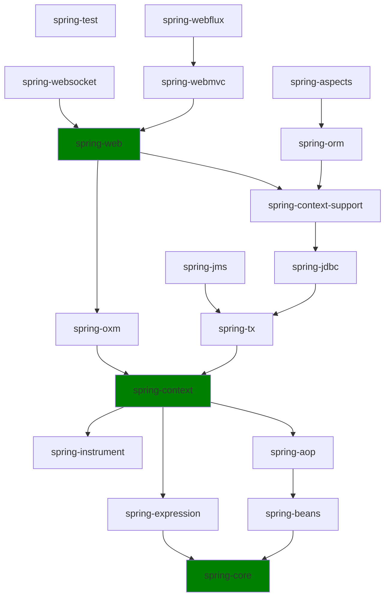

## Spring 是什么

Spring框架是一个开源的Java EE应用程序框架, 由Rod Johnson发起, 旨在解决企业级编程开发中的复杂性. Spring框架基于分层思想, 提供了轻量级的容器, 用于管理bean的生命周期, 并集成了众多服务, 如事务管理、消息服务等. 其核心功能包括控制反转（Ioc）和面向切面（Aop）两大技术, 实现了项目在开发过程中的轻松解耦, 提高了开发效率. Spring框架可以单独应用于构筑应用程序, 也可以与其他Web框架（如Struts、Webwork、Tapestry等）和桌面应用程序框架（如Swing）组合使用. 因此, Spring框架不仅适用于J2EE应用程序, 也可以应用于桌面应用程序和小应用程序

此外, Spring框架还提供了丰富的数据访问层框架, 如Mybatis和Hibernate, 这些框架可以解脱开发者直接使用Jdbc操作数据库的烦恼, 使数据层的操作更加轻巧、方便. 同时, Spring框架也是目前企业开发中使用最广泛的框架之一, 其优点包括易于集成、降低组件之间的耦合度、提高开发效率等

Spring框架是Java开发领域中的一个重要框架, 为开发者提供了丰富的功能和灵活的集成方式, 极大地提高了开发效率和项目质量

## Spring 模块依赖

Spring 框架俗称 Spring 全家桶, 基于分层的思想, Spring 在开发的各个方面都有支持, 比如:

- Web: Spring Web MVC、Spring Flux
- 持久层: Spring Data/Spring Data JPA、Spring Data Redis
- 安全校验: Spring Security
- 构建工程脚手架: Spring Boot
- 微服务: Spring Cloud

